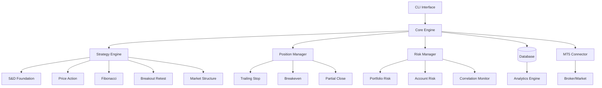

# Architecture Guide

This guide provides comprehensive information about the trading bot's system architecture, design patterns, database schema, and architectural decisions.

## System Architecture Overview

The trading bot follows a modern, async-first architecture with clear separation of concerns and modular design principles.

### High-Level Architecture



### Component Architecture

```python
# Core architectural components
ARCHITECTURE_COMPONENTS = {
    "presentation": {
        "cli": "Click-based command line interface",
        "api": "FastAPI web interface (optional)"
    },
    "application": {
        "trading_bot": "Main orchestrator",
        "strategy_engine": "Strategy coordination",
        "position_manager": "Position lifecycle management",
        "risk_manager": "Risk validation and monitoring"
    },
    "domain": {
        "strategies": "Trading strategy implementations",
        "market_structure": "Market analysis components",
        "signals": "Trading signal generation"
    },
    "infrastructure": {
        "database": "SQLAlchemy + SQLite persistence",
        "mt5_connector": "MetaTrader5 integration",
        "notifications": "Telegram notification system",
        "config": "Configuration management"
    }
}
```

## Modern Architecture Patterns

### 1. Async/Await Pattern

**Full async architecture for non-blocking operations**

```python
class AsyncTradingBot:
    """
    Async-first architecture ensures non-blocking operations
    """

    async def trading_loop(self):
        """Main trading loop with async operations"""
        while self.is_running:
            # Parallel analysis of multiple symbols
            tasks = [
                self.analyze_symbol(symbol)
                for symbol in self.trading_symbols
            ]

            # Execute all analyses concurrently
            results = await asyncio.gather(*tasks, return_exceptions=True)

            # Process results
            for symbol, result in zip(self.trading_symbols, results):
                if isinstance(result, Exception):
                    self.logger.error(f"Analysis failed for {symbol}: {result}")
                elif result:
                    await self.execute_trade(result)

            await asyncio.sleep(60)  # Non-blocking sleep

    async def analyze_symbol(self, symbol: str) -> Optional[TradingSignal]:
        """Async symbol analysis with concurrent layer processing"""
        # Foundation analysis (mandatory)
        zones_task = self.foundation_analyzer.detect_zones(symbol)

        # Market hours validation
        market_hours_task = self.market_validator.is_trading_allowed(symbol)

        # Position check
        position_check_task = self.has_active_position(symbol)

        # Wait for prerequisite checks
        zones, market_open, has_position = await asyncio.gather(
            zones_task, market_hours_task, position_check_task
        )

        if not zones or not market_open or has_position:
            return None

        # Concurrent enhancement layer analysis
        enhancement_tasks = []
        if self.config.is_enabled('price_action'):
            enhancement_tasks.append(
                self.price_action_analyzer.analyze(symbol, zones[0])
            )
        if self.config.is_enabled('fibonacci'):
            enhancement_tasks.append(
                self.fibonacci_analyzer.analyze(symbol, zones[0])
            )

        # Process enhancements concurrently
        enhancements = await asyncio.gather(*enhancement_tasks)

        # Build final signal
        return self._build_layered_signal(zones[0], enhancements)
```

### 2. Dependency Injection Pattern

**Pydantic settings and configuration injection**

```python
from pydantic import BaseSettings
from typing import Protocol

class ConfigurationProtocol(Protocol):
    """Configuration interface for dependency injection"""
    risk_per_trade: float
    max_concurrent_positions: int
    confluence_threshold: float

class TradingBotConfig(BaseSettings):
    """Main configuration with dependency injection"""

    # Trading settings
    risk_per_trade: float = 0.005
    max_concurrent_positions: int = 5
    confluence_threshold: float = 65.0

    # Database settings
    database_url: str = "sqlite+aiosqlite:///./data/trading_bot.db"
    database_echo: bool = False

    # MT5 settings
    mt5_auto_start: bool = True
    mt5_timeout: int = 30

    class Config:
        env_file = ".env"
        env_prefix = "TRADING_BOT_"

class StrategyEngine:
    """Strategy engine with injected dependencies"""

    def __init__(
        self,
        config: ConfigurationProtocol,
        database: AsyncSession,
        market_connector: MarketConnectorProtocol,
        logger: Logger
    ):
        self.config = config
        self.db = database
        self.market = market_connector
        self.logger = logger

        # Injected analyzers
        self.foundation_analyzer = SupplyDemandAnalyzer(config, database)
        self.price_action_analyzer = PriceActionAnalyzer(config)
        self.risk_manager = RiskManager(config, database)

# Dependency injection container
class DIContainer:
    """Simple dependency injection container"""

    def __init__(self):
        self._services = {}
        self._singletons = {}

    def register(self, interface: type, implementation: type, singleton: bool = False):
        """Register service implementation"""
        self._services[interface] = (implementation, singleton)

    def get(self, interface: type):
        """Get service instance"""
        if interface in self._singletons:
            return self._singletons[interface]

        implementation, singleton = self._services[interface]
        instance = implementation()

        if singleton:
            self._singletons[interface] = instance

        return instance

# Usage
container = DIContainer()
container.register(ConfigurationProtocol, TradingBotConfig, singleton=True)
container.register(MarketConnectorProtocol, MT5Connector, singleton=True)

strategy_engine = container.get(StrategyEngine)
```

### 3. Repository Pattern

**Clean data access layer with SQLAlchemy**

```python
from abc import ABC, abstractmethod
from sqlalchemy.ext.asyncio import AsyncSession
from typing import Generic, TypeVar, Optional, List

T = TypeVar('T')

class BaseRepository(Generic[T], ABC):
    """Abstract base repository pattern"""

    def __init__(self, session: AsyncSession, model_class: type):
        self.session = session
        self.model_class = model_class

    @abstractmethod
    async def create(self, entity: T) -> T:
        """Create new entity"""
        pass

    @abstractmethod
    async def get_by_id(self, entity_id: int) -> Optional[T]:
        """Get entity by ID"""
        pass

    @abstractmethod
    async def update(self, entity: T) -> T:
        """Update existing entity"""
        pass

    @abstractmethod
    async def delete(self, entity_id: int) -> bool:
        """Delete entity by ID"""
        pass

class TradeRepository(BaseRepository[Trade]):
    """Concrete repository for trade entities"""

    async def create(self, trade: Trade) -> Trade:
        """Create new trade record"""
        self.session.add(trade)
        await self.session.commit()
        await self.session.refresh(trade)
        return trade

    async def get_by_id(self, trade_id: int) -> Optional[Trade]:
        """Get trade by ID"""
        result = await self.session.execute(
            select(Trade).where(Trade.id == trade_id)
        )
        return result.scalar_one_or_none()

    async def get_by_symbol(self, symbol: str, limit: int = 100) -> List[Trade]:
        """Get trades by symbol"""
        result = await self.session.execute(
            select(Trade)
            .where(Trade.symbol == symbol)
            .order_by(Trade.opened_at.desc())
            .limit(limit)
        )
        return result.scalars().all()

    async def get_active_trades(self) -> List[Trade]:
        """Get all active trades"""
        result = await self.session.execute(
            select(Trade).where(Trade.status == TradeStatus.ACTIVE)
        )
        return result.scalars().all()

    async def update(self, trade: Trade) -> Trade:
        """Update trade record"""
        await self.session.commit()
        await self.session.refresh(trade)
        return trade

    async def delete(self, trade_id: int) -> bool:
        """Delete trade record"""
        result = await self.session.execute(
            delete(Trade).where(Trade.id == trade_id)
        )
        await self.session.commit()
        return result.rowcount > 0

    async def get_performance_stats(self, days: int = 30) -> Dict:
        """Get performance statistics"""
        from_date = datetime.now() - timedelta(days=days)

        result = await self.session.execute(
            select(
                func.count(Trade.id).label('total_trades'),
                func.sum(case((Trade.profit > 0, 1), else_=0)).label('winning_trades'),
                func.avg(Trade.profit).label('avg_profit'),
                func.sum(Trade.profit).label('total_profit')
            ).where(Trade.opened_at >= from_date)
        )

        stats = result.first()
        win_rate = (stats.winning_trades / stats.total_trades * 100) if stats.total_trades > 0 else 0

        return {
            'total_trades': stats.total_trades,
            'winning_trades': stats.winning_trades,
            'win_rate': win_rate,
            'average_profit': float(stats.avg_profit or 0),
            'total_profit': float(stats.total_profit or 0)
        }

class SupplyDemandZoneRepository(BaseRepository[SupplyDemandZone]):
    """Repository for Supply & Demand zones"""

    async def get_active_zones(self, symbol: str) -> List[SupplyDemandZone]:
        """Get active zones for symbol"""
        result = await self.session.execute(
            select(SupplyDemandZone)
            .where(
                and_(
                    SupplyDemandZone.symbol == symbol,
                    SupplyDemandZone.is_active == True,
                    SupplyDemandZone.test_count <= 3
                )
            )
            .order_by(SupplyDemandZone.strength.desc())
        )
        return result.scalars().all()

    async def update_zone_test(self, zone_id: int) -> bool:
        """Update zone test count"""
        result = await self.session.execute(
            update(SupplyDemandZone)
            .where(SupplyDemandZone.id == zone_id)
            .values(
                test_count=SupplyDemandZone.test_count + 1,
                last_tested_at=datetime.utcnow()
            )
        )
        await self.session.commit()
        return result.rowcount > 0
```

### 4. Event-Driven Pattern

**Event bus for market structure and position events**

```python
from typing import Dict, List, Callable, Any
from enum import Enum
import asyncio

class EventType(Enum):
    """System event types"""
    TRADE_OPENED = "trade_opened"
    TRADE_CLOSED = "trade_closed"
    BREAKEVEN_TRIGGERED = "breakeven_triggered"
    TRAILING_ACTIVATED = "trailing_activated"
    ZONE_CREATED = "zone_created"
    ZONE_TESTED = "zone_tested"
    MARKET_STRUCTURE_CHANGE = "market_structure_change"
    RISK_THRESHOLD_EXCEEDED = "risk_threshold_exceeded"

class Event:
    """Base event class"""

    def __init__(self, event_type: EventType, data: Dict[str, Any], source: str = None):
        self.event_type = event_type
        self.data = data
        self.source = source
        self.timestamp = datetime.utcnow()
        self.event_id = str(uuid4())

class EventBus:
    """Async event bus for system-wide event handling"""

    def __init__(self):
        self._handlers: Dict[EventType, List[Callable]] = defaultdict(list)
        self._middleware: List[Callable] = []
        self._event_history: List[Event] = []
        self._max_history = 1000

    def subscribe(self, event_type: EventType, handler: Callable):
        """Subscribe to event type"""
        self._handlers[event_type].append(handler)

    def add_middleware(self, middleware: Callable):
        """Add middleware for event processing"""
        self._middleware.append(middleware)

    async def publish(self, event: Event):
        """Publish event to all subscribers"""
        # Add to history
        self._event_history.append(event)
        if len(self._event_history) > self._max_history:
            self._event_history.pop(0)

        # Apply middleware
        for middleware in self._middleware:
            event = await middleware(event)
            if event is None:  # Middleware can filter events
                return

        # Execute handlers concurrently
        handlers = self._handlers[event.event_type]
        if handlers:
            tasks = [handler(event) for handler in handlers]
            await asyncio.gather(*tasks, return_exceptions=True)

    def get_recent_events(self, event_type: EventType = None, limit: int = 100) -> List[Event]:
        """Get recent events"""
        events = self._event_history
        if event_type:
            events = [e for e in events if e.event_type == event_type]
        return events[-limit:]

# Event handlers
class TradingEventHandlers:
    """Collection of trading event handlers"""

    def __init__(self, notification_manager, database, logger):
        self.notification_manager = notification_manager
        self.database = database
        self.logger = logger

    async def handle_trade_opened(self, event: Event):
        """Handle trade opened event"""
        trade_data = event.data

        # Send notification
        await self.notification_manager.send_trade_opened_notification(trade_data)

        # Log event
        self.logger.info(f"Trade opened: {trade_data['symbol']} - {trade_data['direction']}")

        # Update statistics
        await self._update_trade_statistics(trade_data)

    async def handle_breakeven_triggered(self, event: Event):
        """Handle breakeven triggered event"""
        position_data = event.data

        # Send notification
        await self.notification_manager.send_breakeven_notification(position_data)

        # Update position management stats
        await self._update_position_management_stats(position_data)

    async def handle_zone_tested(self, event: Event):
        """Handle zone tested event"""
        zone_data = event.data

        # Update zone statistics
        zone_repo = SupplyDemandZoneRepository(self.database)
        await zone_repo.update_zone_test(zone_data['zone_id'])

        # Check if zone should be deactivated
        if zone_data['test_count'] >= 3:
            await self._deactivate_zone(zone_data['zone_id'])

# Usage in main system
class TradingBot:
    """Main trading bot with event-driven architecture"""

    def __init__(self):
        self.event_bus = EventBus()
        self._setup_event_handlers()

    def _setup_event_handlers(self):
        """Setup event handlers"""
        handlers = TradingEventHandlers(
            self.notification_manager,
            self.database,
            self.logger
        )

        # Subscribe to events
        self.event_bus.subscribe(EventType.TRADE_OPENED, handlers.handle_trade_opened)
        self.event_bus.subscribe(EventType.BREAKEVEN_TRIGGERED, handlers.handle_breakeven_triggered)
        self.event_bus.subscribe(EventType.ZONE_TESTED, handlers.handle_zone_tested)

        # Add middleware for event logging
        self.event_bus.add_middleware(self._log_event_middleware)

    async def _log_event_middleware(self, event: Event) -> Event:
        """Middleware to log all events"""
        self.logger.debug(f"Event: {event.event_type.value} from {event.source}")
        return event

    async def execute_trade(self, signal):
        """Execute trade and publish event"""
        result = await self.mt5_connector.place_order(signal)

        if result['success']:
            # Publish trade opened event
            event = Event(
                event_type=EventType.TRADE_OPENED,
                data={
                    'symbol': signal.symbol,
                    'direction': signal.direction,
                    'ticket': result['ticket'],
                    'volume': signal.volume,
                    'entry_price': result['price']
                },
                source='trading_bot'
            )
            await self.event_bus.publish(event)
```

### 5. Strategy Pattern

**Pluggable trading strategies**

```python
from abc import ABC, abstractmethod
from typing import Optional, Dict, Any

class TradingStrategy(ABC):
    """Abstract base class for trading strategies"""

    def __init__(self, config: Dict[str, Any]):
        self.config = config
        self.name = self.__class__.__name__
        self.enabled = config.get('enabled', True)
        self.weight = config.get('weight', 1.0)

    @abstractmethod
    async def analyze(self, symbol: str, market_data: MarketData) -> Optional[TradingSignal]:
        """Analyze market and generate trading signal"""
        pass

    @abstractmethod
    def validate_signal(self, signal: TradingSignal) -> bool:
        """Validate generated signal"""
        pass

    @property
    @abstractmethod
    def required_timeframes(self) -> List[str]:
        """Required timeframes for analysis"""
        pass

    def get_confidence_score(self, signal: TradingSignal) -> float:
        """Calculate confidence score for signal"""
        return signal.base_confidence * self.weight

class SupplyDemandStrategy(TradingStrategy):
    """Supply & Demand zone strategy implementation"""

    @property
    def required_timeframes(self) -> List[str]:
        return ["M15", "H1", "H4"]

    async def analyze(self, symbol: str, market_data: MarketData) -> Optional[TradingSignal]:
        """Analyze supply and demand zones"""
        zones = await self._detect_zones(symbol, market_data)

        if not zones:
            return None

        # Find best zone for entry
        best_zone = self._select_best_zone(zones, market_data.current_price)

        if not best_zone:
            return None

        # Generate signal
        signal = TradingSignal(
            symbol=symbol,
            strategy=self.name,
            direction=best_zone.expected_direction,
            entry_price=self._calculate_entry_price(best_zone, market_data),
            stop_loss=self._calculate_stop_loss(best_zone, market_data),
            take_profit=self._calculate_take_profit(best_zone, market_data),
            base_confidence=best_zone.strength,
            metadata={'zone_id': best_zone.id, 'zone_type': best_zone.zone_type}
        )

        return signal if self.validate_signal(signal) else None

    def validate_signal(self, signal: TradingSignal) -> bool:
        """Validate S&D signal"""
        min_strength = self.config.get('min_strength', 40.0)
        return signal.base_confidence >= min_strength

class StrategyManager:
    """Manages multiple trading strategies"""

    def __init__(self, config: Dict[str, Any]):
        self.strategies: Dict[str, TradingStrategy] = {}
        self.config = config
        self._initialize_strategies()

    def _initialize_strategies(self):
        """Initialize all configured strategies"""
        strategy_configs = self.config.get('strategies', {})

        # Strategy registry
        strategy_classes = {
            'supply_demand': SupplyDemandStrategy,
            'price_action': PriceActionStrategy,
            'fibonacci': FibonacciStrategy,
            'breakout_retest': BreakoutRetestStrategy,
            'market_structure': MarketStructureStrategy
        }

        for strategy_name, strategy_config in strategy_configs.items():
            if strategy_config.get('enabled', False):
                strategy_class = strategy_classes.get(strategy_name)
                if strategy_class:
                    self.strategies[strategy_name] = strategy_class(strategy_config)

    async def analyze_symbol(self, symbol: str) -> Optional[TradingSignal]:
        """Run all enabled strategies for symbol"""
        market_data = await self._get_market_data(symbol)
        signals = []

        # Run all strategies concurrently
        tasks = [
            strategy.analyze(symbol, market_data)
            for strategy in self.strategies.values()
            if strategy.enabled
        ]

        results = await asyncio.gather(*tasks, return_exceptions=True)

        # Collect valid signals
        for strategy_name, result in zip(self.strategies.keys(), results):
            if isinstance(result, TradingSignal):
                signals.append(result)
            elif isinstance(result, Exception):
                self.logger.error(f"Strategy {strategy_name} failed: {result}")

        # Combine signals if multiple strategies generated signals
        return self._combine_signals(signals) if signals else None

    def _combine_signals(self, signals: List[TradingSignal]) -> TradingSignal:
        """Combine multiple signals into single signal"""
        if len(signals) == 1:
            return signals[0]

        # Weighted combination logic
        total_weight = sum(self.strategies[s.strategy].weight for s in signals)

        combined_confidence = sum(
            s.base_confidence * self.strategies[s.strategy].weight
            for s in signals
        ) / total_weight

        # Use signal from strategy with highest weight
        best_signal = max(signals, key=lambda s: self.strategies[s.strategy].weight)
        best_signal.base_confidence = combined_confidence
        best_signal.metadata['combined_from'] = [s.strategy for s in signals]

        return best_signal
```

### 6. State Machine Pattern

**Position lifecycle management**

```python
from enum import Enum
from typing import Dict, Callable, Optional

class PositionState(Enum):
    """Position states in lifecycle"""
    PENDING = "pending"
    ACTIVE = "active"
    BREAKEVEN = "breakeven"
    TRAILING = "trailing"
    PARTIAL_CLOSED = "partial_closed"
    CLOSED = "closed"
    FAILED = "failed"

class PositionEvent(Enum):
    """Position events that trigger state transitions"""
    OPENED = "opened"
    PROFIT_REACHED = "profit_reached"
    BREAKEVEN_TRIGGERED = "breakeven_triggered"
    TRAILING_ACTIVATED = "trailing_activated"
    PARTIAL_CLOSE = "partial_close"
    STOP_HIT = "stop_hit"
    TARGET_HIT = "target_hit"
    MANUAL_CLOSE = "manual_close"
    ERROR_OCCURRED = "error_occurred"

class PositionStateMachine:
    """State machine for position lifecycle management"""

    def __init__(self):
        self.transitions: Dict[tuple, tuple] = {
            # (from_state, event) -> (to_state, action)
            (PositionState.PENDING, PositionEvent.OPENED):
                (PositionState.ACTIVE, self._on_position_opened),

            (PositionState.ACTIVE, PositionEvent.PROFIT_REACHED):
                (PositionState.BREAKEVEN, self._on_breakeven_triggered),

            (PositionState.BREAKEVEN, PositionEvent.TRAILING_ACTIVATED):
                (PositionState.TRAILING, self._on_trailing_activated),

            (PositionState.ACTIVE, PositionEvent.PARTIAL_CLOSE):
                (PositionState.PARTIAL_CLOSED, self._on_partial_close),

            (PositionState.BREAKEVEN, PositionEvent.PARTIAL_CLOSE):
                (PositionState.PARTIAL_CLOSED, self._on_partial_close),

            (PositionState.TRAILING, PositionEvent.PARTIAL_CLOSE):
                (PositionState.PARTIAL_CLOSED, self._on_partial_close),

            # Close events from any active state
            (PositionState.ACTIVE, PositionEvent.STOP_HIT):
                (PositionState.CLOSED, self._on_position_closed),

            (PositionState.ACTIVE, PositionEvent.TARGET_HIT):
                (PositionState.CLOSED, self._on_position_closed),

            (PositionState.BREAKEVEN, PositionEvent.STOP_HIT):
                (PositionState.CLOSED, self._on_position_closed),

            (PositionState.TRAILING, PositionEvent.STOP_HIT):
                (PositionState.CLOSED, self._on_position_closed),

            (PositionState.PARTIAL_CLOSED, PositionEvent.STOP_HIT):
                (PositionState.CLOSED, self._on_position_closed),

            # Error transitions
            (PositionState.PENDING, PositionEvent.ERROR_OCCURRED):
                (PositionState.FAILED, self._on_position_failed),
        }

    async def process_event(self, position: Position, event: PositionEvent, event_data: Dict = None):
        """Process position event and transition state"""
        current_state = position.state
        transition_key = (current_state, event)

        if transition_key not in self.transitions:
            self.logger.warning(f"Invalid transition: {current_state} -> {event}")
            return False

        new_state, action = self.transitions[transition_key]

        # Execute transition action
        try:
            await action(position, event_data or {})
            position.state = new_state
            position.last_updated = datetime.utcnow()

            self.logger.info(f"Position {position.ticket}: {current_state} -> {new_state}")

            # Publish state change event
            await self.event_bus.publish(Event(
                event_type=EventType.POSITION_STATE_CHANGED,
                data={
                    'ticket': position.ticket,
                    'from_state': current_state.value,
                    'to_state': new_state.value,
                    'event': event.value
                }
            ))

            return True

        except Exception as e:
            self.logger.error(f"State transition failed: {e}")
            return False

    async def _on_position_opened(self, position: Position, data: Dict):
        """Handle position opened"""
        position.opened_at = datetime.utcnow()
        position.status = "active"

        # Start monitoring for breakeven
        await self._start_breakeven_monitoring(position)

    async def _on_breakeven_triggered(self, position: Position, data: Dict):
        """Handle breakeven triggered"""
        # Move stop loss to breakeven
        new_sl = position.open_price
        await self.mt5_connector.modify_position(position.ticket, stop_loss=new_sl)

        position.stop_loss = new_sl
        position.breakeven_triggered_at = datetime.utcnow()

        # Start trailing monitoring if configured
        if self._should_start_trailing(position):
            await self._start_trailing_monitoring(position)

    async def _on_trailing_activated(self, position: Position, data: Dict):
        """Handle trailing stop activated"""
        position.trailing_activated_at = datetime.utcnow()
        await self._update_trailing_stop(position)

    async def _on_partial_close(self, position: Position, data: Dict):
        """Handle partial position close"""
        close_percentage = data.get('percentage', 0.5)
        close_volume = position.volume * close_percentage

        # Execute partial close
        result = await self.mt5_connector.partial_close(position.ticket, close_volume)

        if result['success']:
            position.volume -= close_volume
            position.partial_closes.append({
                'volume': close_volume,
                'price': result['price'],
                'timestamp': datetime.utcnow()
            })

    async def _on_position_closed(self, position: Position, data: Dict):
        """Handle position closed"""
        position.closed_at = datetime.utcnow()
        position.close_price = data.get('close_price')
        position.profit = data.get('profit', 0)
        position.status = "closed"

        # Calculate final statistics
        await self._calculate_position_stats(position)

class PositionManager:
    """Position manager using state machine"""

    def __init__(self, mt5_connector, database, event_bus):
        self.mt5_connector = mt5_connector
        self.database = database
        self.event_bus = event_bus
        self.state_machine = PositionStateMachine()
        self.active_positions: Dict[int, Position] = {}

    async def open_position(self, signal: TradingSignal) -> bool:
        """Open new position using state machine"""
        # Create position in PENDING state
        position = Position(
            symbol=signal.symbol,
            direction=signal.direction,
            volume=signal.volume,
            entry_price=signal.entry_price,
            stop_loss=signal.stop_loss,
            take_profit=signal.take_profit,
            state=PositionState.PENDING
        )

        # Execute trade
        result = await self.mt5_connector.place_order(signal)

        if result['success']:
            position.ticket = result['ticket']
            position.open_price = result['price']

            # Transition to ACTIVE state
            await self.state_machine.process_event(
                position,
                PositionEvent.OPENED,
                {'ticket': result['ticket'], 'price': result['price']}
            )

            # Store position
            self.active_positions[position.ticket] = position
            await self._save_position(position)

            return True
        else:
            # Transition to FAILED state
            await self.state_machine.process_event(
                position,
                PositionEvent.ERROR_OCCURRED,
                {'error': result['error']}
            )
            return False
```

### 7. Chain of Responsibility Pattern

**Risk validation pipeline**

```python
from abc import ABC, abstractmethod
from typing import Optional, Dict, Any

class RiskValidator(ABC):
    """Abstract risk validator in chain"""

    def __init__(self, next_validator: Optional['RiskValidator'] = None):
        self._next_validator = next_validator

    async def validate(self, signal: TradingSignal, context: Dict[str, Any]) -> RiskValidationResult:
        """Validate signal and pass to next validator"""
        result = await self._validate_impl(signal, context)

        if not result.is_valid or self._next_validator is None:
            return result

        # Pass to next validator
        next_result = await self._next_validator.validate(signal, context)

        # Combine results
        return RiskValidationResult(
            is_valid=result.is_valid and next_result.is_valid,
            risk_score=max(result.risk_score, next_result.risk_score),
            warnings=result.warnings + next_result.warnings,
            errors=result.errors + next_result.errors
        )

    @abstractmethod
    async def _validate_impl(self, signal: TradingSignal, context: Dict[str, Any]) -> RiskValidationResult:
        """Implement specific validation logic"""
        pass

class PositionSizeValidator(RiskValidator):
    """Validates position size against account risk"""

    def __init__(self, config: Dict, next_validator: Optional[RiskValidator] = None):
        super().__init__(next_validator)
        self.max_risk_per_trade = config.get('max_risk_per_trade', 0.02)

    async def _validate_impl(self, signal: TradingSignal, context: Dict[str, Any]) -> RiskValidationResult:
        account_balance = context['account_balance']
        position_risk = signal.volume * abs(signal.entry_price - signal.stop_loss)
        risk_percentage = position_risk / account_balance

        if risk_percentage > self.max_risk_per_trade:
            return RiskValidationResult(
                is_valid=False,
                risk_score=risk_percentage * 100,
                errors=[f"Position risk {risk_percentage:.2%} exceeds maximum {self.max_risk_per_trade:.2%}"]
            )

        warnings = []
        if risk_percentage > self.max_risk_per_trade * 0.8:
            warnings.append(f"High position risk: {risk_percentage:.2%}")

        return RiskValidationResult(
            is_valid=True,
            risk_score=risk_percentage * 100,
            warnings=warnings
        )

class CorrelationValidator(RiskValidator):
    """Validates position correlation"""

    async def _validate_impl(self, signal: TradingSignal, context: Dict[str, Any]) -> RiskValidationResult:
        active_positions = context['active_positions']
        correlation_threshold = 0.7

        for position in active_positions:
            correlation = await self._calculate_correlation(signal.symbol, position.symbol)

            if correlation > correlation_threshold:
                return RiskValidationResult(
                    is_valid=False,
                    risk_score=correlation * 100,
                    errors=[f"High correlation {correlation:.2f} with {position.symbol}"]
                )

        return RiskValidationResult(is_valid=True, risk_score=0)

class DrawdownValidator(RiskValidator):
    """Validates against maximum drawdown"""

    async def _validate_impl(self, signal: TradingSignal, context: Dict[str, Any]) -> RiskValidationResult:
        current_drawdown = context['current_drawdown']
        max_drawdown = context['max_drawdown_limit']

        if current_drawdown >= max_drawdown:
            return RiskValidationResult(
                is_valid=False,
                risk_score=100,
                errors=[f"Current drawdown {current_drawdown:.2%} at maximum limit"]
            )

        # Warning if approaching limit
        warning_threshold = max_drawdown * 0.8
        warnings = []
        if current_drawdown > warning_threshold:
            warnings.append(f"Approaching drawdown limit: {current_drawdown:.2%}")

        return RiskValidationResult(
            is_valid=True,
            risk_score=current_drawdown / max_drawdown * 100,
            warnings=warnings
        )

class RiskManager:
    """Risk manager using chain of responsibility"""

    def __init__(self, config: Dict):
        self.config = config
        self._build_validation_chain()

    def _build_validation_chain(self):
        """Build the risk validation chain"""
        # Build chain from last to first
        self.validation_chain = DrawdownValidator(
            config=self.config
        )

        self.validation_chain = CorrelationValidator(
            next_validator=self.validation_chain
        )

        self.validation_chain = PositionSizeValidator(
            config=self.config,
            next_validator=self.validation_chain
        )

    async def validate_signal(self, signal: TradingSignal) -> RiskValidationResult:
        """Validate signal through risk chain"""
        context = await self._build_validation_context(signal)
        return await self.validation_chain.validate(signal, context)

    async def _build_validation_context(self, signal: TradingSignal) -> Dict[str, Any]:
        """Build context for risk validation"""
        return {
            'account_balance': await self.get_account_balance(),
            'active_positions': await self.get_active_positions(),
            'current_drawdown': await self.calculate_current_drawdown(),
            'max_drawdown_limit': self.config.get('max_drawdown', 0.15)
        }
```

## Database Architecture

### SQLAlchemy 2.0 Modern Design

```python
from sqlalchemy.ext.asyncio import AsyncSession, create_async_engine
from sqlalchemy.orm import DeclarativeBase, Mapped, mapped_column, relationship
from sqlalchemy import String, Integer, Float, DateTime, Boolean, Text, ForeignKey
from typing import Optional, List
import datetime

class Base(DeclarativeBase):
    """Base class for all database models"""
    pass

# Core trading models
class Trade(Base):
    """Trade entity with modern SQLAlchemy 2.0 syntax"""
    __tablename__ = "trades"

    id: Mapped[int] = mapped_column(Integer, primary_key=True)
    ticket: Mapped[int] = mapped_column(Integer, unique=True, index=True)
    symbol: Mapped[str] = mapped_column(String(10), index=True)
    direction: Mapped[str] = mapped_column(String(4))  # BUY/SELL
    volume: Mapped[float] = mapped_column(Float)

    # Price information
    entry_price: Mapped[float] = mapped_column(Float)
    close_price: Mapped[Optional[float]] = mapped_column(Float, nullable=True)
    stop_loss: Mapped[Optional[float]] = mapped_column(Float, nullable=True)
    take_profit: Mapped[Optional[float]] = mapped_column(Float, nullable=True)

    # Financial results
    profit: Mapped[Optional[float]] = mapped_column(Float, nullable=True)
    commission: Mapped[Optional[float]] = mapped_column(Float, nullable=True)
    swap: Mapped[Optional[float]] = mapped_column(Float, nullable=True)

    # Timestamps
    opened_at: Mapped[datetime.datetime] = mapped_column(DateTime, index=True)
    closed_at: Mapped[Optional[datetime.datetime]] = mapped_column(DateTime, nullable=True)

    # Strategy information
    strategy_name: Mapped[str] = mapped_column(String(50), index=True)
    confidence_score: Mapped[Optional[float]] = mapped_column(Float, nullable=True)

    # Status
    status: Mapped[str] = mapped_column(String(20), default="active")  # active, closed, failed

    # Relationships
    position_events: Mapped[List["PositionEvent"]] = relationship(back_populates="trade")

class SupplyDemandZone(Base):
    """Supply & Demand zone entity"""
    __tablename__ = "supply_demand_zones"

    id: Mapped[int] = mapped_column(Integer, primary_key=True)
    symbol: Mapped[str] = mapped_column(String(10), index=True)
    timeframe: Mapped[str] = mapped_column(String(5))

    # Zone boundaries
    top_price: Mapped[float] = mapped_column(Float)
    bottom_price: Mapped[float] = mapped_column(Float)
    center_price: Mapped[float] = mapped_column(Float)

    # Zone characteristics
    zone_type: Mapped[str] = mapped_column(String(20))  # supply, demand, consolidation
    strength: Mapped[float] = mapped_column(Float, index=True)
    volume_confirmation: Mapped[float] = mapped_column(Float)
    freshness: Mapped[float] = mapped_column(Float)

    # Zone status
    is_active: Mapped[bool] = mapped_column(Boolean, default=True, index=True)
    test_count: Mapped[int] = mapped_column(Integer, default=0)
    last_tested_at: Mapped[Optional[datetime.datetime]] = mapped_column(DateTime, nullable=True)

    # Timestamps
    created_at: Mapped[datetime.datetime] = mapped_column(DateTime, default=datetime.datetime.utcnow)
    detected_at: Mapped[datetime.datetime] = mapped_column(DateTime)

class PositionEvent(Base):
    """Position lifecycle events"""
    __tablename__ = "position_events"

    id: Mapped[int] = mapped_column(Integer, primary_key=True)
    trade_id: Mapped[int] = mapped_column(ForeignKey("trades.id"), index=True)

    event_type: Mapped[str] = mapped_column(String(30), index=True)
    event_data: Mapped[Optional[str]] = mapped_column(Text, nullable=True)  # JSON data

    timestamp: Mapped[datetime.datetime] = mapped_column(DateTime, default=datetime.datetime.utcnow)

    # Relationships
    trade: Mapped["Trade"] = relationship(back_populates="position_events")

# Performance tracking models
class StrategyPerformance(Base):
    """Strategy performance tracking"""
    __tablename__ = "strategy_performance"

    id: Mapped[int] = mapped_column(Integer, primary_key=True)
    strategy_name: Mapped[str] = mapped_column(String(50), index=True)
    symbol: Mapped[str] = mapped_column(String(10), index=True)
    timeframe: Mapped[str] = mapped_column(String(5))

    # Performance metrics
    total_trades: Mapped[int] = mapped_column(Integer, default=0)
    winning_trades: Mapped[int] = mapped_column(Integer, default=0)
    win_rate: Mapped[float] = mapped_column(Float, default=0.0)
    profit_factor: Mapped[float] = mapped_column(Float, default=0.0)
    avg_rr_ratio: Mapped[float] = mapped_column(Float, default=0.0)
    sharpe_ratio: Mapped[float] = mapped_column(Float, default=0.0)

    # Strategy-specific metrics
    avg_confluence_score: Mapped[float] = mapped_column(Float, default=0.0)
    avg_entry_score: Mapped[float] = mapped_column(Float, default=0.0)

    # Configuration tracking
    config_hash: Mapped[Optional[str]] = mapped_column(String(32), nullable=True)
    config_version: Mapped[Optional[str]] = mapped_column(String(20), nullable=True)

    # Time period
    period_start: Mapped[datetime.datetime] = mapped_column(DateTime)
    period_end: Mapped[datetime.datetime] = mapped_column(DateTime)

# Database manager
class DatabaseManager:
    """Modern async database manager"""

    def __init__(self, database_url: str):
        self.engine = create_async_engine(
            database_url,
            echo=False,
            pool_pre_ping=True,
            pool_recycle=3600
        )

    async def create_tables(self):
        """Create all database tables"""
        async with self.engine.begin() as conn:
            await conn.run_sync(Base.metadata.create_all)

    async def get_session(self) -> AsyncSession:
        """Get database session"""
        return AsyncSession(self.engine)

    async def close(self):
        """Close database connections"""
        await self.engine.dispose()
```

### Connection Pooling and Performance

```python
class OptimizedDatabaseManager(DatabaseManager):
    """Database manager with performance optimizations"""

    def __init__(self, database_url: str, config: Dict):
        # Performance optimizations
        engine_args = {
            "echo": config.get("echo", False),
            "pool_pre_ping": True,
            "pool_recycle": config.get("pool_recycle", 3600),
            "pool_size": config.get("pool_size", 10),
            "max_overflow": config.get("max_overflow", 20),
            "pool_timeout": config.get("pool_timeout", 30),
        }

        # SQLite-specific optimizations
        if "sqlite" in database_url:
            engine_args.update({
                "connect_args": {
                    "check_same_thread": False,
                    "timeout": 20,
                    "isolation_level": None,  # Autocommit mode for WAL
                }
            })

            # Enable WAL mode for better concurrency
            if config.get("enable_wal", True):
                database_url += "?mode=wal"

        self.engine = create_async_engine(database_url, **engine_args)
        self.config = config

    async def optimize_sqlite(self):
        """Apply SQLite-specific optimizations"""
        if "sqlite" not in str(self.engine.url):
            return

        async with self.engine.begin() as conn:
            # Enable WAL mode
            await conn.execute(text("PRAGMA journal_mode=WAL"))

            # Optimize for performance
            await conn.execute(text("PRAGMA synchronous=NORMAL"))
            await conn.execute(text("PRAGMA cache_size=10000"))
            await conn.execute(text("PRAGMA temp_store=MEMORY"))
            await conn.execute(text("PRAGMA mmap_size=268435456"))  # 256MB

            # Create indexes for performance
            await self._create_performance_indexes(conn)

    async def _create_performance_indexes(self, conn):
        """Create indexes for better query performance"""
        indexes = [
            "CREATE INDEX IF NOT EXISTS idx_trades_symbol_opened ON trades(symbol, opened_at)",
            "CREATE INDEX IF NOT EXISTS idx_trades_strategy_status ON trades(strategy_name, status)",
            "CREATE INDEX IF NOT EXISTS idx_zones_symbol_active ON supply_demand_zones(symbol, is_active)",
            "CREATE INDEX IF NOT EXISTS idx_zones_strength ON supply_demand_zones(strength DESC)",
            "CREATE INDEX IF NOT EXISTS idx_performance_strategy_period ON strategy_performance(strategy_name, period_start, period_end)",
        ]

        for index_sql in indexes:
            await conn.execute(text(index_sql))
```

This comprehensive architecture guide provides the foundation for understanding and extending the trading bot's sophisticated design patterns and database architecture.
