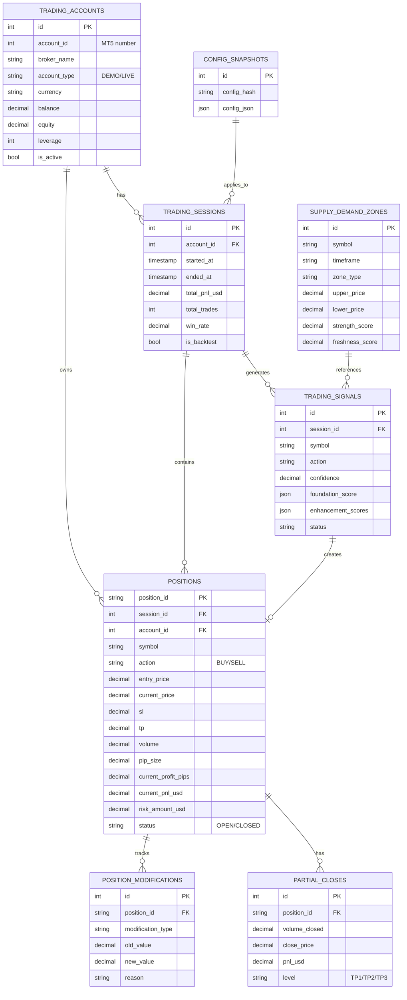

# Database ERD

Trading bot database schema and entity relationships.

## Schema Status

| Status | Count |
|--------|-------|
| ✅ Implemented | 5 tables |
| ⏳ In Progress (Phase 5.5) | 3 tables |
| 📋 Planned | 5 tables |
| **Target** | **14 tables** |

## Tables

### ✅ Implemented

| Table | Purpose |
|-------|---------|
| `trading_accounts` | Multi-account support (MT5 accounts) |
| `trading_sessions` | Session-level tracking |
| `positions` | Position management with pip tracking |
| `supply_demand_zones` | S&D zone detection results |
| `config_snapshots` | Configuration versioning |

### ⏳ In Progress

| Table | Purpose |
|-------|---------|
| `trading_signals` | Signal generation history |
| `position_modifications` | Breakeven/trailing audit |
| `partial_closes` | Partial close tracking |

### 📋 Planned

| Table | Purpose |
|-------|---------|
| `market_data` | OHLCV data for charting |
| `risk_metrics` | Real-time risk calculations |
| `symbol_info` | Dynamic symbol configuration |
| `risk_violations` | Risk alert history |
| `system_health` | System monitoring |

## Entity Relationships



## Database Engines

- **Development**: SQLite (`sqlite+aiosqlite:///trading_bot.db`)
- **Production**: PostgreSQL (`postgresql+asyncpg://...`)

## Migrations

Managed by **Alembic**:

```bash
# Create migration
alembic revision --autogenerate -m "description"

# Apply migrations
alembic upgrade head

# Check current revision
alembic current
```

## Implementation Files

- **Models**: [src/trading_bot/data/models.py](../../src/trading_bot/data/models.py)
- **Repositories**: [src/trading_bot/data/repositories/](../../src/trading_bot/data/repositories/)
- **Migrations**: [alembic/versions/](../../alembic/versions/)
