# Trading Bot Database ERD (Entity Relationship Diagram)

## Overview

Database schema untuk Advanced Trading Bot System dengan Position Management, Strategy Analysis, dan Risk Management. Schema dirancang untuk mendukung multi-asset trading dengan pip tracking, automated position management, dan comprehensive audit trail.

## Entity Relationship Diagram

```mermaid
erDiagram
    %% Core Trading Entities
    TRADING_SESSIONS {
        string session_id PK
        string trading_type
        string config_profile
        boolean dry_run
        datetime start_time
        datetime end_time
        string status
        json session_metadata
        datetime created_at
        datetime updated_at
    }

    %% Position Management Entities
    POSITIONS {
        string position_id PK
        string session_id FK
        string symbol
        string asset_class
        string direction
        float entry_price
        datetime entry_time
        float volume
        float current_stop_loss
        float current_take_profit
        float current_price
        string status
        boolean breakeven_activated
        boolean trailing_activated
        float pip_size
        float pip_value_per_lot
        float entry_to_sl_pips
        float entry_to_tp_pips
        float current_profit_pips
        float risk_amount_usd
        float potential_profit_usd
        float current_pnl_usd
        datetime created_at
        datetime updated_at
    }

    POSITION_MODIFICATIONS {
        string modification_id PK
        string position_id FK
        string modification_type
        float old_value
        float new_value
        string reason
        boolean success
        string error_message
        datetime executed_at
    }

    PARTIAL_CLOSES {
        string partial_close_id PK
        string position_id FK
        float close_price
        float volume_closed
        float profit_pips
        float profit_usd
        float remaining_volume
        datetime close_time
        string reason
    }

    %% Strategy Analysis Entities
    ZONES {
        string zone_id PK
        string session_id FK
        string symbol
        string timeframe
        string trading_type
        string zone_type
        float price_level
        float strength_score
        float volume_confirmation
        int test_count
        float freshness_score
        boolean is_valid
        datetime first_formed
        datetime last_tested
        datetime created_at
        datetime updated_at
    }

    TRADING_SIGNALS {
        string signal_id PK
        string session_id FK
        string zone_id FK
        string symbol
        string timeframe
        string trading_type
        string direction
        float entry_price
        float stop_loss
        float take_profit
        float foundation_score
        json enhancement_scores
        float final_confidence
        float risk_reward_ratio
        string signal_status
        datetime generated_at
        datetime expires_at
    }

    SIGNAL_EXECUTIONS {
        string execution_id PK
        string signal_id FK
        string position_id FK
        string execution_type
        boolean success
        string failure_reason
        float execution_price
        float slippage
        datetime execution_time
    }

    %% Market Data Entities
    MARKET_DATA {
        string data_id PK
        string symbol
        string timeframe
        datetime timestamp
        float open_price
        float high_price
        float low_price
        float close_price
        float volume
        float spread
        json technical_indicators
        datetime created_at
    }

    SYMBOL_INFO {
        string symbol PK
        string asset_class
        string description
        float pip_size
        float pip_value_per_lot
        int digits
        float min_volume
        float max_volume
        float volume_step
        boolean is_active
        json market_hours
        datetime last_updated
    }

    %% Risk Management Entities
    RISK_METRICS {
        string risk_id PK
        string session_id FK
        string position_id FK
        float account_balance
        float total_exposure
        float used_margin
        float free_margin
        float daily_pnl
        float max_drawdown
        float risk_percentage
        int active_positions
        json risk_limits
        datetime calculated_at
    }

    RISK_VIOLATIONS {
        string violation_id PK
        string risk_id FK
        string violation_type
        string severity
        string description
        json violation_details
        boolean resolved
        datetime occurred_at
        datetime resolved_at
    }

    %% System Health & Monitoring
    SYSTEM_HEALTH {
        string health_id PK
        string session_id FK
        int active_positions
        boolean mt5_connection_status
        boolean database_status
        float cpu_usage
        float memory_usage
        json component_status
        datetime last_data_update
        datetime recorded_at
    }

    AUDIT_LOG {
        string log_id PK
        string session_id FK
        string entity_type
        string entity_id
        string action_type
        json old_values
        json new_values
        string user_agent
        string ip_address
        datetime action_time
    }

    %% Configuration & Settings
    BOT_CONFIGURATIONS {
        string config_id PK
        string profile_name
        string trading_type
        json strategy_settings
        json risk_settings
        json position_settings
        json notification_settings
        boolean is_active
        datetime created_at
        datetime updated_at
    }

    %% Relationships
    TRADING_SESSIONS ||--o{ POSITIONS : "has"
    TRADING_SESSIONS ||--o{ ZONES : "analyzes"
    TRADING_SESSIONS ||--o{ TRADING_SIGNALS : "generates"
    TRADING_SESSIONS ||--o{ SYSTEM_HEALTH : "monitors"
    TRADING_SESSIONS ||--o{ RISK_METRICS : "calculates"

    POSITIONS ||--o{ POSITION_MODIFICATIONS : "has"
    POSITIONS ||--o{ PARTIAL_CLOSES : "executes"
    POSITIONS ||--o{ RISK_METRICS : "tracks"

    ZONES ||--o{ TRADING_SIGNALS : "generates"

    TRADING_SIGNALS ||--o{ SIGNAL_EXECUTIONS : "executes"
    SIGNAL_EXECUTIONS ||--o{ POSITIONS : "creates"

    SYMBOL_INFO ||--o{ POSITIONS : "defines"
    SYMBOL_INFO ||--o{ MARKET_DATA : "provides"

    RISK_METRICS ||--o{ RISK_VIOLATIONS : "detects"

    BOT_CONFIGURATIONS ||--o{ TRADING_SESSIONS : "configures"
```



## Key Entity Descriptions

### Core Trading Entities

#### TRADING_SESSIONS
Central entity yang merepresentasikan satu sesi trading bot.
- **Primary Key**: `session_id` (unique session identifier)
- **Key Fields**:
  - `trading_type`: SCALPING, DAY_TRADING, SWING_TRADING, POSITION_TRADING
  - `config_profile`: Configuration profile yang digunakan
  - `dry_run`: Boolean flag untuk paper trading mode
  - `session_metadata`: JSON field untuk menyimpan additional session info

#### POSITIONS
Entity utama untuk position management dengan pip tracking lengkap.
- **Primary Key**: `position_id` (unique position identifier)
- **Foreign Key**: `session_id` → TRADING_SESSIONS
- **Pip Tracking Fields**:
  - `pip_size`: Asset-specific pip size (0.0001, 0.01, 0.1, 1.0)
  - `pip_value_per_lot`: USD value per pip for 1 lot
  - `entry_to_sl_pips`: Distance to stop loss in pips
  - `entry_to_tp_pips`: Distance to take profit in pips
  - `current_profit_pips`: Real-time profit/loss in pips
  - `risk_amount_usd`: USD amount at risk
  - `potential_profit_usd`: USD potential profit
  - `current_pnl_usd`: Current P&L in USD

#### POSITION_MODIFICATIONS
Audit trail untuk semua perubahan position (breakeven, trailing, partial closes).
- **Primary Key**: `modification_id`
- **Foreign Key**: `position_id` → POSITIONS
- **Key Fields**:
  - `modification_type`: BREAKEVEN, TRAILING, PARTIAL_CLOSE, MODIFY_SL, MODIFY_TP
  - `success`: Boolean flag untuk status execution
  - `error_message`: Error details jika modification gagal

### Strategy Analysis Entities

#### ZONES
Supply & Demand zones yang dideteksi oleh foundation strategy.
- **Primary Key**: `zone_id`
- **Foreign Key**: `session_id` → TRADING_SESSIONS
- **Key Fields**:
  - `zone_type`: SUPPLY atau DEMAND
  - `strength_score`: Score kekuatan zone (0-100)
  - `test_count`: Berapa kali zone sudah ditest
  - `freshness_score`: Seberapa fresh zone tersebut

#### TRADING_SIGNALS
Signals yang dihasilkan dari strategy analysis.
- **Primary Key**: `signal_id`
- **Foreign Keys**: `session_id`, `zone_id`
- **Key Fields**:
  - `foundation_score`: Score dari foundation strategy
  - `enhancement_scores`: JSON field untuk scores dari 6 enhancement layers
  - `final_confidence`: Final confidence score (weighted)
  - `signal_status`: GENERATED, EXECUTED, EXPIRED, CANCELLED

### Risk Management Entities

#### RISK_METRICS
Real-time risk metrics calculation.
- **Primary Key**: `risk_id`
- **Foreign Keys**: `session_id`, `position_id`
- **Key Fields**:
  - `risk_percentage`: Current account risk percentage
  - `max_drawdown`: Maximum drawdown experienced
  - `risk_limits`: JSON field dengan risk limits configuration

#### RISK_VIOLATIONS
Risk violations dan alerts.
- **Primary Key**: `violation_id`
- **Foreign Key**: `risk_id` → RISK_METRICS
- **Key Fields**:
  - `violation_type`: EXPOSURE_LIMIT, DRAWDOWN_LIMIT, POSITION_LIMIT
  - `severity`: LOW, MEDIUM, HIGH, CRITICAL

## Database Schema Features

### 1. **Comprehensive Pip Tracking**
- Real-time pip calculations stored di database
- Asset-specific pip values dan calculations
- USD amount tracking untuk risk management

### 2. **Complete Audit Trail**
- Semua position modifications di-track
- Signal generation dan execution history
- Risk metrics evolution over time

### 3. **Multi-Asset Support**
- Symbol-specific information dan settings
- Asset class specific pip calculations
- Flexible market data storage

### 4. **Advanced Risk Management**
- Real-time risk metrics calculation
- Risk violation detection dan alerting
- Account balance dan exposure tracking

### 5. **Performance Optimization**
- Indexed pada frequently queried fields
- JSON fields untuk flexible configuration storage
- Time-based partitioning untuk historical data

## Implementation Notes

### Database Type
- **Primary**: SQLite untuk development dan testing
- **Production**: PostgreSQL untuk production dengan advanced features
- **Async ORM**: SQLAlchemy 2.0 dengan async support

### Indexing Strategy
```sql
-- Performance critical indexes
CREATE INDEX idx_positions_session_symbol ON positions(session_id, symbol);
CREATE INDEX idx_positions_status_updated ON positions(status, updated_at);
CREATE INDEX idx_zones_symbol_timeframe ON zones(symbol, timeframe, is_valid);
CREATE INDEX idx_signals_session_confidence ON trading_signals(session_id, final_confidence);
CREATE INDEX idx_market_data_symbol_time ON market_data(symbol, timestamp);
```

### Data Retention Policy
- **Trading Sessions**: Keep all sessions (historical analysis)
- **Positions**: Keep all positions (performance tracking)
- **Market Data**: Retention based on timeframe (M1: 30 days, H1: 1 year, D1: permanent)
- **System Health**: Keep 90 days rolling
- **Audit Log**: Keep 1 year rolling

### Backup Strategy
- **Real-time**: Position data dan critical changes
- **Daily**: Complete database backup
- **Weekly**: Archived backup untuk long-term storage

Diagram ini menunjukkan complete database schema yang mendukung semua fitur advanced trading bot dengan position management, strategy analysis, dan risk management yang terintegrasi.
