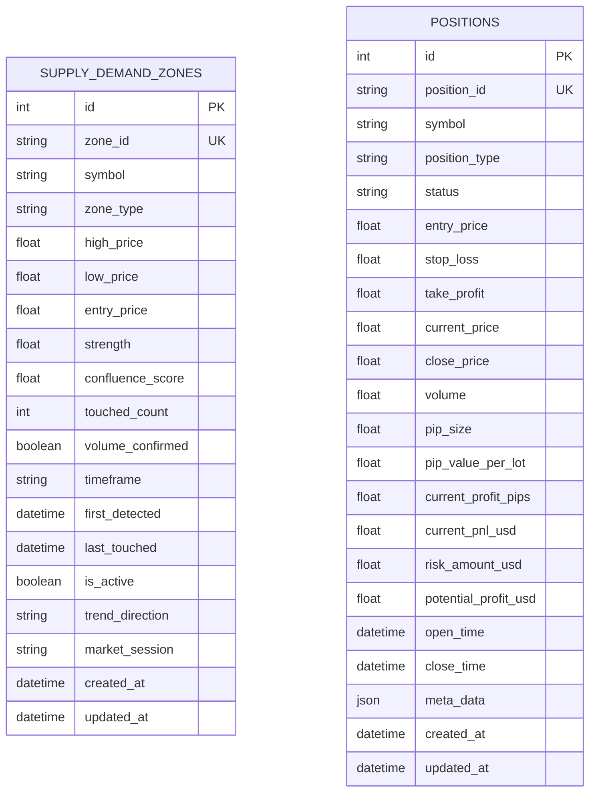

# Trading Bot Database ERD (Entity Relationship Diagram)

## ⚠️ Database Status: **MINIMAL IMPLEMENTATION**

**Current State**: Production database has **2 tables only**
**Target State**: 14 tables for full dashboard functionality
**Gap**: 12 tables + multiple missing fields

---

## 📊 Current Database Schema (Actual Implementation)

### Actual Tables in Production:
1. ✅ `supply_demand_zones` - Supply & Demand zone tracking
2. ✅ `positions` - Basic position management

**Last Updated**: January 6, 2026 (Verified from Alembic migrations)

---

## Entity Relationship Diagram (Current State)



**Note**: Currently NO relationships exist as tables are independent.

---

## 🚨 Critical Gap Analysis: Current vs Required Schema

### Missing Tables (12 Tables) - **CRITICAL**

#### **1. TRADING_SESSIONS** - ❌ **NOT IMPLEMENTED**
**Purpose**: Track trading sessions, configurations, and performance
**Impact**: Cannot group positions by session, cannot track configuration changes, cannot calculate session-level P&L

**Required Fields**:
```sql
- session_id (PK)
- account_id (FK) → TRADING_ACCOUNTS
- config_hash (FK) → CONFIG_SNAPSHOTS
- trading_type, config_profile, dry_run
- start_time, end_time, status
- total_pnl_usd, total_trades, winning_trades, losing_trades, win_rate
- is_backtest, backtest_start_date, backtest_end_date
- data_quality_score
- session_metadata (JSON)
- created_at, updated_at
```

#### **2. TRADING_ACCOUNTS** - ❌ **NOT IMPLEMENTED**
**Purpose**: Multi-account support (Demo/Live, Cent/Standard, Prop Firm)
**Impact**: Cannot distinguish between accounts, cannot track which account opened positions

**Required Fields**:
```sql
- account_id (PK) - MT5 Login ID
- broker_name, account_number, account_type
- currency, balance, equity, leverage
- is_active
- created_at, updated_at
```

#### **3. CONFIG_SNAPSHOTS** - ❌ **NOT IMPLEMENTED**
**Purpose**: Configuration versioning for audit trail
**Impact**: Cannot reproduce results, cannot audit configuration changes

**Required Fields**:
```sql
- config_hash (PK) - SHA256 of config
- config_json (JSONB) - Full config snapshot
- created_at
```

#### **4. TRADING_SIGNALS** - ❌ **NOT IMPLEMENTED**
**Purpose**: Store generated trading signals
**Impact**: Cannot analyze signal quality, cannot track signal-to-position success rate

**Required Fields**:
```sql
- signal_id (PK)
- session_id (FK), zone_id (FK)
- symbol, timeframe, trading_type, direction
- entry_price, stop_loss, take_profit
- foundation_score, enhancement_scores (JSON), final_confidence
- risk_reward_ratio, signal_status
- generated_at, expires_at
```

#### **5. SIGNAL_EXECUTIONS** - ❌ **NOT IMPLEMENTED**
**Purpose**: Track signal execution attempts
**Impact**: Cannot track execution failures, cannot analyze slippage

**Required Fields**:
```sql
- execution_id (PK)
- signal_id (FK), position_id (FK)
- execution_type, success, failure_reason
- execution_price, slippage
- execution_time
```

#### **6. POSITION_MODIFICATIONS** - ❌ **NOT IMPLEMENTED**
**Purpose**: Audit trail for breakeven, trailing, partial closes
**Impact**: Cannot track automation effectiveness, no modification history

**Required Fields**:
```sql
- modification_id (PK)
- position_id (FK)
- modification_type, old_value, new_value
- reason, success, error_message
- executed_at
```

#### **7. PARTIAL_CLOSES** - ❌ **NOT IMPLEMENTED**
**Purpose**: Track partial position closes
**Impact**: Cannot analyze profit-taking strategy effectiveness

**Required Fields**:
```sql
- partial_close_id (PK)
- position_id (FK)
- close_price, volume_closed, profit_pips, profit_usd
- remaining_volume, close_time, reason
```

#### **8. MARKET_DATA** - ❌ **NOT IMPLEMENTED**
**Purpose**: OHLCV data with technical indicators
**Impact**: Cannot build charts, cannot backtest, no historical data

**Required Fields**:
```sql
- data_id (PK)
- symbol, timeframe, timestamp
- open_price, high_price, low_price, close_price, volume, spread
- technical_indicators (JSON)
- created_at
```

#### **9. SYMBOL_INFO** - ❌ **NOT IMPLEMENTED**
**Purpose**: Symbol metadata and specifications
**Impact**: Hardcoded pip values, no dynamic symbol configuration

**Required Fields**:
```sql
- symbol (PK)
- asset_class, description
- pip_size, pip_value_per_lot, digits
- min_volume, max_volume, volume_step
- is_active, market_hours (JSON)
- last_updated
```

#### **10. RISK_METRICS** - ❌ **NOT IMPLEMENTED**
**Purpose**: Real-time risk calculations
**Impact**: No risk dashboard, cannot track exposure history

**Required Fields**:
```sql
- risk_id (PK)
- session_id (FK), position_id (FK)
- account_balance, total_exposure, used_margin, free_margin
- daily_pnl, max_drawdown, risk_percentage, active_positions
- risk_limits (JSON)
- calculated_at
```

#### **11. RISK_VIOLATIONS** - ❌ **NOT IMPLEMENTED**
**Purpose**: Risk violation tracking
**Impact**: No risk alerts history, cannot analyze violations

**Required Fields**:
```sql
- violation_id (PK)
- risk_id (FK)
- violation_type, severity, description
- violation_details (JSON)
- resolved, occurred_at, resolved_at
```

#### **12. SYSTEM_HEALTH** / **AUDIT_LOG** / **BOT_CONFIGURATIONS** - ❌ **NOT IMPLEMENTED**
**Purpose**: System monitoring and audit trail
**Impact**: No system health tracking, limited audit capabilities

---

### Missing Fields in POSITIONS Table - **CRITICAL**

#### **Relationship Fields** (Priority: CRITICAL)
```sql
❌ session_id (FK) → TRADING_SESSIONS  -- Cannot group by session
❌ account_id (FK) → TRADING_ACCOUNTS  -- Cannot identify account
❌ signal_id (FK) → TRADING_SIGNALS    -- Cannot link to signal
❌ strategy_id TEXT                     -- Cannot identify strategy
❌ magic_number INTEGER                 -- MT5 magic number
❌ mt5_ticket INTEGER                   -- MT5 ticket ID
❌ comment TEXT                         -- MT5 comment
```

#### **Closing Details** (Priority: CRITICAL)
```sql
✅ close_price REAL                     -- EXISTS
❌ realized_pnl_usd REAL                -- Final P&L when closed
❌ realized_profit_pips REAL            -- Final profit in pips
❌ close_reason TEXT                    -- Why closed (SL/TP/Manual)
❌ exit_type TEXT                       -- Exit classification
```

#### **Quality Metrics** (Priority: HIGH)
```sql
❌ mae_pips REAL                        -- Max Adverse Excursion
❌ mfe_pips REAL                        -- Max Favorable Excursion
❌ quality_score REAL                   -- Calculated quality (0-100)
❌ is_winner BOOLEAN                    -- Win/Loss flag
❌ holding_time_seconds INTEGER         -- Position duration
❌ max_profit_pips REAL                 -- Max profit reached
❌ max_drawdown_pips REAL               -- Max loss from peak
❌ signal_confidence REAL               -- Copy from signal
```

#### **Execution Metrics** (Priority: MEDIUM)
```sql
❌ execution_duration_ms INTEGER        -- Entry execution time
❌ slippage_pips REAL                   -- Entry slippage
❌ closing_slippage_pips REAL           -- Exit slippage
❌ entry_tags JSON                      -- Entry context tags
```

#### **Missing from Current Schema**
```sql
❌ asset_class TEXT                     -- Forex/Commodities/Crypto
❌ direction TEXT                       -- (currently position_type)
❌ entry_to_sl_pips REAL                -- Risk in pips
❌ entry_to_tp_pips REAL                -- Reward in pips
❌ breakeven_activated BOOLEAN          -- Automation tracking
❌ trailing_activated BOOLEAN           -- Automation tracking
```

---

### Missing Fields in SUPPLY_DEMAND_ZONES Table

#### **Relationship Fields**
```sql
❌ session_id (FK) → TRADING_SESSIONS  -- Cannot group zones by session
❌ trading_type TEXT                    -- Cannot filter by trading type
```

#### **Additional Context**
```sql
❌ price_level REAL                     -- Exact price level
❌ freshness_score REAL                 -- Zone freshness
```

---

## 📊 Dashboard Feasibility Analysis

### ❌ **Current State: DASHBOARD NOT FEASIBLE**

| Dashboard Feature | Data Available? | Severity |
|-------------------|-----------------|----------|
| **Real-time Position Dashboard** | ⚠️ Partial (no session/account context) | 🔴 CRITICAL |
| **Position Management** | ⚠️ Partial (basic data only) | 🔴 CRITICAL |
| **Strategy Analysis** | ❌ No signal data | 🔴 CRITICAL |
| **Market Analysis** | ❌ No market data | 🔴 CRITICAL |
| **Risk Management** | ❌ No risk metrics | 🔴 CRITICAL |
| **Analytics & Reports** | ❌ Missing aggregations | 🔴 CRITICAL |
| **System Health** | ❌ No health tracking | 🟡 HIGH |

### Critical Questions That CANNOT Be Answered:

1. ❌ **"Mana posisi yang bagus atau tidak?"**
   - No `quality_score`, `mae_pips`, `mfe_pips`
   - No `realized_pnl_usd` for closed positions
   - No `exit_type` classification

2. ❌ **"Profit atau loss tiap sesi/tiap start berapa?"**
   - No `TRADING_SESSIONS` table
   - No `session_id` in POSITIONS
   - No session-level aggregation

3. ❌ **"Data untuk backtest valid atau tidak?"**
   - No `MARKET_DATA` table
   - No `is_backtest` flag
   - No data quality validation

4. ❌ **"Position dibuka pakai akun mana?"**
   - No `TRADING_ACCOUNTS` table
   - No `account_id` in POSITIONS

5. ❌ **"Position dibuka dengan strategi apa?"**
   - No `strategy_id` or `magic_number`
   - No `TRADING_SIGNALS` table

---

## 🎯 Migration Roadmap (Priority Order)

### **Phase 1: Foundation Tables** (CRITICAL - Week 1)
1. ✅ Create `TRADING_ACCOUNTS` table
2. ✅ Create `TRADING_SESSIONS` table with session aggregation fields
3. ✅ Create `CONFIG_SNAPSHOTS` table
4. ✅ Update `POSITIONS` table:
   - Add relationship FKs (`session_id`, `account_id`, `signal_id`)
   - Add closing details (`realized_pnl_usd`, `exit_type`, etc.)
   - Add strategy attribution (`strategy_id`, `magic_number`, `mt5_ticket`)
5. ✅ Update `SUPPLY_DEMAND_ZONES` table:
   - Add `session_id` FK

### **Phase 2: Signal & Execution Tracking** (HIGH - Week 2)
6. ✅ Create `TRADING_SIGNALS` table
7. ✅ Create `SIGNAL_EXECUTIONS` table
8. ✅ Create `POSITION_MODIFICATIONS` table
9. ✅ Create `PARTIAL_CLOSES` table

### **Phase 3: Market Data & Monitoring** (MEDIUM - Week 3)
10. ✅ Create `MARKET_DATA` table
11. ✅ Create `SYMBOL_INFO` table
12. ✅ Create `RISK_METRICS` table
13. ✅ Create `RISK_VIOLATIONS` table

### **Phase 4: System Health & Audit** (LOW - Week 4)
14. ✅ Create `SYSTEM_HEALTH` table
15. ✅ Create `AUDIT_LOG` table
16. ✅ Create `BOT_CONFIGURATIONS` table

### **Phase 5: Quality Metrics & Analytics** (ENHANCEMENT - Week 5)
17. ✅ Add quality metrics to POSITIONS (MAE, MFE, quality_score)
18. ✅ Create background worker for MAE/MFE calculation
19. ✅ Create materialized views for analytics
20. ✅ Implement indexes for performance

---

## ✅ Current Database Strengths

Despite gaps, current schema has:
- ✅ Basic position tracking with pip calculations
- ✅ Supply & Demand zones with strength scoring
- ✅ Proper timestamps and audit fields
- ✅ JSON fields for flexible data storage
- ✅ PostgreSQL-ready data types

---

## 📝 Summary

**Current State**: 2 tables (14% complete)
**Required State**: 14+ tables (100%)
**Dashboard Readiness**: ❌ **NOT READY** (requires all Phase 1-3 tables minimum)

**Recommendation**: Complete Phase 1-3 migrations before dashboard development.
