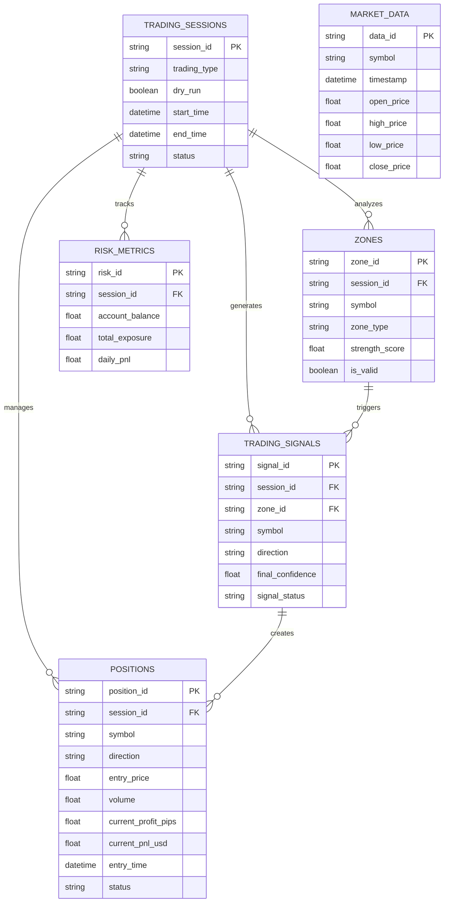

# Database ERD

## Current State

| Status | Tables | Completion |
|--------|--------|------------|
| **Implemented** | 2 | 14% |
| **Target** | 14 | 100% |

### Existing Tables
- `supply_demand_zones` - S&D zone tracking
- `positions` - Basic position management

## Target Schema

## Missing Tables (Priority Order)

| Phase | Table | Purpose |
|-------|-------|---------|
| 1 | `TRADING_ACCOUNTS` | Multi-account support |
| 1 | `TRADING_SESSIONS` | Session grouping & P&L |
| 1 | `CONFIG_SNAPSHOTS` | Config versioning |
| 2 | `TRADING_SIGNALS` | Signal quality analysis |
| 2 | `SIGNAL_EXECUTIONS` | Execution tracking |
| 2 | `POSITION_MODIFICATIONS` | Breakeven/trailing audit |
| 2 | `PARTIAL_CLOSES` | Profit-taking tracking |
| 3 | `MARKET_DATA` | OHLCV + indicators |
| 3 | `SYMBOL_INFO` | Dynamic symbol config |
| 3 | `RISK_METRICS` | Risk dashboard |
| 3 | `RISK_VIOLATIONS` | Risk alerts history |
| 4 | `SYSTEM_HEALTH` | Monitoring |

## Migration Checklist

- [ ] Phase 1: Core tables (sessions, accounts, configs)
- [ ] Phase 2: Signal tracking & execution
- [ ] Phase 3: Market data & risk metrics
- [ ] Phase 4: System health & monitoring

## Dashboard Feasibility

| Feature | Ready? |
|---------|--------|
| Position Dashboard | ⚠️ Partial (no session context) |
| Strategy Analysis | ❌ No signal data |
| Risk Dashboard | ❌ No risk metrics |
| Analytics | ❌ Missing aggregations |

**Conclusion**: Complete Phase 1-3 for full dashboard functionality.
