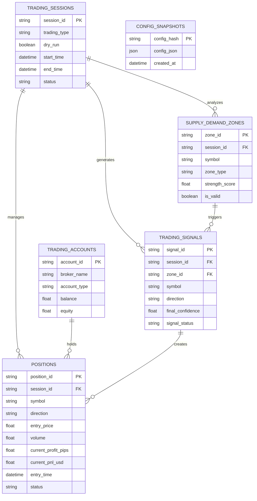

# Database ERD

Entity relationship diagram for the trading bot database schema.

## Current State

| Status | Tables | Completion |
|--------|--------|------------|
| **Implemented** | 5 | ~36% |
| **Target** | 14 | 100% |

### Implemented Tables
- `supply_demand_zones` - S&D zone tracking
- `positions` - Position management
- `trading_accounts` - Multi-account support
- `trading_sessions` - Session grouping
- `config_snapshots` - Config versioning

### In Progress
- `trading_signals` - Signal tracking
- `position_modifications` - Modification audit
- `partial_closes` - Profit-taking tracking

### Planned
- `market_data` - OHLCV storage
- `risk_metrics` - Risk tracking
- `symbol_info` - Dynamic symbol config
- `risk_violations` - Risk alerts
- `system_health` - Monitoring

## Entity Relationship Diagram

## Missing Tables (Priority)

| Phase | Table | Purpose |
|-------|-------|---------|
| 2 | `TRADING_SIGNALS` | Signal quality analysis |
| 2 | `SIGNAL_EXECUTIONS` | Execution tracking |
| 2 | `POSITION_MODIFICATIONS` | Breakeven/trailing audit |
| 2 | `PARTIAL_CLOSES` | Profit-taking tracking |
| 3 | `MARKET_DATA` | OHLCV + indicators |
| 3 | `RISK_METRICS` | Risk dashboard |
| 3 | `SYMBOL_INFO` | Dynamic symbol config |
| 4 | `RISK_VIOLATIONS` | Risk alerts history |
| 4 | `SYSTEM_HEALTH` | Monitoring |

## Migration Checklist

- [x] Phase 1: Core tables (sessions, accounts, configs)
- [ ] Phase 2: Signal tracking & execution
- [ ] Phase 3: Market data & risk metrics
- [ ] Phase 4: System health & monitoring

## Dashboard Feasibility

| Feature | Ready? |
|---------|--------|
| Position Dashboard | ⚠️ Partial (no signal tracking) |
| Strategy Analysis | ⚠️ Partial (no execution tracking) |
| Risk Dashboard | ❌ No risk metrics table |
| Analytics | ⚠️ Partial (basic aggregations) |

**For database implementation details, see [`src/trading_bot/data/models.py`](../../src/trading_bot/data/models.py).**
