# End-to-End Trading Flow Documentation

## Overview

This document provides a comprehensive overview of the complete trading flow in the Advanced Trading Bot System, from market analysis to trade execution and management.

## 🏗️ System Architecture Flow

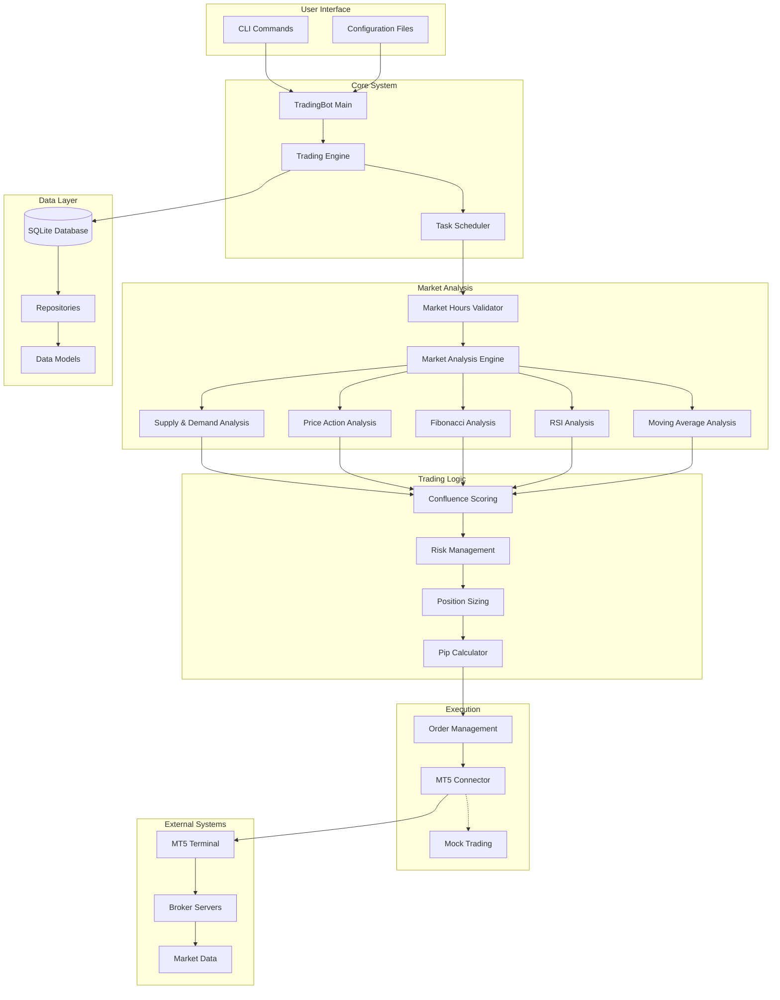

## 📊 Detailed End-to-End Trading Flow

### Phase 1: System Initialization

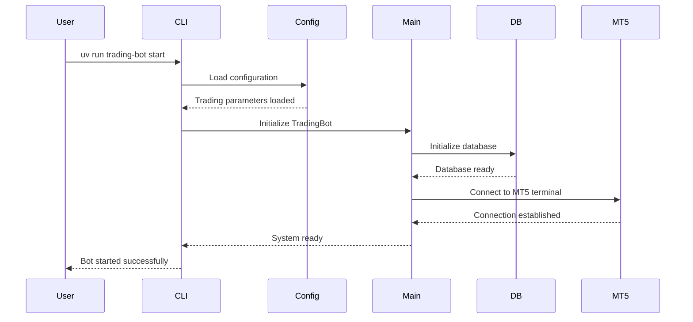

### Phase 2: Market Analysis Cycle

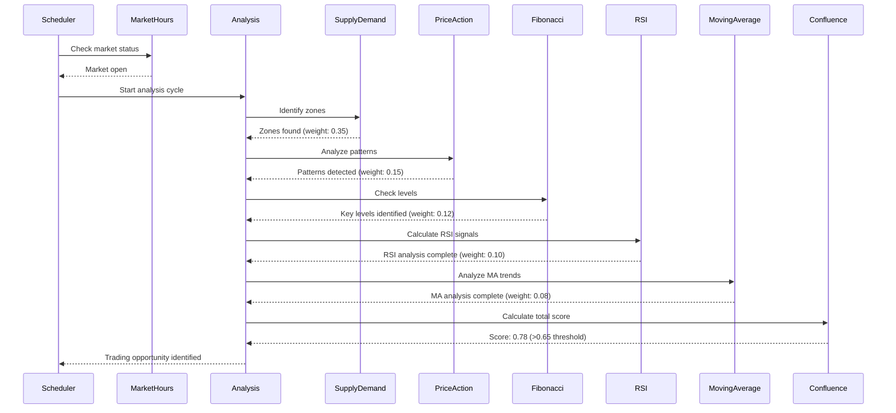

### Phase 3: Risk Management & Position Sizing

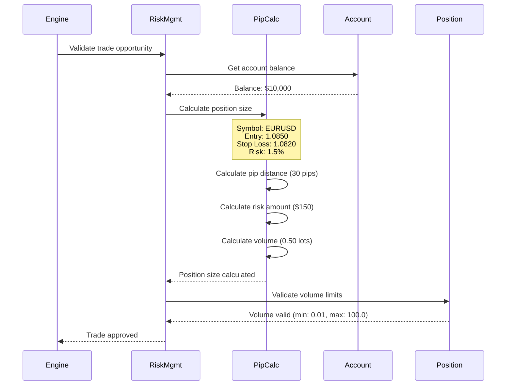

### Phase 4: Order Execution

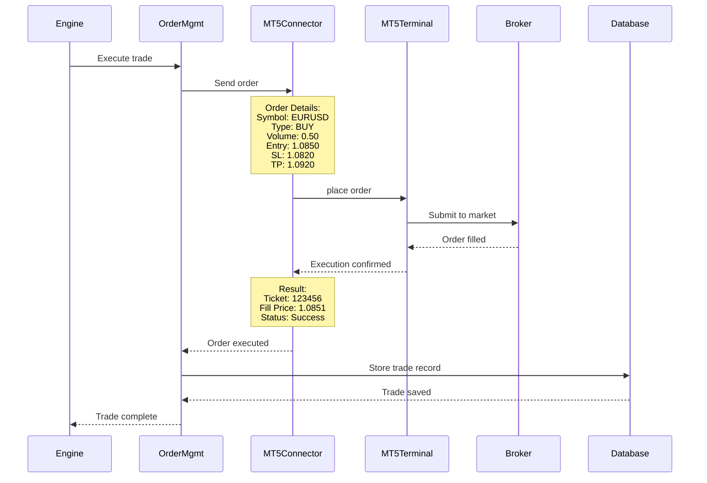

### Phase 5: Position Management

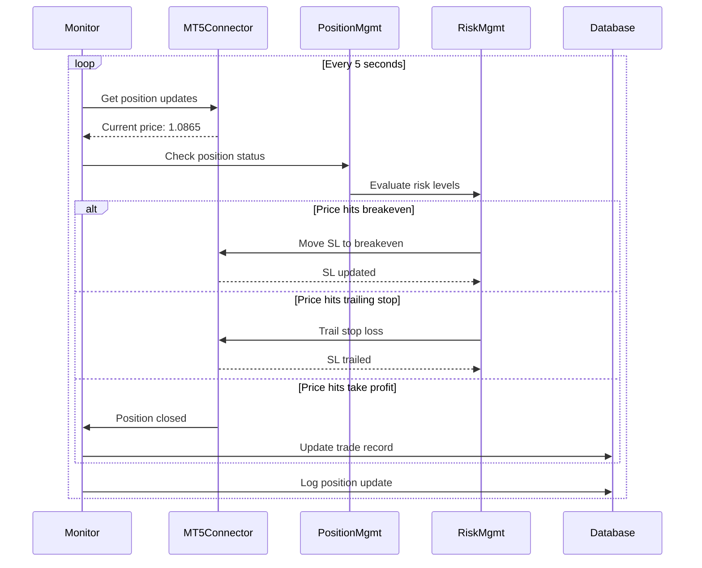

## 🔄 Complete Trading Session Flow

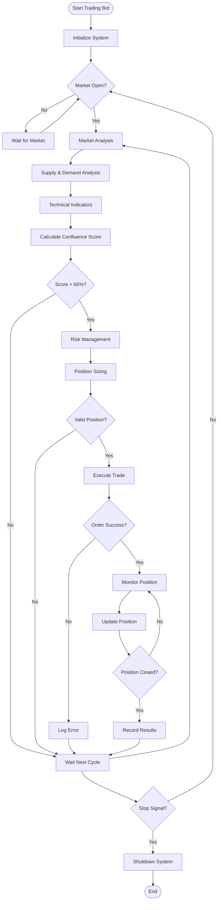

## 📈 Trading Type Specific Flows

### Scalping Flow (M1-M15, High Frequency)

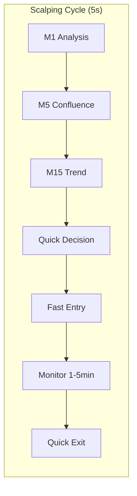

### Day Trading Flow (M15-H4, Balanced)

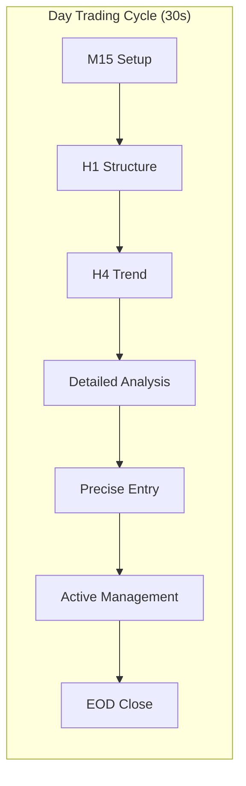

### Swing Trading Flow (H4-D1, Multi-day)

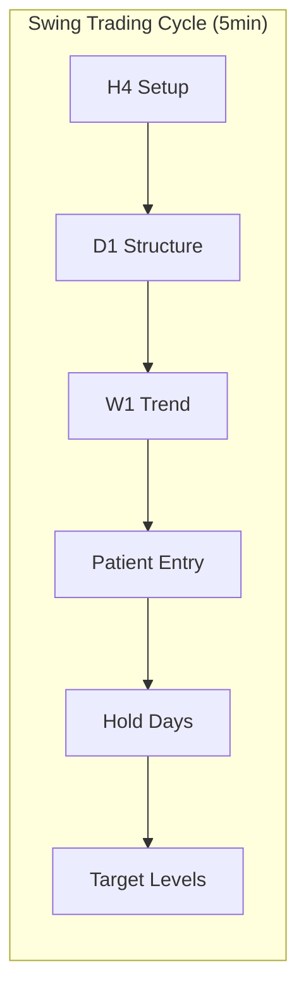

## 🏗️ Database Flow

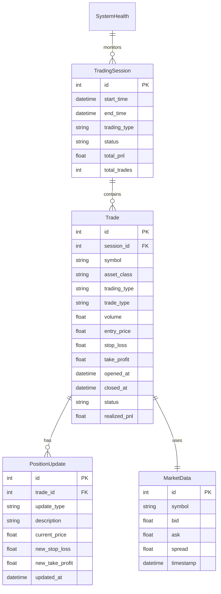

## 🔧 Configuration Flow

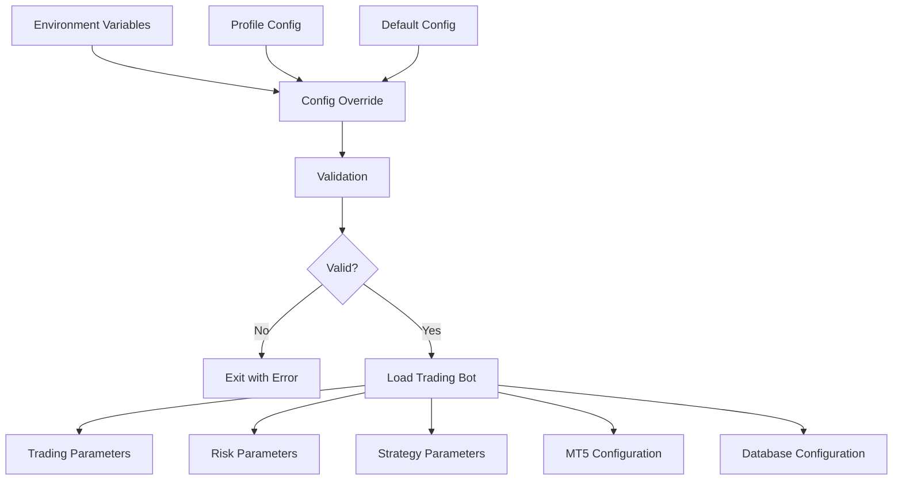

## ⚡ Performance Metrics Flow

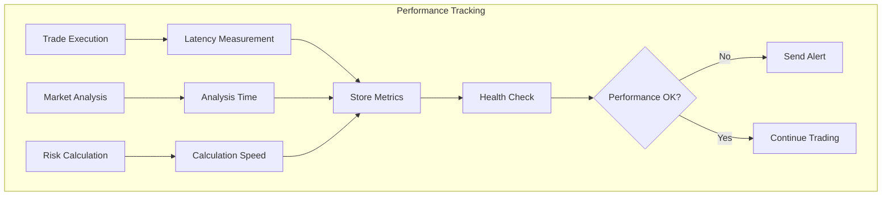

## 🚨 Error Handling Flow

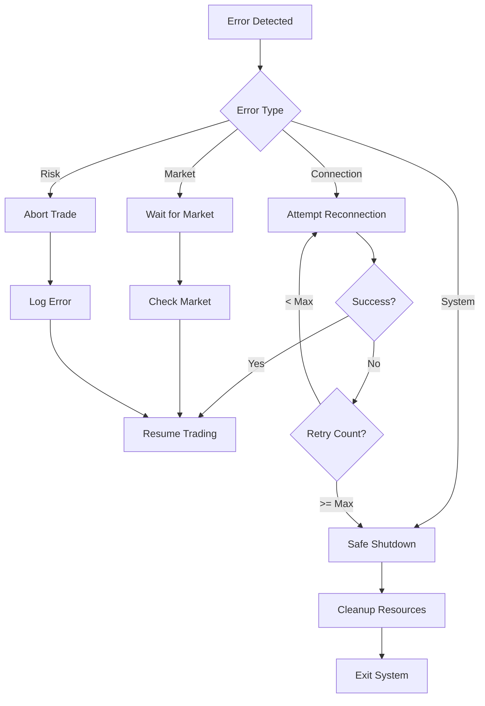

## 📊 Key Trading Parameters

### Risk Management
- **Maximum risk per trade:** 0.2% - 1.8% (based on trading type)
- **Maximum daily loss:** 5%
- **Maximum drawdown:** 15%
- **Maximum open positions:** 3

### Position Sizing
- **Minimum volume:** 0.01 lots (all asset classes)
- **Maximum volume:** 100 lots (Forex), 50 lots (Commodities), 10 lots (Crypto)
- **Risk scaling:** Dynamic based on trading type and account balance

### Confluence Scoring
- **Minimum threshold:** 65%
- **Foundation weight:** 35% (Supply & Demand - mandatory)
- **Enhancement weights:** Price Action (15%), Fibonacci (12%), RSI (10%), MA (8%)

### Timing
- **Analysis frequency:** 5s (Scalping) → 5min (Swing)
- **Position monitoring:** Real-time
- **Database updates:** Every position change
- **Health checks:** Every 30 seconds

## 🎯 Trading Session Lifecycle

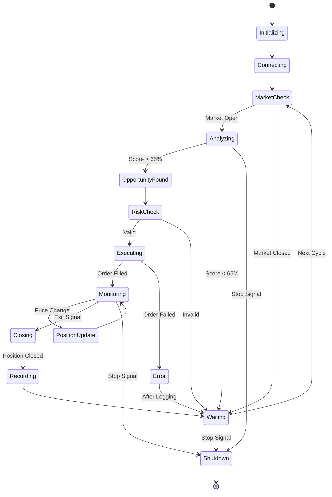

This documentation provides a complete view of how the trading bot operates from start to finish, including all the technical analysis, risk management, and execution phases.