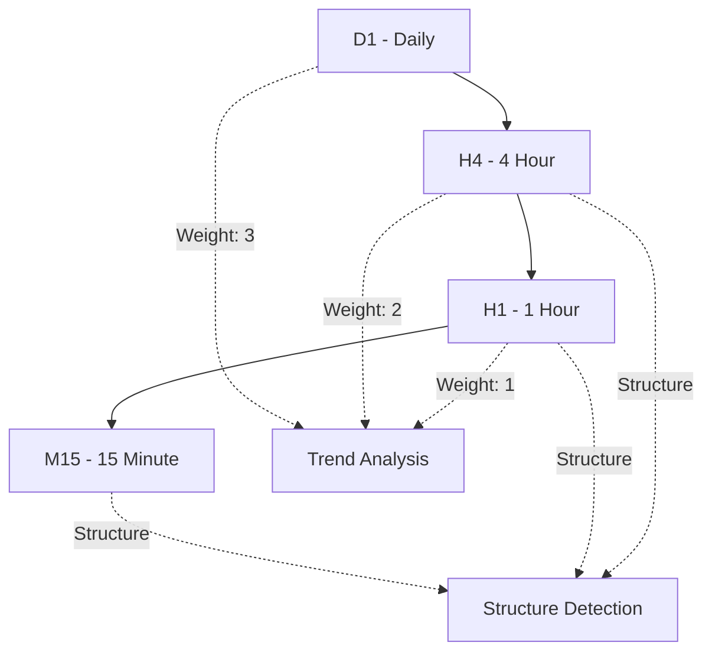

# ⏰ Multi-Timeframe Analysis Guide

## Overview

Trading bot menggunakan sophisticated multi-timeframe analysis untuk meningkatkan akurasi signal dan mengurangi false signals. System ini menganalisis struktur pasar dan trend alignment across multiple timeframes untuk memberikan confluence-based trading decisions.

## Default Timeframe Configuration

### Primary Timeframes

```bash
# Core Analysis Timeframes
PRIMARY_TIMEFRAME=H1          # Main analysis timeframe
SECONDARY_TIMEFRAME=H4        # Trend confirmation timeframe  
TERTIARY_TIMEFRAME=D1         # Major trend direction
ANALYSIS_TIMEFRAMES=M15,H1,H4 # Structure detection range
```

### Timeframe Hierarchy



## Timeframe Weights & Scoring

### Trend Analysis Weights

```json
{
  "trend_weights": {
    "D1": 3,    // Major trend - Highest priority
    "H4": 2,    // Intermediate trend - Medium priority
    "H1": 1     // Short-term trend - Lower priority
  },
  "minimum_trend_strength": 4,  // Combined score threshold
  "trend_alignment_weight": 0.45 // Overall trend influence
}
```

### Weight Distribution in Practice

**Example Calculation**:
```python
# Trend alignment scoring
def calculate_trend_score(h1_trend, h4_trend, d1_trend, expected_trend):
    score = 0
    
    # H1 trend (weight: 1) - 30% influence
    if h1_trend == expected_trend:
        score += 1 * 0.30
    elif h1_trend == 'neutral':
        score += 1 * 0.15
    
    # H4 trend (weight: 2) - 40% influence  
    if h4_trend == expected_trend:
        score += 2 * 0.40
    elif h4_trend == 'neutral':
        score += 2 * 0.20
    
    # D1 trend (weight: 3) - 30% influence
    if d1_trend == expected_trend:
        score += 3 * 0.30
    elif d1_trend == 'neutral':
        score += 3 * 0.15
    
    return score
```

## Structure Analysis Across Timeframes

### Break of Structure (BOS) Detection

**Multi-Timeframe BOS Analysis**:

```python
class MultiTimeframeBOSDetector:
    def __init__(self):
        self.timeframes = ['M15', 'H1', 'H4']
        self.confirmation_weights = {
            'M15': 0.2,  # Entry timing
            'H1': 0.5,   # Main confirmation
            'H4': 0.3    # Trend confirmation
        }
    
    async def detect_bos_confluence(self, symbol):
        bos_events = {}
        
        for tf in self.timeframes:
            bos_events[tf] = await self.detect_bos(symbol, tf)
        
        # Calculate confluence score
        confluence_score = 0
        for tf, events in bos_events.items():
            if events and self.validate_bos_quality(events[-1]):
                confluence_score += self.confirmation_weights[tf]
        
        return {
            'confluence_score': confluence_score,
            'events_by_timeframe': bos_events,
            'is_confluent': confluence_score >= 0.6
        }
```

### Change of Character (CHoCH) Analysis

**Timeframe-Specific CHoCH Detection**:

```json
{
  "choch_timeframe_settings": {
    "M15": {
      "lookback_periods": 50,
      "momentum_threshold": 0.3,
      "confirmation_candles": 3
    },
    "H1": {
      "lookback_periods": 100,
      "momentum_threshold": 0.4,
      "confirmation_candles": 5
    },
    "H4": {
      "lookback_periods": 200,
      "momentum_threshold": 0.5,
      "confirmation_candles": 8
    }
  }
}
```

## Order Block Detection

### Timeframe-Specific Order Blocks

```python
class MultiTimeframeOrderBlocks:
    def __init__(self):
        self.timeframe_priorities = {
            'H4': 1.0,   # Highest priority - institutional levels
            'H1': 0.7,   # Medium priority - swing levels
            'M15': 0.4   # Lower priority - short-term levels
        }
    
    def detect_order_blocks(self, symbol):
        order_blocks = {}
        
        for tf, priority in self.timeframe_priorities.items():
            blocks = self.find_order_blocks(symbol, tf)
            
            # Apply timeframe-specific scoring
            for block in blocks:
                block['priority_score'] = block['strength'] * priority
                block['timeframe'] = tf
            
            order_blocks[tf] = blocks
        
        return self.merge_and_rank_blocks(order_blocks)
```

### Order Block Validation Across Timeframes

```json
{
  "order_block_validation": {
    "H4_blocks": {
      "min_strength": 0.7,
      "min_volume_ratio": 1.5,
      "max_age_hours": 168
    },
    "H1_blocks": {
      "min_strength": 0.6,
      "min_volume_ratio": 1.3,
      "max_age_hours": 72
    },
    "M15_blocks": {
      "min_strength": 0.5,
      "min_volume_ratio": 1.2,
      "max_age_hours": 24
    }
  }
}
```

## Fair Value Gap (FVG) Analysis

### Timeframe-Specific FVG Sizing

```python
class MultiTimeframeFVG:
    def __init__(self):
        self.min_gap_sizes = {
            'M15': {
                'forex': 3,      # pips
                'commodities': 15,
                'crypto': 50
            },
            'H1': {
                'forex': 8,
                'commodities': 30,
                'crypto': 100
            },
            'H4': {
                'forex': 15,
                'commodities': 60,
                'crypto': 200
            }
        }
    
    def detect_fvg(self, symbol, timeframe, asset_class):
        min_size = self.min_gap_sizes[timeframe][asset_class]
        gaps = self.find_price_gaps(symbol, timeframe, min_size)
        
        # Calculate fill probability based on timeframe
        for gap in gaps:
            gap['fill_probability'] = self.calculate_fill_probability(
                gap, timeframe, asset_class
            )
        
        return gaps
```

## Confluence Scoring System

### Multi-Timeframe Confluence Calculation

```python
class ConfluenceAnalyzer:
    def __init__(self):
        self.confluence_weights = {
            'trend_alignment': 0.35,
            'structure_confluence': 0.25,
            'order_block_proximity': 0.20,
            'fvg_alignment': 0.10,
            'liquidity_context': 0.10
        }
    
    def calculate_confluence_score(self, signal_data):
        total_score = 0
        
        # Trend alignment across timeframes
        trend_score = self.calculate_trend_confluence(signal_data['trends'])
        total_score += trend_score * self.confluence_weights['trend_alignment']
        
        # Structure confluence (BOS/CHoCH alignment)
        structure_score = self.calculate_structure_confluence(signal_data['structure'])
        total_score += structure_score * self.confluence_weights['structure_confluence']
        
        # Order block proximity across timeframes
        ob_score = self.calculate_order_block_confluence(signal_data['order_blocks'])
        total_score += ob_score * self.confluence_weights['order_block_proximity']
        
        # Fair Value Gap alignment
        fvg_score = self.calculate_fvg_confluence(signal_data['fvgs'])
        total_score += fvg_score * self.confluence_weights['fvg_alignment']
        
        # Liquidity context
        liquidity_score = self.calculate_liquidity_confluence(signal_data['liquidity'])
        total_score += liquidity_score * self.confluence_weights['liquidity_context']
        
        return {
            'total_score': total_score,
            'breakdown': {
                'trend': trend_score,
                'structure': structure_score,
                'order_blocks': ob_score,
                'fvg': fvg_score,
                'liquidity': liquidity_score
            }
        }
```

## Configuration Examples

### Complete Multi-Timeframe Setup

```bash
# Multi-Timeframe Analysis Configuration
MULTI_TIMEFRAME_ENABLED=true
PRIMARY_TIMEFRAME=H1
SECONDARY_TIMEFRAME=H4
TERTIARY_TIMEFRAME=D1
ANALYSIS_TIMEFRAMES=M15,H1,H4

# Trend Analysis Weights
D1_TREND_WEIGHT=3
H4_TREND_WEIGHT=2
H1_TREND_WEIGHT=1
MIN_TREND_STRENGTH=4

# Trend Validation Settings
TREND_VALIDATION_ENABLED=true
REQUIRE_TREND_ALIGNMENT=true
TREND_ALIGNMENT_WEIGHT=0.45
TREND_ALIGNMENT_BONUS=0.10

# Confluence Settings
CONFLUENCE_BONUS_ENABLED=true
MIN_CONFLUENCE_SCORE=0.65
HIGH_CONFLUENCE_THRESHOLD=0.80

# Structure Analysis by Timeframe
STRUCTURE_ANALYSIS_M15_ENABLED=true
STRUCTURE_ANALYSIS_H1_ENABLED=true
STRUCTURE_ANALYSIS_H4_ENABLED=true
STRUCTURE_ANALYSIS_D1_ENABLED=false  # Too slow for real-time
```

### Asset-Specific Timeframe Settings

```json
{
  "forex_major": {
    "primary_timeframe": "H1",
    "analysis_timeframes": ["M15", "H1", "H4"],
    "trend_timeframes": ["H1", "H4", "D1"],
    "structure_detection_sensitivity": {
      "M15": "high",
      "H1": "medium", 
      "H4": "low"
    }
  },
  "commodities": {
    "primary_timeframe": "H4",
    "analysis_timeframes": ["H1", "H4", "D1"],
    "trend_timeframes": ["H4", "D1", "W1"],
    "structure_detection_sensitivity": {
      "H1": "medium",
      "H4": "high",
      "D1": "medium"
    }
  },
  "crypto": {
    "primary_timeframe": "H1",
    "analysis_timeframes": ["M15", "H1", "H4"],
    "trend_timeframes": ["H1", "H4", "D1"],
    "structure_detection_sensitivity": {
      "M15": "very_high",
      "H1": "high",
      "H4": "medium"
    }
  }
}
```

## Performance Optimization

### Timeframe Analysis Optimization

```python
class OptimizedMultiTimeframeAnalysis:
    def __init__(self):
        self.cache_duration = {
            'M15': 300,   # 5 minutes
            'H1': 1800,   # 30 minutes
            'H4': 7200,   # 2 hours
            'D1': 14400   # 4 hours
        }
        
        self.analysis_cache = {}
    
    async def get_timeframe_analysis(self, symbol, timeframe):
        cache_key = f"{symbol}_{timeframe}"
        
        # Check cache first
        if self.is_cache_valid(cache_key, timeframe):
            return self.analysis_cache[cache_key]
        
        # Perform analysis
        analysis = await self.perform_analysis(symbol, timeframe)
        
        # Cache results
        self.analysis_cache[cache_key] = {
            'data': analysis,
            'timestamp': time.time()
        }
        
        return analysis
    
    def is_cache_valid(self, cache_key, timeframe):
        if cache_key not in self.analysis_cache:
            return False
        
        cache_age = time.time() - self.analysis_cache[cache_key]['timestamp']
        return cache_age < self.cache_duration[timeframe]
```

### Memory Management for Multi-Timeframe Data

```python
class TimeframeDataManager:
    def __init__(self):
        self.max_candles_per_timeframe = {
            'M15': 500,   # ~5 days
            'H1': 500,    # ~20 days
            'H4': 300,    # ~50 days
            'D1': 200     # ~7 months
        }
    
    def optimize_data_usage(self):
        for tf, max_candles in self.max_candles_per_timeframe.items():
            # Trim old data to prevent memory bloat
            self.trim_timeframe_data(tf, max_candles)
        
        # Force garbage collection
        gc.collect()
```

## Monitoring & Debugging

### Multi-Timeframe Analysis Monitoring

```python
class MultiTimeframeMonitor:
    def __init__(self):
        self.performance_metrics = {}
    
    def log_analysis_performance(self, symbol, timeframes, execution_time):
        """Log performance metrics for multi-timeframe analysis."""
        
        metric_key = f"{symbol}_{len(timeframes)}tf"
        
        if metric_key not in self.performance_metrics:
            self.performance_metrics[metric_key] = []
        
        self.performance_metrics[metric_key].append({
            'execution_time': execution_time,
            'timeframes': timeframes,
            'timestamp': time.time()
        })
        
        # Alert if analysis takes too long
        if execution_time > 5.0:  # 5 seconds threshold
            logger.warning(f"Slow multi-timeframe analysis: {execution_time:.2f}s for {symbol}")
    
    def get_performance_summary(self):
        """Get performance summary for all timeframe analyses."""
        
        summary = {}
        for key, metrics in self.performance_metrics.items():
            if metrics:
                avg_time = sum(m['execution_time'] for m in metrics) / len(metrics)
                max_time = max(m['execution_time'] for m in metrics)
                
                summary[key] = {
                    'average_time': avg_time,
                    'max_time': max_time,
                    'total_analyses': len(metrics)
                }
        
        return summary
```

### Debug Configuration

```bash
# Debug Multi-Timeframe Analysis
DEBUG_MULTI_TIMEFRAME=true
LOG_TIMEFRAME_ANALYSIS=true
LOG_CONFLUENCE_CALCULATIONS=true
LOG_TREND_ALIGNMENT_DETAILS=true

# Performance Monitoring
MONITOR_TIMEFRAME_ANALYSIS_TIME=true
MAX_TIMEFRAME_ANALYSIS_TIME=5.0
ALERT_ON_SLOW_ANALYSIS=true
```

## Best Practices

### 1. Timeframe Selection Guidelines

- **Scalping (M1-M5)**: Use M15, H1 for structure
- **Day Trading (M15-H1)**: Use H1, H4, D1 for confluence
- **Swing Trading (H4-D1)**: Use H4, D1, W1 for trend analysis

### 2. Performance Considerations

- **Cache Analysis Results**: Avoid redundant calculations
- **Limit Timeframe Count**: Max 3-4 timeframes per analysis
- **Optimize Data Retention**: Keep only necessary historical data
- **Async Processing**: Use parallel analysis where possible

### 3. Signal Quality Enhancement

- **Require Multi-TF Confluence**: Minimum 2 timeframes aligned
- **Weight Higher Timeframes**: Give more importance to H4/D1
- **Filter Conflicting Signals**: Reject signals with timeframe conflicts
- **Use Timeframe-Appropriate Targets**: Larger targets for higher timeframes

This comprehensive multi-timeframe guide provides the foundation for understanding how the trading bot leverages multiple timeframes to improve signal quality and trading performance.