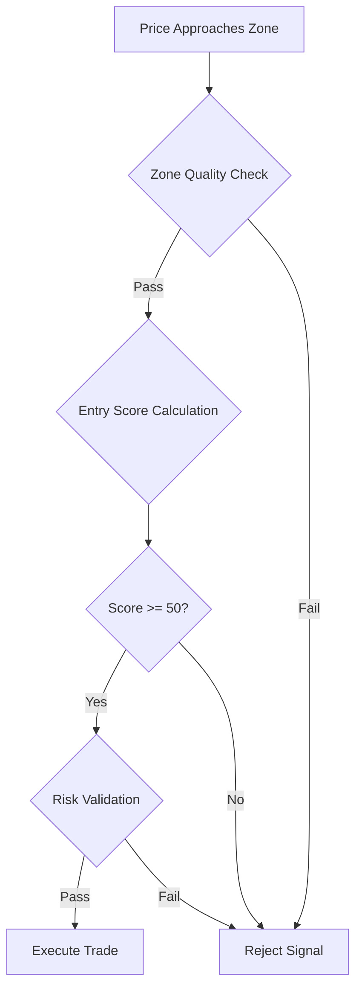

# 📈 Trading Strategy Guide

## Strategy Overview

Trading bot ini menggunakan pendekatan multi-strategy dengan fokus pada **institutional trading concepts** dan **market structure analysis**. Sistem ini dirancang untuk mengidentifikasi dan memanfaatkan pergerakan yang didorong oleh institutional money flow.

## Core Strategy Framework

### 1. Supply & Demand Strategy (Primary)

**Konsep Dasar**: Trading berdasarkan zone supply dan demand yang telah terbukti secara historis

#### Zone Detection Algorithm
```python
class EnhancedZoneAnalyzer:
    def detect_zones(self, data, lookback=300):
        zones = []

        # Identify potential zones
        for i in range(lookback, len(data)):
            # Look for strong rejection patterns
            if self.is_strong_rejection(data, i):
                zone = self.create_zone(data, i)
                if self.validate_zone_quality(zone):
                    zones.append(zone)

        return self.filter_overlapping_zones(zones)
```

#### Zone Quality Criteria
- **Minimum Strength**: 35.0 (configurable)
- **Minimum Grade**: C atau lebih tinggi
- **Maximum Age**: 168 jam (7 hari)
- **Freshness Bonus**: 15.0 untuk zone baru
- **Volume Confirmation**: Minimum 0.8x average volume

#### Entry Validation Process


#### Zone-Based Parameters
```json
{
  "zone_detection": {
    "min_strength": 35.0,
    "min_grade": "C",
    "max_age_hours": 168,
    "freshness_threshold": 15.0,
    "volume_factor": 0.8
  },
  "entry_validation": {
    "min_entry_score": 50,
    "tolerance_pips": {
      "forex": 12,
      "commodities": 40,
      "crypto": 150
    }
  }
}
```

### 2. Breakout Retest Strategy (Secondary)

**Konsep Dasar**: Trading momentum breakout dengan konfirmasi retest

#### Breakout Detection
```python
class BreakoutDetector:
    def detect_breakout(self, data, structure_levels):
        for level in structure_levels:
            if self.is_clean_break(data, level):
                breakout = {
                    'level': level,
                    'strength': self.calculate_break_strength(data, level),
                    'volume_confirmation': self.validate_volume(data),
                    'confidence': self.calculate_confidence(data, level)
                }
                return breakout
        return None
```

#### Retest Validation
- **Retest Patience**: 4 jam maximum waiting time
- **Tolerance Levels**:
  - Forex: 8 pips
  - Commodities: 25 pips
  - Crypto: 100 pips
- **Confidence Boost**: +0.15 untuk successful retest

#### Breakout Parameters
```json
{
  "breakout_detection": {
    "min_confidence": 0.50,
    "max_spread_ratio": 0.4,
    "volume_confirmation": true
  },
  "retest_validation": {
    "patience_hours": 4.0,
    "confidence_boost": 0.15,
    "momentum_entry": true
  }
}
```

## Market Structure Integration

### 1. Break of Structure (BOS) Detection

**Definisi**: Perubahan struktur pasar yang menunjukkan shift dalam market sentiment

#### BOS Detection Algorithm
```python
class BOSDetector:
    def detect_bos(self, data, timeframe):
        swing_points = self.identify_swing_points(data)

        for i in range(1, len(swing_points)):
            current_swing = swing_points[i]
            previous_swing = swing_points[i-1]

            if self.is_structure_break(current_swing, previous_swing):
                bos_event = {
                    'type': 'BOS',
                    'direction': self.get_break_direction(current_swing, previous_swing),
                    'strength': self.calculate_break_strength(data, current_swing),
                    'confidence': self.calculate_confidence(data, current_swing),
                    'timestamp': current_swing['timestamp']
                }
                return bos_event
        return None
```

#### BOS Validation Criteria
- **Swing Lookback**: 20-50 candles
- **Volume Confirmation**: Required untuk high-confidence BOS
- **Multi-timeframe Alignment**: H1, H4, D1 confirmation dengan weighted system
  - **D1 Weight**: 3 (Major trend - 30% influence)
  - **H4 Weight**: 2 (Intermediate trend - 40% influence)
  - **H1 Weight**: 1 (Short-term trend - 30% influence)
  - **Minimum Score**: 4 (Combined weighted score untuk confirmation)
- **Analysis Timeframes**: M15, H1, H4 (Structure detection range)
- **Minimum Break Distance**: Asset-specific pip requirements

### 2. Change of Character (CHoCH) Detection

**Definisi**: Perubahan karakter pasar dari trending ke ranging atau sebaliknya

#### CHoCH Detection Process
```python
class CHoCHDetector:
    def detect_choch(self, data, trend_data):
        momentum_shifts = self.identify_momentum_shifts(data)

        for shift in momentum_shifts:
            if self.validate_character_change(shift, trend_data):
                choch_event = {
                    'type': 'CHoCH',
                    'from_character': shift['previous_character'],
                    'to_character': shift['new_character'],
                    'strength': shift['momentum_strength'],
                    'confidence': self.calculate_choch_confidence(shift)
                }
                return choch_event
        return None
```

### 3. Order Block Identification

**Definisi**: Candle terakhir sebelum struktur break yang menunjukkan institutional entry

#### Order Block Detection
```python
class OrderBlockDetector:
    def identify_order_blocks(self, data, bos_events):
        order_blocks = []

        for bos in bos_events:
            # Find last opposite candle before BOS
            ob_candle = self.find_last_opposite_candle(data, bos)

            if self.validate_order_block(ob_candle, bos):
                order_block = {
                    'high': ob_candle['high'],
                    'low': ob_candle['low'],
                    'direction': 'bullish' if bos['direction'] == 'up' else 'bearish',
                    'strength': self.calculate_ob_strength(ob_candle, bos),
                    'timestamp': ob_candle['timestamp']
                }
                order_blocks.append(order_block)

        return order_blocks
```

#### Order Block Validation
- **Volume Analysis**: Minimum volume during formation
- **Price Reaction**: Historical reaction at the level
- **Strength Scoring**: Based on break strength and volume
- **Validity Period**: Time-based expiration

### 4. Fair Value Gap (FVG) Analysis

**Definisi**: Area imbalance harga yang cenderung diisi oleh pergerakan selanjutnya

#### FVG Detection Algorithm
```python
class FairValueGapDetector:
    def detect_fvg(self, data):
        fvgs = []

        for i in range(2, len(data)):
            candle1 = data[i-2]
            candle2 = data[i-1]  # Gap candle
            candle3 = data[i]

            # Check for bullish FVG
            if candle1['high'] < candle3['low']:
                gap = {
                    'type': 'bullish_fvg',
                    'top': candle3['low'],
                    'bottom': candle1['high'],
                    'size_pips': self.calculate_gap_size(candle1['high'], candle3['low']),
                    'fill_probability': self.calculate_fill_probability(gap_data)
                }
                fvgs.append(gap)

            # Check for bearish FVG
            elif candle1['low'] > candle3['high']:
                gap = {
                    'type': 'bearish_fvg',
                    'top': candle1['low'],
                    'bottom': candle3['high'],
                    'size_pips': self.calculate_gap_size(candle3['high'], candle1['low']),
                    'fill_probability': self.calculate_fill_probability(gap_data)
                }
                fvgs.append(gap)

        return fvgs
```

## Entry Validation System

### Multi-Factor Entry Scoring

```python
class EnhancedEntryValidator:
    def calculate_entry_score(self, signal, market_data):
        score = 0

        # Zone quality (30% weight)
        zone_score = self.calculate_zone_score(signal.zone)
        score += zone_score * 0.30

        # Pattern recognition (25% weight)
        pattern_score = self.calculate_pattern_score(signal, market_data)
        score += pattern_score * 0.25

        # Volume confirmation (20% weight)
        volume_score = self.calculate_volume_score(market_data)
        score += volume_score * 0.20

        # Market structure (15% weight)
        structure_score = self.calculate_structure_score(signal)
        score += structure_score * 0.15

        # Timing context (10% weight)
        timing_score = self.calculate_timing_score(signal)
        score += timing_score * 0.10

        return min(100, max(0, score))
```

### Entry Score Components

#### 1. Zone Quality Score (30%)
- **Zone Strength**: 0-40 points
- **Zone Freshness**: 0-20 points
- **Historical Performance**: 0-15 points
- **Volume Confirmation**: 0-25 points

#### 2. Pattern Recognition Score (25%)
- **Rejection Pattern**: 0-30 points
- **Candle Formation**: 0-25 points
- **Multi-candle Pattern**: 0-20 points
- **Pattern Completion**: 0-25 points

#### 3. Volume Confirmation Score (20%)
- **Volume Ratio**: 0-40 points
- **Volume Trend**: 0-30 points
- **Institutional Volume**: 0-30 points

#### 4. Market Structure Score (15%)
- **BOS Alignment**: 0-35 points
- **Order Block Proximity**: 0-30 points
- **Liquidity Context**: 0-35 points

#### 5. Timing Context Score (10%)
- **Session Quality**: 0-40 points
- **News Proximity**: 0-30 points
- **Market Hours**: 0-30 points

### Entry Validation Thresholds

```json
{
  "entry_thresholds": {
    "minimum_entry_score": 50,
    "high_confidence_threshold": 75,
    "pattern_recognition_required": true,
    "volume_confirmation_required": true,
    "structure_alignment_bonus": 10
  },
  "rejection_criteria": {
    "poor_zone_quality": -20,
    "counter_trend_penalty": -25,
    "high_spread_penalty": -15,
    "poor_timing_penalty": -20
  }
}
```

## Risk Management Integration

### Stop Loss Calculation

#### Zone-Based Stop Loss
```python
class ZoneBasedSLCalculator:
    def calculate_sl(self, signal, zone):
        if signal.direction == 'buy':
            # Place SL below zone low with buffer
            sl_price = zone.low - (self.get_buffer_pips(signal.symbol) * self.get_pip_value(signal.symbol))
        else:
            # Place SL above zone high with buffer
            sl_price = zone.high + (self.get_buffer_pips(signal.symbol) * self.get_pip_value(signal.symbol))

        # Validate SL distance
        sl_distance = abs(signal.entry_price - sl_price)
        if not self.validate_sl_distance(sl_distance, signal.symbol):
            return self.calculate_fallback_sl(signal)

        return sl_price
```

#### Structure-Based Stop Loss
```python
class StructureBasedSLCalculator:
    def calculate_sl(self, signal, structure_data):
        recent_structure = self.get_recent_structure_level(signal.symbol, signal.direction)

        if recent_structure:
            buffer = self.get_structure_buffer(signal.symbol)
            if signal.direction == 'buy':
                sl_price = recent_structure.low - buffer
            else:
                sl_price = recent_structure.high + buffer
        else:
            # Fallback to ATR-based SL
            sl_price = self.calculate_atr_based_sl(signal)

        return sl_price
```

### Take Profit Calculation

#### Risk-Reward Based TP
```python
class RiskRewardTPCalculator:
    def calculate_tp(self, signal, sl_price):
        sl_distance = abs(signal.entry_price - sl_price)
        min_rr_ratio = self.get_min_rr_ratio(signal.symbol)

        tp_distance = sl_distance * min_rr_ratio

        if signal.direction == 'buy':
            tp_price = signal.entry_price + tp_distance
        else:
            tp_price = signal.entry_price - tp_distance

        return tp_price
```

#### Structure-Based TP
```python
class StructureBasedTPCalculator:
    def calculate_tp(self, signal, structure_data):
        target_levels = self.identify_target_levels(signal, structure_data)

        # Use nearest significant level as TP
        if target_levels:
            return target_levels[0]  # Nearest level
        else:
            # Fallback to RR-based TP
            return self.calculate_rr_based_tp(signal)
```

## Position Management Strategy

### Breakeven Management

#### Asset-Specific Breakeven
```json
{
  "breakeven_parameters": {
    "forex_major": {
      "trigger_pips": 15,
      "buffer_pips": 0.5
    },
    "forex_jpy": {
      "trigger_pips": 18,
      "buffer_pips": 0.8
    },
    "commodities": {
      "trigger_pips": 150,
      "buffer_pips": 5
    },
    "crypto": {
      "trigger_pips": 300,
      "buffer_pips": 20
    }
  }
}
```

### Trailing Stop Management

#### Dynamic Trailing System
```python
class DynamicTrailingManager:
    def update_trailing_stop(self, position):
        current_profit_pips = self.calculate_profit_pips(position)
        asset_params = self.get_asset_parameters(position.symbol)

        # Check if trailing should start
        if current_profit_pips >= asset_params['trailing']['start_pips_from_sl']:
            new_sl = self.calculate_trailing_sl(position, asset_params)

            # Only move SL in favorable direction
            if self.is_favorable_move(position, new_sl):
                self.update_stop_loss(position, new_sl)
```

### Partial Close Management

#### Multi-Level Partial Close
```python
class PartialCloseManager:
    def check_partial_close(self, position):
        profit_pips = self.calculate_profit_pips(position)
        asset_params = self.get_asset_parameters(position.symbol)

        partial_levels = asset_params['partial_close']['levels']
        partial_percentages = asset_params['partial_close']['percentages']

        for i, level in enumerate(partial_levels):
            if profit_pips >= level and not position.partial_closes[i]:
                close_percentage = partial_percentages[i]
                self.execute_partial_close(position, close_percentage)
                position.partial_closes[i] = True
```

## Performance Optimization

### Signal Quality Tracking

```python
class SignalQualityTracker:
    def track_signal_performance(self, signal, trade_result):
        quality_metrics = {
            'entry_score': signal.entry_score,
            'zone_strength': signal.zone.strength,
            'structure_alignment': signal.structure_score,
            'trade_outcome': trade_result.profit_loss,
            'win_rate_contribution': 1 if trade_result.profit_loss > 0 else 0
        }

        self.update_quality_database(quality_metrics)
        self.adjust_scoring_weights(quality_metrics)
```

### Strategy Performance Analysis

```python
class StrategyPerformanceAnalyzer:
    def analyze_strategy_performance(self, strategy_name, period_days=30):
        trades = self.get_strategy_trades(strategy_name, period_days)

        metrics = {
            'total_trades': len(trades),
            'win_rate': self.calculate_win_rate(trades),
            'profit_factor': self.calculate_profit_factor(trades),
            'average_rr': self.calculate_average_rr(trades),
            'max_drawdown': self.calculate_max_drawdown(trades),
            'sharpe_ratio': self.calculate_sharpe_ratio(trades)
        }

        return StrategyPerformanceReport(metrics)
```

## Configuration Examples

### Complete Strategy Configuration

```json
{
  "strategy_config": {
    "supply_demand": {
      "enabled": true,
      "priority": 1,
      "zone_detection": {
        "min_strength": 35.0,
        "min_grade": "C",
        "max_age_hours": 168,
        "freshness_threshold": 15.0
      },
      "entry_validation": {
        "min_entry_score": 50,
        "pattern_recognition": true,
        "volume_confirmation": true,
        "structure_alignment": true
      }
    },
    "breakout_retest": {
      "enabled": true,
      "priority": 2,
      "breakout_detection": {
        "min_confidence": 0.50,
        "volume_confirmation": true,
        "max_spread_ratio": 0.4
      },
      "retest_validation": {
        "patience_hours": 4.0,
        "tolerance_pips": {
          "forex": 8,
          "commodities": 25,
          "crypto": 100
        }
      }
    }
  },
  "risk_management": {
    "position_sizing": {
      "risk_per_trade": 0.005,
      "max_risk_exposure": 0.06,
      "volatility_adjustment": true
    },
    "stop_loss": {
      "method": "zone_based",
      "fallback": "structure_based",
      "min_rr_ratio": 1.2
    }
  }
}
```

This comprehensive strategy guide provides the foundation for understanding and optimizing the trading bot's decision-making process.
