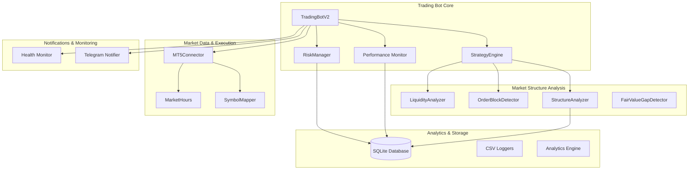
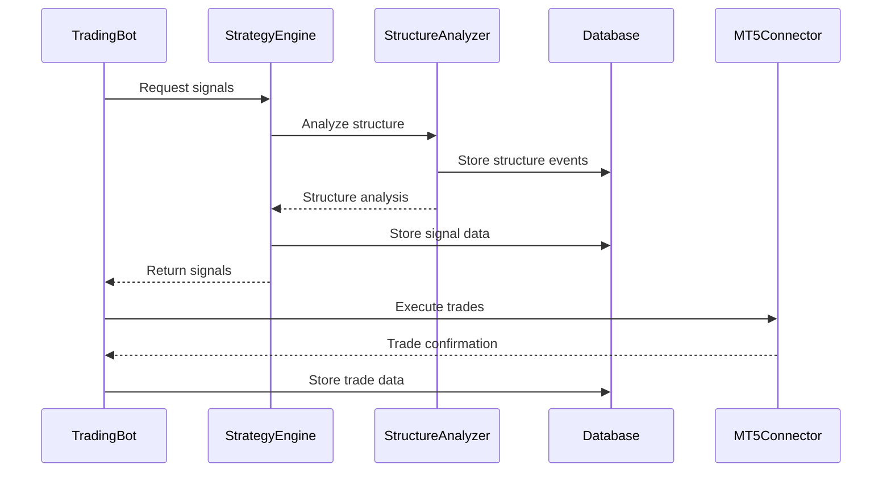

# 🏗️ Technical Architecture Documentation

## System Architecture Overview

### High-Level Architecture



## Core Components Architecture

### 1. Trading Bot Core (`TradingBotV2`)

**Responsibility**: Main orchestrator dan control center

**Key Features**:
- 1-minute trading loop execution
- Component lifecycle management
- Error handling dan recovery
- Graceful shutdown procedures

**Architecture Pattern**: Orchestrator Pattern
```python
class TradingBotV2:
    def __init__(self, config):
        self.strategy_engine = StrategyEngine(config)
        self.position_manager = PositionManager(config)
        self.risk_manager = RiskManager(config)
        self.mt5_connector = MT5Connector(config)
        
    async def trading_loop(self):
        # Main 1-minute execution cycle
        while self.is_running:
            await self.execute_trading_cycle()
            await asyncio.sleep(60)
```

### 2. Strategy Engine (`StrategyEngine`)

**Responsibility**: Signal generation dan strategy coordination

**Architecture Pattern**: Strategy Pattern + Factory Pattern
```python
class StrategyEngine:
    def __init__(self):
        self.strategies = {
            'supply_demand': SupplyDemandStrategy(),
            'breakout_retest': BreakoutRetestStrategy(),
            'price_action': PriceActionStrategy()
        }
        
    async def generate_signals(self):
        signals = []
        for strategy in self.active_strategies:
            signal = await strategy.analyze()
            if signal:
                signals.append(signal)
        return signals
```

**Strategy Components**:
- **SupplyDemandStrategy**: Zone-based trading
- **BreakoutRetestStrategy**: Momentum trading
- **PriceActionStrategy**: Pattern recognition
- **EnhancedEntryValidator**: Multi-factor validation

### 3. Position Management System

**Architecture Pattern**: Manager Pattern + State Machine

#### PositionManager
```python
class PositionManager:
    def __init__(self):
        self.breakeven_manager = BreakevenManager()
        self.trailing_manager = TrailingManager()
        self.partial_close_manager = PartialCloseManager()
        
    async def manage_positions(self):
        for position in self.active_positions:
            await self.update_position_state(position)
```

#### State Machine Implementation
```python
class PositionState(Enum):
    OPEN = "open"
    BREAKEVEN_PENDING = "breakeven_pending"
    BREAKEVEN_SET = "breakeven_set"
    TRAILING_ACTIVE = "trailing_active"
    PARTIAL_CLOSED = "partial_closed"
    CLOSED = "closed"

class PositionStateMachine:
    def transition(self, position, new_state):
        # Validate state transition
        # Execute state-specific actions
        # Update position data
```

### 4. Risk Management Architecture

**Architecture Pattern**: Chain of Responsibility + Observer Pattern

```python
class RiskManager:
    def __init__(self):
        self.risk_validators = [
            PositionSizeValidator(),
            CorrelationValidator(),
            DrawdownValidator(),
            ExposureValidator()
        ]
        
    async def validate_trade(self, signal):
        for validator in self.risk_validators:
            result = await validator.validate(signal)
            if not result.is_valid:
                return result
        return ValidationResult(True)
```

**Risk Components**:
- **CorrelationAnalyzer**: Real-time correlation matrix
- **DrawdownProtection**: Tiered protection system
- **VolatilityManager**: ATR-based position sizing
- **ExposureCalculator**: Portfolio exposure tracking

### 5. Market Structure Analysis

**Architecture Pattern**: Analyzer Pattern + Observer Pattern

```python
class StructureAnalyzer:
    def __init__(self):
        self.bos_detector = BOSDetector()
        self.choch_detector = CHoCHDetector()
        self.order_block_detector = OrderBlockDetector()
        
    async def analyze_structure(self, symbol, timeframe):
        structure_events = []
        
        # Detect structure changes
        bos_events = await self.bos_detector.detect(symbol, timeframe)
        choch_events = await self.choch_detector.detect(symbol, timeframe)
        
        return StructureAnalysis(bos_events, choch_events)
```

**Structure Components**:
- **BOSDetector**: Break of Structure detection
- **CHoCHDetector**: Change of Character detection
- **OrderBlockDetector**: Institutional level identification
- **FairValueGapDetector**: Price imbalance detection
- **LiquidityAnalyzer**: Liquidity pool identification

## Data Architecture

### Database Schema (SQLite)

```sql
-- Trades table
CREATE TABLE trades (
    id INTEGER PRIMARY KEY AUTOINCREMENT,
    ticket INTEGER UNIQUE NOT NULL,
    symbol TEXT NOT NULL,
    trade_type TEXT NOT NULL,
    volume REAL NOT NULL,
    open_price REAL NOT NULL,
    close_price REAL,
    sl REAL,
    tp REAL,
    open_time TIMESTAMP NOT NULL,
    close_time TIMESTAMP,
    profit REAL,
    strategy TEXT,
    confidence_score REAL,
    market_structure_context TEXT,
    created_at TIMESTAMP DEFAULT CURRENT_TIMESTAMP
);

-- Market structure events
CREATE TABLE market_structure_events (
    id INTEGER PRIMARY KEY AUTOINCREMENT,
    symbol TEXT NOT NULL,
    timeframe TEXT NOT NULL,
    event_type TEXT NOT NULL,
    event_data TEXT NOT NULL,
    confidence_score REAL,
    timestamp TIMESTAMP NOT NULL,
    created_at TIMESTAMP DEFAULT CURRENT_TIMESTAMP
);

-- Performance metrics
CREATE TABLE strategy_performance (
    id INTEGER PRIMARY KEY AUTOINCREMENT,
    strategy_name TEXT NOT NULL,
    symbol TEXT NOT NULL,
    timeframe TEXT NOT NULL,
    total_trades INTEGER DEFAULT 0,
    winning_trades INTEGER DEFAULT 0,
    total_profit REAL DEFAULT 0.0,
    max_drawdown REAL DEFAULT 0.0,
    profit_factor REAL DEFAULT 0.0,
    sharpe_ratio REAL DEFAULT 0.0,
    period_start TIMESTAMP NOT NULL,
    period_end TIMESTAMP NOT NULL,
    created_at TIMESTAMP DEFAULT CURRENT_TIMESTAMP
);
```

### Data Flow Architecture



## Configuration Architecture

### Hierarchical Configuration System

```python
class ConfigurationManager:
    def __init__(self):
        self.config_hierarchy = [
            'environment_variables',
            'config_files',
            'database_settings',
            'default_values'
        ]
        
    def get_config(self, key):
        for source in self.config_hierarchy:
            value = self.get_from_source(source, key)
            if value is not None:
                return value
        return None
```

**Configuration Layers**:
1. **Environment Variables** (.env file)
2. **JSON Configuration Files** (config/*.json)
3. **Database Settings** (runtime configuration)
4. **Default Values** (hardcoded fallbacks)

### Asset-Specific Configuration

```json
{
  "forex_major": {
    "symbols": ["EURUSD", "GBPUSD", "USDCHF"],
    "pip": 0.0001,
    "breakeven": {
      "trigger_pips": 15,
      "buffer_pips": 0.5
    },
    "trailing": {
      "start_pips_from_sl": 20,
      "distance_pips": 15
    },
    "partial_close": {
      "levels": [20, 40, 60],
      "percentages": [0.25, 0.25, 0.5]
    }
  }
}
```

## Performance Architecture

### Asynchronous Processing

```python
class AsyncTradingLoop:
    async def execute_cycle(self):
        # Parallel execution of independent tasks
        tasks = [
            self.update_market_data(),
            self.analyze_positions(),
            self.generate_signals(),
            self.update_risk_metrics()
        ]
        
        results = await asyncio.gather(*tasks, return_exceptions=True)
        return self.process_results(results)
```

### Memory Management

```python
class MemoryManager:
    def __init__(self):
        self.data_cache = LRUCache(maxsize=1000)
        self.cleanup_interval = 300  # 5 minutes
        
    async def cleanup_memory(self):
        # Periodic memory cleanup
        gc.collect()
        self.data_cache.clear_expired()
        await self.optimize_database_cache()
```

### Database Optimization

```python
class SQLiteOptimizer:
    def __init__(self):
        self.connection_pool = ConnectionPool(
            min_connections=3,
            max_connections=10
        )
        
    def optimize_queries(self):
        # Query optimization strategies
        self.enable_wal_mode()
        self.create_indexes()
        self.analyze_query_plans()
```

## Error Handling Architecture

### Exception Hierarchy

```python
class TradingBotException(Exception):
    """Base exception for trading bot"""
    pass

class MT5ConnectionError(TradingBotException):
    """MT5 connection related errors"""
    pass

class RiskValidationError(TradingBotException):
    """Risk management validation errors"""
    pass

class DatabaseError(TradingBotException):
    """Database operation errors"""
    pass
```

### Error Recovery Strategies

```python
class ErrorRecoveryManager:
    def __init__(self):
        self.recovery_strategies = {
            MT5ConnectionError: self.recover_mt5_connection,
            DatabaseError: self.recover_database_connection,
            RiskValidationError: self.handle_risk_violation
        }
        
    async def handle_error(self, error):
        strategy = self.recovery_strategies.get(type(error))
        if strategy:
            return await strategy(error)
        else:
            return await self.default_recovery(error)
```

## Security Architecture

### Data Protection

```python
class SecurityManager:
    def __init__(self):
        self.encryption_key = self.load_encryption_key()
        
    def encrypt_sensitive_data(self, data):
        # Encrypt credentials and sensitive information
        return self.cipher.encrypt(data)
        
    def validate_configuration(self, config):
        # Validate configuration for security issues
        return self.security_validator.validate(config)
```

### Access Control

```python
class AccessController:
    def __init__(self):
        self.permissions = {
            'trading': ['execute_trades', 'modify_positions'],
            'analytics': ['read_data', 'generate_reports'],
            'admin': ['all_permissions']
        }
        
    def check_permission(self, user, action):
        user_permissions = self.get_user_permissions(user)
        return action in user_permissions
```

## Monitoring Architecture

### Health Monitoring

```python
class HealthMonitor:
    def __init__(self):
        self.health_checks = [
            MT5ConnectionCheck(),
            DatabaseHealthCheck(),
            MemoryUsageCheck(),
            PositionHealthCheck()
        ]
        
    async def perform_health_check(self):
        results = {}
        for check in self.health_checks:
            results[check.name] = await check.execute()
        return HealthReport(results)
```

### Performance Monitoring

```python
class PerformanceMonitor:
    def __init__(self):
        self.metrics_collector = MetricsCollector()
        
    async def collect_metrics(self):
        metrics = {
            'loop_execution_time': self.measure_loop_time(),
            'memory_usage': self.get_memory_usage(),
            'database_performance': self.measure_db_performance(),
            'trade_execution_latency': self.measure_trade_latency()
        }
        
        await self.metrics_collector.store(metrics)
```

## Deployment Architecture

### Container Configuration

```dockerfile
FROM python:3.11-slim

WORKDIR /app

COPY requirements.txt .
RUN pip install -r requirements.txt

COPY src/ ./src/
COPY config/ ./config/
COPY run_trading_bot.py .

CMD ["python", "run_trading_bot.py"]
```

### Environment Management

```yaml
# docker-compose.yml
version: '3.8'
services:
  trading-bot:
    build: .
    environment:
      - ENVIRONMENT=production
      - LOG_LEVEL=INFO
    volumes:
      - ./data:/app/data
      - ./logs:/app/logs
    restart: unless-stopped
```

## Scalability Considerations

### Horizontal Scaling

```python
class ScalabilityManager:
    def __init__(self):
        self.load_balancer = LoadBalancer()
        self.instance_manager = InstanceManager()
        
    async def scale_based_on_load(self):
        current_load = await self.measure_system_load()
        if current_load > self.scale_up_threshold:
            await self.instance_manager.add_instance()
        elif current_load < self.scale_down_threshold:
            await self.instance_manager.remove_instance()
```

### Resource Optimization

```python
class ResourceOptimizer:
    def __init__(self):
        self.cpu_optimizer = CPUOptimizer()
        self.memory_optimizer = MemoryOptimizer()
        
    async def optimize_resources(self):
        # CPU optimization
        await self.cpu_optimizer.optimize_thread_pool()
        
        # Memory optimization
        await self.memory_optimizer.optimize_cache_size()
        
        # I/O optimization
        await self.optimize_database_connections()
```

## Testing Architecture

### Test Strategy

```python
class TestSuite:
    def __init__(self):
        self.unit_tests = UnitTestSuite()
        self.integration_tests = IntegrationTestSuite()
        self.performance_tests = PerformanceTestSuite()
        
    async def run_all_tests(self):
        results = {}
        results['unit'] = await self.unit_tests.run()
        results['integration'] = await self.integration_tests.run()
        results['performance'] = await self.performance_tests.run()
        return TestResults(results)
```

### Mock Architecture

```python
class MockMT5Connector:
    def __init__(self):
        self.mock_data = MockDataProvider()
        
    async def positions_get(self):
        return self.mock_data.get_mock_positions()
        
    async def order_send(self, request):
        return self.mock_data.simulate_order_execution(request)
```

This technical architecture provides a comprehensive foundation for understanding the system's design, implementation patterns, and scalability considerations.