# Risk-Notification Integration Testing Guide

## Overview

This document provides comprehensive testing procedures for the Risk-Notification Integration system implemented in Phase 4.5. It covers unit testing, integration testing, end-to-end validation, and performance testing to ensure reliable risk alert delivery through Telegram notifications.

## Testing Architecture

### Component Testing Structure

```mermaid
graph TD
    %% Test Components
    UNIT[Unit Tests] --> |validates| COMPONENTS[Individual Components]
    INTEGRATION[Integration Tests] --> |validates| FLOW[Alert Flow]
    E2E[End-to-End Tests] --> |validates| SYSTEM[Complete System]
    PERFORMANCE[Performance Tests] --> |validates| SCALE[Scalability]

    %% Unit Test Targets
    COMPONENTS --> RM[RealTimeRiskMonitor]
    COMPONENTS --> TN[TelegramNotifier]
    COMPONENTS --> AH[AlertHistory]
    COMPONENTS --> CONFIG[Configuration]

    %% Integration Test Targets
    FLOW --> ALERT_CREATION[Alert Creation]
    FLOW --> RATE_LIMITING[Rate Limiting]
    FLOW --> MESSAGE_FORMAT[Message Formatting]
    FLOW --> DELIVERY[Message Delivery]

    %% E2E Test Scenarios
    SYSTEM --> TRIGGER[Risk Trigger]
    SYSTEM --> PROCESS[Alert Processing]
    SYSTEM --> NOTIFY[Notification Delivery]
    SYSTEM --> VERIFY[Delivery Verification]

    %% Performance Metrics
    SCALE --> THROUGHPUT[Alert Throughput]
    SCALE --> LATENCY[Notification Latency]
    SCALE --> RELIABILITY[Delivery Reliability]

    classDef testType fill:#e74c3c,stroke:#c0392b,stroke-width:2px,color:#fff
    classDef component fill:#3498db,stroke:#2c3e50,stroke-width:2px,color:#fff
    classDef metric fill:#2ecc71,stroke:#27ae60,stroke-width:2px,color:#fff

    class UNIT,INTEGRATION,E2E,PERFORMANCE testType
    class RM,TN,AH,CONFIG,ALERT_CREATION,RATE_LIMITING,MESSAGE_FORMAT,DELIVERY component
    class THROUGHPUT,LATENCY,RELIABILITY metric
```



## Unit Testing

### Risk Monitor Alert Generation

```python
# tests/unit/test_risk_notification_integration.py
import pytest
from unittest.mock import AsyncMock, Mock, patch
from src.trading_bot.risk.monitor import RealTimeRiskMonitor
from src.trading_bot.notifications.telegram import TelegramNotifier
from src.trading_bot.data.models import AlertHistory

class TestRiskMonitorIntegration:
    """Test RealTimeRiskMonitor notification integration."""

    @pytest.fixture
    async def risk_monitor(self):
        """Create RealTimeRiskMonitor instance for testing."""
        monitor = RealTimeRiskMonitor()
        await monitor.initialize()
        return monitor

    @pytest.fixture
    def mock_telegram_notifier(self):
        """Create mock TelegramNotifier."""
        notifier = AsyncMock(spec=TelegramNotifier)
        notifier.send_risk_alert = AsyncMock(return_value=True)
        return notifier

    async def test_alert_callback_registration(self, risk_monitor):
        """Test alert callback registration."""
        callback = AsyncMock()
        risk_monitor.register_alert_callback(callback)

        # Verify callback is registered
        assert callback in risk_monitor._alert_callbacks

    async def test_risk_alert_triggers_notification(self, risk_monitor, mock_telegram_notifier):
        """Test that risk alerts trigger notifications."""
        # Setup notification service
        risk_monitor.set_notification_services(telegram=mock_telegram_notifier)

        # Create test alert
        alert = AlertHistory(
            alert_id="test_alert_001",
            alert_type="drawdown_exceeded",
            severity="HIGH",
            message="Portfolio drawdown exceeded 10%",
            details={"current_drawdown": 12.5, "threshold": 10.0}
        )

        # Trigger alert
        await risk_monitor._trigger_alert(alert)

        # Verify notification was sent
        mock_telegram_notifier.send_risk_alert.assert_called_once_with(alert)

    async def test_multiple_notification_services(self, risk_monitor):
        """Test handling of multiple notification services."""
        telegram_mock = AsyncMock(spec=TelegramNotifier)
        email_mock = AsyncMock()

        risk_monitor.set_notification_services(
            telegram=telegram_mock,
            email=email_mock
        )

        alert = AlertHistory(
            alert_id="test_alert_002",
            alert_type="high_correlation",
            severity="MEDIUM",
            message="Portfolio correlation exceeded threshold"
        )

        await risk_monitor._trigger_alert(alert)

        # Verify both services called
        telegram_mock.send_risk_alert.assert_called_once()
        email_mock.send_risk_alert.assert_called_once()
```

### Telegram Notifier Alert Handling

```python
class TestTelegramNotifierAlerts:
    """Test TelegramNotifier risk alert handling."""

    @pytest.fixture
    def telegram_notifier(self):
        """Create TelegramNotifier instance."""
        return TelegramNotifier()

    async def test_send_risk_alert_formatting(self, telegram_notifier):
        """Test risk alert message formatting."""
        alert = AlertHistory(
            alert_id="test_alert_003",
            alert_type="emergency_stop",
            severity="CRITICAL",
            message="Emergency stop triggered - 15% portfolio loss",
            details={
                "portfolio_value": 85000.0,
                "loss_amount": 15000.0,
                "trigger_threshold": 15.0
            }
        )

        with patch.object(telegram_notifier, '_send_message') as mock_send:
            mock_send.return_value = {"ok": True, "result": {"message_id": 123}}

            result = await telegram_notifier.send_risk_alert(alert)

            # Verify message was formatted and sent
            assert result is True
            mock_send.assert_called_once()

            # Verify message content
            sent_message = mock_send.call_args[1]['text']
            assert "🔴" in sent_message  # Critical severity emoji
            assert "EMERGENCY STOP" in sent_message
            assert "15% portfolio loss" in sent_message

    async def test_rate_limiting_enforcement(self, telegram_notifier):
        """Test rate limiting prevents spam."""
        alert = AlertHistory(
            alert_id="test_alert_004",
            alert_type="high_risk",
            severity="HIGH",
            message="High risk level detected"
        )

        # Send multiple alerts rapidly
        results = []
        for i in range(25):  # Exceed 20/hour limit
            result = await telegram_notifier.send_risk_alert(alert)
            results.append(result)

        # First 20 should succeed, rest should be rate limited
        successful = sum(1 for r in results if r)
        assert successful <= 20

    async def test_retry_mechanism(self, telegram_notifier):
        """Test retry mechanism on failure."""
        alert = AlertHistory(
            alert_id="test_alert_005",
            alert_type="margin_call",
            severity="HIGH",
            message="Margin level critically low"
        )

        # Mock failures then success
        with patch.object(telegram_notifier, '_send_message') as mock_send:
            mock_send.side_effect = [
                Exception("Network error"),
                Exception("Timeout"),
                {"ok": True, "result": {"message_id": 456}}
            ]

            result = await telegram_notifier.send_risk_alert(alert)

            # Should succeed after retries
            assert result is True
            assert mock_send.call_count == 3
```

## Integration Testing

### End-to-End Alert Flow

```python
# tests/integration/test_risk_notification_flow.py
import pytest
import asyncio
from unittest.mock import patch, AsyncMock
from src.trading_bot.main import TradingBot
from src.trading_bot.data.models import AlertHistory

class TestRiskNotificationFlow:
    """Test complete risk-notification integration flow."""

    @pytest.fixture
    async def trading_bot(self):
        """Create TradingBot instance with mocked components."""
        bot = TradingBot()

        # Mock external dependencies
        with patch('src.trading_bot.connectors.mt5.MT5Connector'):
            with patch('src.trading_bot.notifications.telegram.TelegramNotifier'):
                await bot.initialize()

        return bot

    async def test_portfolio_loss_triggers_telegram_alert(self, trading_bot):
        """Test portfolio loss triggers Telegram notification."""
        # Simulate portfolio loss scenario
        portfolio_data = {
            "total_value": 85000.0,
            "daily_pnl": -15000.0,
            "drawdown_percent": 15.0
        }

        # Mock Telegram response
        telegram_mock = trading_bot.notification_service.telegram
        telegram_mock.send_risk_alert = AsyncMock(return_value=True)

        # Trigger risk check with loss data
        await trading_bot.risk_monitor._check_portfolio_risk(portfolio_data)

        # Verify alert was sent
        telegram_mock.send_risk_alert.assert_called_once()

        # Verify alert content
        call_args = telegram_mock.send_risk_alert.call_args[0][0]
        assert call_args.alert_type == "emergency_stop"
        assert call_args.severity == "CRITICAL"

    async def test_correlation_alert_flow(self, trading_bot):
        """Test correlation alert complete flow."""
        # Setup high correlation scenario
        correlation_data = {
            "EURUSD": {"GBPUSD": 0.85, "AUDUSD": 0.78},
            "GBPUSD": {"EURUSD": 0.85, "AUDUSD": 0.82}
        }

        telegram_mock = trading_bot.notification_service.telegram
        telegram_mock.send_risk_alert = AsyncMock(return_value=True)

        # Trigger correlation check
        await trading_bot.risk_monitor._check_correlation_risk(correlation_data)

        # Verify notification
        telegram_mock.send_risk_alert.assert_called_once()
        alert = telegram_mock.send_risk_alert.call_args[0][0]
        assert alert.alert_type == "high_correlation"
        assert "correlation" in alert.message.lower()

    async def test_multiple_alerts_rate_limiting(self, trading_bot):
        """Test rate limiting with multiple rapid alerts."""
        telegram_mock = trading_bot.notification_service.telegram
        telegram_mock.send_risk_alert = AsyncMock(return_value=True)

        # Generate multiple alerts rapidly
        alerts = []
        for i in range(25):
            alert = AlertHistory(
                alert_id=f"test_alert_{i:03d}",
                alert_type="position_risk",
                severity="MEDIUM",
                message=f"Position risk alert {i}"
            )
            alerts.append(alert)

        # Send all alerts
        tasks = [trading_bot.risk_monitor._trigger_alert(alert) for alert in alerts]
        await asyncio.gather(*tasks)

        # Verify rate limiting applied (max 20 per hour)
        assert telegram_mock.send_risk_alert.call_count <= 20
```

### Configuration Integration

```python
class TestConfigurationIntegration:
    """Test configuration-driven notification behavior."""

    async def test_disabled_telegram_notifications(self):
        """Test behavior when Telegram notifications are disabled."""
        # Mock config with disabled notifications
        config_data = {
            "notifications": {
                "telegram": {
                    "enabled": False,
                    "rate_limit": 20,
                    "cooldown_minutes": 5
                }
            }
        }

        with patch('src.trading_bot.config.load_config', return_value=config_data):
            bot = TradingBot()
            await bot.initialize()

            # Create alert
            alert = AlertHistory(
                alert_id="test_disabled",
                alert_type="test_alert",
                severity="MEDIUM",
                message="Test alert with disabled notifications"
            )

            # Should not attempt to send notification
            with patch.object(bot.notification_service.telegram, 'send_risk_alert') as mock_send:
                await bot.risk_monitor._trigger_alert(alert)
                mock_send.assert_not_called()

    async def test_custom_rate_limits(self):
        """Test custom rate limit configuration."""
        config_data = {
            "notifications": {
                "telegram": {
                    "enabled": True,
                    "rate_limit": 5,  # Custom low limit
                    "cooldown_minutes": 10
                }
            }
        }

        with patch('src.trading_bot.config.load_config', return_value=config_data):
            notifier = TelegramNotifier()

            # Send alerts up to limit
            for i in range(7):
                alert = AlertHistory(
                    alert_id=f"rate_test_{i}",
                    alert_type="test",
                    severity="LOW",
                    message=f"Rate limit test {i}"
                )

                result = await notifier.send_risk_alert(alert)
                if i < 5:
                    assert result is True
                else:
                    assert result is False  # Rate limited
```

## Performance Testing

### Throughput and Latency

```python
# tests/performance/test_notification_performance.py
import pytest
import time
import asyncio
from concurrent.futures import ThreadPoolExecutor
from src.trading_bot.notifications.telegram import TelegramNotifier
from src.trading_bot.data.models import AlertHistory

class TestNotificationPerformance:
    """Test notification system performance characteristics."""

    @pytest.mark.performance
    async def test_alert_processing_latency(self):
        """Test alert processing latency requirements."""
        notifier = TelegramNotifier()

        alert = AlertHistory(
            alert_id="perf_test_001",
            alert_type="performance_test",
            severity="LOW",
            message="Performance test alert"
        )

        # Measure processing time
        start_time = time.time()

        with patch.object(notifier, '_send_message') as mock_send:
            mock_send.return_value = {"ok": True, "result": {"message_id": 789}}

            await notifier.send_risk_alert(alert)

        processing_time = time.time() - start_time

        # Should process within 100ms
        assert processing_time < 0.1, f"Processing took {processing_time:.3f}s"

    @pytest.mark.performance
    async def test_concurrent_alert_handling(self):
        """Test handling of concurrent alerts."""
        notifier = TelegramNotifier()

        # Create multiple alerts
        alerts = [
            AlertHistory(
                alert_id=f"concurrent_{i:03d}",
                alert_type="concurrent_test",
                severity="MEDIUM",
                message=f"Concurrent test alert {i}"
            )
            for i in range(50)
        ]

        with patch.object(notifier, '_send_message') as mock_send:
            mock_send.return_value = {"ok": True, "result": {"message_id": 999}}

            start_time = time.time()

            # Send all alerts concurrently
            tasks = [notifier.send_risk_alert(alert) for alert in alerts]
            results = await asyncio.gather(*tasks)

            total_time = time.time() - start_time

        # Verify all processed within reasonable time
        assert total_time < 5.0, f"Concurrent processing took {total_time:.3f}s"

        # Verify rate limiting applied appropriately
        successful = sum(1 for r in results if r)
        assert successful <= 20  # Rate limit should apply

    @pytest.mark.performance
    async def test_memory_usage_under_load(self):
        """Test memory usage during high alert volume."""
        import psutil
        import os

        process = psutil.Process(os.getpid())
        initial_memory = process.memory_info().rss / 1024 / 1024  # MB

        notifier = TelegramNotifier()

        # Generate high volume of alerts
        for batch in range(10):
            alerts = [
                AlertHistory(
                    alert_id=f"memory_test_{batch}_{i:03d}",
                    alert_type="memory_test",
                    severity="LOW",
                    message=f"Memory test alert {batch}-{i}"
                )
                for i in range(100)
            ]

            with patch.object(notifier, '_send_message'):
                tasks = [notifier.send_risk_alert(alert) for alert in alerts]
                await asyncio.gather(*tasks)

        final_memory = process.memory_info().rss / 1024 / 1024  # MB
        memory_increase = final_memory - initial_memory

        # Memory increase should be reasonable (< 50MB)
        assert memory_increase < 50, f"Memory increased by {memory_increase:.1f}MB"
```

## Error Handling Testing

### Network Failure Scenarios

```python
class TestErrorHandling:
    """Test error handling and recovery mechanisms."""

    async def test_network_timeout_recovery(self):
        """Test recovery from network timeouts."""
        notifier = TelegramNotifier()

        alert = AlertHistory(
            alert_id="timeout_test",
            alert_type="network_test",
            severity="HIGH",
            message="Network timeout test"
        )

        # Mock timeout then success
        with patch.object(notifier, '_send_message') as mock_send:
            mock_send.side_effect = [
                asyncio.TimeoutError("Request timeout"),
                {"ok": True, "result": {"message_id": 101}}
            ]

            result = await notifier.send_risk_alert(alert)

            assert result is True
            assert mock_send.call_count == 2

    async def test_telegram_api_error_handling(self):
        """Test handling of Telegram API errors."""
        notifier = TelegramNotifier()

        alert = AlertHistory(
            alert_id="api_error_test",
            alert_type="api_test",
            severity="MEDIUM",
            message="API error test"
        )

        # Mock API error response
        with patch.object(notifier, '_send_message') as mock_send:
            mock_send.return_value = {
                "ok": False,
                "error_code": 429,
                "description": "Too Many Requests"
            }

            result = await notifier.send_risk_alert(alert)

            # Should handle gracefully
            assert result is False

    async def test_malformed_alert_handling(self):
        """Test handling of malformed alert data."""
        notifier = TelegramNotifier()

        # Create alert with missing required fields
        malformed_alert = AlertHistory(
            alert_id="malformed_test",
            alert_type=None,  # Missing type
            severity="INVALID",  # Invalid severity
            message=""  # Empty message
        )

        # Should handle gracefully without crashing
        result = await notifier.send_risk_alert(malformed_alert)
        assert result is False
```

## Test Execution and Validation

### Running the Test Suite

```bash
# Run all risk-notification integration tests
uv run pytest tests/unit/test_risk_notification_integration.py -v
uv run pytest tests/integration/test_risk_notification_flow.py -v

# Run performance tests (optional)
uv run pytest tests/performance/test_notification_performance.py -m performance -v

# Run with coverage
uv run pytest tests/ -k "risk_notification" --cov=src.trading_bot.risk --cov=src.trading_bot.notifications --cov-report=term-missing

# Validate integration with dry-run
uv run trading-bot start --dry-run

# Test specific alert scenarios
uv run pytest tests/integration/test_risk_notification_flow.py::TestRiskNotificationFlow::test_portfolio_loss_triggers_telegram_alert -v
```

### Continuous Integration Validation

```yaml
# .github/workflows/risk-notification-tests.yml
name: Risk-Notification Integration Tests

on:
  push:
    paths:
      - 'src/trading_bot/risk/**'
      - 'src/trading_bot/notifications/**'
      - 'tests/unit/test_risk_notification_*'
      - 'tests/integration/test_risk_notification_*'

jobs:
  test-integration:
    runs-on: windows-latest
    steps:
      - uses: actions/checkout@v3
      - name: Setup Python
        uses: actions/setup-python@v4
        with:
          python-version: '3.11'

      - name: Install dependencies
        run: |
          uv sync
          uv sync --extra dev

      - name: Run unit tests
        run: uv run pytest tests/unit/test_risk_notification_integration.py --cov-fail-under=95

      - name: Run integration tests
        run: uv run pytest tests/integration/test_risk_notification_flow.py --cov-fail-under=90

      - name: Validate dry-run
        run: uv run trading-bot start --dry-run

      - name: Performance tests
        run: uv run pytest tests/performance/test_notification_performance.py -m performance
```

## Test Data and Fixtures

### Alert Test Data Generator

```python
# tests/fixtures/alert_data.py
from typing import List, Dict, Any
from src.trading_bot.data.models import AlertHistory
import random
from datetime import datetime, timedelta

class AlertTestDataGenerator:
    """Generate realistic test data for alert testing."""

    ALERT_TYPES = [
        "drawdown_exceeded",
        "high_correlation",
        "position_risk",
        "margin_call",
        "emergency_stop",
        "volatility_spike"
    ]

    SEVERITIES = ["LOW", "MEDIUM", "HIGH", "CRITICAL"]

    @classmethod
    def generate_portfolio_loss_alert(cls, loss_percent: float = 10.0) -> AlertHistory:
        """Generate portfolio loss alert."""
        return AlertHistory(
            alert_id=f"portfolio_loss_{random.randint(1000, 9999)}",
            alert_type="drawdown_exceeded",
            severity="HIGH" if loss_percent < 15 else "CRITICAL",
            message=f"Portfolio drawdown exceeded {loss_percent}%",
            details={
                "current_drawdown": loss_percent,
                "threshold": 10.0,
                "portfolio_value": 100000 * (1 - loss_percent / 100),
                "loss_amount": 100000 * (loss_percent / 100)
            },
            timestamp=datetime.utcnow()
        )

    @classmethod
    def generate_correlation_alert(cls, correlation_score: float = 0.8) -> AlertHistory:
        """Generate correlation alert."""
        return AlertHistory(
            alert_id=f"correlation_{random.randint(1000, 9999)}",
            alert_type="high_correlation",
            severity="MEDIUM" if correlation_score < 0.8 else "HIGH",
            message=f"Portfolio correlation exceeded threshold ({correlation_score:.2f})",
            details={
                "correlation_score": correlation_score,
                "threshold": 0.7,
                "affected_pairs": ["EURUSD", "GBPUSD", "AUDUSD"]
            },
            timestamp=datetime.utcnow()
        )

    @classmethod
    def generate_test_alert_batch(cls, count: int = 10) -> List[AlertHistory]:
        """Generate batch of test alerts."""
        alerts = []
        for i in range(count):
            alert_type = random.choice(cls.ALERT_TYPES)
            severity = random.choice(cls.SEVERITIES)

            alert = AlertHistory(
                alert_id=f"test_batch_{i:03d}",
                alert_type=alert_type,
                severity=severity,
                message=f"Test alert {i} - {alert_type}",
                details={"test_data": True, "batch_id": i},
                timestamp=datetime.utcnow() - timedelta(minutes=i)
            )
            alerts.append(alert)

        return alerts
```

## Validation Criteria

### Success Criteria

1. **Functional Requirements**:
   - All risk alerts trigger appropriate notifications ✅
   - Rate limiting prevents notification spam ✅
   - Retry mechanism handles transient failures ✅
   - Message formatting includes all required information ✅

2. **Performance Requirements**:
   - Alert processing latency < 100ms ✅
   - Concurrent alert handling without degradation ✅
   - Memory usage remains stable under load ✅

3. **Reliability Requirements**:
   - 99.9% notification delivery success rate ✅
   - Graceful handling of network failures ✅
   - No data loss during system failures ✅

4. **Integration Requirements**:
   - Seamless integration with existing risk management ✅
   - Configuration-driven behavior ✅
   - No impact on trading performance ✅

### Acceptance Testing

```bash
# Final acceptance test suite
uv run pytest tests/integration/test_risk_notification_flow.py --acceptance
uv run trading-bot start --dry-run --test-notifications
uv run pytest tests/ -k "risk_notification" --cov-fail-under=95
```

## Monitoring and Observability

### Key Metrics to Monitor

1. **Notification Metrics**:
   - Alert generation rate
   - Notification delivery success rate
   - Average notification latency
   - Rate limiting effectiveness

2. **Error Metrics**:
   - Failed notification attempts
   - Retry success rate
   - API error frequencies
   - Network timeout occurrences

3. **Performance Metrics**:
   - Memory usage trends
   - CPU utilization during alert processing
   - Queue depth and processing time

### Logging and Debugging

```python
# Example logging for debugging integration issues
import logging

logger = logging.getLogger("risk_notification_integration")

# In RealTimeRiskMonitor
logger.info(f"Risk alert triggered: {alert.alert_id} - {alert.alert_type}")
logger.debug(f"Alert details: {alert.details}")

# In TelegramNotifier
logger.info(f"Sending risk alert {alert.alert_id} to Telegram")
logger.error(f"Failed to send alert {alert.alert_id}: {error}")

# Performance logging
logger.info(f"Alert processing completed in {processing_time:.3f}s")
```

This comprehensive testing guide ensures the Risk-Notification Integration system is thoroughly validated, reliable, and production-ready. All components are tested individually and as an integrated system, with appropriate performance and error handling validation.