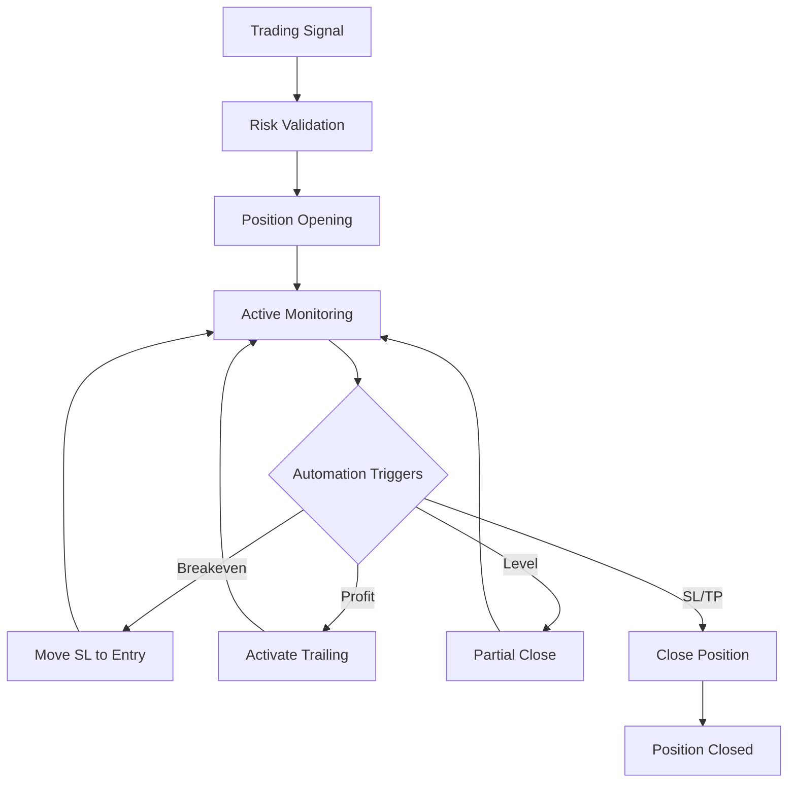

# Position Management System

Complete position lifecycle management with pip tracking and automation features.

## Overview

The Position Management System handles all aspects of trade position lifecycle, from opening to closing with sophisticated automation features including breakeven triggers, trailing stops, and partial closes.

## Core Components

### Position Manager

Central orchestrator coordinating all position operations.

### Asset-Specific Managers

- **ForexPositionManager**: 5-50 pip stops
- **CommodityPositionManager**: 50-400 pip stops (Gold)
- **CryptoPositionManager**: Dynamic based on volatility

### Automation Engine

Handles automated position management:
- Breakeven triggers
- Trailing stops
- Partial closes
- Stop loss/take profit monitoring

## Configuration

### Asset-Specific Settings

```yaml
position_management:
  forex_major:
    breakeven_trigger: 15  # pips
    trailing_distance: 10
    partial_closes:
      - level: 20
        percentage: 25
      - level: 40
        percentage: 50

  forex_jpy:
    breakeven_trigger: 150
    trailing_distance: 100

  commodities:
    breakeven_trigger: 500
    trailing_distance: 300

  crypto:
    breakeven_trigger: 50  # USD
    trailing_distance: 30
```

### Trading Type Adaptation

```yaml
position_management_by_type:
  scalping:
    automation_frequency: 5
    quick_breakeven: true

  day_trading:
    automation_frequency: 15
    normal_breakeven: true

  swing_trading:
    automation_frequency: 60
    delayed_breakeven: true

  position_trading:
    automation_frequency: 300
    wide_breakeven: true
```

## Position Lifecycle



## Pip Tracking

The system tracks pip-based calculations for accurate position management:

- **Current profit pips**: Real-time pip profit/loss
- **Risk amount USD**: Maximum loss if SL hit
- **Potential profit USD**: Maximum profit if TP hit
- **Current P&L USD**: Real-time unrealized P&L

### Asset Pip Values

| Asset Class | Pip Size | Example Symbols |
|-------------|----------|-----------------|
| Forex Major | 0.0001 | EURUSD, GBPUSD |
| Forex JPY | 0.01 | USDJPY, EURJPY |
| Commodities | 0.1 | XAUUSD, XAGUSD |
| Crypto | 1.0 | BTCUSD, ETHUSD |

## CLI Commands

```bash
# View active positions
uv run trading-bot positions active
uv run trading-bot positions active --symbol EURUSD

# Position operations
uv run trading-bot positions close --ticket 123456
uv run trading-bot positions partial-close --ticket 123456 --percentage 50
uv run trading-bot positions modify --ticket 123456 --sl 1.0850

# Analysis
uv run trading-bot positions analyze --ticket 123456
uv run trading-bot positions performance --symbol EURUSD --days 30
```

## Integration

### Risk Manager

All position actions validated through risk manager before execution.

### MT5 Connector

Trade modifications executed through MT5 connector.

### Notification Service

Users notified of all position management actions.

## Best Practices

1. **Asset-aware**: Always use asset-specific settings
2. **Risk-first**: Validate all actions with risk manager
3. **Monitor automation**: Check automation triggers regularly
4. **Test in dry-run**: Validate before production use

For implementation details, see [`src/trading_bot/position/`](../../src/trading_bot/position/).
