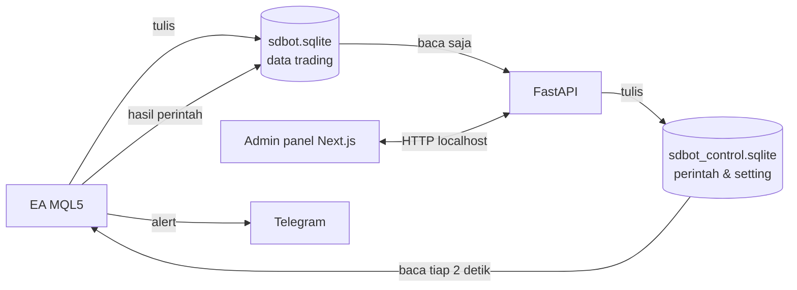
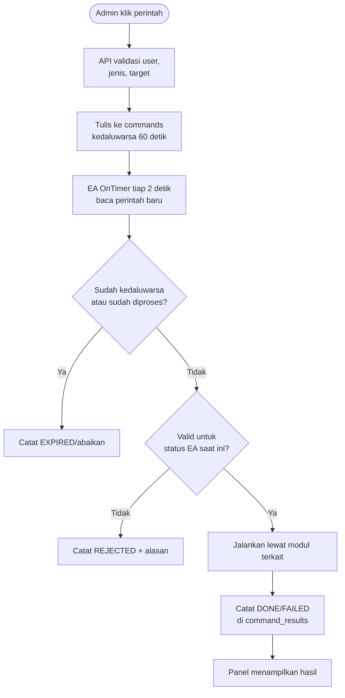

# PRD — Backoffice SDBot (API + Admin Panel)

2026-09-21 · @indra

> Sumber: Claude Docs https://claude.ai/code/artifact/0f8b5ef3-286a-4f3e-b62e-9781d632d0de (disalin ke repo 2026-10-06). Dokumen di claude.ai adalah versi induk; salinan ini acuan saat coding. Jangan diedit langsung: catat perubahan di `sdbot/docs/PENDING-CHANGES.md` (skill `sdbot-docs-sync`).

## Ringkasan dan tujuan

Backoffice terdiri dari API (Python FastAPI) dan admin panel (Next.js) yang berjalan di PC lokal yang sama dengan MT5. Fungsinya memantau EA, mengubah setting saat berjalan, dan mengirim perintah seperti pause atau close all.

Tujuan:

- Melihat status EA, equity, drawdown, posisi terbuka, dan riwayat trade dalam satu layar.
- Menganalisis performa: win rate, profit factor, expectancy dalam R, spread, dan slippage.
- Mengubah setting risiko tertentu tanpa membuka MT5, dalam batas aman yang dikunci EA.
- Mengirim perintah darurat dengan konfirmasi dan jejak audit.

Prinsip utama: **EA tetap berdiri sendiri.** Jika backoffice mati, error, atau tidak pernah dijalankan, EA tetap trading dan mengelola posisi seperti biasa. Backoffice tidak pernah mengirim order langsung ke MT5.

## Arsitektur integrasi

EA dan backoffice berkomunikasi lewat dua file SQLite di folder Common MT5, bukan lewat HTTP. Setiap file hanya punya satu pihak penulis.



Alasan memilih berbagi file, bukan EA memanggil API:

| Aspek | Berbagi SQLite (dipilih) | EA memanggil API via WebRequest |
| --- | --- | --- |
| Ketergantungan | EA jalan walau API mati | Perlu antrean dan retry jika API mati |
| Performa EA | Tulis file lokal, sangat cepat | WebRequest blocking, menahan OnTick |
| Kerumitan | Tidak perlu endpoint untuk EA | Perlu autentikasi dan endpoint khusus EA |
| Batasan | Hanya bisa di PC yang sama | Bisa lintas mesin |

Jika nanti backoffice dipindah ke server online, lapisan sinkronisasi bisa ditambahkan tanpa mengubah logika trading EA.

Aturan penulis tunggal:

- `sdbot.sqlite`: hanya EA yang menulis. API membuka dalam mode read-only.
- `sdbot_control.sqlite`: hanya API yang menulis. EA hanya membaca.
- Hasil eksekusi perintah ditulis EA ke `sdbot.sqlite` (tabel `command_results`), bukan ke file kontrol.
- Kedua file memakai mode WAL agar pembacaan dan penulisan bisa berjalan bersamaan.

## Database dan kontrak data

Skema kedua file didefinisikan sekali di `shared/schema/` dan menjadi kontrak antara MQL5 dan Python.

### sdbot.sqlite (ditulis EA)

Tabel data EA (skema v4, DDL lengkap di `shared/schema/data_db.sql`): `sessions`, `accounts`, `signals` + `signal_scores`, `trades`, `deals`, `position_events`, `closures`, `balance_ops`, `alerts`, view `v_trade_results`, dan `schema_migrations`. Semua waktu UTC epoch detik. Tabel alerts (v3) memuat setiap notifikasi, termasuk event trade (TRADE_OPENED, TRADE_CLOSED), heartbeat, laporan harian, start dan stop EA, kalender berita tidak terbaca (NEWS_FILTER_OFF, Fase 4), dengan notify_key (kunci pembaruan status) dan status_reason: COOLDOWN, QUOTA, STALE, OVERFLOW, RESTART, TRANSPORT_TEMP, TRANSPORT_PERMANENT, TELEGRAM_OFF, PUSH_SENT, PUSH_FAILED, PLAIN_TEXT (daftar lengkap di shared/schema/enums.md). Tabel signals (Fase 3) berisi satu baris per kandidat sinyal dengan id dari EA, reject_stage (termasuk POSITION_OPEN dan SL_TOO_FAR; Fase 4: NEWS_BLACKOUT, OUTSIDE_SESSION, SPREAD_TOO_WIDE, CURRENCY_EXPOSURE), dan context_json (kode pola pa_pattern: STAR, ENGULF_STRONG, PIN, ENGULF, TWEEZER, OUTSIDE, NONE; sumber TP tp_source: ZONE, RR). signal_scores berisi komponen score_component ZONE, TREND, PA (cadangan FIB, TRENDLINE, BREAKOUT, RSI) dan, sejak skema v4, kolom active (1 = ikut skor gerbang, 0 = komponen bayangan Fase 5; default 1). score_total hanya menjumlahkan komponen aktif, jadi tampilan skor di backoffice wajib membedakan aktif dan bayangan. Kunci posisi = `login + run_key + position_id` (`run_key` 0 di live, ID sesi pertama run di backtest). Backoffice hanya membaca `sdbot.sqlite`, tidak pernah `sdbot_tester.sqlite`. Tambahan untuk backoffice:

| Tabel | Isi | Frekuensi tulis |
| --- | --- | --- |
| `ea_instances` | login, simbol, magic, versi EA, status (RUNNING/PAUSED/STOPPED), heartbeat terakhir | Tiap 5 detik |
| `account_snapshots` | waktu, balance, equity, margin level, DD dari puncak, P&L harian | Tiap 1 menit |
| `open_positions` | snapshot posisi terbuka: ticket, profit, R saat ini, status BE/partial/trailing | Tiap 5 detik (ditimpa) |
| `command_results` | command_id, waktu terima, waktu selesai, status (DONE/FAILED/REJECTED/EXPIRED), pesan | Saat perintah diproses |
| `settings_applied` | versi setting yang sedang aktif per instance | Saat setting berubah |

### sdbot_control.sqlite (ditulis API)

| Tabel | Isi |
| --- | --- |
| `commands` | id (UUID), target (login + magic atau semua), jenis, parameter JSON, dibuat, kedaluwarsa, dibuat_oleh |
| `settings` | versi, target, key, value, dibuat, dibuat_oleh |
| `admin_users` | username, hash password (argon2), dibuat |
| `audit_log` | waktu, user, aksi, detail |
| `schema_migrations` | migrasi yang sudah diterapkan |

Aturan kontrak:

- Skema hanya berubah lewat migrasi maju di `shared/schema/migrations/<db>/` (`tools/schema.py new` lalu `build`), dicatat di tabel `schema_migrations` tiap DB. `build` membangkitkan `Storage/Migrations.mqh`, `Core/SchemaEnums.mqh`, snapshot, dan fixture; model dan repository Python ikut diperbarui dalam commit yang sama.
- EA memeriksa versi skema kontrol saat start. Jika tidak cocok, EA mengabaikan perintah dan setting dari panel, lalu mengirim alert.
- Beberapa instance EA menulis ke `sdbot.sqlite` yang sama dengan busy timeout 2 detik.
- Waktu disimpan dalam UTC (epoch detik). Panel yang mengonversi ke zona waktu lokal.

## Perintah dan setting

### Jenis perintah

| Perintah | Efek di EA | Konfirmasi di panel |
| --- | --- | --- |
| `PAUSE` | Tahan entry baru, posisi tetap dikelola | Satu klik |
| `RESUME` | Lanjut entry, jika tidak sedang STOPPED | Satu klik |
| `CLOSE_POSITION` | Tutup satu ticket | Dialog konfirmasi |
| `CLOSE_ALL` | Tutup semua posisi magic target + PAUSE | Ketik "CLOSE ALL" |
| `RESET_EMERGENCY` | Buka status STOPPED, reset puncak equity ke equity saat ini | Ketik "RESET" + password ulang |

### Alur perintah



Aturan perintah:

- Setiap perintah punya UUID. EA mencatat ID yang sudah diproses sehingga perintah tidak pernah dijalankan dua kali.
- Perintah kedaluwarsa dalam 60 detik. Ini mencegah `CLOSE_ALL` lama tereksekusi saat MT5 baru dibuka berjam-jam kemudian.
- EA tetap memakai modul yang sama (Execution, Risk) dan semua aturan keamanannya. Panel tidak bisa melewati aturan EA.
- Panel menampilkan status perintah: menunggu, selesai, gagal, ditolak, atau kedaluwarsa.

### Setting yang bisa diubah dari panel

Input EA di MT5 tetap menjadi batas atas. Panel hanya bisa mengubah nilai di dalam batas tersebut.

| Setting | Batas yang dikunci EA |
| --- | --- |
| Risiko per trade | Tidak boleh melebihi `InpRiskPerTradePct` |
| Batas rugi harian | Tidak boleh melebihi `InpDailyLossPct` |
| Maks spread | Tidak boleh melebihi `InpMaxSpreadPoints` |
| Skor konfluensi minimum | Tidak boleh di bawah `InpMinConfluenceScore` |
| Filter berita on/off | Hanya bisa dinyalakan dari panel, mematikan harus lewat input MT5 |
| Simbol aktif | Hanya bisa menonaktifkan instance, tidak menambah simbol baru |

Prinsipnya: panel boleh membuat EA lebih ketat, tidak pernah lebih longgar dari input MT5. Setting baru berlaku di siklus OnTimer berikutnya dan dicatat di `settings_applied`.

## Admin panel

Panel dibuat dengan Next.js (App Router) dan hanya memanggil API. Data diperbarui dengan polling setiap 5 detik di halaman live.

| Halaman | Isi | Aksi |
| --- | --- | --- |
| Dashboard | Status tiap instance (RUNNING/PAUSED/STOPPED), umur heartbeat, equity, DD dari puncak, P&L harian, kurva equity | Pause/resume semua, close all |
| Posisi | Posisi terbuka: simbol, arah, lot, profit, R saat ini, status BE/partial/trailing | Tutup posisi |
| Riwayat trade | Tabel trade tertutup dengan filter simbol, tanggal, versi EA, alasan tutup | Ekspor CSV |
| Statistik | Win rate, profit factor, expectancy (R), max DD, rata-rata spread dan slippage, per simbol dan per versi | Pilih periode |
| Sinyal | Sinyal diterima dan ditolak, skor per komponen, alasan tolak terbanyak | Filter |
| Alert | Riwayat alert dan status kirim | Filter severity |
| Setting | Nilai aktif, batas dari input MT5, riwayat perubahan | Ubah setting |
| Perintah | Riwayat perintah dan hasilnya | Lihat detail |
| Audit | Semua aksi admin | Filter user |

Indikator penting di dashboard:

- Heartbeat lebih dari 30 detik: tampil kuning "tidak merespons". Lebih dari 5 menit: merah "offline".
- Status STOPPED selalu tampil paling atas dengan warna merah dan tombol reset.
- Setting yang sedang aktif di EA (dari `settings_applied`) dibedakan dengan setting yang baru dikirim tapi belum diterapkan.

Ekspor CSV dari panel menggantikan kebutuhan DB Browser untuk analisis harian.

## Endpoint API

Semua endpoint di bawah prefix `/api/v1`, butuh login kecuali `/auth/login` dan `/health`. Respons JSON dengan skema Pydantic, dan dokumentasi OpenAPI tersedia otomatis di `/docs`.

| Metode | Path | Fungsi |
| --- | --- | --- |
| GET | `/health` | Status API dan akses ke kedua file DB |
| POST | `/auth/login` | Login, set cookie sesi |
| POST | `/auth/logout` | Logout |
| GET | `/instances` | Daftar instance EA, status, heartbeat |
| GET | `/accounts/{login}/snapshots` | Kurva equity dan DD, parameter periode |
| GET | `/positions` | Posisi terbuka semua instance |
| GET | `/trades` | Riwayat trade, filter dan paginasi |
| GET | `/stats` | Statistik performa, parameter periode, simbol, versi |
| GET | `/signals` | Sinyal diterima dan ditolak |
| GET | `/alerts` | Riwayat alert |
| GET | `/settings` | Setting aktif, batas, dan riwayat |
| PUT | `/settings` | Ubah setting, divalidasi terhadap batas |
| POST | `/commands` | Kirim perintah |
| GET | `/commands` | Riwayat perintah dan hasil |
| GET | `/commands/{id}` | Status satu perintah |
| GET | `/audit` | Log audit |
| GET | `/trades/export` | Ekspor CSV |

Struktur internal API berlapis: `routers/` (HTTP) → `services/` (logika) → `repositories/` (akses DB). Router tidak boleh mengakses DB langsung.

## Keamanan

Karena panel bisa menutup semua posisi, akses ke panel diperlakukan setara akses ke akun trading.

- [ ] API dan panel hanya listen di `127.0.0.1`, tidak di `0.0.0.0`. Tidak bisa diakses dari perangkat lain di jaringan.
- [ ] Tidak ada port forwarding di router. Jika nanti butuh akses dari HP, gunakan VPN pribadi seperti Tailscale, bukan membuka port ke internet.
- [ ] Login wajib walau lokal. Password di-hash argon2, sesi lewat cookie httpOnly dengan masa berlaku 12 jam.
- [ ] Akun admin pertama dibuat lewat perintah CLI, tidak ada halaman registrasi.
- [ ] `CLOSE_ALL` dan `RESET_EMERGENCY` butuh konfirmasi ketik ulang, dan reset butuh password ulang.
- [ ] Rate limit perintah: maksimal 10 perintah per menit per user.
- [ ] Semua aksi yang mengubah sesuatu dicatat di `audit_log`.
- [ ] Rahasia API (secret sesi) disimpan di file `.env` yang tidak di-commit.
- [ ] Token Telegram tetap hanya di input EA, tidak disimpan di backoffice.
- [ ] API membuka `sdbot.sqlite` dengan mode read-only (`?mode=ro`), sehingga bug API tidak bisa merusak data trading.

## Menjalankan di PC lokal

| Komponen | Perintah | Alamat |
| --- | --- | --- |
| API | `uv run uvicorn app.main:app --host 127.0.0.1 --port 8000` | `http://127.0.0.1:8000` |
| Panel | `pnpm build` lalu `pnpm start -H 127.0.0.1 -p 3000` | `http://127.0.0.1:3000` |

Konfigurasi API lewat `.env`:

```text
SDB_COMMON_DIR=C:\Users\NAMA\AppData\Roaming\MetaQuotes\Terminal\Common\Files
SDB_DATA_DB=sdbot.sqlite
SDB_CONTROL_DB=sdbot_control.sqlite
SDB_SESSION_SECRET=ganti-dengan-string-acak-panjang
```

Kebutuhan:

- Panel meneruskan request `/api/*` ke `127.0.0.1:8000` lewat rewrites Next.js, sehingga satu origin, tanpa CORS, dan cookie aman.
- API membuat `sdbot_control.sqlite` beserta tabelnya saat pertama jalan jika belum ada.
- Satu skrip `tools/start-backoffice.ps1` menjalankan API dan panel sekaligus.
- Skrip didaftarkan di Windows Task Scheduler dengan pemicu "At log on", agar backoffice ikut hidup setelah PC restart, seperti MT5 di folder Startup.
- Urutan start tidak penting. EA dan backoffice saling tidak bergantung.
- Development memakai `pnpm dev` dan `uvicorn --reload`, production memakai build di atas.

## Perubahan di sisi EA

Integrasi menambah satu modul baru dan memperluas Logger, tanpa mengubah logika trading.

| Modul | Perubahan |
| --- | --- |
| `Control/ControlReader` (baru) | Membaca `sdbot_control.sqlite` tiap 2 detik di OnTimer: perintah baru dan versi setting terbaru |
| `Control/CommandHandler` (baru) | Validasi perintah (kedaluwarsa, duplikat, status), lalu memanggil Risk atau Execution |
| `Core/State` | Menyimpan setting efektif = nilai panel yang sudah dijepit ke batas input MT5 |
| `Storage/Logger` | Menulis `ea_instances`, `account_snapshots`, `open_positions`, `command_results`, `settings_applied` |
| `Core/Inputs` | Input baru `InpEnableBackoffice` (default true) dan `InpControlPollSeconds` (default 2) |

Aturan di sisi EA:

- Jika file kontrol tidak ada, terkunci, atau versi skema tidak cocok, EA melanjutkan dengan input MT5 saja dan mengirim alert Info sekali.
- Pembacaan file kontrol tidak boleh lebih dari 50 ms per siklus. Jika lewat, siklus dilewati.
- Di Strategy Tester, modul Control nonaktif otomatis.
- Status PAUSE dari panel disimpan di Global Variables, sehingga tetap berlaku setelah EA restart.
- `RESET_EMERGENCY` dari panel memakai jalur yang sama dengan input `InpResetEmergencyStop`.

## Pengujian dan roadmap

Skenario uji wajib:

- [ ] API mati saat EA jalan: EA tetap trading tanpa error berulang
- [ ] File kontrol dihapus atau terkunci: EA memakai input MT5 dan mengirim alert sekali
- [ ] `CLOSE_ALL` dikirim saat MT5 tertutup, MT5 dibuka 5 menit kemudian: perintah tercatat EXPIRED, tidak dieksekusi
- [ ] Perintah yang sama terbaca dua kali: hanya dieksekusi sekali
- [ ] Setting risiko dari panel melebihi batas input: dijepit ke batas dan tercatat
- [ ] `RESUME` saat status STOPPED: ditolak dengan alasan
- [ ] Panel menampilkan offline setelah MT5 ditutup lebih dari 5 menit
- [ ] API tidak bisa diakses dari perangkat lain di jaringan yang sama
- [ ] Test otomatis API (pytest) memakai salinan DB contoh, bukan DB live

| Fase | Isi | Syarat mulai |
| --- | --- | --- |
| B1. Kontrak | Skema `shared/schema/`, tabel tambahan di Logger EA | EA fase 1 (fondasi) selesai |
| B2. API baca | Endpoint GET, statistik, ekspor CSV | B1 |
| B3. Panel monitoring | Dashboard, posisi, riwayat, statistik, sinyal, alert | B2 |
| B4. Auth dan audit | Login, sesi, audit log | B3 |
| B5. Setting | ControlReader EA + halaman setting | B4 |
| B6. Perintah | CommandHandler EA + halaman perintah | B5 dan uji skenario lolos |

Fitur perintah sengaja dibuat terakhir, setelah monitoring dan autentikasi terbukti stabil.

Keputusan terbuka:

- [ ] Satu user admin cukup, atau perlu beberapa user dengan peran berbeda (lihat saja vs bisa kirim perintah)?
- [ ] Butuh akses panel dari HP lewat VPN di v1, atau cukup dari PC?
- [ ] Komponen UI: shadcn/ui + Tailwind, atau pustaka lain?
