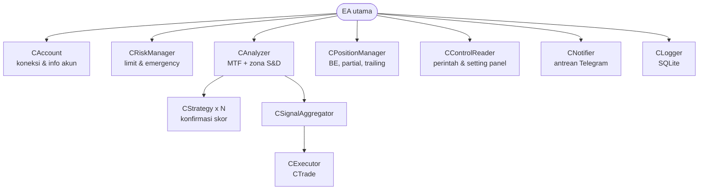
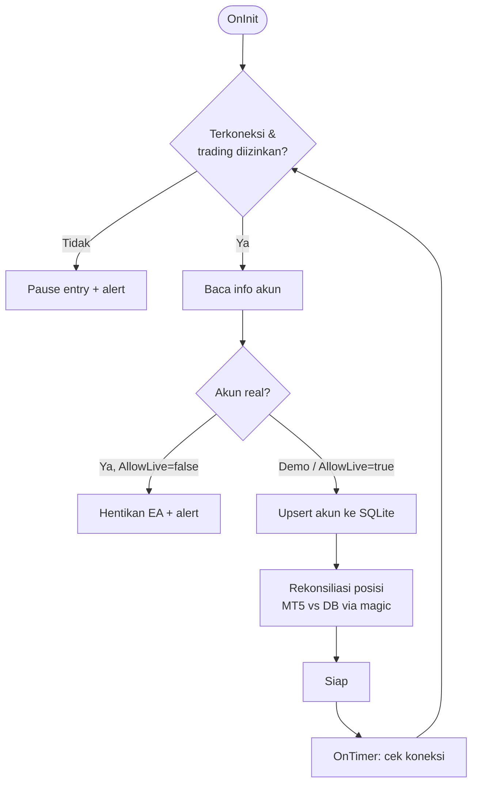
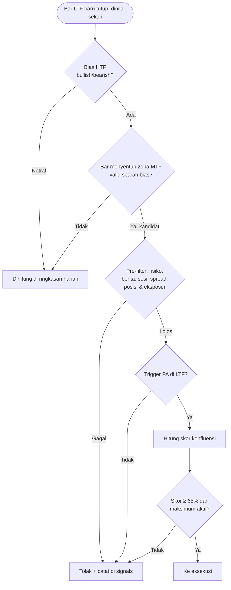
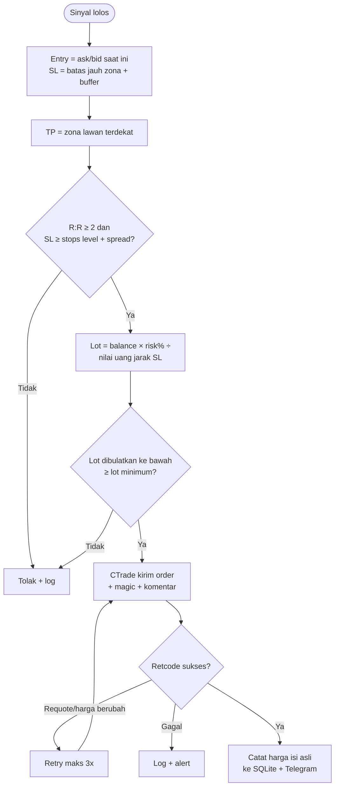
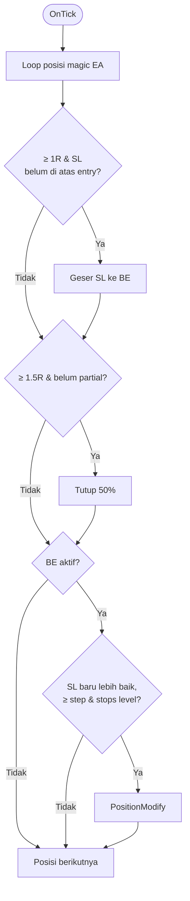
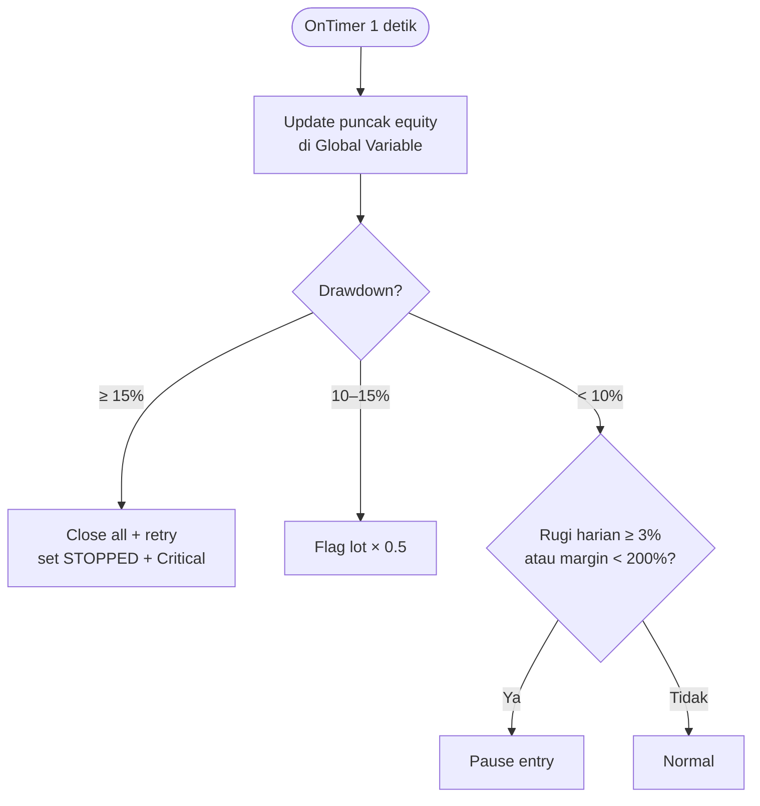
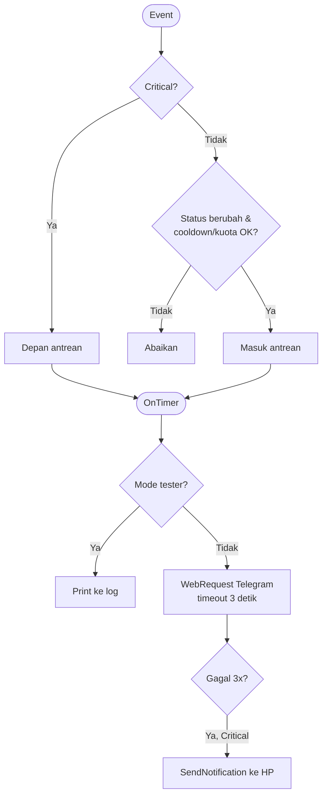

# PRD — EA Trading Bot MQL5 (Supply & Demand + Konfluensi)

2026-09-19 · @indra

> Sumber: Claude Docs https://claude.ai/code/artifact/9602635e-5c86-4d25-abe9-420a45a9ad24 (disalin ke repo 2026-10-03). Dokumen di claude.ai adalah versi induk; salinan ini acuan saat coding. Jangan diedit langsung: catat perubahan di `sdbot/docs/PENDING-CHANGES.md` (skill `sdbot-docs-sync`).

## Ringkasan dan tujuan

Produk ini adalah Expert Advisor (EA) MQL5 untuk MetaTrader 5 yang trading otomatis dengan zona Supply & Demand sebagai dasar, dikonfirmasi skor konfluensi dari Fibonacci, trendline, price action, dan struktur pasar.

Tujuan utama:

- Menjalankan strategi secara disiplin tanpa emosi, dengan aturan yang objektif dan bisa diuji.
- Melindungi modal lewat risk management berlapis dan emergency stop.
- Mengelola posisi otomatis: breakeven, partial close, dan trailing stop berbasis R dan ATR.
- Menghasilkan data trade yang lengkap untuk evaluasi dan perbaikan strategi.

Ekspektasi realistis: target bukan 10–30% per bulan. Keberhasilan diukur dari drawdown terkontrol, profit factor di atas 1.3, dan hasil forward test yang konsisten dengan backtest.

## Ruang lingkup

Versi 1 mencakup satu EA per terminal, satu gaya trading per instance EA, dan aset Forex, emas, serta crypto CFD yang tersedia di broker MT5.

| Termasuk (v1) | Di luar lingkup (v1) |
| --- | --- |
| Zona S&D, bias MTF, skor konfluensi | Machine learning / model AI |
| Eksekusi order dengan magic number | Ganti akun dari dalam EA |
| Breakeven, partial close, trailing ATR | PostgreSQL dan backoffice online |
| Risk management dan emergency stop | Perintah lewat Telegram |
| Notifikasi Telegram + push HP | Volume Profile (tick volume, bobot kecil, fase akhir) |
| Log SQLite termasuk spread dan slippage |  |
| Integrasi backoffice lokal: data, setting, dan perintah lewat SQLite bersama |  |

Detail API dan admin panel ada di PRD Backoffice SDBot.

Fitur di luar lingkup bisa ditambahkan setelah v1 terbukti stabil di akun cent.

## Platform dan arsitektur

EA ditulis full MQL5 karena strategi berbasis teknikal dan manajemen posisi per tick, backtest bawaan tersedia di Strategy Tester, dan kalender ekonomi bisa diakses langsung.

Prinsip arsitektur:

- Terminal MT5 adalah sumber kebenaran posisi. Setiap posisi ditandai magic number, DB hanya untuk log.
- Status disimpulkan dari posisi itu sendiri (posisi SL, volume) agar restart EA aman.
- Pengaman (risk monitor) terpisah dari notifikasi. Kegagalan Telegram tidak boleh menghambat trading.
- Analisis hanya saat candle baru tutup, untuk menghindari repainting dan beban berlebih.



Setiap modul adalah class di file `.mqh` terpisah, sehingga bisa diuji dan diganti satu per satu.

Pemetaan event MQL5:

| Event | Tugas |
| --- | --- |
| `OnInit` | Cek koneksi, validasi akun, buat handle indikator, rekonsiliasi posisi |
| `OnTick` | Deteksi bar baru, analisis, entry, position management |
| `OnTimer` (1 detik) | Risk monitor, sync akun, baca perintah dan setting panel, snapshot untuk backoffice, kirim antrean notifikasi, heartbeat |
| `OnTradeTransaction` | Deteksi posisi tertutup dan alasannya, simpan ke log |
| `OnTester` | Metrik custom untuk optimasi |
| `OnDeinit` | Lepas handle, tutup DB |

## Akun dan koneksi

EA bekerja hanya pada akun yang sedang login di terminalnya. Multi-akun berarti beberapa terminal MT5, masing-masing dengan EA sendiri.



Kebutuhan:

- Koneksi dicek dengan `TERMINAL_CONNECTED`, `TERMINAL_TRADE_ALLOWED`, dan `MQL_TRADE_ALLOWED`.
- Saat terputus, entry baru ditahan. Reconnect ditangani terminal. Terputus lebih dari 5 menit memicu alert Medium.
- Tipe akun dari `ACCOUNT_TRADE_MODE`. Akun real (termasuk cent) ditolak kecuali input `AllowLiveTrading = true`.
- Rekonsiliasi saat start: posisi di MT5 yang tidak ada di DB dicatat, posisi di DB yang sudah tertutup diperbarui dari history deal.
- Beberapa EA di satu akun berbagi status risiko lewat Global Variables terminal.
- Mode margin dicek dari `ACCOUNT_MARGIN_MODE` saat `OnInit`. Akun netting ditolak karena partial close, magic per posisi, dan satu entry per zona mengasumsikan setiap posisi berdiri sendiri (mode hedging).

## Pipeline analisis

Sinyal hanya lahir jika lolos tiga gerbang wajib (bias HTF, zona S&D valid, trigger LTF). Skor konfluensi hanya menilai kualitas, tidak bisa menggantikan gerbang.

### Timeframe per gaya trading

| Gaya | HTF (bias) | MTF (zona & struktur) | LTF (trigger) |
| --- | --- | --- | --- |
| Scalping | M15 | M5 | M1 |
| Day trading | H4 | H1 | M15 |
| Swing | W1 | D1 | H4 |
| Position | MN1 | W1 | D1 |

Satu gaya per instance EA, dipilih lewat input. Hasil analisis tiap TF disimpan di memori dan dihitung ulang hanya saat bar baru di TF tersebut.

### Struktur dan bias HTF

- Swing = fractal dengan kekuatan `SwingStrength` (default 2) dari bar tertutup, diakui setelah `SwingStrength` bar di kanannya tutup. High/low sama persis: bar lebih awal yang dipakai.
- BOS = close bar tertutup melewati swing terkonfirmasi terakhir. Arah struktur = BOS terakhir dalam `StructureLookback` bar (default 100).
- Arah EMA (`EmaPeriod` default 50): bullish bila close > EMA dan EMA naik dibanding `EmaSlopeBars` bar sebelumnya (default 3); bearish kebalikannya; selain itu netral.
- Bias HTF bullish/bearish hanya bila arah struktur dan arah EMA HTF sama. Selain itu netral, termasuk saat histori kurang.

### Alur



Kandidat = bar LTF tertutup yang menyentuh zona valid searah bias HTF. Setiap kandidat menjadi satu baris `signals` dengan tahap pertama yang gagal, dalam urutan: pre-filter risiko (STOPPED, pause harian, tidak bisa trading) → posisi instance masih terbuka (`POSITION_OPEN`) → trigger PA (`NO_PA_TRIGGER`) → skor (`SCORE_TOO_LOW`) → SL/TP dan R:R → lot dan pre-trade check → eksekusi. Bar tanpa bias atau tanpa zona hanya dihitung di ringkasan log harian. Setiap bar dinilai sekali (penanda bar di Global Variable per magic), dan bar yang lebih tua dari 2 × LTF tidak dinilai.

### Aturan zona Supply & Demand

- Zona dideteksi di MTF dari swing terkonfirmasi (Fractals dengan jeda bar), bukan ZigZag yang bisa repaint.
- Status zona: Fresh (belum disentuh), Tested (1 sentuhan), Invalid (ditembus close), Used (sudah dipakai entry).
- Zona Fresh bernilai tertinggi. Zona dengan 2 sentuhan atau lebih dianggap lemah dan tidak dipakai.
- Usia maksimal zona dalam jumlah bar MTF (default 100 bar), bukan jam.
- Satu zona hanya boleh menghasilkan satu entry.
- Zona dihitung ulang dari histori saat `OnInit`, tidak dimuat dari DB, agar backtest tidak bocor data.

Definisi zona:

- Zona dari satu candle swing MTF. Demand = low sampai max(open, close) candle swing low; supply = high sampai min(open, close) candle swing high.
- Lebar wajib `ZoneMinWidthAtr`–`ZoneMaxWidthAtr` (0,3–2,0) × ATR(14) MTF. Gerak keluar (close terjauh dari batas dekat) wajib ≥ `ZoneMinLegAtr` (1,5) × ATR dalam `ZoneLegBars` (10) bar. Zona aktif sejak swing terkonfirmasi dan gerak keluar tercapai.
- Sentuhan = bar MTF tertutup yang masuk zona setelah bar sebelumnya di luar. Status: Fresh (0), Tested (1), Lemah (≥ 2, tidak dipakai), Invalid (close melewati batas jauh, final), Kedaluwarsa (> `MaxZoneAgeBars` bar), Used (sudah dipakai entry).
- Penanda Used disimpan di Global Variable per magic dan dibersihkan setelah zona kedaluwarsa.
- Peta zona dibangun ulang penuh dari histori setiap bar MTF baru, tidak dari DB. Zona bertumpuk tidak digabung; pipeline memilih Fresh lebih dulu, lalu yang terbaru.

### Trigger price action

Trigger PA = pola terarah pertama yang cocok di bar LTF tertutup, diperiksa dalam urutan: bintang pagi/sore, engulfing kuat, pin bar, engulfing biasa, tweezer, outside bar terarah. Pola netral (inside bar, doji, harami) tidak pernah menjadi trigger. Ukuran relatif ATR(14) LTF dan rentang bar, sebagai konstanta:

| Pola | Syarat (versi bullish; bearish cerminnya) |
| --- | --- |
| Bintang | Badan bar pertama > 0,5 ATR, badan tengah < 0,3 × badan pertama, bar ketiga close melewati titik tengah badan pertama |
| Engulfing kuat | Badan menelan badan sebelumnya, badan ≥ 60% rentang dan ≥ 0,8 ATR, close melewati high/low bar sebelumnya |
| Pin bar | Badan ≤ 35% rentang; sumbu ≥ 2 × badan, ≥ 60% rentang, dan > 2 × sumbu lain; rentang ≥ 0,8 ATR |
| Engulfing biasa | Syarat badan engulfing saja |
| Tweezer | Bar sebelumnya berlawanan, selisih low/high ≤ 0,1 ATR |
| Outside bar | High dan low melewati bar sebelumnya, close melewati close sebelumnya |

Kode pola (enum `pa_pattern`): `STAR`, `ENGULF_STRONG`, `PIN`, `ENGULF`, `TWEEZER`, `OUTSIDE`, `NONE`. Tidak ada aturan khusus logam atau crypto; sekitar 40% bar M15 punya pola terarah.

### Skor konfluensi (total 100)

| Komponen | Maks | Aturan skor |
| --- | --- | --- |
| Kualitas zona | 30 | Fresh 30, Tested 15 |
| Fibonacci | 15 | Zona di 0.5–0.618 = 15, di 0.382 atau 0.786 = 8 |
| Trendline | 15 | 3+ sentuhan searah = 15, 2 sentuhan = 7 |
| Keselarasan tren (struktur + MA) | 15 | BOS searah dan EMA 50 searah = 15, salah satu = 7 |
| Breakout & retest | 10 | Retest level yang ditembus = 10 |
| Kekuatan price action | 10 | Engulfing kuat = 10, pin bar = 7, lainnya = 3 |
| RSI | 5 | Divergence searah = 5 |

Struktur dan MA digabung karena sama-sama mengukur tren, agar tidak dihitung ganda. Semua komponen dinilai sesuai arah sinyal. Ambang 65 adalah titik awal dan ditentukan ulang lewat backtest.

Strategi konfirmasi ditambahkan satu per satu, dan setiap penambahan harus terbukti meningkatkan hasil forward test.

`MinConfluenceScore` diartikan persen dari skor maksimum komponen yang aktif. Fase 3 hanya punya zona (30), keselarasan tren (15), dan price action (10), jadi maksimum 55 dan ambang default 65% berarti skor ≥ 36. Saat komponen Fase 5 aktif, maksimum kembali 100. Keselarasan tren dinilai di MTF: struktur dan EMA MTF searah sinyal = 15, salah satu = 7, tidak ada = 0. `signals.score_total` menyimpan skor mentah; setiap kandidat mencatat komponen `ZONE`, `TREND`, `PA` di `signal_scores` (enum `score_component`, cadangan `FIB`, `TRENDLINE`, `BREAKOUT`, `RSI`).

## Eksekusi order

Entry, SL, dan TP hanya berasal dari zona S&D, lalu lot dihitung dari harga yang benar-benar akan dieksekusi.



Kebutuhan:

- Mode entry default adalah market order saat trigger. Opsi limit order di batas dekat zona tersedia lewat input.
- Nilai uang jarak SL dihitung dengan `OrderCalcProfit()` agar benar untuk semua aset.
- Lot dibulatkan ke bawah sesuai `SYMBOL_VOLUME_STEP`. Jika di bawah `SYMBOL_VOLUME_MIN`, sinyal ditolak, tidak dibulatkan ke atas.
- Filling mode dideteksi otomatis dari `SYMBOL_FILLING_MODE`.
- SL dan TP selalu dikirim bersama order, sehingga posisi terlindungi walau EA mati.
- Setelah terisi, risiko aktual dihitung ulang dari harga isi asli dan disimpan di log.
- `CExecutor` adalah satu-satunya pintu ke broker. `OrderCheck` dijalankan sebelum setiap `OrderSend`; deviasi maksimum 10 point; modify dan close juga diulang maksimal 3 kali untuk retcode sementara.
- Komentar order `SDB|<SL awal>|<ID permintaan>`: ID 4 karakter unik per permintaan. Setelah retcode ambigu (timeout), EA mencari posisi atau deal dengan ID itu dulu, sehingga order yang ternyata terisi tidak dikirim dua kali.
- Alasan tolak memakai kode `enums.md`, termasuk `INVALID_STOPS` (SL/TP kosong atau di sisi salah) dan `INVALID_VOLUME`.

Aturan entry Fase 3:

- Hanya market order. `EntryMode` limit ditunda ke Fase 5.
- SL = batas jauh zona ∓ `SlBufferAtr` (0,1) × ATR(14) MTF; SL SELL ditambah spread saat itu.
- Jarak SL wajib ≥ max(stops level + spread, `MinSlAtr` 0,3 × ATR MTF) dan ≤ `MaxSlAtr` 3,0 × ATR MTF (`SL_TOO_CLOSE` / `SL_TOO_FAR`). Entry yang sudah melewati SL ditolak `INVALID_STOPS`.
- TP = batas dekat zona lawan valid terdekat. Bila tidak ada, TP = entry ± `MinRR` × jarak SL (2R); sumber TP (`ZONE` / `RR`) dicatat di konteks sinyal.
- Maksimal satu posisi terbuka per instance (simbol). Zona menjadi Used hanya setelah order terisi.

## Position management

Semua ambang memakai kelipatan R (R = jarak SL awal) dan ATR, bukan pips tetap per aset, sehingga otomatis cocok untuk forex, emas, dan crypto.

| Aksi | Pemicu default | Tindakan |
| --- | --- | --- |
| Breakeven | Profit ≥ 1R | SL ke entry + buffer (spread + komisi) |
| Partial close | Profit ≥ 1.5R | Tutup 50%, jika sisa volume ≥ lot minimum |
| Trailing | Setelah breakeven aktif | SL = harga − ATR(14) × 2 (buy), hanya maju |
| Penutupan | SL/TP di server broker | EA mendeteksi, tidak menutup sendiri |



Kebutuhan:

- Setiap aksi dicek independen dalam satu tick, bukan rantai if-else.
- Status disimpulkan dari posisi: SL di atas entry (buy) berarti BE aktif, volume di bawah volume awal berarti partial sudah dilakukan.
- Modifikasi dikirim hanya jika perubahan SL ≥ langkah minimum (default 5 point) dan menghormati stops level serta freeze level.
- Gagal modifikasi: retry maksimal 3x dengan cooldown 30 detik, lalu alert.
- Posisi yang ditutup dari luar (manual, stop out) dideteksi lewat `OnTradeTransaction` dengan `DEAL_REASON`, lalu dicatat.
- Titik BE = harga buka ± (spread + komisi pulang-pergi dalam point + `BreakevenBufferPoints`).
- Posisi milik instance ditentukan dari deal pembukanya (magic + simbol). Posisi yang ditutup close all dari instance lain tetap dicatat pemiliknya dengan alasan `EA_CLOSE`.
- Setelah 3 percobaan modifikasi atau partial yang gagal: satu event `MODIFY_FAILED` dan satu alert Medium, lalu berhenti sampai SL atau volume posisi berubah.
- SL yang dihapus manual dipasang kembali (SL awal bila masih valid, atau SL valid terdekat) dengan alert High; gagal 3 kali = alert Critical.
- Alasan tutup dibedakan `SL`, `BE_STOP`, dan `TRAIL_STOP` dari level pemicu SL. MFE dan MAE dalam R dihitung dari bar M1 saat posisi tutup.

## Risk management

Satu set angka berlaku untuk semua modul. Drawdown dihitung dari puncak equity, dan batas harian di-reset saat pergantian hari waktu server broker.

| Parameter | Default | Keterangan |
| --- | --- | --- |
| Risiko per trade | 0.5% (maks 1%) | Dari balance, jarak ke SL |
| Total risiko posisi terbuka | 3% | Posisi yang sudah BE dihitung 0% |
| Batas rugi harian | 3% | Termasuk floating, pause sampai hari berikutnya |
| Eksposur per mata uang | Maks 2 posisi searah | Contoh: maks 2 posisi long USD |
| Margin level | Alert di bawah 300% | Blok entry di bawah 200% |
| Drawdown 5% | Info | Tanpa tindakan |
| Drawdown 10% | Lot × 0.5 | Otomatis kembali normal di bawah 8% |
| Drawdown 15% | Close all + STOPPED | Butuh reset manual via input |
| Posisi per kategori aset | Forex major 5, cross 3, komoditas 1, crypto 1 | Posisi SDBot di akun; kategori dari mata uang simbol |



Kebutuhan:

- Monitor berjalan terus di `OnTimer`, terpisah dari logika entry, tidak hanya saat ada sinyal.
- Puncak equity, status STOPPED, dan pause disimpan di Global Variables agar bertahan saat restart dan dibaca semua EA di akun yang sama.
- Close all dicoba tiap 5 detik saat pasar buka dan tiap 60 detik saat pasar tutup; percobaan saat pasar tutup tidak dihitung gagal. Alert Critical `CLOSE_ALL_FAILED` setelah 3 gagal berturut-turut saat pasar buka, lalu paling sering tiap 15 menit.
- Pre-trade check berurutan: boleh trading, STOPPED, pause harian, risiko per trade (`RISK_PER_TRADE`), total risiko terbuka, batas posisi per kategori aset (`CLASS_POSITION_LIMIT`), eksposur mata uang, margin.
- Blok magic SDBot `2026091901`–`2026091999`, satu nomor per simbol (`2026091900` untuk harness uji). Emergency stop menutup semua posisi SDBot di simbol mana pun, dan total risiko terbuka dihitung atas semua posisi SDBot di akun.
- Batas posisi SDBot per kategori aset di akun: forex major 5, forex cross 3, komoditas 1, crypto 1 (input `MaxPos*`). Kategori ditentukan dari mata uang base dan quote simbol.
- Posisi SDBot tanpa SL dihitung berisiko 1% balance di total risiko terbuka.
- Lot × 0.5 dicabut saat drawdown di bawah min(8%, `DDReducePct` × 0.8), agar flag tidak berkedip bila `DDReducePct` disetel di bawah 8%.
- Deposit dan penarikan menggeser puncak equity dan balance awal hari sebesar nominalnya. Saat status bersama baru dibuat (akun baru, Global Variables dihapus, awal run tester), operasi saldo lama dianggap sudah diproses.

## Notifikasi

Satu class `CNotifier` menangani semua pesan (risiko, trade, heartbeat). Alert Critical selalu lolos tanpa rate limit.

| Event | Severity | Aturan kirim |
| --- | --- | --- |
| Drawdown ≥ 15%, close gagal 3x, posisi tanpa SL | Critical | Langsung, tanpa cooldown dan kuota; push HP bila Telegram gagal 3x atau nonaktif |
| Drawdown ≥ 10%, rugi harian ≥ 3%, margin < 300%, SL dipasang kembali | High | Saat status berubah |
| Terputus > 5 menit, order gagal | Medium | Cooldown 5 menit per tipe |
| Drawdown ≥ 5%, alert Info lain | Info | Cooldown 5 menit per tipe |
| Open, close, BE, partial | Info (tutup profit, BE, partial ditampilkan SUCCESS) | Setiap event, tanpa cooldown |
| Pulih di bawah level | Info | Sekali saat pulih |
| Heartbeat, laporan harian | Info | Satu instance pemimpin per akun; tanpa cooldown dan kuota |
| Start, stop EA | Info | Per instance, tanpa bunyi; tanpa cooldown dan kuota |



Kebutuhan:

- Pesan dikirim dari antrean di `OnTimer` (setelah risk monitor, maks 2 per siklus), tidak pernah di tengah proses order, karena `WebRequest` blocking. Critical diambil lebih dulu; antrean maks 100, non-Critical tertua digeser bila penuh.
- URL `https://api.telegram.org` wajib diizinkan di pengaturan Expert Advisors.
- Format pesan HTML mode dengan escape `& < >`, dipotong di 4096 karakter tanpa merusak tag.
- Kuota non-Critical 20 pesan per jam server untuk semua instance SDBot di akun (Global Variables, compare-and-set); event trade ikut kuota. Cooldown tipe akun (`CONN_*`, `DD_*`, `DAILY_LOSS`, `MARGIN_*`, `BALANCE_OP`, `STATE_RESET`, `EMERGENCY_RESET`) juga per akun. Pesan non-Critical yang lebih tua dari 30 menit sejak masuk antrean dibuang. Pesan yang ditahan tercatat `SKIPPED` dengan alasan, tanpa pesan ringkasan. Waktu memakai `TimeTradeServer()` agar tetap berjalan saat pasar tutup.
- Gagal sementara (timeout, 5xx, jaringan): coba lagi maks 3 kali, maks 1 kiriman per 10 detik per instance selama gagal. HTTP 429: tunggu `retry_after`, berlaku untuk semua instance. Jarak kiriman ke Telegram minimal 1 detik untuk semua instance. Pesan yang ditolak parser HTML dikirim ulang sekali sebagai teks polos.
- URL belum diizinkan (4014), token salah (401/404), bot dikeluarkan (403), atau chat tidak ditemukan: Telegram nonaktif sampai EA di-init ulang, satu log CRITICAL dan satu push HP.
- Push HP (`SendNotification`, teks polos maks 255 karakter) untuk Critical yang gagal di Telegram atau saat Telegram nonaktif; dibatasi 2 per detik dan 10 per menit (ditunda, bukan dibuang); push belum dikonfigurasi = satu CRITICAL per sesi.
- Token dan chat ID disimpan sebagai input EA, tidak ditulis di kode, log, DB, maupun JSON input sesi.
- Telegram memakai bot dan chat yang sama dengan bot Python. Format mengikuti bot Python: emoji per level, HTML, pesan start dan stop, heartbeat tanpa bunyi, laporan harian. Setiap pesan diawali penanda `SDBot` + simbol (atau `AKUN <login>` untuk heartbeat dan laporan) + tipe akun (`TESTER` di Strategy Tester) + versi EA.
- Heartbeat dan laporan harian dikirim satu instance pemimpin per akun (lease Global Variable 120 detik, diperbarui tiap 30 detik, dilepas saat berhenti). Heartbeat tanpa bunyi tiap `HeartbeatMinutes`: balance, equity, drawdown dari puncak, status risiko, posisi SDBot terbuka di akun, instance hidup, pesan yang ditahan kuota jam sebelumnya.
- Laporan harian saat hari server berganti, dari history deal MT5 posisi SDBot: P&L bersih, jumlah posisi tutup, win rate, P&L per simbol, operasi saldo, balance. Hari tanpa posisi tutup dan tanpa operasi saldo tidak dilaporkan; hari yang terlewat dikirim kemudian, sekali per hari (maks 7 hari).
- Pesan start (memuat akhir sesi sebelumnya) dan stop per instance, tanpa bunyi. Saat deinit, Critical lalu stop dikirim maks 2 detik (MT5 menghentikan `OnDeinit` setelah 2.5 detik).
- Restart: baris `PENDING` milik instance yang lebih tua dari 30 menit menjadi `SKIPPED`; Critical yang lebih muda dikirim ulang; non-Critical muda `SKIPPED`.
- Event posisi: BE (`BE_MOVED`) dan partial (`PARTIAL_CLOSED`) Info; SL dipasang kembali (`SL_RESTORED`) High; posisi tetap tanpa SL setelah 3 gagal (`SL_MISSING`) Critical.

## Data dan database

Database memakai SQLite bawaan MQL5 di folder Common, satu file untuk semua EA, dibedakan per nomor akun. DB berfungsi sebagai log, bukan sumber kebenaran posisi. Backoffice membaca file yang sama secara read-only, sehingga DB dibuka dengan mode WAL.

| Tabel | Isi utama |
| --- | --- |
| `sessions` | login, magic, simbol, mode (LIVE/TESTER), versi EA, `input_hash` + `inputs_json`, mulai, akhir + alasan, rentang tester, `run_key` |
| `accounts` | login, server, tipe (demo/real/cent), margin mode, mata uang, leverage, balance, equity, puncak equity, selisih waktu server, updated_at |
| `signals` + `signal_scores` | waktu, simbol, arah, gaya, zona, skor total dan skor per komponen, spread (point), status, alasan tolak |
| `trades` | `run_key`, `position_id`, magic, simbol, arah, sumber (EA/RECONCILED), volume awal, harga diminta dan isi, slippage dan spread (point), SL/TP awal, risiko uang dan %, signal_id, versi EA |
| `deals` | setiap deal posisi: tiket, entry (IN/OUT/INOUT/OUT_BY), tipe, volume, harga, alasan deal, profit, komisi, swap, fee |
| `position_events` | BE, PARTIAL, PARTIAL_SKIPPED, TRAILING, MODIFY_FAILED, SL_RESTORED: SL lama/baru, volume, harga, spread |
| `closures` | alasan (TP/SL/BE_STOP/TRAIL_STOP/MANUAL/STOP_OUT/EA_CLOSE/ROLLOVER/OTHER), harga level dan isi, slippage exit, volume, profit, komisi, swap, fee, net, R hasil, MFE/MAE dalam R, lama posisi, flag BE/partial/trailing |
| `balance_ops` | deposit, penarikan, kredit: tiket deal, waktu, jenis, nominal |
| `alerts` | waktu, tipe (termasuk event trade, heartbeat, laporan, start/stop), severity, pesan, status kirim, attempts, sent_at, notify_key, status_reason (skema v3) |
| `v_trade_results` | view trades + closures per posisi |
| `schema_migrations` | migrasi yang sudah diterapkan (menggantikan `schema_version`) |

Kebutuhan:

- Dibuka dengan flag `DATABASE_OPEN_COMMON` agar mudah ditemukan, termasuk hasil backtest.
- Tidak ada fitur ekspor CSV di EA. File SQLite dibuka dan diekspor lewat DB Browser for SQLite.
- Logging DB dimatikan saat optimasi (`MQL_OPTIMIZATION`) karena banyak agent bisa mengunci file yang sama. Evaluasi optimasi memakai metrik `OnTester`.
- Spread dicatat dalam point dari `SYMBOL_SPREAD`. Slippage = selisih harga isi dengan harga diminta (entry) atau harga SL/TP (exit), bertanda negatif jika merugikan.
- Data spread dan slippage dipakai untuk menyetel `MaxSpreadPoints`, membandingkan live dengan backtest, dan menilai kualitas eksekusi broker.
- Tabel `signals` menyimpan sinyal yang ditolak juga, untuk menganalisis filter mana yang paling sering memblokir.
- Kolom `R hasil` di `closures` menjadi dasar metrik expectancy dan sudah termasuk efek spread, slippage, dan komisi.
- Tabel tambahan untuk backoffice (instance, snapshot, hasil perintah) dijelaskan di PRD Backoffice. Skema resmi ada di shared/schema/ pada repo.
- Semua waktu disimpan UTC (epoch detik); `accounts.server_utc_offset_sec` menyimpan selisih waktu server.
- Backtest menulis file terpisah `sdbot_tester.sqlite`; optimasi tidak menulis DB; backoffice hanya membaca `sdbot.sqlite`.
- Kolom `run_key` memisahkan run backtest: 0 di live, ID sesi pertama run di tester (posisi dan deal tester bernomor sama di setiap run). Kunci posisi = `login + run_key + position_id`.
- Skema hanya berubah lewat migrasi maju di `shared/schema/migrations/` (`tools/schema.py`), diterapkan EA sendiri saat start. DDL lengkap: `shared/schema/data_db.sql`.

Telemetri sinyal: satu baris `signals` per kandidat dan tiga baris `signal_scores` (`ZONE`, `TREND`, `PA`). `signals.id` dihitung EA dari login, run_key, magic, dan waktu bar, sehingga `trades.signal_id` terisi sebelum order dan restart di bar yang sama tidak menambah baris. `context_json` berisi pola PA, status zona, alasan bias, entry/SL/TP, sumber TP, R:R, ATR MTF, persen skor, dan maksimum aktif.

## Parameter input EA

Konfigurasi YAML diganti input EA, disimpan sebagai file `.set` per gaya trading dan per simbol.

| Grup | Input | Default |
| --- | --- | --- |
| Umum | `MagicNumber` | 2026091901 (blok 2026091901–2026091999, satu nomor per simbol; 2026091900 untuk harness uji) |
| Umum | `TradingStyle` | Day trading |
| Umum | `SymbolSuffix` | kosong |
| Umum | `AllowLiveTrading` | false |
| Umum | PresetTag | kosong (preset mengisi simbolnya; beda dengan simbol chart = WARN) |
| Entry | `EntryMode` | Market (limit ditunda ke Fase 5) |
| Entry | `MinConfluenceScore` | 65 (% dari skor maksimum komponen aktif; Fase 3: 55, jadi skor ≥ 36) |
| Entry | `MinRR` | 2.0 (TP ke zona lawan terdekat, atau 2R bila tidak ada) |
| Entry | `MaxZoneAgeBars` | 100 |
| Entry | SlBufferAtr | 0.1 × ATR(14) MTF di luar batas jauh zona (SELL + spread) |
| Entry | MinSlAtr / MaxSlAtr | 0.3 / 3.0 × ATR(14) MTF (jarak SL minimal juga ≥ stops level + spread) |
| Analisis | SwingStrength / StructureLookback | 2 (1–5) / 100 bar (20–500) |
| Analisis | EmaPeriod / EmaSlopeBars | 50 (10–400) / 3 (1–20) |
| Zona | ZoneMinWidthAtr / ZoneMaxWidthAtr | 0.3 / 2.0 × ATR(14) MTF |
| Zona | ZoneMinLegAtr / ZoneLegBars | 1.5 × ATR dalam 10 bar MTF |
| Filter | `MaxSpreadPoints` | per simbol |
| Filter | `NewsBlockMinutes` | 30 sebelum/sesudah berita high impact |
| Filter | `TradingSessions` | London + New York |
| Risiko | `RiskPerTradePct` | 0.5 |
| Risiko | `MaxOpenRiskPct` | 3.0 |
| Risiko | MaxPosForexMajor / ForexCross / Commodity / Crypto | 5 / 3 / 1 / 1 posisi SDBot per kategori aset di akun |
| Risiko | `DailyLossPct` | 3.0 |
| Risiko | `DDReducePct` / `DDStopPct` | 10 / 15 |
| Risiko | `ResetEmergencyStop` | false |
| Posisi | `BreakevenR` / `BreakevenBufferPoints` | 1.0 / spread + 2 |
| Posisi | `PartialR` / `PartialPct` | 1.5 / 50 |
| Posisi | `TrailATRPeriod` / `TrailATRMult` | 14 / 2.0 |
| Notifikasi | `TelegramToken` / `TelegramChatID` | kosong |
| Notifikasi | `HeartbeatMinutes` | 60 (0 = mati, selain itu 5–1440) |

Input tambahan untuk integrasi backoffice: `InpEnableBackoffice` (default true) dan `InpControlPollSeconds` (default 2). Nilai input MT5 menjadi batas atas untuk setting yang diubah dari admin panel; panel hanya boleh membuat EA lebih ketat.

Preset siap pakai ada untuk 12 simbol bot Python: `SDBot_DAY_<SIMBOL>c.set`, dibangkitkan `tools/gen_presets.py`. Di Fase 1 isinya sama untuk semua simbol kecuali `MagicNumber` dan `PresetTag`; nilai per kategori dari bot Python (spread maks, sesi, jarak SL) dicatat sebagai komentar sampai inputnya ada di Fase 3–4. Preset memakai `AllowLiveTrading = false` dan risiko 0.5% per trade.

Filter berita memakai kalender ekonomi bawaan MT5 (`CalendarValueHistory`), tanpa sumber eksternal. Di Strategy Tester, filter berita memakai file CSV kalender historis karena fungsi kalender tidak tersedia di tester.

## Instalasi dan pemasangan

EA dipasang dengan menyalin file ke folder data MT5, compile di MetaEditor, lalu dipasang ke chart dengan izin Algo Trading aktif.

### 1. Struktur folder

Kode EA ada di folder `ea/src/` pada monorepo. Folder ini dihubungkan ke folder data MT5 dengan junction, bukan disalin, lewat skrip `tools/link-mt5.ps1` (detail di dokumen Struktur Repo & Aturan Kode). Hasilnya di dalam MT5:

```text
MQL5/
├── Experts/SDBot/     → ea/src/Experts/SDBot/   (SDBot.mq5)
├── Include/SDBot/     → ea/src/Include/SDBot/   (modul .mqh per folder)
├── Scripts/SDBot/     → ea/src/Scripts/SDBot/
└── Presets/SDBot/     → ea/src/Presets/
```

Path folder data MT5 didapat dari File → Open Data Folder. CSV kalender historis untuk backtest disalin ke folder Common/Files.

### 2. Compile

1. Tekan F4 untuk membuka MetaEditor.
2. Buka `Experts/SDBot/SDBot.mq5`, tekan F7 (Compile).
3. Pastikan tab Errors menunjukkan 0 error. File `SDBot.ex5` akan muncul di folder yang sama.
4. Di MT5, klik kanan panel Navigator → Refresh. EA muncul di bawah Expert Advisors.

### 3. Pengaturan MT5 (sekali saja)

Buka Tools → Options → tab Expert Advisors:

- [ ] Centang Allow algorithmic trading
- [ ] Centang Allow WebRequest for listed URL, lalu tambahkan `https://api.telegram.org`
- [ ] Jangan centang Allow DLL imports (tidak dibutuhkan)

Buka tab Notifications, centang Enable Push Notifications, lalu isi MetaQuotes ID dari aplikasi MetaTrader 5 di HP (menu Settings → Messages).

### 4. Siapkan bot Telegram

1. Tidak membuat bot baru: SDBot memakai bot dan chat Telegram yang sama dengan bot Python.
2. Jalankan `python sdbot/tools/make_local_presets.py`: skrip membaca `TELEGRAM_BOT_TOKEN` dan `TELEGRAM_CHAT_ID` dari `.env` bot Python dan membuat salinan pribadi `SDBot_DAY_<SIMBOL>c.local.set` dari setiap preset repo. File yang sudah disunting tidak ditimpa tanpa `--force`.
3. File `*.local.set` tidak pernah di-commit (skrip gagal bila tidak diabaikan git); token dan chat ID tidak pernah ditulis di kode atau preset repo. Token kosong: EA tetap jalan, pesan hanya di log Experts.

### 5. Pasang EA ke chart

1. Buka chart simbol yang akan ditradingkan. Timeframe chart bebas karena EA memakai timeframe dari input gaya trading.
2. Seret SDBot dari Navigator ke chart.
3. Tab Common: centang Allow Algo Trading.
4. Tab Inputs: klik Load dan pilih file `.set`, atau isi manual. Untuk akun cent, set `AllowLiveTrading = true` dan `SymbolSuffix` sesuai broker.
5. Klik OK, lalu pastikan tombol Algo Trading di toolbar berwarna hijau.
6. Ikon topi di pojok kanan atas chart berwarna biru berarti EA aktif.

Satu EA per chart simbol, masing-masing dengan `MagicNumber` berbeda. Status risiko tetap dihitung per akun lewat Global Variables.

Muat preset `SDBot_DAY_<SIMBOL>c.set` yang sesuai simbol chart: `MagicNumber` dan `PresetTag` sudah benar (01 EURUSD, 02 GBPUSD, 03 EURJPY, 04 GBPJPY, 05 USDJPY, 06 USDCHF, 07 AUDUSD, 08 USDCAD, 09 NZDUSD, 10 XAUUSD, 11 XAGUSD, 12 BTCUSD). EA memberi WARN bila preset dimuat di chart simbol lain.

### 6. Cek berjalan normal

- Tab Experts di panel Toolbox (Ctrl+T): pesan inisialisasi EA tanpa error.
- Tab Journal: tidak ada pesan penolakan WebRequest.
- Telegram menerima pesan "EA started" dan heartbeat pertama.
- File log SQLite ada di folder Common: `%APPDATA%\MetaQuotes\Terminal\Common\Files`.

### 7. Menjalankan di PC lokal

EA dijalankan di PC lokal, sehingga hanya aktif selama PC menyala, MT5 terbuka, dan internet tersambung. SL dan TP tetap aman di server broker saat PC mati, tetapi breakeven, partial, trailing, dan emergency stop berhenti.

Pengaturan PC:

- [ ] Sleep dan hibernate dimatikan (Settings → System → Power: Never)
- [ ] Laptop: selalu dicolok charger, aksi tutup layar diset Do nothing
- [ ] Windows Update: atur Active hours dan tunda update agar tidak restart otomatis saat pasar buka
- [ ] Shortcut MT5 dimasukkan ke folder Startup (Win+R → `shell:startup`) agar terbuka otomatis setelah restart
- [ ] MT5 ditutup normal lewat File → Exit, agar chart dan EA tersimpan di profil dan aktif lagi saat dibuka
- [ ] Internet stabil, lebih baik kabel LAN daripada Wi-Fi

Risiko dan mitigasi:

- Heartbeat Telegram tiap 1 jam berhenti datang berarti PC, MT5, atau internet mati. Cek manual jika lebih dari 1 jam tanpa heartbeat.
- Saat MT5 dibuka lagi, EA menjalankan rekonsiliasi posisi dan melanjutkan manajemen posisi dari status yang tersimpulkan.
- Latensi lokal lebih tinggi dari VPS. Cukup untuk day trading dan swing, tetapi kurang ideal untuk scalping M1.
- Hindari mematikan PC saat ada posisi terbuka, terutama menjelang berita besar.

Jika nanti dibutuhkan uptime penuh, langkah 1–6 bisa diulang di Windows VPS tanpa perubahan kode.

### 8. Update versi

1. Salin file baru, compile ulang di MetaEditor.
2. EA di chart otomatis dimuat ulang. Posisi terbuka tetap dikelola karena status disimpulkan dari posisi dan Global Variables.
3. Update sebaiknya dilakukan saat pasar sepi atau tanpa posisi terbuka.

### 9. Menjalankan backtest

1. Tekan Ctrl+R untuk membuka Strategy Tester.
2. Pilih SDBot, simbol, dan rentang tanggal.
3. Modeling: Every tick based on real ticks. Isi deposit awal dan mata uang sesuai akun cent.
4. Tab Inputs: muat file `.set` yang sama dengan live.
5. Centang Visual mode untuk uji fungsi, matikan untuk backtest penuh, lalu klik Start.

## Pengujian dan kriteria penerimaan

EA naik ke akun standar hanya setelah lolos empat tahap pengujian berikut secara berurutan. Akun demo tidak dipakai, digantikan akun cent dengan kondisi eksekusi nyata.

| Tahap | Cara | Lolos jika |
| --- | --- | --- |
| 1. Uji fungsi | Strategy Tester visual mode, skenario manual | BE, partial, trailing, limit risiko, emergency stop bekerja sesuai tabel |
| 2. Backtest | Real ticks, data server akun cent, spread asli, komisi, 3+ tahun | Minimal 300 trade, profit factor ≥ 1.3, max DD ≤ 15% |
| 3. Forward test | Periode 12 bulan terakhir yang tidak dipakai optimasi | Profit factor dan DD tidak memburuk lebih dari 30% dibanding backtest |
| 4. Live akun cent | Akun cent 1–3 bulan, lalu backtest ulang periode yang sama | Tidak ada error kritis, entry/exit cocok dengan backtest, slippage rata-rata tercatat dan wajar |

Catatan akun cent:

- Mata uang akun USC. Semua aturan risiko berbasis persen, tidak boleh ada nilai tetap dalam dolar di kode.
- Simbol memakai akhiran (misalnya `EURUSDc`), diatur lewat input `SymbolSuffix`.
- Ukuran kontrak berbeda dari akun standar. Lot tetap benar karena dihitung dengan `OrderCalcProfit()`.
- Akun cent terdeteksi sebagai akun real, sehingga `AllowLiveTrading` harus `true`.
- Pesan Telegram menampilkan mata uang dari `ACCOUNT_CURRENCY`.
- Pindah ke akun standar dianggap tahap uji baru, dimulai lagi dengan risiko kecil karena spread dan eksekusi bisa berbeda.

Skenario uji fungsi wajib:

- [ ] Restart EA saat ada posisi terbuka, status BE dan partial tetap benar
- [ ] Koneksi putus, entry tertahan, alert terkirim
- [ ] Rugi harian 3% tercapai, entry pause sampai hari server berikutnya
- [ ] Drawdown 15%, semua posisi ditutup, EA tetap STOPPED setelah restart
- [ ] Lot hitungan di bawah lot minimum, sinyal ditolak
- [ ] Posisi ditutup manual, tercatat dengan alasan yang benar
- [ ] Telegram gagal, alert Critical terkirim lewat push HP
- [ ] Akun real dengan `AllowLiveTrading = false`, EA menolak jalan

Metrik custom di `OnTester` untuk optimasi: expectancy per trade dalam R dibagi max drawdown.

Expectancy dihitung dari R hasil closure; drawdown = max drawdown relatif equity (%). Metrik bernilai 0 bila trade dengan R kurang dari 30 atau drawdown 0, agar pass dengan sedikit trade tidak terpilih. Optimasi tidak menulis DB.

## Roadmap

Pengembangan dimulai dari fondasi pengaman, lalu strategi ditambah bertahap agar setiap lapisan bisa diukur kontribusinya.

| Fase | Isi | Selesai jika |
| --- | --- | --- |
| 1. Fondasi | CAccount, CRiskManager, CPositionManager, CLogger | Uji fungsi BE, partial, trailing, limit risiko lolos |
| 2. Notifikasi | CNotifier, Telegram, push HP, heartbeat | Semua event di tabel notifikasi terkirim sesuai aturan |
| 3. Strategi inti | Bias HTF, zona S&D, trigger PA, eksekusi | Backtest dasar 12 simbol × 12 bulan terakhir tanpa lapisan konfirmasi: tanpa error kritis, total ≥ 300 trade dan setiap simbol ≥ 15 trade, semua trade punya signal_id dengan skor lengkap, query kalibrasi menghasilkan data. Profit dinilai di Fase 5–6 |
| 4. Filter | Berita, sesi, spread, eksposur mata uang | Filter tercatat di tabel signals dengan alasan tolak |
| 5. Konfirmasi | Fibonacci, trendline, breakout retest, RSI (satu per satu) | Setiap lapisan meningkatkan hasil forward test |
| 6. Validasi | Forward test dan live akun cent 1–3 bulan | Kriteria penerimaan tahap 3 dan 4 terpenuhi |
| 7. Lanjutan | Volume profile, filter AI, backoffice online | Diputuskan setelah fase 6 |

## Temuan review dan keputusan

Delapan flow dari versi Python direview. Temuan utama dan keputusan yang diambil di PRD ini:

| Flow | Temuan | Keputusan di PRD |
| --- | --- | --- |
| Akun | Trading jalan dengan akun cache saat MT5 terputus | Entry ditahan saat terputus |
| Akun | Akun terpilih di DB bisa beda dengan akun login | Dihapus, EA terikat ke akun terminal |
| Strategi | Tidak ada aturan konflik antar strategi | S&D jadi penentu entry/SL/TP, lainnya hanya skor |
| MTF | HTF hanya bobot 25%, trade melawan tren bisa lolos | HTF jadi gerbang wajib |
| MTF | Cache berbasis detik | Dihitung ulang per bar baru |
| Open position | Total bobot 115% | Dinormalisasi ke 100 |
| Open position | Lot dihitung dari entry teoretis | Lot dari harga eksekusi asli |
| Open position | Validasi R:R selalu lolos | TP ke zona lawan, lalu cek R:R |
| Open position | Syarat zona 2+ sentuhan | Zona Fresh bernilai tertinggi |
| Position mgmt | Ambang pips tetap per aset | Kelipatan R dan ATR |
| Position mgmt | EA menutup posisi saat SL/TP kena | SL/TP di server, EA hanya mendeteksi |
| Risk | Tiga versi angka risiko bertentangan | Satu tabel angka |
| Risk | Emergency hanya dicek saat ada sinyal baru | Monitor terus di OnTimer |
| Notifikasi | Alert Critical bisa terblokir rate limit | Critical tanpa limit + push HP |
| Eksekusi strategi | Loop kembali scan semua simbol, bukan simbol berikutnya | Loop per simbol diperbaiki |
| Eksekusi strategi | Skor bisa ≥ 65 dengan zona lemah (+5) | Zona valid jadi gerbang wajib |
| Eksekusi strategi | Struktur, MA, trendline mengukur tren yang sama | Struktur dan MA digabung |
| Eksekusi strategi | Set timeframe beda dengan flow MTF | Satu tabel timeframe |

Keputusan yang diambil pada 28 September 2026:

| Keputusan | Hasil | Catatan |
| --- | --- | --- |
| Gaya trading pertama | Day trading (HTF H4, MTF H1, LTF M15) | Gaya lain menyusul setelah day trading lolos validasi |
| Simbol awal | Simbol aktif bot Python, versi cent: EURUSD, GBPUSD, USDJPY, USDCHF, AUDUSD, USDCAD, NZDUSD, EURJPY, GBPJPY, XAUUSD, XAGUSD, BTCUSD (semula 4 pair; diubah 2026-09-30) | Di akun cent Exness memakai akhiran `c` (`SymbolSuffix = c`). `MaxSpreadPoints` disetel per simbol dari data spread di log |
| Mode entry | Market saat trigger (default), Limit sebagai opsi input | Mode Adaptive jadi kandidat fase 5–6: market jika R:R di harga saat ini ≥ `MinRR`, jika tidak pasang limit di harga yang membuat R:R = `MinRR` dan hangus setelah N bar. Dipakai hanya jika backtest dan forward test membuktikan lebih baik |
| Broker dan tipe akun | Exness, akun cent, server Exness-MT5Real20, mata uang USC, mode margin hedging | Dicek langsung dari terminal (`ACCOUNT_MARGIN_MODE = RETAIL_HEDGING`). EA menolak jalan di akun netting |
