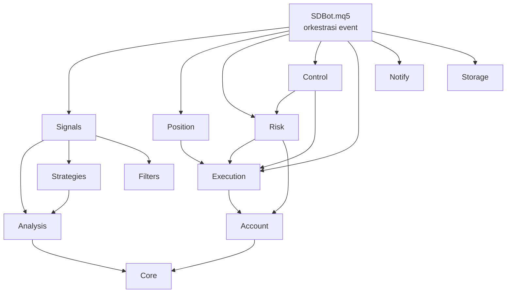

# Struktur Repo & Aturan Kode — SDBot (Monorepo)

2026-09-21 · @indra

> Sumber: Claude Docs https://claude.ai/code/artifact/af81a7e2-e640-4dc4-8f65-936acfc16525 (disalin ke repo 2026-10-01). Dokumen di claude.ai adalah versi induk; salinan ini acuan saat coding. Jangan diedit langsung: catat perubahan di `sdbot/docs/PENDING-CHANGES.md` (skill `sdbot-docs-sync`).

## Tujuan

Dokumen ini menerjemahkan PRD EA Trading Bot MQL5 menjadi struktur repo dan aturan kode yang wajib diikuti setiap perubahan, baik ditulis sendiri maupun dengan bantuan AI.

Tiga prinsip utama:

- **Satu tanggung jawab per modul.** Hanya Executor yang mengirim order, hanya Logger yang menulis DB, hanya Notifier yang memanggil WebRequest.
- **Logika murni terpisah dari terminal.** Perhitungan (lot, R, skor, zona) ditulis sebagai fungsi murni agar bisa diuji tanpa pasar.
- **Aman secara default.** Semua input default mengarah ke perilaku paling aman, dan setiap aksi trading dicek hasilnya.

File ini juga bisa disimpan di repo sebagai `docs/RULES.md` agar jadi acuan saat coding.

## Struktur folder repo

Satu repo berisi tiga bagian: `ea/` (MQL5), `backoffice/` (API FastAPI dan panel Next.js), dan `shared/` (kontrak data yang dipakai keduanya). Folder `ea/src/` meniru struktur `MQL5/` agar bisa dihubungkan langsung ke MT5.

```text
sdbot/
├── README.md                     ringkasan + cara instal semua bagian
├── CHANGELOG.md                  riwayat versi EA dan backoffice
├── .gitignore
├── .editorconfig
├── docs/
│   ├── PRD-EA.md
│   ├── PRD-Backoffice.md
│   ├── RULES.md                  dokumen ini
│   ├── flows/                    diagram Mermaid per modul
│   └── decisions/                catatan keputusan (ADR-001-...md)
├── shared/
│   └── schema/
│       ├── data_db.sql           skema sdbot.sqlite (ditulis EA)
│       ├── control_db.sql        skema sdbot_control.sqlite (ditulis API)
│       ├── enums.md              nilai status, jenis perintah, alasan tutup
│       └── fixtures/             DB contoh untuk test API
├── ea/
│   ├── src/
│   │   ├── Experts/SDBot/SDBot.mq5
│   │   ├── Include/SDBot/
│   │   │   ├── Core/             Types, Constants, Inputs, Utils, State
│   │   │   ├── Account/
│   │   │   ├── Risk/             RiskManager, RiskMonitor, Exposure
│   │   │   ├── Analysis/         Analyzer, Timeframes, Swings, Zones
│   │   │   ├── Strategies/       StrategyBase + strategi konfirmasi
│   │   │   ├── Signals/          SignalAggregator
│   │   │   ├── Filters/          NewsFilter, SessionFilter, SpreadFilter
│   │   │   ├── Execution/        Executor
│   │   │   ├── Position/         PositionManager
│   │   │   ├── Control/          ControlReader, CommandHandler
│   │   │   ├── Notify/           Notifier, TelegramClient
│   │   │   ├── Storage/          Logger, Schema
│   │   │   └── UI/               Panel di chart
│   │   ├── Scripts/SDBot/        ExportCalendar, ResetState
│   │   └── Presets/              file .set tanpa token
│   └── tests/
│       ├── Scripts/SDBotTests/   unit test fungsi murni
│       └── scenarios/            file .ini Strategy Tester
├── backoffice/
│   ├── api/
│   │   ├── pyproject.toml, uv.lock, .env.example
│   │   ├── app/
│   │   │   ├── main.py
│   │   │   ├── core/             config, security, koneksi DB
│   │   │   ├── routers/          endpoint HTTP
│   │   │   ├── services/         logika bisnis
│   │   │   ├── repositories/     query SQLite
│   │   │   └── schemas/          model Pydantic
│   │   ├── cli/                  create_admin, init_control_db
│   │   └── tests/
│   └── web/
│       ├── package.json, pnpm-lock.yaml, next.config.ts
│       └── src/
│           ├── app/              halaman: login, dashboard, positions, trades,
│           │                     stats, signals, alerts, settings, commands, audit
│           ├── components/
│           ├── lib/api/          tipe dan client hasil generate OpenAPI
│           └── hooks/
├── tools/
│   ├── link-mt5.ps1              junction ea/src → folder MT5
│   ├── start-backoffice.ps1      jalankan API + panel
│   ├── gen-api-types.ps1         generate tipe TypeScript dari OpenAPI
│   └── queries/                  query SQL analisis
└── reports/                      hasil backtest (tidak di-commit)
```

Aturan folder:

- Satu class per file `.mqh`, nama file sama dengan nama class tanpa awalan C.
- File baru selalu masuk ke folder lapisan yang sesuai, tidak di root folder modul.
- `ea/src/Include/SDBot/Core/Inputs.mqh` adalah satu-satunya tempat deklarasi `input`.
- `shared/schema/` adalah sumber kebenaran skema. EA dan API mengikutinya, bukan sebaliknya.
- Kode backoffice tidak pernah mengimpor atau membaca file di `ea/`, dan sebaliknya. Keduanya hanya bertemu lewat `shared/`.
- Diagram di `docs/flows/` diperbarui di commit yang sama dengan perubahan logikanya.
- `ea/src/Include/SDBot/App/` adalah lapisan paling atas, hanya orkestrasi (`CSdbApp`, `CTeeSink`). `SDBot.mq5` hanya meneruskan event ke `CSdbApp`.
- `shared/schema/` berisi `migrations/<db>/NNNN_*.sql`, `migrations.lock.json`, `enums.md`, snapshot `data_db.sql` (hasil generate), dan `fixtures/`.
- `tools/` berisi `link-mt5.ps1`, `build-ea.ps1`, `run-ea-tests.ps1`, `lib/Mt5Paths.psm1`, `mt5-paths.example.json` (`mt5-paths.local.json` tidak di-commit), `schema.py`, `gen_presets.py`, dan `queries/`.
- `ea/src/Presets/` berisi preset `SDBot_DAY_<SIMBOL>c.set` untuk 12 simbol bot Python, dibangkitkan `tools/gen_presets.py`; tidak diedit tangan.

## Menghubungkan repo ke MT5

Repo disimpan di luar folder MT5, lalu dihubungkan dengan junction Windows. Edit di repo langsung terbaca MetaEditor, dan git tidak tercampur file bawaan MT5.

Jalankan sekali di PowerShell (sebagai Administrator), sesuaikan dua path di baris pertama:

```powershell
$repo = "D:\dev\sdbot\ea\src"
$mql5 = "C:\Users\NAMA\AppData\Roaming\MetaQuotes\Terminal\<ID>\MQL5"

New-Item -ItemType Junction -Path "$mql5\Experts\SDBot"  -Target "$repo\Experts\SDBot"
New-Item -ItemType Junction -Path "$mql5\Include\SDBot"  -Target "$repo\Include\SDBot"
New-Item -ItemType Junction -Path "$mql5\Scripts\SDBot"  -Target "$repo\Scripts\SDBot"
New-Item -ItemType Junction -Path "$mql5\Presets\SDBot"  -Target "$repo\Presets"
```

Path `<ID>` didapat dari MT5: File → Open Data Folder. Skrip ini disimpan sebagai `tools/link-mt5.ps1`.

Setelah terhubung:

- Compile tetap lewat MetaEditor (F7). File `.ex5` hasil compile ikut muncul di repo, tetapi diabaikan git.
- Jika punya lebih dari satu terminal MT5 (misalnya cent dan standar), jalankan skrip untuk setiap folder `<ID>`.
- Folder `Include` dan `Experts` bawaan MT5 tidak disentuh, sehingga update MT5 tidak menghapus kode.
- `link-mt5.ps1` juga membuat junction `Experts/SDBotTests`, `Include/SDBotTests`, dan `Scripts/SDBotTests` ke `ea/tests/`, serta `Presets/SDBot` ke `ea/src/Presets/`.
- `build-ea.ps1` compile semua target EA dan uji dengan aturan 0 error dan 0 warning; `run-ea-tests.ps1` menjalankannya di Strategy Tester terminal uji yang terpisah dari terminal live.

## Lapisan dan aturan dependensi

Modul disusun berlapis. Lapisan atas boleh memakai lapisan bawah, tidak pernah sebaliknya.



| Modul | Boleh | Dilarang |
| --- | --- | --- |
| App | Memegang semua modul dan meneruskan OnInit, OnTick, OnTimer, OnTradeTransaction, OnTester, OnDeinit dalam urutan tetap | Mengambil keputusan trading sendiri |
| Core | Tipe, konstanta, input, fungsi murni | Memanggil modul lain |
| Analysis, Strategies | Membaca harga dan indikator, menghitung skor | Mengirim order, menulis DB, memanggil WebRequest |
| Filters | Membaca kalender, sesi, spread | Mengubah posisi |
| Signals | Menggabungkan hasil jadi `TradingSignal` | Mengirim order |
| Risk | Membaca akun dan posisi, mengubah status risiko, meminta close all lewat Execution | Membuka posisi baru |
| Execution | Satu-satunya pemanggil `CTrade` untuk order baru dan penutupan | Mengambil keputusan entry |
| Position | Memutuskan BE, partial, trailing, lalu memanggil Execution | Membuka posisi baru |
| Control | Membaca file kontrol (read-only), memvalidasi perintah, memanggil Risk atau Execution | Menulis file kontrol, melewati aturan Risk |
| Notify | Satu-satunya pemanggil `WebRequest` dan `SendNotification` | Memengaruhi alur trading |
| Storage | Satu-satunya penulis `sdbot.sqlite` | Memengaruhi alur trading |

Komunikasi antar modul lewat struct di `Core/Types.mqh` (misalnya `ZoneInfo`, `StrategyResult`, `TradingSignal`, `RiskState`), bukan variabel global.

Notify dan Storage tidak boleh menggagalkan trading: jika error, cukup log dan lanjut.

## Penamaan dan gaya kode

| Elemen | Format | Contoh |
| --- | --- | --- |
| Class | `C` + PascalCase | `CRiskManager` |
| Struct | PascalCase | `TradingSignal` |
| Enum | `ENUM_SDB_` + UPPER_SNAKE | `ENUM_SDB_ZONE_STATUS` |
| Nilai enum | `SDB_` + UPPER_SNAKE | `SDB_ZONE_FRESH` |
| Method dan fungsi | PascalCase, diawali kata kerja | `CalcLotSize()`, `IsZoneValid()` |
| Member class | `m_` + camelCase | `m_peakEquity` |
| Variabel lokal dan parameter | camelCase | `stopDistance` |
| Input | `Inp` + nama di PRD | `InpRiskPerTradePct` |
| Konstanta | `SDB_` + UPPER_SNAKE | `SDB_MAX_RETRY` |
| Global Variable terminal | `SDB_<login>_<nama>` | `SDB_12345_PEAK_EQUITY` |
| Include guard | `SDB_<FOLDER>_<FILE>_MQH` | `SDB_RISK_RISKMANAGER_MQH` |

Aturan gaya:

- Setiap file `.mqh` diawali include guard (`#ifndef` / `#define` / `#endif`) dan komentar singkat tujuan file.
- Compile wajib 0 error dan 0 warning. Warning dianggap error.
- Tidak ada angka ajaib di logika. Semua ambang dari input atau konstanta di `Core/Constants.mqh`.
- Fungsi maksimal sekitar 50 baris. Lebih dari itu dipecah.
- Satuan harga selalu point, bukan pip. Konversi hanya untuk tampilan.
- Nilai uang dihitung dengan `OrderCalcProfit()` atau tick value, tidak pernah diasumsikan per lot.
- Semua persentase ditulis dalam persen (0.5 berarti 0.5%), dengan akhiran `Pct` pada nama.
- Komentar menjelaskan alasan, bukan mengulang apa yang dilakukan kode.
- Setiap objek yang dibuat dengan `new` dihapus di destruktor atau `OnDeinit`.

## Aturan wajib keamanan trading

Aturan ini tidak boleh dilanggar walau untuk percobaan. Pelanggaran dianggap bug kritis.

Order dan posisi:

- [ ] Setiap order baru selalu membawa SL dan TP. Order tanpa SL ditolak di Executor.
- [ ] Setiap order membawa MagicNumber, dan setiap loop posisi memfilter magic serta simbol. Pengecualian tertulis: emergency close (`CExecutor::CloseAllSdbot`) dan risiko terbuka akun memakai semua posisi bermagic di blok SDBot `2026091900`–`2026091999`; kepemilikan posisi untuk pencatatan closure diambil dari deal pembukanya.
- [ ] Hasil `CTrade` selalu dicek lewat `ResultRetcode()`. Tidak ada order tanpa pengecekan hasil.
- [ ] Lot dibulatkan ke bawah sesuai volume step. Lot di bawah minimum berarti tolak, tidak dibulatkan ke atas.
- [ ] SL hanya boleh bergerak ke arah menguntungkan. Fungsi modify menolak SL yang lebih buruk.
- [ ] SL dan TP yang dikirim selalu dinormalisasi (`NormalizeDouble` dengan digit simbol) dan dicek terhadap stops level serta freeze level.
- [ ] `OrderCheck` dijalankan sebelum setiap `OrderSend`. Komentar order `SDB|<SL awal>|<ID permintaan>` mencegah order ganda setelah retcode ambigu. Retry hanya untuk retcode sementara, maksimal 3 kali, juga untuk modify dan close.

Risiko:

- [ ] Pre-trade check dari Risk wajib dipanggil sebelum setiap entry, tanpa jalan pintas.
- [ ] Status STOPPED hanya bisa dibuka lewat input `InpResetEmergencyStop`, tidak pernah otomatis.
- [ ] Tidak ada nilai uang tetap dalam kode. Semua aturan risiko berbasis persen.
- [ ] Default `InpAllowLiveTrading = false`.

Data dan analisis:

- [ ] Analisis hanya memakai bar yang sudah tutup (shift ≥ 1). Bar berjalan (shift 0) hanya untuk harga saat ini.
- [ ] Tidak memakai indikator yang repaint (misalnya ZigZag) untuk keputusan entry.
- [ ] Handle indikator dibuat di `OnInit`, dicek `INVALID_HANDLE`, dan dilepas di `OnDeinit`. Tidak boleh dibuat di `OnTick`.
- [ ] Hasil `CopyRates` / `CopyBuffer` selalu dicek jumlahnya sebelum dipakai.

Mode khusus:

- [ ] Cek `MQL_TESTER`: WebRequest dan fungsi kalender tidak dipanggil di tester.
- [ ] Cek `MQL_OPTIMIZATION`: logging DB dimatikan saat optimasi.

## Logging dan error handling

Ada dua jalur log: log terminal (tab Experts) untuk debugging, dan SQLite untuk data analisis.

| Level | Dipakai untuk | Tujuan |
| --- | --- | --- |
| DEBUG | Detail perhitungan (skor per komponen, zona) | Terminal, hanya jika `InpLogLevel = DEBUG` |
| INFO | Sinyal, entry, BE, partial, close | Terminal + SQLite |
| WARN | Sinyal ditolak filter, retry, spread melebar | Terminal + SQLite |
| ERROR | Order atau modify gagal, handle invalid, DB error | Terminal + SQLite + Notifier |
| CRITICAL | Emergency stop, close gagal 3x | Terminal + SQLite + Notifier (Critical) |

Format baris log terminal:

```text
[SDB][LEVEL][Modul][Simbol] pesan | kunci=nilai kunci=nilai
[SDB][WARN][Filters][EURUSDc] sinyal ditolak | alasan=spread spread=28 max=20
```

Aturan:

- Semua log lewat fungsi di `Core/Utils.mqh` (`LogInfo`, `LogWarn`, dll.), tidak memanggil `Print` langsung.
- Setiap error mencantumkan kode error (`GetLastError()` atau retcode) dan konteksnya.
- Retry hanya untuk error sementara (requote, harga berubah, server sibuk), maksimal 3x dengan jeda. Error permanen (volume invalid, market closed) langsung dicatat tanpa retry.
- Log DEBUG tidak boleh aktif di akun live kecuali sedang investigasi, karena memperlambat dan memenuhi log.

## Testing

MQL5 tidak punya framework unit test bawaan, jadi pengujian dibagi tiga lapis.

| Lapis | Alat | Menguji |
| --- | --- | --- |
| Unit | Suite `.mqh` di `ea/tests/Include/SDBotTests/Suites/`, dijalankan `tools/run-ea-tests.ps1 -Unit` di Strategy Tester terminal uji (atau script `RunUnitTests` di chart) | Fungsi murni: lot, R, skor, pembulatan, validasi SL |
| Skenario | Harness `SDBotHarness` + pasangan `.ini`/`.set` di `ea/``tests/scenarios/`, assert otomatis lewat `run-ea-tests.ps1 -Scenario SC-nn` | Alur lengkap: BE, partial, trailing, limit risiko, restart |
| Performa | Backtest dan forward test sesuai PRD | Edge strategi, drawdown, slippage |

Contoh script unit test:

```cpp
#include <SDBot/Core/Utils.mqh>

int g_fail = 0;
void AssertEq(double a, double b, string name)
{
   if(MathAbs(a - b) > 1e-8) { g_fail++; Print("FAIL ", name, ": ", a, " != ", b); }
}

void OnStart()
{
   AssertEq(RoundLotDown(0.0379, 0.01), 0.03, "lot dibulatkan ke bawah");
   AssertEq(ProfitInR(1.1050, 1.1000, 1.0950), 1.0, "profit 1R");
   Print(g_fail == 0 ? "ALL PASS" : "FAILED: " + IntegerToString(g_fail));
}
```

Aturan:

- Setiap fungsi murni baru di Core, Risk, atau Analysis wajib punya minimal satu test di script unit.
- Setiap bug yang ditemukan ditambah test yang mereproduksinya sebelum diperbaiki.
- Skenario wajib dari PRD (restart, putus koneksi, rugi harian, DD 15%, lot minimum, close manual, Telegram gagal, akun real) dijalankan ulang sebelum setiap rilis.
- Hasil backtest disimpan di `reports/` dengan nama `YYYYMMDD_versi_simbol_gaya.html`, tidak di-commit.
- Pemeriksaan yang tidak bisa diotomatisasi dicatat di `ea/tests/manual-checklist.md` dan dicentang sebelum fase dinyatakan selesai.

## Aturan backoffice

### API (FastAPI)

- Python 3.12+, dependensi dikelola `uv`. Lint dan format dengan `ruff`, cek tipe dengan `mypy` mode strict.
- Alur wajib: `routers/` → `services/` → `repositories/`. Router hanya validasi input dan memanggil service.
- Semua request dan response memakai model Pydantic di `schemas/`. Tidak ada `dict` mentah di batas API.
- `sdbot.sqlite` dibuka read-only di satu tempat (`core/db.py`). Hanya repository kontrol yang boleh menulis `sdbot_control.sqlite`.
- Query memakai parameter (`?`), tidak pernah menyambung string SQL.
- Setiap endpoint yang mengubah data wajib mencatat ke `audit_log` di service yang sama.
- Validasi batas setting dilakukan di API untuk pesan error yang jelas, dan tetap diulang di EA sebagai pengaman terakhir.
- Konfigurasi hanya dari `.env` lewat `pydantic-settings`. Tidak ada path atau secret di kode.
- Test dengan `pytest` memakai DB dari `shared/schema/fixtures/`, tidak pernah DB live.

### Panel (Next.js)

- TypeScript strict, pnpm, ESLint + Prettier.
- Tipe data API di-generate dari OpenAPI (`tools/gen-api-types.ps1`), tidak ditulis manual.
- Semua request lewat `src/lib/api/`. Komponen tidak memanggil `fetch` langsung.
- Panel tidak menyimpan data trading sendiri. Semua angka berasal dari API.
- Aksi berbahaya (`CLOSE_ALL`, `RESET_EMERGENCY`) wajib lewat komponen dialog konfirmasi yang sama.
- Waktu diterima UTC dari API dan dikonversi ke zona lokal hanya saat ditampilkan.

### Kontrak lintas bagian

- Perubahan skema: `python sdbot/tools/schema.py new data "<deskripsi>"`, tulis SQL migrasi, `schema.py build` (menghasilkan `Storage/Migrations.mqh`, `Core/SchemaEnums.mqh`, snapshot, fixture), lalu commit (pre-commit menjalankan `schema.py check`). EA menerapkan migrasi sendiri saat start. Migrasi hanya maju; migrasi yang sudah rilis tidak boleh diedit. `Control/ControlReader.mqh` dan repository API diperbarui dalam PR yang sama.
- Nama kolom dan nilai enum (status, jenis perintah, alasan tutup) mengikuti `shared/schema/enums.md` persis, huruf besar dan kecilnya.
- Menambah jenis perintah baru butuh: enum di `shared`, handler di EA, validasi di API, tombol di panel, dan skenario uji.

## Git, versi, dan rahasia

Branch:

- `main`: hanya versi yang sudah lolos skenario wajib dan sedang atau siap jalan di akun cent.
- `dev`: integrasi fitur yang sedang dikembangkan.
- `feat/<nama>` dan `fix/<nama>`: satu fitur atau perbaikan per branch, merge ke `dev`.

Commit memakai format Conventional Commits dengan scope bagian repo, contoh: `feat(``ea/``position): trailing berbasis ATR`, `fix(``api): validasi batas risiko`, `feat(web): halaman statistik`, `chore(shared): skema v3`.

Versi:

- EA: format `MAJOR.MINOR` di `#property version` pada `SDBot.mq5` (MQL5 hanya menerima format ini).
- API dan panel: versi semver di `pyproject.toml` dan `package.json`, dinaikkan bersama.
- MINOR naik untuk fitur baru atau perubahan logika, MAJOR untuk perubahan yang memengaruhi posisi terbuka atau skema DB.
- Setiap rilis dicatat di `CHANGELOG.md` dengan bagian EA dan Backoffice terpisah, plus hasil backtest ringkas untuk rilis EA.
- Versi EA ikut dicatat di tabel `trades` agar hasil bisa dibandingkan per versi di panel.
- MAJOR minimal 1, karena MetaEditor memberi warning 68 untuk versi `0.x` dan aturan compile adalah 0 warning. Fase 1 memakai `1.00`–`1.06` (naik `0.01` per spec); `2.00` setelah validasi Fase 6.

Rahasia:

- Token Telegram, chat ID, dan MetaQuotes ID tidak pernah di-commit, termasuk di file `.set`.
- File `.set` di repo mengosongkan input rahasia. Nilai asli diisi manual di MT5.
- Secret sesi API hanya di `backoffice/api/.env`. Repo hanya berisi `.env.example` tanpa nilai asli.

Isi `.gitignore`:

```text
# MQL5
*.ex5
*.local.set

# Data dan laporan
*.sqlite
*.sqlite-wal
*.sqlite-shm
*.log
reports/
!shared/schema/fixtures/*.sqlite

# Python
.venv/
__pycache__/
.env
.pytest_cache/
.mypy_cache/
.ruff_cache/

# Node
node_modules/
.next/
```

File preset pribadi yang berisi token disimpan dengan akhiran `.local.set` agar otomatis diabaikan git.

## Definition of done

Satu fitur atau perbaikan dianggap selesai hanya jika semua poin ini terpenuhi:

- [ ] EA: compile 0 error, 0 warning (`build-ea.ps1`), dan `run-ea-tests.ps1 -All` (unit test + skenario) PASS
- [ ] API: `ruff`, `mypy`, dan `pytest` lulus
- [ ] Panel: `pnpm lint`, `pnpm typecheck`, dan `pnpm build` lulus
- [ ] Tidak melanggar aturan dependensi, aturan backoffice, dan aturan wajib keamanan trading
- [ ] Skenario terkait dijalankan (Strategy Tester visual mode untuk EA, skenario integrasi untuk backoffice) dan hasilnya sesuai PRD
- [ ] Jika skema berubah: migrasi baru lewat `tools/schema.py` (`build` dan `check` lulus), EA, API, fixture, dan tipe panel diperbarui bersamaan
- [ ] Input atau setting baru ditambahkan di `Core/Inputs.mqh`, PRD terkait, dan file `.set` contoh
- [ ] Diagram di `docs/flows/`, PRD, dan `CHANGELOG.md` diperbarui

Sebelum merge ke `main`, semua skenario wajib dari PRD dijalankan ulang, dan backtest dasar dibandingkan dengan versi sebelumnya untuk memastikan tidak ada penurunan yang tidak dijelaskan.
