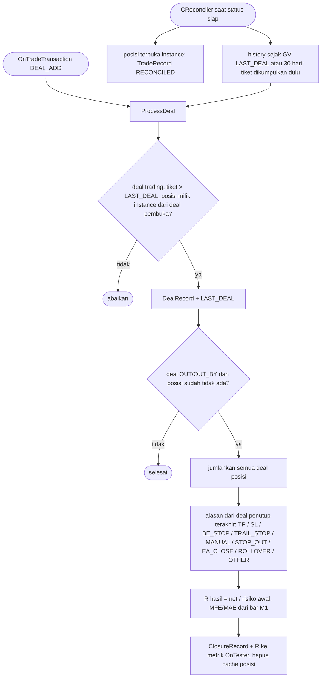

# Deal, closure, dan rekonsiliasi

```mermaid
flowchart TB
    T([OnTradeTransaction DEAL_ADD]) --> P[ProcessDeal]
    RC([CReconciler saat status siap]) --> O[posisi terbuka instance: TradeRecord RECONCILED]
    RC --> H[history sejak GV LAST_DEAL atau 30 hari: tiket dikumpulkan dulu] --> P
    P --> D{deal trading, tiket > LAST_DEAL, posisi milik instance dari deal pembuka?}
    D -->|tidak| Z([abaikan])
    D -->|ya| DR[DealRecord + LAST_DEAL]
    DR --> C{deal OUT/OUT_BY dan posisi sudah tidak ada?}
    C -->|tidak| Z2([selesai])
    C -->|ya| CL[jumlahkan semua deal posisi]
    CL --> RE[alasan dari deal penutup terakhir: TP / SL / BE_STOP / TRAIL_STOP / MANUAL / STOP_OUT / EA_CLOSE / ROLLOVER / OTHER]
    RE --> R[R hasil = net / risiko awal; MFE/MAE dari bar M1]
    R --> CR[ClosureRecord + R ke metrik OnTester, hapus cache posisi]
```

Kepemilikan posisi dari deal pembuka, sehingga posisi yang ditutup close all instance lain tetap dicatat pemiliknya sebagai `EA_CLOSE` (spec 06 EC-15).
