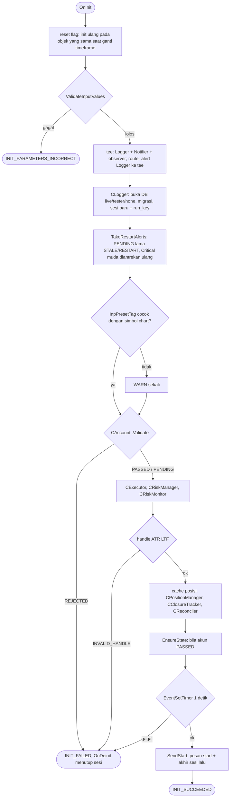
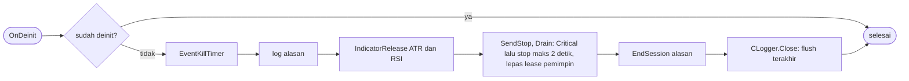

# Init dan deinit

`SDBot.mq5` hanya meneruskan event ke `CSdbApp` (spec 04). Harness uji memakai `CSdbApp` yang sama. Tanpa DB (optimasi) notifier tidak dipasang (spec 08).

Modul sinyal (bila sinyal aktif): struktur, zona, trigger PA, filter berita, lalu handle `iRSI(MTF, 14)` bila `InpScoreRsiMode` bukan OFF (spec 21). Handle RSI yang gagal dibuat hanya menghasilkan WARN; skor RSI menjadi 0 dan EA tetap jalan.

`EnsureState` (juga dicoba ulang dari timer selama akun PENDING): `CState` → `CRiskState` (nilai awal aman) → `CRiskMonitor.OnStateReady` (baseline operasi saldo, `STATE_RESET`, reset emergency, operasi saldo tertunda) → snapshot akun dengan puncak equity → `CReconciler.Run` (posisi terbuka `RECONCILED`, deal yang terlewat).

