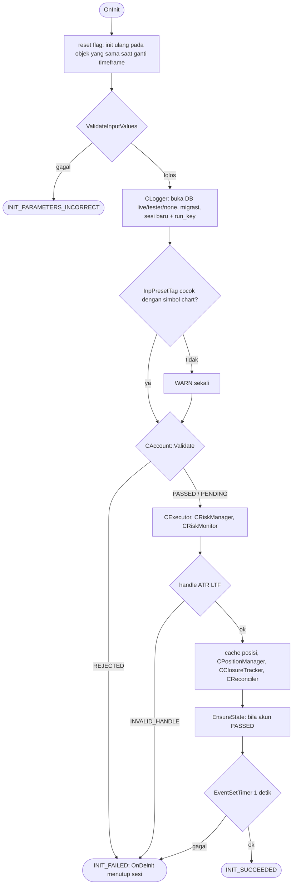
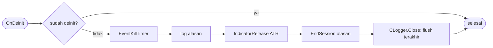

# Init dan deinit

`SDBot.mq5` hanya meneruskan event ke `CSdbApp` (spec 04). Harness uji memakai `CSdbApp` yang sama.

`EnsureState` (juga dicoba ulang dari timer selama akun PENDING): `CState` → `CRiskState` (nilai awal aman) → `CRiskMonitor.OnStateReady` (baseline operasi saldo, `STATE_RESET`, reset emergency, operasi saldo tertunda) → snapshot akun dengan puncak equity → `CReconciler.Run` (posisi terbuka `RECONCILED`, deal yang terlewat).

