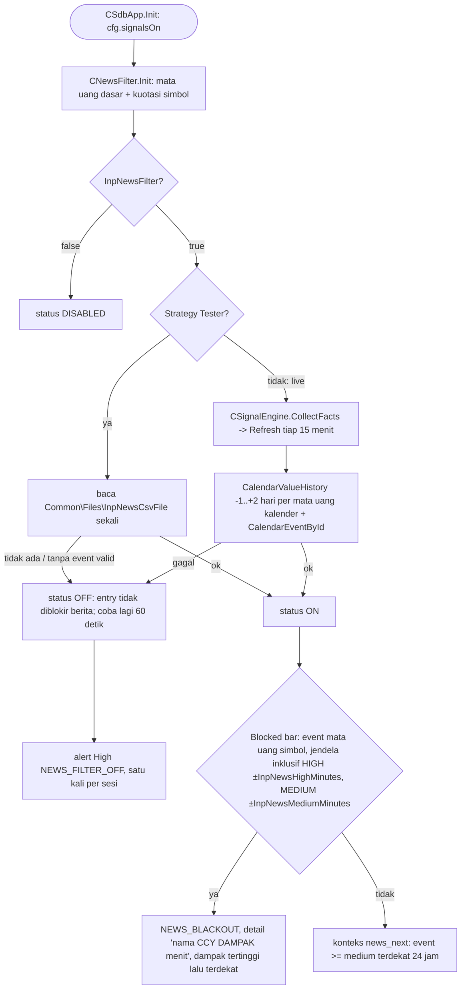

# Filter berita (spec 16)



Mata uang tanpa event kalender (XAU, XAG, BTC) hanya terlindungi lewat kaki USD. Hanya jadwal event yang dipakai, tidak pernah nilai actual, sehingga backtest tanpa lookahead. LOW tidak pernah memblokir.

## Kalender untuk tester

Kalender MT5 tidak tersedia di Strategy Tester. Script `Scripts/SDBot/ExportCalendar.mq5` di terminal yang login menulis `Common\Files\sdbot_calendar.csv` (baris `epoch_server,ccy,impact,event_id,nama`, urut waktu) untuk USD, EUR, GBP, JPY, CHF, AUD, CAD, NZD, dan ringkasan di `sdbot_calendar_status.txt`. Kalender yang belum sinkron (err 5401) ditunggu sampai 120 detik.

```powershell
sdbot\tools\run-ea-tests.ps1 -ExportCalendar             # terminal uji, tutup sendiri setelah selesai
sdbot\tools\run-ea-tests.ps1 -ExportCalendar -Baseline   # ekspor lalu backtest dasar
```
