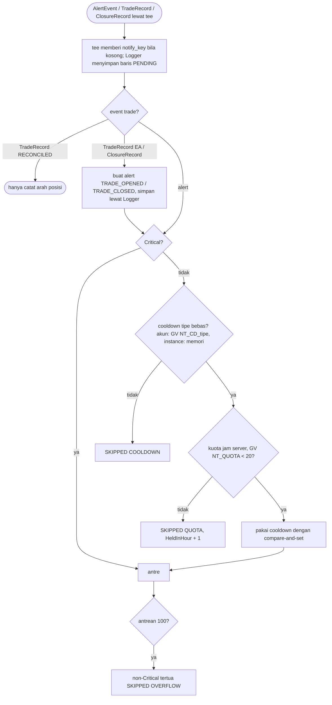
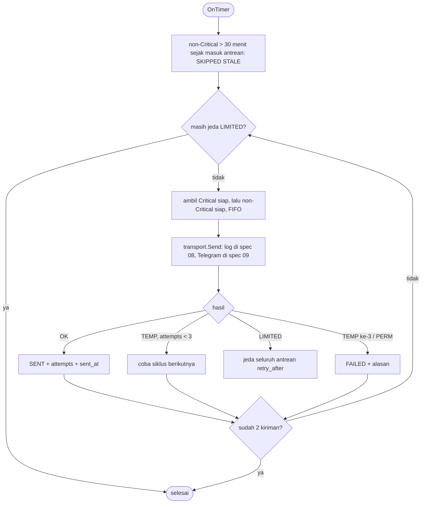
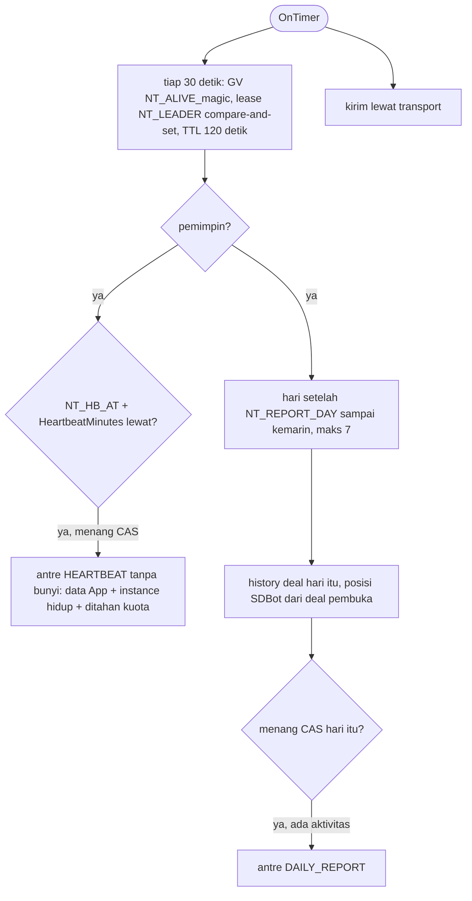
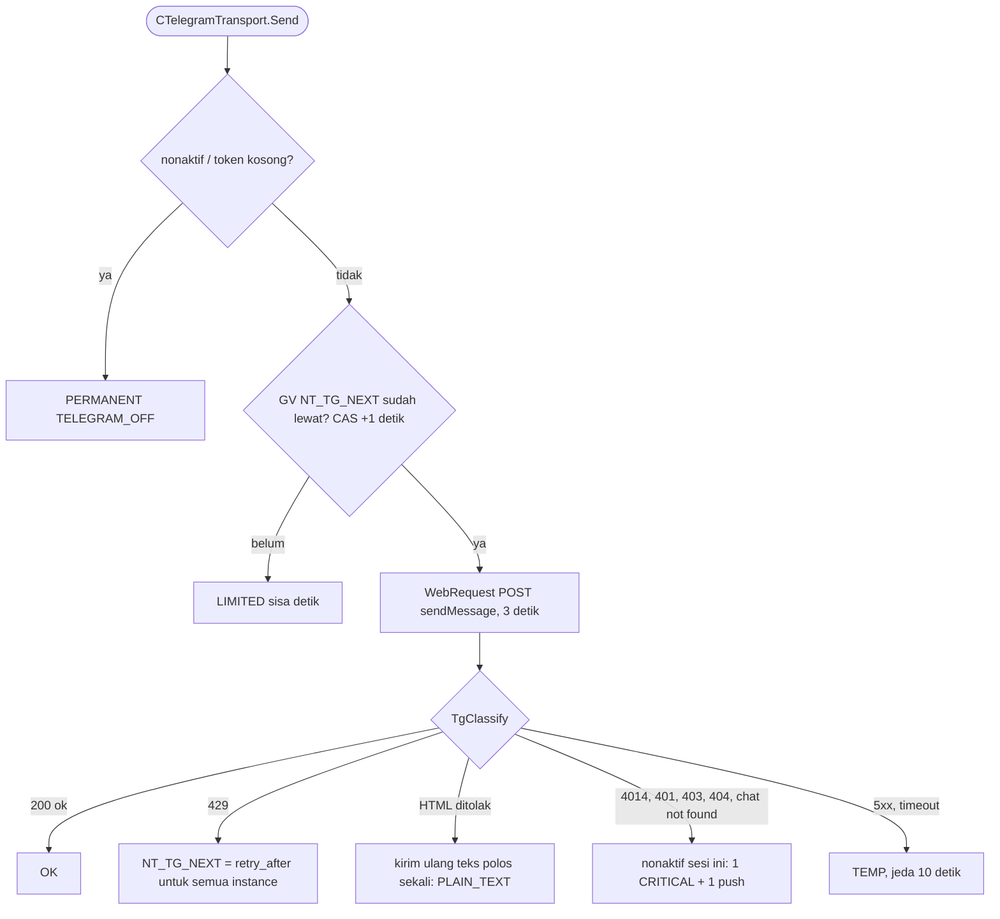

# Notifier

`CNotifier` (lapisan Notify) adalah sink di `CTeeSink` di samping `CLogger`. Event masuk dinilai saat itu juga; pengiriman hanya dari `OnTimer` dan `OnDeinit` (spec 08).

Status (`SENT`, `FAILED`, `SKIPPED` + alasan) dikirim ke `CLogger.OnAlertStatus` dan ditulis di flush yang sama dengan baris alert-nya (UPDATE per `login + notify_key`). Umur pesan dihitung dari waktu masuk antrean menurut waktu notifier (`TimeTradeServer` di live, `TimeCurrent` di tester), karena `TimeCurrent` berhenti saat pasar tutup.

Restart: `CLogger.TakeRestartAlerts` menandai `PENDING` instance dari sesi lalu (> 30 menit `STALE`, non-Critical muda `RESTART`) dan mengembalikan Critical muda untuk `Requeue`. Deinit: `DrainCritical` mengirim Critical tersisa maksimal 3 detik.

## Telegram, push, pesan berjadwal (spec 09)

Critical yang `FAILED` (atau saat Telegram nonaktif) dikirim lewat `SendNotification` sebagai teks polos maks 255 karakter; status `FAILED` + `PUSH_SENT`/`PUSH_FAILED`. Push dibatasi 2/detik dan 10/menit (ditunda, maks 20 di memori).
