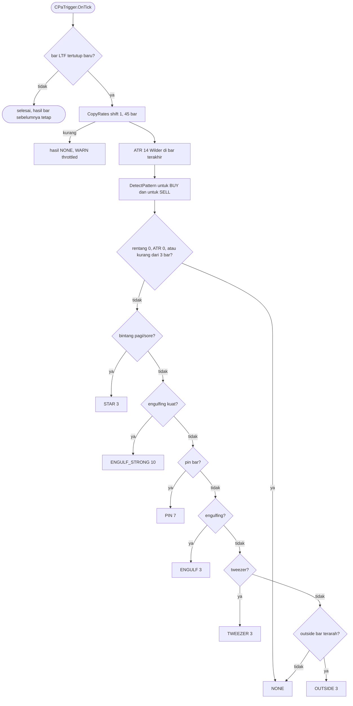

# Trigger price action (spec 12)

Ukuran pola relatif ATR dan rentang bar (konstanta `SDB_PA_*` di `Core/Constants.mqh`), sehingga satu definisi berlaku untuk forex, logam, dan crypto. Pola netral (inside bar, doji, harami) tidak diperiksa sama sekali, jadi tidak bisa mendahului pola terarah. Pipeline (spec 13) memanggil `Result(arah bias)` dan `LastBar` untuk cek sentuhan zona.
