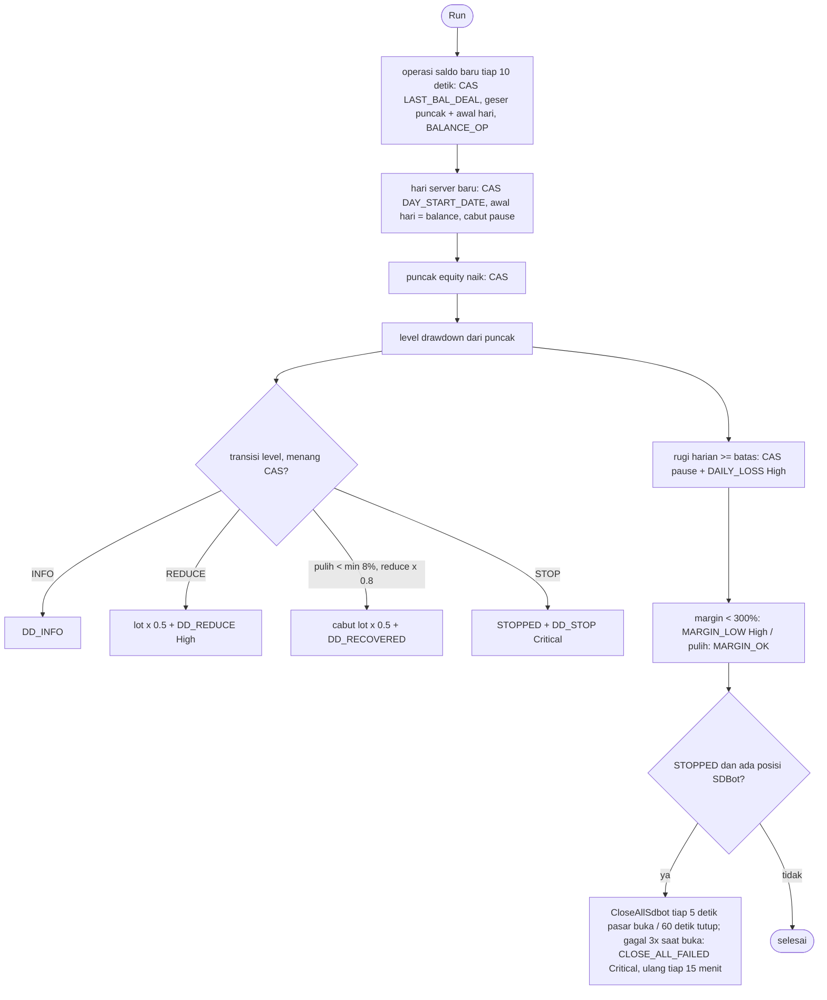

# CRiskMonitor.Run (tiap detik)

```mermaid
flowchart TB
    R([Run]) --> B[operasi saldo baru tiap 10 detik: CAS LAST_BAL_DEAL, geser puncak + awal hari, BALANCE_OP]
    B --> D[hari server baru: CAS DAY_START_DATE, awal hari = balance, cabut pause]
    D --> P[puncak equity naik: CAS]
    P --> L[level drawdown dari puncak]
    L --> L1{transisi level, menang CAS?}
    L1 -->|INFO| A1[DD_INFO]
    L1 -->|REDUCE| A2[lot x 0.5 + DD_REDUCE High]
    L1 -->|pulih < min 8%, reduce x 0.8| A3[cabut lot x 0.5 + DD_RECOVERED]
    L1 -->|STOP| A4[STOPPED + DD_STOP Critical]
    L --> H[rugi harian >= batas: CAS pause + DAILY_LOSS High]
    H --> M[margin < 300%: MARGIN_LOW High / pulih: MARGIN_OK]
    M --> C{STOPPED dan ada posisi SDBot?}
    C -->|ya| CA[CloseAllSdbot tiap 5 detik pasar buka / 60 detik tutup; gagal 3x saat buka: CLOSE_ALL_FAILED Critical, ulang tiap 15 menit]
    C -->|tidak| Z([selesai])
```

STOPPED hanya dibuka lewat `InpResetEmergencyStop` (transisi false -> true per instance). Semua status di Global Variables akun, dibagi semua instance.
