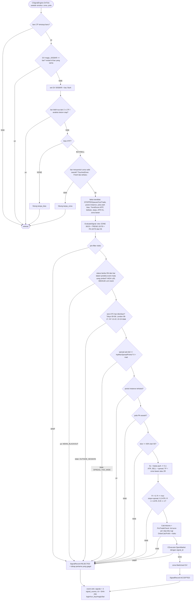

# Pipeline sinyal dan entry (spec 13, filter Fase 4: spec 14–16)

Filter berita (spec 16, [news.md](news.md)) berjalan sebelum sesi dan spread; status OFF atau DISABLED tidak memblokir. Konteks sinyal mencatat `news` (ON/OFF/DISABLED) dan `news_next` (event ≥ medium terdekat dalam 24 jam, atau null).

Satu baris `signals` per kandidat (bar yang menyentuh zona valid searah bias, 4–6 per hari per simbol). Bar tanpa bias atau tanpa zona hanya dihitung dan diringkas di log INFO saat hari server berganti dan saat EA berhenti. ID sinyal dihitung sebelum order sehingga `trades.signal_id` terisi, dan baris yang sama dari restart di bar yang sama ditolak `ON CONFLICT(id) DO NOTHING`. Query kalibrasi: `tools/queries/signal_rejects.sql`, `score_vs_r.sql`, `pattern_vs_r.sql`, `zone_status_vs_r.sql`, `tp_source_vs_r.sql`, `candidates_per_day.sql`.
