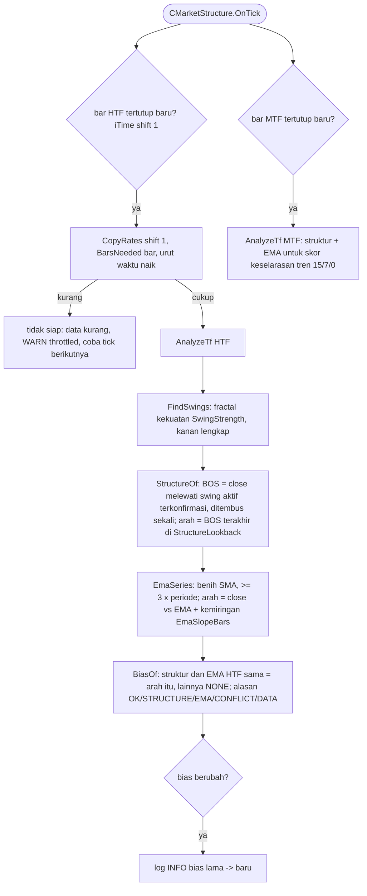

# Analisis struktur (spec 10)

Hanya bar tertutup yang dipakai; hasil sebuah bar hanya bergantung pada bar sampai bar itu. SC-12/SC-12x membuktikan hasil selama run sama dengan hasil dihitung ulang dari histori, termasuk setelah restart.
