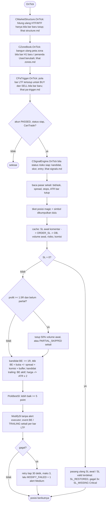

# OnTick: analisis, sinyal, dan manajemen posisi

```mermaid
flowchart TB
    T([OnTick]) --> AN[CMarketStructure.OnTick: hitung ulang HTF/MTF hanya bila bar baru tutup; lihat structure.md]
    AN --> ZN[CZoneBook.OnTick: bangun ulang peta zona bila bar H1 baru / penanda Used berubah; lihat zones.md]
    ZN --> PA[CPaTrigger.OnTick: pola bar LTF tertutup untuk BUY dan SELL bila bar baru; lihat pa-trigger.md]
    PA --> G{akun PASSED, status siap, CanTrade?}
    G -->|tidak| Z([selesai])
    G -->|ya| SG[CSignalEngine.OnTick bila status risiko siap: kandidat, skor, entry; lihat signals.md]
    SG --> M[baca pasar sekali: bid/ask, spread, stops, ATR bar tutup]
    M --> L[tiket posisi magic + simbol dikumpulkan dulu]
    L --> C[cache: SL awal komentar -> ORDER_SL -> DB, volume awal, risiko, komisi]
    C --> S0{SL = 0?}
    S0 -->|ya| RS[pasang ulang SL awal / SL valid terdekat: SL_RESTORED, gagal 3x: SL_MISSING Critical]
    S0 -->|tidak| P{profit >= 1.5R dan belum partial?}
    P -->|ya| PC[tutup 50% volume awal, atau PARTIAL_SKIPPED sekali]
    P -->|tidak| SL
    PC --> SL[kandidat BE: >= 1R, titik BE = buka +/- spread + komisi + buffer; kandidat trailing: BE aktif, harga -/+ ATR x 2]
    SL --> B[PickBestSl: lebih baik >= 5 point]
    B --> MO[ModifySl tanpa alert executor; event BE / TRAILING sekali per bar LTF]
    MO --> F{gagal?}
    F -->|ya| RT[retry tiap 30 detik, maks 3, lalu MODIFY_FAILED + 1 alert Medium]
    F -->|tidak| N([posisi berikutnya])
    RT --> N
    RS --> N
```

BE dan partial disimpulkan dari posisi MT5 (SL >= harga buka, volume < volume awal), jadi restart tidak mengulangnya.
