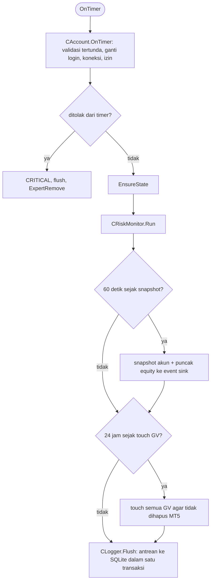

# OnTimer (tiap 1 detik)

```mermaid
flowchart TB
    T([OnTimer]) --> A[CAccount.OnTimer: validasi tertunda, ganti login, koneksi, izin]
    A --> R{ditolak dari timer?}
    R -->|ya| X[CRITICAL, flush, ExpertRemove]
    R -->|tidak| E[EnsureState]
    E --> M[CRiskMonitor.Run]
    M --> S{60 detik sejak snapshot?}
    S -->|ya| SN[snapshot akun + puncak equity ke event sink]
    S -->|tidak| G
    SN --> G{24 jam sejak touch GV?}
    G -->|ya| TG[touch semua GV agar tidak dihapus MT5]
    G -->|tidak| F
    TG --> F[CLogger.Flush: antrean ke SQLite dalam satu transaksi]
```

Risk monitor jalan sebelum snapshot dan flush, terpisah dari logika entry (PRD §Risk management).
