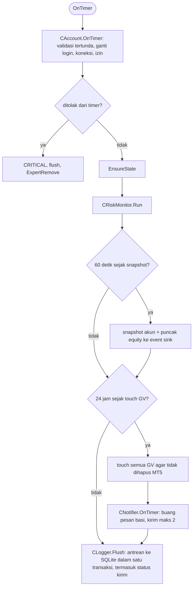

# OnTimer (tiap 1 detik)

Risk monitor jalan sebelum snapshot, notifier, dan flush, terpisah dari logika entry (PRD §Risk management). Notifier juga jalan saat akun belum PASSED, agar alert init terkirim (spec 08). Detail: [notifier.md](notifier.md).
