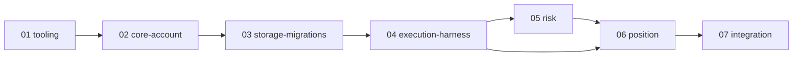

# SDBot specs

Spec-driven development dengan metode Kiro (skill `sdbot-spec`). Setiap spec punya `requirements.md` → `design.md` → `tasks.md`, masing-masing disetujui sebelum lanjut, lalu task dikerjakan satu per satu dengan TDD.

## Fase 1 — Fondasi EA

Ringkasan lingkup, use case, arsitektur bersama, dan strategi uji: [fase-1-overview.md](fase-1-overview.md).

Kerjakan **berurutan**. Spec berikutnya baru dimulai setelah semua task spec sebelumnya selesai dan terverifikasi.

| # | Spec | Isi | Butuh | Bukti selesai | Status |
|---|---|---|---|---|---|
| 1 | [ea-01-tooling](ea-01-tooling/) | Kerangka folder, junction MT5, compile otomatis, framework unit test, runner tester, cek SQLite MT5 | — | `build-ea` dan `run-ea-tests` jalan; self-test framework lulus | Requirements + design draft |
| 2 | [ea-02-core-account](ea-02-core-account/) | Core (tipe, konstanta, input, util, state GV, event sink), validasi akun, koneksi, log terminal | 1 | suite CoreUtils + AccountRules ALL PASS | Requirements + design draft |
| 3 | [ea-03-storage-migrations](ea-03-storage-migrations/) | Skema SQLite baru, migrasi via skrip, file DB live vs tester terpisah, `CLogger` | 2 | pytest `schema.py` + suite Storage ALL PASS | Requirements + design draft |
| 4 | [ea-04-execution-harness](ea-04-execution-harness/) | `CExecutor`, orkestrasi `CSdbApp`, `SDBot.mq5`, harness uji dasar | 2, 3 | suite Execution ALL PASS, SC-06 PASS | Requirements + design draft |
| 5 | [ea-05-risk](ea-05-risk/) | Lot sizing, pre-trade check, drawdown, rugi harian, emergency stop, operasi saldo | 4 | suite RiskMath ALL PASS, SC-02/03/05/07 PASS | Requirements + design draft |
| 6 | [ea-06-position](ea-06-position/) | BE, partial, trailing, deteksi closure, restart aman | 4, 5 | suite PositionMath ALL PASS, SC-01/04 PASS | Requirements + design draft |
| 7 | [ea-07-integration](ea-07-integration/) | Metrik OnTester, preset `.set`, checklist manual, regresi penuh, DoD Fase 1 | 1–6 | semua suite + SC-01..08 PASS, MC Fase 1 dicek | Requirements + design draft |

Urutan ini dipilih agar setiap spec bisa diuji penuh saat selesai: framework uji ada sebelum kode apa pun, event sink dan storage ada sebelum modul yang menulis log, dan harness ada sebelum modul yang butuh posisi sungguhan (risk, position).

Pelajaran dari bot Python yang memengaruhi spec ini: [python-bot-lessons.md](python-bot-lessons.md).

## Fase berikutnya

Spec detail (requirements, design, tasks) dibuat saat fase sebelumnya selesai. Catatan awal di bawah memastikan hal penting dari PRD dan dari bot Python tidak hilang, dan Fase 1 sudah menyiapkan tempatnya.

### Fase 2 — Notifikasi (spec `ea-08-notifier-telegram`)

Isi PRD: `CNotifier` satu pintu, Telegram lewat `WebRequest` dari antrean di `OnTimer` (tidak pernah di tengah proses order), push HP (`SendNotification`) bila Telegram gagal 3x untuk Critical, heartbeat tiap 60 menit, HTML mode, kuota non-Critical 20/jam, pesan non-Critical > 30 menit dibuang, Critical tanpa limit, cooldown per tipe, token dan chat ID hanya di input.

Disiapkan di Fase 1: tabel `alerts` dengan status `PENDING`/`SENT`/`FAILED`/`SKIPPED`, `attempts`, `sent_at` (spec 03); semua modul sudah mengirim `AlertEvent` lewat event sink (spec 02).

Edge case yang wajib masuk requirements:
- URL `https://api.telegram.org` belum diizinkan di MT5 (`WebRequest` error 4014): alert sekali lewat push HP + log CRITICAL, bukan diulang tiap detik.
- Token salah (HTTP 401) atau chat ID salah (400 "chat not found"): error permanen, jangan retry, beri tahu lewat push HP sekali.
- HTTP 429 dari Telegram: patuhi `retry_after` dari respons.
- Pesan > 4096 karakter: dipotong dengan penanda.
- Karakter `& < >` di pesan: di-escape (pelajaran bot Python).
- `WebRequest` blocking hingga timeout 3 detik: maksimal N pesan per siklus timer agar timer tidak tertahan.
- Empat instance di satu akun: heartbeat dan laporan harian cukup satu per akun (pemilihan instance via Global Variable), trade event tetap per instance.
- Strategy Tester: tidak ada `WebRequest`, pesan hanya dicetak ke log (PRD).
- Restart EA: pesan `PENDING` di DB yang lebih tua dari 30 menit ditandai `SKIPPED`, bukan dikirim terlambat.
- Mode ditandai di setiap pesan (akun cent/real, versi EA) agar pesan dari akun uji tidak tertukar.

### Fase 3 — Strategi inti (spec `ea-09`–`ea-11`: analisis MTF + zona, trigger PA, sinyal + entry)

Isi PRD: bias HTF sebagai gerbang wajib, zona S&D dari Fractals berjeda di MTF (Fresh/Tested/Invalid/Used, maks 100 bar, satu zona satu entry), trigger PA di LTF, skor 100 poin, entry market (default) atau limit, TP ke zona lawan lalu cek R:R ≥ 2.

Pelajaran bot Python yang wajib jadi requirement: skor dan alasan tolak setiap kandidat tercatat (kalibrasi ambang 65 dari data, bukan asumsi); urutan detektor pola dari yang spesifik ke netral; setiap komponen skor punya uji yang membuktikan ia terpanggil di pipeline; `trades.signal_id` selalu terisi.

### Fase 4 — Filter (spec `ea-12-filters-news`)

Isi PRD: filter berita memakai kalender bawaan MT5 (`CalendarValueHistory`) ±30 menit berita high impact; di Strategy Tester memakai CSV kalender historis di Common/Files (dibuat script `ExportCalendar`); filter sesi London + New York; filter spread per simbol; eksposur maks 2 posisi searah per mata uang.

Pelajaran dari spec news bot Python yang wajib masuk:
- Blackout per tingkat dampak (high ±30 menit, medium ±10 menit, low tidak diblokir), dapat diatur lewat input.
- Pemetaan mata uang ke pair: EURUSD → EUR, USD; EURJPY → EUR, JPY; event salah satu mata uang memblokir pair itu.
- **Degrade aman tetapi terlihat**: jika kalender tidak bisa dibaca (terminal belum sinkron, CSV tidak ada di tester), entry tidak diblokir **dan** alert "proteksi berita OFF" dikirim sekali, bukan diam-diam.
- Waktu event dikonversi dengan benar: kalender MT5 memakai waktu server; CSV tester harus memakai zona waktu yang sama dengan data tester.
- **Tanpa lookahead**: di backtest hanya event dengan waktu ≤ waktu bar yang boleh dipakai, dan nilai `actual` baru ada setelah rilis.
- Telemetri: sinyal yang ditolak dicatat `NEWS_BLACKOUT` dengan nama event dan menit ke/dari rilis; trade yang lolos menyimpan event terdekat.
- Eksposur mata uang dihitung **dengan arah** (BUY EURUSD = long EUR + short USD, SELL kebalikannya), dengan test case pair JPY (bug bot Python).
- Modifier kepercayaan dari hasil rilis (surprise) di luar lingkup sampai blackout terbukti (sama dengan urutan bot Python).

### Fase 5–7 dan backoffice

Fase 5 konfirmasi (Fibonacci, trendline, breakout-retest, RSI, satu per satu dengan pelajaran bug di `python-bot-lessons.md`), Fase 6 validasi (forward test + akun cent 1–3 bulan), backoffice B1–B6 mengikuti PRD Backoffice. Spec dibuat saat gilirannya.

## Status gate

`Draft` → `Approved (tanggal)` per dokumen. `tasks.md` baru dibuat setelah requirements dan design spec itu disetujui. Spec dianggap `Done` setelah semua task dicentang dan bukti selesai di tabel terpenuhi.
