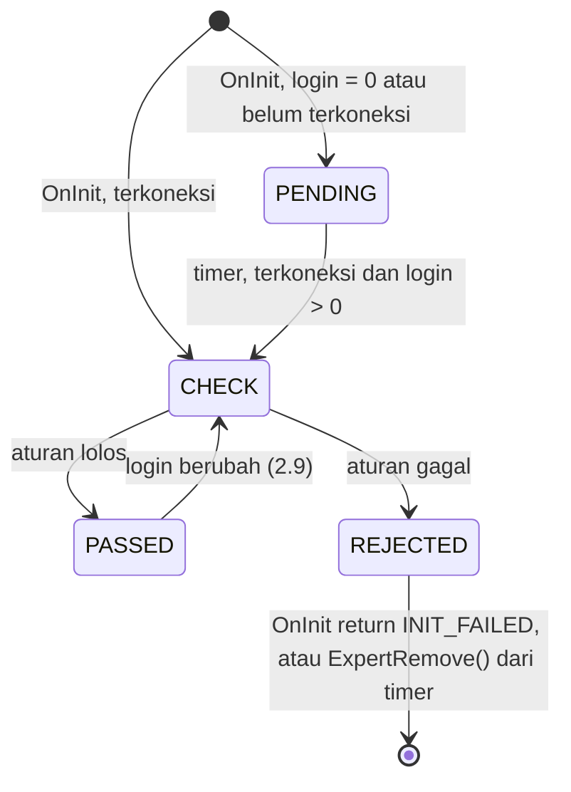

# Design — 02 Core dan akun

Status: Draft
Requirements: [requirements.md](requirements.md)

## 1. Overview

Core berisi hal yang dipakai semua lapisan dan tidak memanggil modul lain. Account membungkus status terminal dan akun, dengan aturan keputusan dipisah ke fungsi murni agar semua kombinasi (demo, real, cent, netting, suffix salah) bisa diuji tanpa akun sungguhan.

Validasi akun berjalan sebagai state machine kecil karena di MT5 EA sering di-init sebelum terminal selesai login (EC-01).

## 2. File

```
Include/SDBot/Core/Types.mqh        enum dan struct (§4.1, §4.2)
Include/SDBot/Core/Constants.mqh    konstanta PRD (§4.4)
Include/SDBot/Core/Inputs.mqh       input Fase 1 (§4.3)
Include/SDBot/Core/Utils.mqh        log, throttle, util murni
Include/SDBot/Core/InputRules.mqh   ValidateInputValues() [murni]
Include/SDBot/Core/State.mqh        CState (Global Variables)
Include/SDBot/Core/EventSink.mqh    ISdbEventSink, CNullSink
Include/SDBot/Account/AccountRules.mqh  aturan akun [murni]
Include/SDBot/Account/Account.mqh   CAccount
tests/Include/SDBotTests/FakeSink.mqh
tests/Include/SDBotTests/Suites/TestCoreUtils.mqh, TestAccountRules.mqh, TestState.mqh, TestLog.mqh
```

## 3. Komponen

### 3.1 `InputRules.mqh` [murni]

```cpp
struct InputValues { double riskPerTradePct, maxOpenRiskPct, dailyLossPct, ddReducePct, ddStopPct,
                     breakevenR, partialR, partialPct, trailAtrMult; int breakevenBufferPoints,
                     trailAtrPeriod; long magic; };
bool ValidateInputValues(const InputValues &v, string &errors);   // semua kesalahan digabung "; "
InputValues CurrentInputs();                                       // salin dari Inp* (tidak murni, 1 baris per field)
```

Fungsi dipisah dari `input` global agar bisa diuji dengan nilai apa pun (1.2–1.4).

### 3.2 `Utils.mqh`

```cpp
void   SdbSetLogLevel(ENUM_SDB_LOG_LEVEL lvl);
void   LogDebug(string module, string msg);  // + LogInfo, LogWarn, LogError, LogCritical
void   LogThrottled(ENUM_SDB_LOG_LEVEL lvl, string key, int intervalSec, string module, string msg);
string FormatLogLine(ENUM_SDB_LOG_LEVEL lvl, string module, string symbol, string msg); // [murni]
bool   ThrottleAllow(string key, datetime now, int intervalSec, int &suppressed);        // [murni atas tabel internal]
double NormalizePriceTo(double price, int digits);                                      // [murni]
void   StyleTimeframes(ENUM_SDB_TRADING_STYLE s, ENUM_TIMEFRAMES &htf, ENUM_TIMEFRAMES &mtf, ENUM_TIMEFRAMES &ltf); // [murni]
string ErrText(int code);                                                               // "err=4756"
```

Simbol di baris log diambil dari `_Symbol`. Tabel throttle berukuran tetap (64 kunci, LRU) agar tidak tumbuh tanpa batas. Pesan yang ditahan dicatat sebagai `(+N ditahan)` pada cetakan berikutnya (5.4).

### 3.3 `State.mqh`, `CState`

```cpp
bool     Init(string prefix, long login);        // prefix "SDB" (live) atau "SDBTEST" (unit test)
string   Key(string name);                        // "<prefix>_<login>_<name>"
double   GetOrInit(string name, double safeDefault, bool &wasMissing);
void     Set(string name, double v, bool flush); // flush = GlobalVariablesFlush()
void     TouchAll();                              // GlobalVariableGet semua kunci, dipanggil sekali per hari (4.4)
void     DeleteAll();                             // hanya untuk unit test
```

Akses bertipe (`PeakEquity()`, `IsStopped()`, dst.) ditambahkan oleh spec yang memakainya (spec 05). Nilai awal aman ada di §4.5.

### 3.4 `AccountRules.mqh` [murni]

```cpp
ENUM_SDB_ACCOUNT_TYPE AccountTypeOf(ENUM_ACCOUNT_TRADE_MODE mode, string currency);
bool EvaluateAccount(ENUM_ACCOUNT_TRADE_MODE mode, ENUM_ACCOUNT_MARGIN_MODE margin,
                     bool allowLive, string &reason);                               // 2.2, 2.3
bool SymbolMatchesSuffix(string symbol, string suffix);                             // 2.4
bool TradePermission(bool connected, bool terminalTrade, bool mqlTrade, bool accTrade,
                     bool accExpert, ENUM_SYMBOL_TRADE_MODE symMode, string &why);  // 3.1
ENUM_SDB_CONN_ACTION ConnectionStep(bool connected, datetime now, datetime &downSince,
                                    datetime &lastAlert, bool &alerted);            // 3.3–3.5
```

`ConnectionStep` mengembalikan `NONE`, `LOG_DOWN`, `ALERT_MEDIUM`, atau `ALERT_RECOVERED`. Seluruh logika waktu koneksi ada di sini sehingga EC-04 bisa diuji dengan waktu buatan.

### 3.5 `Account.mqh`, `CAccount`

```cpp
bool   Init(ISdbEventSink *sink);
ENUM_SDB_VALIDATION Validate();   // PASSED | PENDING | REJECTED, dipanggil di OnInit dan tiap timer selama PENDING
bool   CanTrade(string &why);     // 3.1–3.2, hasil di-cache per siklus timer
void   OnTimer();                 // koneksi, izin, validasi tertunda, ganti akun (2.9)
AccountSnapshot Snapshot();
long   Login();
```

State machine validasi:



Di `OnInit`, `REJECTED` langsung mengembalikan `INIT_FAILED`. Dari timer (validasi tertunda), `REJECTED` memanggil `ExpertRemove()` (2.8).

### 3.6 `EventSink.mqh`

```cpp
interface ISdbEventSink
  {
   void OnAccount(const AccountSnapshot &a);
   void OnTradeOpened(const TradeRecord &t);            // spec 04
   void OnDeal(const DealRecord &d);                    // spec 06
   void OnPositionEvent(const PositionEvent &e);        // spec 06
   void OnClosure(const ClosureRecord &c);              // spec 06
   void OnBalanceOp(const BalanceOpRecord &b);          // spec 05
   void OnAlert(const AlertEvent &a);
   bool FindInitialSl(long login, ulong positionId, double &sl);  // spec 06, cadangan terakhir
  };
class CNullSink : public ISdbEventSink { /* semua no-op, FindInitialSl = false */ };
```

`CFakeSink` (di tests) menyimpan setiap event dalam array per jenis, dengan `Count<Jenis>()` dan `Last<Jenis>()`.

## 4. Data models

### 4.1 Enum

| Enum | Nilai |
|---|---|
| `ENUM_SDB_LOG_LEVEL` | `SDB_LOG_DEBUG`, `SDB_LOG_INFO`, `SDB_LOG_WARN`, `SDB_LOG_ERROR`, `SDB_LOG_CRITICAL` |
| `ENUM_SDB_SEVERITY` | `SDB_SEV_INFO`, `SDB_SEV_MEDIUM`, `SDB_SEV_HIGH`, `SDB_SEV_CRITICAL` |
| `ENUM_SDB_TRADING_STYLE` | `SDB_STYLE_SCALPING`, `SDB_STYLE_DAY`, `SDB_STYLE_SWING`, `SDB_STYLE_POSITION` |
| `ENUM_SDB_ACCOUNT_TYPE` | `SDB_ACC_DEMO`, `SDB_ACC_REAL`, `SDB_ACC_CENT` |
| `ENUM_SDB_VALIDATION` | `SDB_VAL_PASSED`, `SDB_VAL_PENDING`, `SDB_VAL_REJECTED` |
| `ENUM_SDB_CONN_ACTION` | `SDB_CONN_NONE`, `SDB_CONN_LOG_DOWN`, `SDB_CONN_ALERT_MEDIUM`, `SDB_CONN_ALERT_RECOVERED` |

Enum untuk event posisi, alasan tutup, dan level drawdown ditambahkan spec 04–06.

### 4.2 Struct event (field lengkap mengikuti skema spec 03)

`AccountSnapshot`, `TradeRecord`, `DealRecord`, `PositionEvent`, `ClosureRecord`, `BalanceOpRecord`, `AlertEvent`. Spec ini mendefinisikan `AccountSnapshot` dan `AlertEvent` lengkap. Struct lain didefinisikan kosong-minimal agar interface compile, lalu dilengkapi spec pemakainya.

`AlertEvent`: `type` (kode stabil, misalnya `ACCOUNT_REJECTED`, `CONN_DOWN`, `CONN_UP`), `severity`, `message`, `symbol`, `magic`, `time`.

### 4.3 Input Fase 1 dan batasnya

| Input | Default | Batas |
|---|---|---|
| `InpMagicNumber` | 20260919 | > 0 (blok magic mengikuti keputusan R2-1 di spec 05) |
| `InpTradingStyle` | `SDB_STYLE_DAY` | — |
| `InpSymbolSuffix` | `""` | — |
| `InpAllowLiveTrading` | `false` | — |
| `InpRiskPerTradePct` | 0.5 | 0 < x ≤ 1.0 |
| `InpMaxOpenRiskPct` | 3.0 | risk per trade ≤ x ≤ 10 |
| `InpDailyLossPct` | 3.0 | 0 < x ≤ 10 |
| `InpDDReducePct` | 10 | 0 < x < DDStop |
| `InpDDStopPct` | 15 | DDReduce < x ≤ 50 |
| `InpResetEmergencyStop` | `false` | — |
| `InpBreakevenR` | 1.0 | 0 < x < PartialR |
| `InpBreakevenBufferPoints` | 2 | 0 ≤ x ≤ 1000 |
| `InpPartialR` | 1.5 | BreakevenR < x ≤ 10 |
| `InpPartialPct` | 50 | 0 < x < 100 |
| `InpTrailATRPeriod` | 14 | 2 ≤ x ≤ 200 |
| `InpTrailATRMult` | 2.0 | 0 < x ≤ 10 |
| `InpLogLevel` | `SDB_LOG_INFO` | — |

Semua input dideklarasikan di spec ini agar batas antar-input bisa divalidasi sekaligus, walau baru dipakai spec 05–06.

### 4.4 Konstanta

`SDB_TIMER_SEC` 1 · `SDB_DISCONNECT_ALERT_SEC` 300 · `SDB_CONN_ALERT_REPEAT_SEC` 300 · `SDB_LOG_THROTTLE_DEFAULT_SEC` 60 · `SDB_LOG_THROTTLE_SLOTS` 64 · `SDB_CENT_CURRENCIES` "USC,EUC" · `SDB_GV_PREFIX` "SDB" · `SDB_GV_TOUCH_SEC` 86400. Spec lain menambah konstantanya sendiri.

### 4.5 Global Variables (nilai awal aman)

| Nama | Nilai awal jika tidak ada | Dipakai |
|---|---|---|
| `SDB_<login>_PEAK_EQUITY` | equity saat ini | spec 05 |
| `SDB_<login>_STOPPED` | 0 | spec 05 |
| `SDB_<login>_DAILY_PAUSE` | 0 | spec 05 |
| `SDB_<login>_LOT_REDUCED` | 0 | spec 05 |
| `SDB_<login>_DAY_START_BAL` | balance saat ini | spec 05 |
| `SDB_<login>_DAY_START_DATE` | tanggal hari server saat ini | spec 05 |
| `SDB_<login>_LAST_BAL_DEAL` | tiket deal operasi saldo terbaru saat ini (operasi lama tidak diproses ulang) | spec 05 |

Jika `PEAK_EQUITY` tidak ada tetapi akun punya riwayat, EA mencatat WARN (EC-07): puncak lama tidak diketahui, drawdown mulai dihitung dari sekarang.

## 5. Error handling

| Kegagalan | Tindakan | Log / alert |
|---|---|---|
| Input salah | `INIT_PARAMETERS_INCORRECT` | CRITICAL dengan semua kesalahan |
| Akun ditolak saat init | `INIT_FAILED` | CRITICAL + alert Critical `ACCOUNT_REJECTED` |
| Akun ditolak saat validasi tertunda | `ExpertRemove()` | sama |
| `SymbolSelect` gagal | tolak | CRITICAL + kode error |
| `GlobalVariableSet` gagal | coba lagi di siklus berikutnya | ERROR + kode error (throttled) |
| `GlobalVariablesFlush` gagal | lanjut, coba lagi saat perubahan berikutnya | ERROR |

## 6. Test case

**TestCoreUtils**

| ID | Fungsi | Input | Harapan | Req |
|---|---|---|---|---|
| TC-CU-01 | `ValidateInputValues` | semua default | lolos | 1.2 |
| TC-CU-02 | sama | risk per trade 1.5 | gagal, menyebut `InpRiskPerTradePct` dan `≤ 1.0` | 1.3 |
| TC-CU-03 | sama | risk per trade 0 | gagal | 1.3 |
| TC-CU-04 | sama | risk 0.5, max open 0.3 | gagal, hubungan antar-input | 1.4 |
| TC-CU-05 | sama | BE R 1.5, partial R 1.5 | gagal | 1.4 |
| TC-CU-06 | sama | DD reduce 15, DD stop 10 | gagal | 1.4 |
| TC-CU-07 | sama | partial pct 100 | gagal | 1.2 |
| TC-CU-08 | sama | magic 0 dan risk 2 sekaligus | gagal, pesan menyebut keduanya | 1.3 |
| TC-CU-09 | `FormatLogLine` | WARN, Filters, EURUSDc, "x \| a=1" | `[SDB][WARN][Filters][EURUSDc] x \| a=1` | 5.1 |
| TC-CU-10 | `ThrottleAllow` | kunci sama 5x dalam 10 detik, interval 60 | true, false ×4 | 5.4 |
| TC-CU-11 | `ThrottleAllow` | kunci sama di detik 61 | true, suppressed = 4 | 5.4 |
| TC-CU-12 | `ThrottleAllow` | 65 kunci berbeda | kunci tertua tergusur, tidak error | 5.4 |
| TC-CU-13 | `NormalizePriceTo` | 1.082345, 5 digit | 1.08235 (pembulatan terdekat) | — |
| TC-CU-14 | `StyleTimeframes` | DAY | H4, H1, M15 | 7.1 |
| TC-CU-15 | `StyleTimeframes` | SCALPING, SWING, POSITION | sesuai tabel PRD | 7.1 |

**TestAccountRules**

| ID | Fungsi | Input | Harapan | Req |
|---|---|---|---|---|
| TC-AC-01 | `EvaluateAccount` | demo, hedging, allowLive false | lolos | 2.2 |
| TC-AC-02 | sama | real, hedging, allowLive false | tolak, menyebut `InpAllowLiveTrading` | 2.2 |
| TC-AC-03 | sama | real, hedging, allowLive true | lolos | 2.2 |
| TC-AC-04 | sama | real, netting, allowLive true | tolak, menyebut `NETTING` | 2.3 |
| TC-AC-05 | sama | demo, exchange | tolak | 2.3 |
| TC-AC-06 | `AccountTypeOf` | real + USC | CENT | 2.10 |
| TC-AC-07 | sama | real + USD | REAL | 2.10 |
| TC-AC-08 | sama | demo + USC | DEMO | 2.10 |
| TC-AC-09 | `SymbolMatchesSuffix` | EURUSDc, "c" | true | 2.4 |
| TC-AC-10 | sama | EURUSD, "c" | false | 2.4 |
| TC-AC-11 | sama | EURUSDc, "" | true | 2.4 |
| TC-AC-12 | sama | EURUSD.pro, ".pro" | true | 2.4 |
| TC-AC-13 | `TradePermission` | semua true, mode FULL | true | 3.1 |
| TC-AC-14 | sama | mqlTrade false | false, `why` menyebut izin EA | 3.6 |
| TC-AC-15 | sama | mode CLOSEONLY | false, menyebut simbol | 3.6 |
| TC-AC-16 | `ConnectionStep` | putus di t=0, cek t=299 | LOG_DOWN lalu NONE, tanpa alert | 3.4 |
| TC-AC-17 | sama | putus t=0, cek t=300 | ALERT_MEDIUM | 3.3 |
| TC-AC-18 | sama | masih putus t=450 | NONE (belum 5 menit sejak alert) | 3.3 |
| TC-AC-19 | sama | masih putus t=600 | ALERT_MEDIUM | 3.3 |
| TC-AC-20 | sama | pulih setelah alert | ALERT_RECOVERED sekali | 3.5 |
| TC-AC-21 | sama | putus-sambung tiap 120 detik × 10 | tidak ada ALERT_MEDIUM | EC-04 |

**TestState** (prefix `SDBTEST`, dihapus di awal dan akhir suite)

| ID | Kasus | Harapan | Req |
|---|---|---|---|
| TC-ST-01 | `Key("STOPPED")`, login 123 | `SDBTEST_123_STOPPED` | 4.1 |
| TC-ST-02 | `GetOrInit` kunci baru, default 0 | 0, `wasMissing = true`, GV sekarang ada | 4.2 |
| TC-ST-03 | `GetOrInit` kunci yang sudah 1 | 1, `wasMissing = false` | 4.2 |
| TC-ST-04 | `Set` lalu instance `CState` kedua membaca | nilai sama (simulasi instance lain) | 4.1 |
| TC-ST-05 | `DeleteAll` | tidak ada GV berprefix `SDBTEST_123_` tersisa | 4.5 |

**TestLog**

| ID | Kasus | Harapan | Req |
|---|---|---|---|
| TC-LG-01 | level INFO, `LogDebug` dipanggil | tidak tercetak (cek lewat hook uji) | 5.2 |
| TC-LG-02 | `CFakeSink` menerima `OnAlert` dari `CAccount` palsu | 1 alert, severity dan type sesuai | 6.3 |
| TC-LG-03 | Modul diberi sink `NULL` | memakai `CNullSink`, tidak crash | 6.4 |

**Manual (terminal live)**

| ID | Langkah | Harapan | Req |
|---|---|---|---|
| MC-01 | Pasang EA di akun cent dengan `InpAllowLiveTrading = false` | gagal init, CRITICAL | 2.2 |
| MC-02 | Pasang di chart EURUSDc dengan `.set` benar | init sukses, log INFO snapshot akun | 2.10 |
| MC-03 | Tutup MT5 dengan EA terpasang, buka lagi | validasi tertunda lalu lolos setelah terkoneksi | 2.6, EC-01 |
| MC-04 | Matikan tombol Algo Trading 1 menit | satu WARN "izin EA mati", satu INFO saat hidup lagi | 3.6 |
| MC-05 | Cabut jaringan 6 menit | WARN, lalu alert Medium di menit ke-5, Info saat pulih | 3.3–3.5 |

## 7. Traceability

| Requirement | Komponen | Uji |
|---|---|---|
| 1 | `Inputs.mqh`, `InputRules.mqh` | TC-CU-01..08 |
| 2 | `AccountRules.mqh`, `CAccount` | TC-AC-01..12, MC-01..03 |
| 3 | `TradePermission`, `ConnectionStep`, `CAccount::OnTimer` | TC-AC-13..21, MC-04, MC-05 |
| 4 | `CState` | TC-ST-01..05 |
| 5 | `Utils.mqh` | TC-CU-09..12, TC-LG-01 |
| 6 | `EventSink.mqh`, `FakeSink.mqh` | TC-LG-02..03 |
| 7 | `StyleTimeframes` | TC-CU-14..15 |
