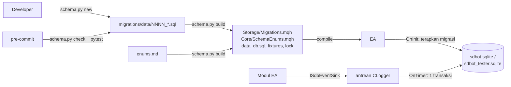

# Design — 03 Storage dan migrasi skema

Status: Draft
Requirements: [requirements.md](requirements.md)

## 1. Overview



- MQL5 tidak bisa membaca file repo saat berjalan (sandbox file MT5), jadi migrasi **dibawa di dalam EA** sebagai kode hasil generate, lalu diterapkan EA sendiri. Tidak ada langkah manual di MT5 atau DB.
- Skrip `sdbot/tools/schema.py` memakai Python standar (`sqlite3`, `hashlib`, `argparse`), tanpa dependensi, dan diuji dengan pytest.
- Semua tulis event lewat antrean dan satu transaksi per detik di `OnTimer` (Req 3), setelah risk monitor berjalan, sehingga kunci DB tidak pernah menahan `OnTick` atau pengiriman order.

## 2. Perubahan dari skema PRD

| Skema PRD | Skema v1 | Alasan |
|---|---|---|
| `schema_version` | `schema_migrations` (riwayat per migrasi + checksum) | Req 4, tahu migrasi mana yang sudah diterapkan dan oleh versi EA mana |
| — | `sessions` | Hasil per versi EA dan per setelan input (pelajaran `config_hash` bot Python); pemisah tester |
| `signals` dengan 7 kolom skor | `signals` + `signal_scores` | Komponen konfirmasi ditambah satu per satu (PRD Fase 5) tanpa migrasi |
| `trades.ticket` | `trades.position_id` + `UNIQUE(login, position_id)` | ID posisi MT5 konsisten di semua tabel; insert idempoten |
| — | `deals` | Partial close dan setiap eksekusi tercatat; sumber rekonsiliasi dan audit volume (bug partial bot Python) |
| `closures.alasan` (SL/TP/manual/stop out) | + `BE_STOP`, `TRAIL_STOP`, `EA_CLOSE`, `ROLLOVER`, `OTHER`; + `mfe_r`, `mae_r`, `holding_sec`, flag BE/partial/trailing | Mengukur kebocoran BE dan membedakan "entry salah" vs "exit buruk" |
| — | `balance_ops` | Jejak deposit/penarikan (spec 05) dan agar statistik tidak menganggapnya profit |
| `alerts.status kirim` | + `attempts`, `sent_at`, `session_id`, `magic`, `symbol` | Kebutuhan Notifier Fase 2 |
| Waktu tanpa zona | Semua UTC epoch + `accounts.server_utc_offset_sec` | PRD Backoffice mensyaratkan UTC; waktu MT5 adalah waktu server |
| Satu file untuk live dan backtest | `sdbot.sqlite` + `sdbot_tester.sqlite` | Data backtest tidak mencemari live |

PRD-EA §Data, PRD-Backoffice §Database, dan RULES §Kontrak lintas bagian perlu diperbarui mengikuti tabel ini setelah design disetujui (lihat §9).

## 3. Skema versi 1 (`0001_initial.sql`)

Tanpa foreign key: DB adalah log dan tidak boleh menolak baris karena baris induknya belum ada (misalnya closure dari rekonsiliasi saat trade tidak tercatat). Keterkaitan dijaga lewat `UNIQUE` dan uji.

```sql
CREATE TABLE sessions (
  id              INTEGER PRIMARY KEY,
  login           INTEGER NOT NULL,
  magic           INTEGER NOT NULL,
  symbol          TEXT    NOT NULL,
  mode            TEXT    NOT NULL CHECK (mode IN ('LIVE','TESTER')),
  ea_version      TEXT    NOT NULL,
  input_hash      TEXT    NOT NULL,
  inputs_json     TEXT    NOT NULL,
  started_at      INTEGER NOT NULL,
  ended_at        INTEGER,
  end_reason      TEXT,
  tester_from     INTEGER,
  tester_to       INTEGER,
  tester_model    TEXT
);
CREATE INDEX ix_sessions_login_started ON sessions (login, started_at);

CREATE TABLE accounts (
  login                 INTEGER PRIMARY KEY,
  server                TEXT    NOT NULL,
  company               TEXT    NOT NULL,
  account_type          TEXT    NOT NULL CHECK (account_type IN ('DEMO','REAL','CENT')),
  margin_mode           TEXT    NOT NULL CHECK (margin_mode IN ('HEDGING','NETTING','EXCHANGE')),
  currency              TEXT    NOT NULL,
  leverage              INTEGER NOT NULL,
  balance               REAL    NOT NULL,
  equity                REAL    NOT NULL,
  peak_equity           REAL    NOT NULL,
  server_utc_offset_sec INTEGER NOT NULL,
  updated_at            INTEGER NOT NULL
);

CREATE TABLE signals (
  id             INTEGER PRIMARY KEY,
  session_id     INTEGER NOT NULL,
  login          INTEGER NOT NULL,
  magic          INTEGER NOT NULL,
  symbol         TEXT    NOT NULL,
  time           INTEGER NOT NULL,
  direction      TEXT    NOT NULL CHECK (direction IN ('BUY','SELL')),
  style          TEXT    NOT NULL CHECK (style IN ('SCALPING','DAY','SWING','POSITION')),
  zone_ref       TEXT,
  score_total    REAL,
  spread_points  INTEGER NOT NULL,
  status         TEXT    NOT NULL CHECK (status IN ('ACCEPTED','REJECTED')),
  reject_stage   TEXT,
  reject_detail  TEXT,
  context_json   TEXT
);
CREATE INDEX ix_signals_login_time ON signals (login, time);
CREATE INDEX ix_signals_stage      ON signals (reject_stage, time);

CREATE TABLE signal_scores (
  signal_id  INTEGER NOT NULL,
  component  TEXT    NOT NULL,
  score      REAL    NOT NULL,
  max_score  REAL    NOT NULL,
  PRIMARY KEY (signal_id, component)
);

CREATE TABLE trades (
  id               INTEGER PRIMARY KEY,
  session_id       INTEGER NOT NULL,
  login            INTEGER NOT NULL,
  position_id      INTEGER NOT NULL,
  magic            INTEGER NOT NULL,
  symbol           TEXT    NOT NULL,
  direction        TEXT    NOT NULL CHECK (direction IN ('BUY','SELL')),
  source           TEXT    NOT NULL CHECK (source IN ('EA','RECONCILED')),
  volume_initial   REAL    NOT NULL,
  price_requested  REAL,
  price_open       REAL    NOT NULL,
  slippage_points  INTEGER,
  spread_points    INTEGER,
  sl_initial       REAL    NOT NULL,
  tp_initial       REAL    NOT NULL,
  risk_money       REAL,
  risk_pct         REAL,
  signal_id        INTEGER,
  ea_version       TEXT    NOT NULL,
  opened_at        INTEGER NOT NULL,
  UNIQUE (login, position_id)
);
CREATE INDEX ix_trades_login_opened ON trades (login, opened_at);

CREATE TABLE deals (
  id           INTEGER PRIMARY KEY,
  session_id   INTEGER NOT NULL,
  login        INTEGER NOT NULL,
  deal_ticket  INTEGER NOT NULL,
  position_id  INTEGER NOT NULL,
  magic        INTEGER NOT NULL,
  symbol       TEXT    NOT NULL,
  time         INTEGER NOT NULL,
  entry        TEXT    NOT NULL CHECK (entry IN ('IN','OUT','INOUT','OUT_BY')),
  deal_type    TEXT    NOT NULL CHECK (deal_type IN ('BUY','SELL')),
  volume       REAL    NOT NULL,
  price        REAL    NOT NULL,
  reason       TEXT    NOT NULL,
  profit       REAL    NOT NULL,
  commission   REAL    NOT NULL,
  swap         REAL    NOT NULL,
  fee          REAL    NOT NULL,
  UNIQUE (login, deal_ticket)
);
CREATE INDEX ix_deals_position ON deals (login, position_id);

CREATE TABLE position_events (
  id             INTEGER PRIMARY KEY,
  session_id     INTEGER NOT NULL,
  login          INTEGER NOT NULL,
  position_id    INTEGER NOT NULL,
  time           INTEGER NOT NULL,
  type           TEXT    NOT NULL,
  sl_old         REAL,
  sl_new         REAL,
  volume         REAL    NOT NULL,
  price          REAL    NOT NULL,
  spread_points  INTEGER NOT NULL,
  detail         TEXT
);
CREATE INDEX ix_pos_events_position ON position_events (login, position_id);

CREATE TABLE closures (
  id               INTEGER PRIMARY KEY,
  session_id       INTEGER NOT NULL,
  login            INTEGER NOT NULL,
  position_id      INTEGER NOT NULL,
  magic            INTEGER NOT NULL,
  symbol           TEXT    NOT NULL,
  closed_at        INTEGER NOT NULL,
  reason           TEXT    NOT NULL,
  level_price      REAL,
  price_close      REAL    NOT NULL,
  slippage_points  INTEGER,
  volume_total     REAL    NOT NULL,
  profit           REAL    NOT NULL,
  commission       REAL    NOT NULL,
  swap             REAL    NOT NULL,
  fee              REAL    NOT NULL,
  net_profit       REAL    NOT NULL,
  r_result         REAL,
  mfe_r            REAL,
  mae_r            REAL,
  holding_sec      INTEGER NOT NULL,
  be_activated     INTEGER NOT NULL CHECK (be_activated IN (0,1)),
  partial_done     INTEGER NOT NULL CHECK (partial_done IN (0,1)),
  trail_activated  INTEGER NOT NULL CHECK (trail_activated IN (0,1)),
  UNIQUE (login, position_id)
);
CREATE INDEX ix_closures_login_closed ON closures (login, closed_at);

CREATE TABLE balance_ops (
  id           INTEGER PRIMARY KEY,
  login        INTEGER NOT NULL,
  deal_ticket  INTEGER NOT NULL,
  time         INTEGER NOT NULL,
  op_type      TEXT    NOT NULL CHECK (op_type IN ('BALANCE','CREDIT')),
  amount       REAL    NOT NULL,
  comment      TEXT,
  UNIQUE (login, deal_ticket)
);

CREATE TABLE alerts (
  id          INTEGER PRIMARY KEY,
  session_id  INTEGER NOT NULL,
  login       INTEGER NOT NULL,
  magic       INTEGER NOT NULL,
  symbol      TEXT    NOT NULL,
  time        INTEGER NOT NULL,
  type        TEXT    NOT NULL,
  severity    TEXT    NOT NULL CHECK (severity IN ('INFO','MEDIUM','HIGH','CRITICAL')),
  message     TEXT    NOT NULL,
  status      TEXT    NOT NULL CHECK (status IN ('PENDING','SENT','FAILED','SKIPPED')),
  attempts    INTEGER NOT NULL DEFAULT 0,
  sent_at     INTEGER
);
CREATE INDEX ix_alerts_status_time ON alerts (status, time);

CREATE VIEW v_trade_results AS
SELECT t.login, t.position_id, t.symbol, t.direction, t.magic, t.ea_version, t.session_id,
       t.opened_at, c.closed_at, c.reason, t.volume_initial, t.price_open, c.price_close,
       t.risk_money, c.net_profit, c.r_result, c.mfe_r, c.mae_r, c.holding_sec,
       c.be_activated, c.partial_done, c.trail_activated, t.signal_id
FROM trades t LEFT JOIN closures c ON c.login = t.login AND c.position_id = t.position_id;
```

`schema_migrations` dibuat oleh runner, bukan oleh migrasi:

```sql
CREATE TABLE IF NOT EXISTS schema_migrations (
  version     INTEGER PRIMARY KEY,
  name        TEXT    NOT NULL,
  checksum    TEXT    NOT NULL,
  applied_at  INTEGER NOT NULL,
  applied_by  TEXT    NOT NULL   -- "SDBot 1.0 login=12345 magic=2026091900"
);
```

### 3.1 `enums.md` (awal)

| Enum | Nilai | CHECK di skema |
|---|---|---|
| `direction` | `BUY`, `SELL` | ya |
| `session_mode` | `LIVE`, `TESTER` | ya |
| `account_type` | `DEMO`, `REAL`, `CENT` | ya |
| `margin_mode` | `HEDGING`, `NETTING`, `EXCHANGE` | ya |
| `trading_style` | `SCALPING`, `DAY`, `SWING`, `POSITION` | ya |
| `signal_status` | `ACCEPTED`, `REJECTED` | ya |
| `deal_entry` | `IN`, `OUT`, `INOUT`, `OUT_BY` | ya |
| `balance_op_type` | `BALANCE`, `CREDIT` | ya |
| `severity` | `INFO`, `MEDIUM`, `HIGH`, `CRITICAL` | ya |
| `alert_status` | `PENDING`, `SENT`, `FAILED`, `SKIPPED` | ya |
| `trade_source` | `EA`, `RECONCILED` | ya |
| `close_reason` | `TP`, `SL`, `BE_STOP`, `TRAIL_STOP`, `MANUAL`, `STOP_OUT`, `EA_CLOSE`, `ROLLOVER`, `OTHER` | tidak (bisa bertambah) |
| `position_event` | `BE`, `PARTIAL`, `PARTIAL_SKIPPED`, `TRAILING`, `MODIFY_FAILED` | tidak |
| `reject_stage` | `STOPPED`, `DAILY_PAUSE`, `NOT_TRADABLE`, `MAX_OPEN_RISK`, `MARGIN_LOW`, `CURRENCY_EXPOSURE`, `NEWS_BLACKOUT`, `OUTSIDE_SESSION`, `SPREAD_TOO_WIDE`, `NO_HTF_BIAS`, `NO_VALID_ZONE`, `ZONE_USED`, `NO_PA_TRIGGER`, `SCORE_TOO_LOW`, `RR_TOO_LOW`, `SL_TOO_CLOSE`, `LOT_BELOW_MIN`, `BROKER_REJECTED`, `OTHER` | tidak |
| `alert_type` | `ACCOUNT_REJECTED`, `CONN_DOWN`, `CONN_UP`, `DB_UNAVAILABLE`, `DB_RECOVERED`, `DB_NEWER_SCHEMA`, `MIGRATION_FAILED`, `ORDER_FAILED`, `MODIFY_FAILED`, `DD_INFO`, `DD_REDUCE`, `DD_RECOVERED`, `DD_STOP`, `DAILY_LOSS`, `MARGIN_LOW`, `CLOSE_ALL_FAILED`, `EMERGENCY_RESET`, `BALANCE_OP`, `STATE_RESET` | tidak |

Nilai alasan tolak yang baru terpakai di Fase 3–4 (`NO_HTF_BIAS`, `NEWS_BLACKOUT`, dst.) sudah dimasukkan agar backoffice bisa dibangun tanpa menunggu fase itu.

### 3.2 Aturan data

- **Waktu**: `ServerToUtc(t) = t − offset`, dengan `offset = round((TimeTradeServer() − TimeGMT()) / 900) × 900`, diukur tiap menit oleh `CAccount` dan disimpan di `accounts.server_utc_offset_sec`. Di Strategy Tester `TimeGMT() == TimeTradeServer()`, sehingga waktu di `sdbot_tester.sqlite` adalah waktu server tester. Ini dicatat di README skema (dicek TC-ENV-07 spec 01).
- **ID MT5**: `ulong` di-bind lewat `DatabaseBind(stmt, i, (long)id)`; ticket MT5 tidak pernah melebihi 2^63.
- **Idempoten**: `trades`, `deals`, `closures`, `balance_ops` memakai `INSERT ... ON CONFLICT DO NOTHING`, dan `accounts` memakai `ON CONFLICT(login) DO UPDATE`.
- **Hash input**: SHA-256 tidak tersedia murni di MQL5, jadi dipakai `CryptEncode(CRYPT_HASH_SHA256, ...)` atas string `inputs_json` yang kuncinya diurutkan (Req 8.5).

## 4. Runtime EA

### 4.1 File hasil generate

`Storage/Migrations.mqh`:

```cpp
// GENERATED oleh sdbot/tools/schema.py — jangan diedit
#define SDB_SCHEMA_LATEST 1
int    SdbMigrationCount()                { return 1; }
int    SdbMigrationVersion(int i)         { ... }
string SdbMigrationName(int i)            { ... }
string SdbMigrationChecksum(int i)        { ... }
int    SdbMigrationStatements(int i, string &out[]) { ... }   // pernyataan sudah dipisah dan di-escape
```

`Core/SchemaEnums.mqh`: `#define SDB_CLOSE_TP "TP"`, `SDB_REJECT_LOT_BELOW_MIN "LOT_BELOW_MIN"`, dst., dikelompokkan per enum.

### 4.2 `CLogger`

```cpp
bool Open(ENUM_SDB_DB_TARGET target);   // LIVE | TESTER | UNITTEST | NONE (optimasi)
void Close();                            // flush terakhir (3.3)
bool Flush();                            // dipanggil CSdbApp::OnTimer setelah risk monitor
bool IsWritable();
long BeginSession(const SessionInfo &s); // 8.1, langsung ditulis (bukan antrean) karena ID-nya dibutuhkan
void EndSession(int reason);             // 8.3
// + ISdbEventSink: OnAccount, OnTradeOpened, OnDeal, OnPositionEvent, OnClosure,
//   OnBalanceOp, OnAlert (masuk antrean) dan FindInitialSl (baca langsung)
```

Urutan `Open`:
1. Tentukan file dari target (Req 1). `NONE` → `IsWritable() = false`, selesai.
2. `DatabaseOpen(file, READWRITE|CREATE|COMMON)`. Gagal → nonaktif + alert `DB_UNAVAILABLE` (2.2).
3. `PRAGMA journal_mode=WAL`, `PRAGMA busy_timeout=<SDB_DB_BUSY_TIMEOUT_MS>`, `PRAGMA synchronous=NORMAL`.
4. `CREATE TABLE IF NOT EXISTS schema_migrations`.
5. Baca `MAX(version)`. Lebih besar dari `SDB_SCHEMA_LATEST` → nonaktif + alert `DB_NEWER_SCHEMA` (4.5).
6. Untuk setiap migrasi versi > DB: `BEGIN IMMEDIATE` → baca ulang `MAX(version)`; jika sudah ≥ versi ini, `ROLLBACK` dan lanjut (4.3) → jalankan setiap pernyataan → insert `schema_migrations` → `COMMIT`. Error → `ROLLBACK`, nonaktif, alert `MIGRATION_FAILED` dengan versi dan pesan SQLite (4.4).
7. Bandingkan checksum migrasi yang tercatat dengan yang dibawa EA → WARN bila beda (4.6).

### 4.3 Antrean dan flush

- Antrean berupa array struct `QueuedEvent` (jenis, prioritas, payload per jenis) berkapasitas `SDB_DB_QUEUE_MAX` (2000).
- Prioritas: 0 = trade/deal/closure/balance op/alert Critical (tidak pernah dibuang); 1 = alert lain, event posisi; 2 = sinyal dan skor.
- Penuh → buang event tertua prioritas 2, lalu 1. Jumlah yang dibuang dicatat di log WARN throttled dan di-reset setiap flush sukses (3.2).
- `Flush()`: jika antrean kosong, selesai. `BEGIN IMMEDIATE`: jika busy, keluar dan coba detik berikutnya (2.3). Tulis semua event dengan prepared statement yang di-cache per jenis → `COMMIT`. Gagal di tengah → `ROLLBACK`, antrean tetap utuh.
- `DB_UNAVAILABLE` dikirim jika gagal flush terus-menerus selama `SDB_DB_UNAVAILABLE_ALERT_SEC` (300 detik), dan `DB_RECOVERED` saat pulih (2.4).
- File dihapus saat berjalan (EC-05): error "no such table" atau "readonly" memicu `Close()` + `Open()` sekali per menit.

## 5. `sdbot/tools/schema.py`

```
python sdbot/tools/schema.py new data "tambah kolom x"
python sdbot/tools/schema.py build [--db data]
python sdbot/tools/schema.py check
python sdbot/tools/schema.py release
python sdbot/tools/schema.py status <file.sqlite>
```

File:

```
sdbot/shared/schema/
  enums.md
  migrations/data/0001_initial.sql
  migrations/data/migrations.lock.json    {"1": {"name": "initial", "sha256": "...", "released": false}}
  migrations/data/seed_sample.sql         data contoh per versi untuk uji migrasi bertahap
  data_db.sql                             snapshot skema terbaru (GENERATED)
  fixtures/data_latest_empty.sqlite       (GENERATED)
  fixtures/data_latest_sample.sqlite      (GENERATED, untuk test API backoffice)
  README.md                               cara kerja migrasi dan aturan data
sdbot/tools/schema.py
sdbot/tools/tests/test_schema.py
```

`control/` (DB kontrol backoffice) memakai mekanisme yang sama saat B1; di sana penerap migrasinya adalah API Python.

Algoritma `build`:
1. Baca dan validasi nama file `NNNN_slug.sql` (berurutan dari 0001, tanpa lompat atau ganda).
2. Pisah pernyataan: tokenizer kecil yang mengenali string `'...'`, identifier `"..."`, komentar `--` dan `/* */`; pemisah hanya `;` di luar semua itu (EC-11). Tolak `BEGIN`, `COMMIT`, `ROLLBACK`, `PRAGMA`, `ATTACH`, `CREATE TRIGGER`, `VACUUM` (EC-10).
3. Terapkan semua migrasi ke DB kosong di memori. Untuk setiap versi N ≥ 2: buat DB di versi N−1, isi `seed_sample.sql` bagian ≤ N−1, lalu terapkan migrasi N (EC-09).
4. Parse `enums.md`, cocokkan setiap kolom yang punya `CHECK (col IN (...))` di `sqlite_master` dengan enum yang dipetakan di tabel "CHECK di skema" (6.3).
5. Hitung SHA-256 setiap migrasi (dengan akhir baris dinormalkan ke LF). Migrasi `released: true` dengan checksum berbeda → gagal (EC-08). Migrasi baru atau belum rilis → lock diperbarui.
6. Tulis semua file hasil generate ke folder sementara, lalu pindahkan sekaligus (5.3). Isi deterministik: urutan tetap, tanpa timestamp (5.4).

`check` = langkah 1–5 tanpa menulis, ditambah perbandingan byte file hasil generate dengan hasil build di folder sementara.

Pre-commit (`.pre-commit-config.yaml`, hook lokal):

```yaml
- id: sdbot-schema-check
  name: SDBot schema check
  entry: uv run python sdbot/tools/schema.py check
  language: system
  pass_filenames: false
  files: ^sdbot/(shared/schema/|tools/schema|ea/src/Include/SDBot/(Storage/Migrations|Core/SchemaEnums)\.mqh)
- id: sdbot-schema-tests
  name: SDBot schema tool tests
  entry: uv run pytest sdbot/tools/tests -q
  language: system
  pass_filenames: false
  files: ^sdbot/(shared/schema/|tools/)
```

## 6. Error handling

| Kegagalan | Tindakan | Alert |
|---|---|---|
| Buka file gagal | nonaktif, coba buka ulang tiap 60 detik | `DB_UNAVAILABLE` High sekali |
| DB lebih baru dari EA | nonaktif permanen untuk sesi ini | `DB_NEWER_SCHEMA` High |
| Migrasi gagal | rollback, nonaktif | `MIGRATION_FAILED` High |
| Checksum berbeda | lanjut | WARN log |
| Flush busy | coba detik berikutnya | `DB_UNAVAILABLE` setelah 300 detik |
| Flush error lain | rollback, antrean utuh, ERROR throttled | sama |
| Antrean penuh | buang prioritas terendah | WARN throttled dengan jumlah |
| Tabel hilang (file dihapus) | tutup + buka ulang (migrasi dari awal) | `DB_RECOVERED` Info |

## 7. Test case

### 7.1 pytest `test_schema.py` (folder sementara per test)

| ID | Kasus | Harapan | Req |
|---|---|---|---|
| TS-01 | `new data "tambah kolom x"` di folder berisi 0001 | file `0002_tambah_kolom_x.sql` dari template | 5.1 |
| TS-02 | `build` dua kali | semua file hasil identik byte per byte | 5.4 |
| TS-03 | migrasi dengan SQL salah | `build` gagal, tidak ada file hasil yang berubah | 5.3 |
| TS-04 | migrasi rilis diedit | `check` gagal menyebut versinya | 5.5, EC-08 |
| TS-05 | migrasi belum rilis diedit lalu `build` | lock diperbarui, `check` lolos | 5.7 |
| TS-06 | file hasil generate diedit tangan | `check` gagal menyebut filenya | 5.5 |
| TS-07 | nomor 0001, 0003 (lompat) dan 0002 ganda | `check` gagal | 5.5 |
| TS-08 | migrasi berisi `BEGIN`, `PRAGMA`, `CREATE TRIGGER` | gagal menyebut pernyataannya | EC-10 |
| TS-09 | `';'` di dalam string dan `-- ;` di komentar | pemisahan benar | EC-11 |
| TS-10 | tambah kolom `NOT NULL` tanpa default dengan data contoh | `check` gagal di langkah bertahap | EC-09 |
| TS-11 | nilai `CHECK` direction berbeda dengan `enums.md` | `check` gagal menyebut kolom dan enum | 6.3 |
| TS-12 | string SQL berisi `"`, `\`, baris baru | literal MQL5 di `Migrations.mqh` benar (dibandingkan dengan fixture teks) | 5.2 |
| TS-13 | `release` | semua entri lock `released: true` | 5.7 |
| TS-14 | `0001_initial.sql` diterapkan | semua tabel dan view di §3 ada; `v_trade_results` bisa di-query | 7.1 |
| TS-15 | insert trade dengan `position_id` yang sama dua kali (`ON CONFLICT DO NOTHING`) | 1 baris | 7.5 |
| TS-16 | insert `position_id` 2^40 | terbaca sama | 7.4 |

### 7.2 Suite MQL5 `TestStorage` (file `sdbot_unittest.sqlite`)

| ID | Kasus | Harapan | Req |
|---|---|---|---|
| TC-DB-01 | `Open(UNITTEST)` pada file kosong | versi = `SDB_SCHEMA_LATEST`, `schema_migrations` berisi semua versi | 4.1 |
| TC-DB-02 | `Open` kedua kali | tidak ada baris migrasi ganda | 4.3 |
| TC-DB-03 | insert manual `schema_migrations` versi 999 lalu `Open` | `IsWritable() = false`, alert `DB_NEWER_SCHEMA` di FakeSink | 4.5 |
| TC-DB-04 | migrasi uji yang sengaja gagal (disuntik lewat hook uji) | versi tetap, nonaktif, alert `MIGRATION_FAILED` | 4.4 |
| TC-DB-05 | checksum tercatat diubah manual | WARN, tetap bisa menulis | 4.6 |
| TC-DB-06 | `OnTradeOpened` dua kali untuk posisi yang sama, lalu `Flush` | 1 baris `trades` | 7.5 |
| TC-DB-07 | `OnDeal` dan `OnClosure` ganda | 1 baris masing-masing | 7.5 |
| TC-DB-08 | 100 event lalu satu `Flush` | semua tertulis, `total_changes` sekali commit | 3.1 |
| TC-DB-09 | koneksi kedua memegang `BEGIN EXCLUSIVE`, lalu `Flush` | gagal tanpa error berulang, antrean utuh; setelah kunci dilepas, `Flush` sukses | 2.3 |
| TC-DB-10 | antrean diisi melebihi kapasitas dengan campuran prioritas | yang terbuang hanya prioritas 2 lalu 1; trade dan alert Critical utuh | 3.2 |
| TC-DB-11 | `ServerToUtc` dengan offset +3 jam | waktu dikurangi 10800 | 7.3 |
| TC-DB-12 | `FindInitialSl` untuk posisi yang sudah di-flush | nilai `sl_initial` benar; posisi tak dikenal → false | 9.3 |
| TC-DB-13 | `Open(NONE)` | tidak ada file dibuat, semua method no-op | 1.3 |
| TC-DB-14 | `BeginSession` dua instance dengan input sama urutan berbeda | `input_hash` sama | 8.5 |
| TC-DB-15 | ticket 2^40 lewat `OnDeal` | terbaca utuh | 7.4 |
| TC-DB-16 | tabel `trades` di-drop di tengah (simulasi file dihapus) | `Flush` berikutnya membuka ulang dan migrasi, event tersimpan | EC-05 |

### 7.3 Manual

| ID | Langkah | Harapan | Req |
|---|---|---|---|
| MC-DB-01 | Buka `sdbot.sqlite` di DB Browser, edit satu baris tanpa menyimpan selama 6 menit saat EA live berjalan | WARN, alert High di menit ke-5, Info setelah disimpan/ditutup, tidak ada event trade hilang | 2.3, 2.4 |
| MC-DB-02 | Jalankan backtest saat EA live berjalan | dua file terpisah, tidak ada error kunci | EC-13 |

## 8. Traceability

| Requirement | Komponen | Uji |
|---|---|---|
| 1 | `CLogger::Open` | TC-DB-13, MC-DB-02 |
| 2 | `CLogger::Open/Flush` | TC-DB-09, TC-DB-16, MC-DB-01 |
| 3 | antrean `CLogger` | TC-DB-08, TC-DB-10 |
| 4 | runner migrasi di `CLogger::Open`, `Migrations.mqh` | TC-DB-01..05 |
| 5 | `schema.py`, pre-commit | TS-01..13 |
| 6 | `enums.md`, `SchemaEnums.mqh` | TS-11 |
| 7 | `0001_initial.sql` | TS-14..16, TC-DB-06, 07, 11, 15 |
| 8 | `BeginSession/EndSession` | TC-DB-14 |
| 9 | `CLogger` sebagai sink | TC-DB-06..12 |

## 9. Keputusan yang perlu disetujui

1. **Skema baru menggantikan tabel PRD** sesuai §2 (`sessions`, `deals`, `signal_scores`, `balance_ops`, `schema_migrations`, kolom closure baru, UTC). Setelah disetujui, PRD-EA §Data, PRD-Backoffice §Database, dan RULES §Kontrak lintas bagian diperbarui (dokumen induk di claude.ai + salinan repo).
2. **DB tester terpisah** (`sdbot_tester.sqlite`), bukan kolom penanda di satu file.
3. **Antrean + flush di `OnTimer`** dan busy timeout **500 ms** (PRD Backoffice menyebut 2 detik). Karena tulis sudah tidak pernah di `OnTick`, timeout pendek cukup dan risk monitor tidak tertahan. Nilai ini jadi konstanta dan bisa diubah.
4. **Tanpa foreign key**; keterkaitan dijaga `UNIQUE` dan uji.
5. **`CHECK` hanya untuk enum stabil**; enum yang bertambah dijaga konstanta hasil generate dan `schema.py check`, karena mengubah `CHECK` di SQLite butuh membangun ulang tabel.
6. **Migrasi hanya maju**, dibuat lewat `schema.py`, dibawa di dalam EA, dan diterapkan EA sendiri.
7. **Skrip Python standar** di `sdbot/tools/` (bukan PowerShell) untuk tooling skema, karena butuh `sqlite3` dan diuji dengan pytest. Skrip lain tetap PowerShell sesuai RULES.
