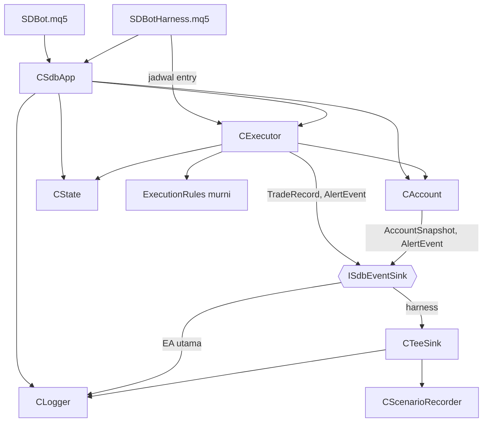

# Design — 04 Eksekusi, orkestrasi, dan harness

Status: Approved (2026-09-29)
Requirements: [requirements.md](requirements.md)

## 1. Overview

`CExecutor` membungkus `CTrade`. Semua aturan keputusan (validasi SL/TP, stops level, volume, klasifikasi retcode, langkah retry, filling mode, komentar, ID permintaan, slippage) dipisah ke `Execution/ExecutionRules.mqh` sebagai fungsi murni yang diuji tanpa pasar. Kelas hanya membaca data simbol, memanggil broker, dan mengirim hasil ke event sink.

`CSdbApp` di folder baru `App/` memegang semua modul dan menjalankan urutan event. Konfigurasi masuk lewat struct `SdbAppConfig` (bukan membaca `Inp*` langsung), sehingga `CSdbApp` bisa diuji di suite unit dengan konfigurasi apa pun. `SDBot.mq5` dan `SDBotHarness.mq5` sama-sama membangun konfigurasi dari input lalu meneruskan event ke `CSdbApp`. Harness menambahkan jadwal entry, perekam event, dan pemeriksa skenario.

## 2. Arsitektur



Lapisan (RULES): `App` di atas semua lapisan, hanya orkestrasi. `Execution` boleh memakai `Core`, `Account`; tidak memakai `Storage` langsung (lewat event sink).

## 3. File

```
Include/SDBot/Execution/ExecutionRules.mqh   [murni]
Include/SDBot/Execution/Executor.mqh         CExecutor
Include/SDBot/App/TeeSink.mqh                CTeeSink (meneruskan event ke dua sink)
Include/SDBot/App/SdbApp.mqh                 CSdbApp
Include/SDBot/Core/Types.mqh                 + OrderRequest, OrderResult, SdbAppConfig, enum baru
Include/SDBot/Core/Constants.mqh             + SDB_MAX_RETRY, SDB_RETRY_DELAY_MS, SDB_MAX_DEVIATION_POINTS, …
Include/SDBot/Core/InputRules.mqh            ValidateInputValues(v, allowHarnessMagic, errors)
Include/SDBot/Core/Inputs.mqh                + CurrentAppConfig(mode, eaVersion)
Experts/SDBot/SDBot.mq5                      v1.03, hanya meneruskan event
shared/schema/enums.md                       + reject_stage INVALID_STOPS, INVALID_VOLUME (lalu schema.py build)
tests/Include/SDBotTests/Suites/TestExecution.mqh
tests/Include/SDBotTests/Suites/TestApp.mqh
tests/Include/SDBotTests/ScenarioRecorder.mqh   CScenarioRecorder (ISdbEventSink)
tests/Include/SDBotTests/Scenarios.mqh          CheckScenario per SC-nn
tests/Experts/SDBotTests/SDBotHarness.mq5
tests/scenarios/SC-00_smoke.ini/.set, SC-06_stops.ini/.set, SC-08_restart.ini/.set
```

## 4. Komponen

### 4.1 `ExecutionRules.mqh` [murni]

```cpp
string ValidateOrderSides(bool isBuy, double price, double sl, double tp);   // "" atau SDB_REJECT_STAGE_INVALID_STOPS (1.1, 1.2)
bool   CheckStops(double price, double sl, double tp, int stopsLevel, int freezeLevel,
                  int spreadPts, double point, string &why);                   // 1.4, jarak SL dan TP
bool   CheckVolume(double vol, double vMin, double vMax, double step, double limit,
                   double existingVol, string &why);                          // 1.5, limit 0 = tanpa batas
ENUM_ORDER_TYPE_FILLING PickFillingMode(long symbolFillingFlags);             // 2.1: FOK > IOC > RETURN
ENUM_SDB_RETCODE_CLASS  ClassifyRetcode(uint retcode);                        // tabel di bawah
ENUM_SDB_NEXT_STEP      NextStep(ENUM_SDB_RETCODE_CLASS c, int attempt, bool foundByRequestId); // 2.2–2.4, 4.6
string BuildOrderComment(double initialSl, int digits, string requestId);    // 5.1
bool   ParseOrderComment(string comment, double &initialSl, string &requestId); // 5.2
string MakeRequestId(long magic, long counter);                              // 5.3, 4 karakter base36
int    SlippagePoints(bool isBuy, double requested, double filled, double point); // 3.1, negatif = merugikan
bool   IsModifySlAllowed(bool isBuy, double oldSl, double newSl, double bid, double ask,
                         int stopsLevel, int freezeLevel, double point, string &why); // 4.2
bool   IsPartialVolumeValid(double closeVol, double posVol, double vMin, double step, string &why); // 4.5
```

Klasifikasi retcode:

| Kelas | Retcode `TRADE_RETCODE_*` |
|---|---|
| SUCCESS | `DONE`, `PLACED`, `DONE_PARTIAL` |
| NO_CHANGES | `NO_CHANGES` |
| TRANSIENT | `REQUOTE`, `PRICE_CHANGED`, `PRICE_OFF`, `TOO_MANY_REQUESTS`, `LOCKED` |
| AMBIGUOUS | `TIMEOUT`, `CONNECTION`, `ERROR`, 0 (tanpa jawaban server) |
| POSITION_GONE | `POSITION_CLOSED` |
| PERMANENT | lainnya, termasuk `MARKET_CLOSED`, `NO_MONEY`, `INVALID_VOLUME`, `INVALID_STOPS`, `INVALID_FILL`, `TRADE_DISABLED`, `LIMIT_VOLUME`, `REJECT` |

`NextStep`: SUCCESS/NO_CHANGES → `SUCCEED`; AMBIGUOUS dengan `foundByRequestId` → `SUCCEED`; TRANSIENT/AMBIGUOUS dengan `attempt ≤ SDB_MAX_RETRY` → `RETRY`; POSITION_GONE → `GONE`; sisanya → `GIVE_UP`. `attempt` dihitung dari 1 (kiriman pertama), jadi paling banyak 1 kirim + 3 ulangan.

Komentar: `SDB|1.08234|k3f9` (16 karakter untuk harga 5 digit, 16 untuk JPY `SDB|161.234|k3f9`, maksimum realistis `SDB|99999.99999|zzzz` = 20). ID permintaan = base36 dari `(magic % 1296) × 1296 + counter % 1296`, dipadatkan 4 karakter. Magic 2026091900–2026091999 menghasilkan 100 awalan berbeda. ID berulang baru setelah 1.296 order per instance; bentrok hanya jika posisi dengan ID yang sama masih terbuka, yang tidak realistis untuk day trading.

### 4.2 `CExecutor`

```cpp
bool Init(long magic, string symbol, CAccount *acc, CState *state, ISdbEventSink *sink, string eaVersion);
bool OpenMarket(const OrderRequest &req, OrderResult &res);            // Req 1–3, 5
ENUM_SDB_EXEC ModifySl(ulong positionId, double newSl, string &why);   // OK | SKIPPED | GONE | FAILED (4.2–4.6)
ENUM_SDB_EXEC ClosePartial(ulong positionId, double volume, string &why);
ENUM_SDB_EXEC ClosePosition(ulong positionId, string &why);
int  CountOwnPositions();
long SendCount() const;                                                // jumlah OrderSend (untuk SC-06)
```

Alur `OpenMarket`:

```mermaid
flowchart TB
    A([OrderRequest]) --> B{CanTrade?}
    B -->|tidak| R1[tolak NOT_TRADABLE]
    B -->|ya| I[ID permintaan: counter GV + 1]
    I --> C[harga terbaru, normalisasi SL/TP]
    C --> D{ValidateOrderSides, CheckStops, CheckVolume}
    D -->|gagal| R2[tolak INVALID_STOPS / SL_TOO_CLOSE / INVALID_VOLUME]
    D -->|lolos| E{OrderCheck}
    E -->|margin| R3[tolak MARGIN_LOW]
    E -->|lain| R3b[tolak BROKER_REJECTED]
    E -->|lolos| F[OrderSend, komentar SDB|SL|id]
    F --> G{NextStep}
    G -->|SUCCEED| S[harga isi, volume, TradeRecord ke sink]
    G -->|RETRY| W[Sleep 500 ms] --> C
    G -->|AMBIGUOUS| H[cari posisi / deal 5 menit dengan id] --> G
    G -->|GIVE_UP| R4[ERROR + alert ORDER_FAILED sekali]
```

- ID permintaan dibuat sekali per `OpenMarket` dan dipakai semua ulangan (2.5). Penghitung: `CState` nama `<magic>_REQ_COUNTER` (GV `SDB_<login>_<magic>_REQ_COUNTER`), dinaikkan dan di-flush sebelum kiriman pertama, jadi restart di tengah ulangan tidak mengulang ID (EC-14).
- `CTrade`: `SetExpertMagicNumber`, `SetDeviationInPoints(SDB_MAX_DEVIATION_POINTS)`, `SetAsyncMode(false)`, `SetTypeFilling(PickFillingMode(SYMBOL_FILLING_MODE))`.
- `OrderCheck`: retcode `NO_MONEY` atau `margin_free < 0` → `MARGIN_LOW`; retcode lain selain 0/`DONE` → `BROKER_REJECTED`.
- Cari berdasarkan ID (2.3): posisi terbuka dengan magic dan simbol instance yang komentarnya berakhir `|<id>`; lalu `HistorySelect(now − 300, now + 60)` dan deal `DEAL_ENTRY_IN` dengan komentar yang sama. Ditemukan → position ID dari posisi/deal itu.
- Harga isi (3.3): `result.price`; jika 0, `HistoryDealSelect(result.deal)` → `DEAL_PRICE`; tetap tidak ada → harga diminta, `slippagePoints = SDB_NULL_LONG`, WARN.
- Risiko uang (3.1): `OrderCalcProfit(type, volumeTerisi, hargaIsi, slAwal, p)` → `riskMoney = −p`; `riskPct = riskMoney / balance × 100`. Gagal dihitung → `SDB_NULL_DOUBLE`.
- `TradeRecord`: `source = SDB_TRADE_SOURCE_EA`, `signalId = req.signalId` (`SDB_NULL_LONG` sebelum Fase 3), `openedAt` = waktu deal (atau `TimeCurrent()`).
- Modify/close: posisi dipilih dengan `PositionSelectByTicket` dan dicek magic + simbol (4.7) → tidak ada → `GONE` tanpa alert (4.4). Ulangan per `NextStep`; sebelum tiap ulangan posisi dicek lagi (4.6). Alert `MODIFY_FAILED` / `ORDER_FAILED` Medium sekali per operasi.

### 4.3 `CTeeSink`

Meneruskan setiap method `ISdbEventSink` ke dua sink. `FindInitialSl` diambil dari sink pertama (Logger). Dipakai harness; EA utama memakai `CLogger` langsung.

### 4.4 `CSdbApp`

```cpp
int    OnInit(const SdbAppConfig &cfg, ISdbEventSink *observer = NULL);  // observer = perekam harness
void   OnTick();
void   OnTimer();
void   OnTradeTransaction(const MqlTradeTransaction &t, const MqlTradeRequest &rq, const MqlTradeResult &rs);
double OnTester();
void   OnDeinit(const int reason);
// akses untuk harness dan uji: Executor(), Account(), Logger(); mulai spec 05/06: RiskManager(), PositionManager()
```

Urutan init (6.1):

1. `SdbSetLogLevel`; `ValidateInputValues(cfg.inputs, cfg.mode == SDB_APP_HARNESS, errors)` gagal → `INIT_PARAMETERS_INCORRECT` (7.3, EC-19).
2. `CLogger.Init(observer, …)` + `Open(cfg.dbTarget)` + `BeginSession`. Gagal buka DB tidak menggagalkan init (spec 03 Req 2.2). Sink modul = `CLogger`, atau `CTeeSink(Logger, observer)` bila ada observer. Alert milik Logger langsung ke observer (tidak lewat tee, agar tidak tercatat dua kali).
3. `CAccount.Init(sink, …)` + `Validate()`: `REJECTED` → `INIT_FAILED`; `PENDING` diperbolehkan (EC-18).
4. `CState.Init` saat akun `PASSED` (juga dicoba ulang dari timer, seperti v1.02).
5. `CExecutor.Init`.
6. Modul spec 05/06 (belum ada).
7. `EventSetTimer(SDB_TIMER_SEC)` gagal → `INIT_FAILED`.

Kegagalan di langkah mana pun: `OnDeinit(REASON_INITFAILED)` dipanggil oleh MT5 setelahnya (terbukti di smoke spec 03), dan `CSdbApp::OnDeinit` aman dipanggil pada objek yang baru sebagian dibuat (6.2).

### 4.5 Urutan event (6.3)

| Event | Urutan |
|---|---|
| `OnTick` | jika akun belum `PASSED` → selesai; `CPositionManager.OnTick` (spec 06) |
| `OnTimer` | `CAccount.OnTimer` (ditolak dari timer → `ExpertRemove`) → `EnsureState` → `CRiskMonitor.Run` (spec 05) → snapshot akun tiap `SDB_ACCOUNT_SNAPSHOT_SEC` (60 detik, 6.5) → touch GV harian → `CLogger.Flush` |
| `OnTradeTransaction` | `CClosureTracker.OnTransaction` (spec 06) |
| `OnTester` | `TesterMetric` (spec 07); spec ini mengembalikan 0 |
| `OnDeinit` | `EventKillTimer` → log alasan → `EndSession(reason)` → `CLogger.Close` (flush terakhir) → `IndicatorRelease` (mulai spec 06) → hapus objek. Aman dipanggil dua kali. |

### 4.6 Harness dan perekam skenario

- `SDBotHarness.mq5` meng-include `Inputs.mqh` (input yang sama dengan EA) ditambah input harness: `InpTestRunId`, `HarnessScenario`, `HarnessEveryBars`, `HarnessDirection` (BUY, SELL, ALTERNATE), `HarnessSlPoints`, `HarnessTpPoints`, `HarnessMaxOpen`, `HarnessFixedLot`, `HarnessRestartAtBar` (0 = tidak). Mode `SDB_APP_HARNESS`, target DB `TESTER`.
- `OnInit`: bukan tester → CRITICAL + `INIT_FAILED` (7.1). `TfBeginRun(InpTestRunId)`.
- `OnTick`: pada bar LTF baru, jika bar ke-N dan posisi sendiri < `HarnessMaxOpen` → `OrderRequest` dengan lot tetap, SL/TP dalam point dari ask/bid → `Executor().OpenMarket`; hasil (termasuk tolak) dicatat perekam. Bar `HarnessRestartAtBar` → `app.OnDeinit(REASON_PROGRAM); delete app; app = new CSdbApp; app.OnInit(cfg, recorder)` (7.5). Perekam hidup di luar `CSdbApp`.
- `CScenarioRecorder` (`ISdbEventSink`): menyimpan `TradeRecord`, alert, snapshot akun, hasil `OpenMarket` (ID permintaan, alasan tolak), ID sesi tiap init, jumlah posisi sebelum/sesudah restart.
- `OnDeinit`: `app.OnDeinit(reason)` dulu (flush dan tutup DB), lalu `CheckScenario(HarnessScenario, recorder)` menulis satu `TfRecord` per harapan, lalu `TfEndRun()`. Skenario tak dikenal → satu FAIL "skenario tidak dikenal" (7.7).
- Pemeriksaan DB di skenario: buka `sdbot_tester.sqlite` read-only dan filter berdasarkan ID sesi yang direkam, karena file tester dipakai semua run.

## 5. Data models

Tambahan di `Core/Types.mqh`:

| Tipe | Isi |
|---|---|
| `OrderRequest` | `isBuy`, `sl`, `tp`, `volume`, `signalId` |
| `OrderResult` | `ok`, `rejectStage` (teks `reject_stage`, "" bila berhasil), `retcode`, `requestId`, `positionId`, `dealTicket`, `priceRequested`, `priceFilled`, `volumeFilled`, `slippagePts`, `spreadPts`, `riskMoney`, `attempts` |
| `SdbAppConfig` | `mode`, `inputs` (`InputValues`), `symbolSuffix`, `allowLive`, `logLevel`, `style`, `inputsJson`, `eaVersion`, `dbTarget` |
| `ENUM_SDB_RETCODE_CLASS` | `SUCCESS`, `NO_CHANGES`, `TRANSIENT`, `AMBIGUOUS`, `POSITION_GONE`, `PERMANENT` |
| `ENUM_SDB_NEXT_STEP` | `SUCCEED`, `RETRY`, `GONE`, `GIVE_UP` |
| `ENUM_SDB_EXEC` | `OK`, `SKIPPED`, `GONE`, `FAILED` |
| `ENUM_SDB_APP_MODE` | `LIVE`, `HARNESS`, `UNITTEST` |

Konstanta: `SDB_MAX_RETRY` 3 · `SDB_RETRY_DELAY_MS` 500 · `SDB_MAX_DEVIATION_POINTS` 10 · `SDB_COMMENT_PREFIX` "SDB|" · `SDB_COMMENT_MAX_LEN` 31 · `SDB_AMBIGUOUS_LOOKBACK_SEC` 300 · `SDB_ACCOUNT_SNAPSHOT_SEC` 60.

Global Variable baru: `SDB_<login>_<magic>_REQ_COUNTER`.

Enum `reject_stage` baru: `INVALID_STOPS`, `INVALID_VOLUME` (`enums.md` + `schema.py build`; tanpa migrasi karena kolom tanpa CHECK).

Input: tidak ada input baru di EA utama. Input harness hanya ada di `SDBotHarness.mq5`.

## 6. Error handling

| Kegagalan | Tindakan | Log / alert |
|---|---|---|
| Validasi gagal | tolak, tidak kirim | WARN throttled dengan alasan |
| `OrderCheck` gagal | tolak `MARGIN_LOW` / `BROKER_REJECTED` | WARN dengan retcode `OrderCheck` |
| Retcode sementara | ulang ≤ 3, validasi ulang | WARN per ulangan |
| Retcode ambigu | cari posisi/deal dengan ID, lalu ulang ≤ 3 | WARN |
| Retcode permanen / ulangan habis | berhenti | ERROR + `ORDER_FAILED` Medium sekali |
| Modify/close: posisi tidak ada | `GONE` | DEBUG |
| Modify: tidak lebih baik | `SKIPPED` | DEBUG |
| Modify/close gagal setelah ulangan | `FAILED` | ERROR + `MODIFY_FAILED` / `ORDER_FAILED` Medium |
| Harga isi tidak ada | baca history, lalu harga diminta | WARN |
| Risiko tidak bisa dihitung | `riskMoney`, `riskPct` NULL | WARN |
| GV penghitung gagal ditulis | order tetap dikirim (ID dari penghitung di memori) | ERROR throttled |

## 7. Test case

**TestExecution** (murni)

| ID | Fungsi | Input | Harapan | Req |
|---|---|---|---|---|
| TC-EX-01 | `ValidateOrderSides` | buy 1.10000, SL 1.09800, TP 1.10500 | "" (lolos) | 1.2 |
| TC-EX-02 | sama | buy, SL 1.10100 | `INVALID_STOPS` | 1.2 |
| TC-EX-03 | sama | sell 1.10000, TP 1.10200 | `INVALID_STOPS` | 1.2 |
| TC-EX-04 | sama | SL 0 atau TP 0 | `INVALID_STOPS` | 1.1 |
| TC-EX-05 | `CheckStops` | buy 1.10000, SL 1.09995, stops 0, spread 8 | tolak (5 < 8) | 1.4 |
| TC-EX-06 | sama | buy 1.10000, SL 1.09900, stops 0, spread 8 | lolos | 1.4 |
| TC-EX-07 | sama | SL 1.09980, stops 20, spread 8 | tolak (20 < 28) | 1.4 |
| TC-EX-07b | sama | SL tepat 28 point, stops 20, spread 8 | lolos (batas) | 1.4 |
| TC-EX-08 | sama | TP 3 point dari harga, freeze 5 | tolak | 1.4 |
| TC-EX-09 | sama | JPY: 161.500, SL 161.450, spread 35, point 0.001 | lolos (50 ≥ 35) | 1.4, EC-15 |
| TC-EX-10 | `CheckVolume` | 0.015, step 0.01 | tolak | 1.5, EC-16 |
| TC-EX-11 | sama | 0.10, limit 0.20, posisi ada 0.15 | tolak | 1.5 |
| TC-EX-11b | sama | 0.005 (< min 0.01); 0.01; 200 (> max 100); 0.07 dengan step 0.01 (floating point) | tolak; lolos; tolak; lolos | 1.5 |
| TC-EX-12 | `PickFillingMode` | FOK+IOC | FOK | 2.1 |
| TC-EX-13 | sama | IOC saja | IOC | EC-05 |
| TC-EX-14 | sama | 0 | RETURN | EC-05 |
| TC-EX-15 | `ClassifyRetcode` | tiap retcode di tabel §4.1 | kelas sesuai | 2.2–2.4 |
| TC-EX-16 | `BuildOrderComment` | 1.08234, 5, "k3f9" | `SDB\|1.08234\|k3f9` | 5.1 |
| TC-EX-17 | sama | 161.234, 3, "zz00" | `SDB\|161.234\|zz00`, panjang ≤ 31 | 5.1, EC-15 |
| TC-EX-18 | `ParseOrderComment` | komentar valid | SL dan ID benar | 5.2 |
| TC-EX-19 | sama | `""`, `SDB\|`, `SDB\|abc\|k3f9`, `[sl 1.08234]`, `SDB\|1.08234`, `SDB\|1.08234\|k3`, `SDB\|1.08234\|k3f9x` | gagal | 5.2, EC-17 |
| TC-EX-20 | `MakeRequestId` | magic …00 dan …01, counter sama | berbeda, panjang 4 | 5.3, EC-12 |
| TC-EX-20b | sama | magic sama, counter 1 dan 2; counter 1 dan 1297 | berbeda; sama (siklus 1.296) | 5.3 |
| TC-EX-21 | `SlippagePoints` | buy diminta 1.10000 isi 1.10003 | −3 | 3.1 |
| TC-EX-22 | sama | sell diminta 1.10000 isi 1.10003 | +3 | 3.1 |
| TC-EX-23 | `IsModifySlAllowed` | buy, SL lama 1.09900, baru 1.09850 | tolak (lebih buruk) | 4.2 |
| TC-EX-24 | sama | buy, SL baru di atas bid | tolak (sisi salah) | 4.2 |
| TC-EX-24b | sama | sell, SL lama 1.10100, baru 1.10050, ask 1.10000, stops 0 | lolos | 4.2 |
| TC-EX-24c | sama | buy, SL baru sama dengan lama | tolak (tidak lebih baik) | 4.2 |
| TC-EX-25 | `IsPartialVolumeValid` | tutup 0.10 dari 0.10 | tolak | 4.5 |
| TC-EX-26 | sama | tutup 0.02 dari 0.03, min 0.01 | lolos | 4.5 |
| TC-EX-27 | sama | tutup 0.025 dari 0.05, step 0.01 | tolak | 4.5, EC-20 |
| TC-EX-27b | sama | tutup 0.045 dari 0.05, min 0.01 (sisa 0.005) | tolak | 4.5 |
| TC-EX-28 | `NextStep` | AMBIGUOUS, attempt 1, ditemukan | SUCCEED | 2.3, EC-01 |
| TC-EX-29 | sama | AMBIGUOUS, attempt 1, tidak ditemukan | RETRY | 2.3 |
| TC-EX-30 | sama | TRANSIENT, attempt 4 | GIVE_UP | 2.2, EC-02 |
| TC-EX-31 | sama | PERMANENT, attempt 1 | GIVE_UP | 2.4, EC-04 |
| TC-EX-32 | sama | NO_CHANGES; POSITION_GONE | SUCCEED; GONE | 4.3, 4.4 |

**TestApp** (`CSdbApp` dengan `SdbAppConfig`, target DB `UNITTEST`)

| ID | Kasus | Harapan | Req |
|---|---|---|---|
| TC-APP-01 | risk per trade 2% | `INIT_PARAMETERS_INCORRECT`, tidak ada sesi di DB | 6.2 |
| TC-APP-02 | magic 2026091900 mode LIVE; mode HARNESS | `INIT_PARAMETERS_INCORRECT`; `INIT_SUCCEEDED` | 7.3, EC-19 |
| TC-APP-03 | konfigurasi valid | `INIT_SUCCEEDED`, satu sesi, akun tercatat setelah flush | 6.1 |
| TC-APP-04 | `OnDeinit` lalu `OnDeinit` lagi | sesi punya `ended_at`, tidak crash, Logger tertutup | 6.4 |
| TC-APP-05 | suffix salah | `INIT_FAILED`; setelah `OnDeinit(REASON_INITFAILED)` alert `ACCOUNT_REJECTED` tersimpan | 6.2 |
| TC-APP-06 | executor saat akun ditolak | `OpenMarket` → `NOT_TRADABLE`, `SendCount() = 0` | 1.7 |
| TC-APP-07 | observer terpasang | snapshot akun dan alert sampai ke observer dan ke DB, alert milik Logger tidak ganda | 7.6 |
| TC-APP-07b | observer terpasang, akun lolos | snapshot akun ≥ 1 di observer, 1 baris `accounts` | 6.5, 7.6 |
| TC-APP-08a..f | jalur broker `CExecutor` di tester: buy lot minimum, modify lebih buruk/lebih baik/tiket asing, partial seluruh volume, close dua kali, SL 3 point | terisi dengan risiko > 0; komentar ter-parse; 1 baris `trades`; `SKIPPED`/`OK`/`GONE`; `SKIPPED`; `OK` lalu `GONE`; `SL_TOO_CLOSE` tanpa kiriman | 1.4, 3.1, 4.2, 4.4, 4.5, 5.1 |

Suite TestApp hanya jalan di Strategy Tester (`RunUnitTestsEA`); di script chart live suite ini dilewati.

**InputRules** (suite CoreUtils, tambahan): TC-IR-xx magic 2026091900 ditolak tanpa `allowHarnessMagic`, diterima dengan flag.

**Skenario** (runner `run-ea-tests.ps1 -Scenario`)

| ID | Given | When | Then | Req |
|---|---|---|---|---|
| SC-00 smoke | EURUSDc M15 1 minggu, entry tiap 20 bar bergantian BUY/SELL, lot 0.01, SL 200, TP 200 point, maks 1 posisi | posisi dibuka dan tertutup di SL/TP | ≥ 3 order berhasil; tiap `TradeRecord` punya SL, TP, harga isi, `riskMoney > 0`; komentar setiap posisi bisa di-parse dan SL-nya sama dengan `sl_initial`; ID permintaan unik; baris `trades` untuk sesi ini = jumlah order berhasil; `sessions.mode = TESTER`; snapshot akun ≥ 1 per 60 detik simulasi | 2.1, 3.1, 5.1, 6.1, 6.5 |
| SC-06 stops | SL 3 point | harness mencoba entry | semua ditolak `SL_TOO_CLOSE`; `SendCount() = 0`; 0 baris `trades` untuk sesi ini | 1.4 |
| SC-08 restart | seperti SC-00, entry tiap 10 bar, maks 2 posisi, restart di bar 50 | orkestrasi dibuat ulang | 2 sesi tercatat, sesi pertama berakhir `PROGRAM`; posisi terbuka sebelum restart masih ada sesudahnya; ID permintaan setelah restart tidak mengulang ID sebelumnya; tidak ada alert error | 5.3, 7.5, EC-14 |

**Manual**

| ID | Langkah | Harapan | Req |
|---|---|---|---|
| MC-EX-01 | Pasang `SDBot.mq5` v1.03 di chart EURUSDc akun cent selama 1 jam | tidak ada order; sesi LIVE tercatat; `accounts.updated_at` diperbarui tiap menit | 6.5, 6.6, 6.7 |
| MC-EX-02 | Pasang harness di chart live terminal uji | gagal init dengan CRITICAL | 7.1, EC-10 |

Retcode ambigu (EC-01, EC-13), requote (EC-02, EC-03), dan partial fill (EC-06) tidak bisa dipicu di tester. Keputusannya diuji lewat `ClassifyRetcode` dan `NextStep`; jalur kodenya ditinjau saat review.

## 8. Traceability

| Requirement | Komponen | Uji |
|---|---|---|
| 1.1–1.5 | `ExecutionRules`, `CExecutor::OpenMarket` | TC-EX-01..11b, SC-06 |
| 1.6 | `CExecutor::OpenMarket` (`OrderCheck`) | review; SC-00 (jalur lolos) |
| 1.7 | `CExecutor`, `CAccount` | TC-APP-06 |
| 2 | `ClassifyRetcode`, `NextStep`, `PickFillingMode`, `CExecutor` | TC-EX-12..15, 28..32, SC-00 |
| 3 | `SlippagePoints`, `CExecutor` | TC-EX-21..22, SC-00 |
| 4 | `CExecutor`, `IsModifySlAllowed`, `IsPartialVolumeValid` | TC-EX-23..27b, 32 (modify/close dipakai nyata di spec 06) |
| 5 | `BuildOrderComment`, `ParseOrderComment`, `MakeRequestId`, GV penghitung | TC-EX-16..20b, SC-00, SC-08 |
| 6 | `CSdbApp`, `SDBot.mq5` | TC-APP-01..07, SC-00, SC-08, MC-EX-01 |
| 7 | harness, `CTeeSink`, `CScenarioRecorder`, `Scenarios.mqh` | TC-APP-02, 07, SC-00, SC-06, SC-08, MC-EX-02 |

## 9. Keputusan (disetujui 2026-09-29, dicatat sebagai PC-07)

1. **Folder `App/` untuk `CSdbApp`**, lapisan paling atas yang hanya berisi orkestrasi. RULES ditambah satu baris lapisan (dicatat di `PENDING-CHANGES.md`).
2. **Komentar `SDB|<SL>|<ID>`** (menggantikan `SDB|<SL>` di draft lama), untuk mencegah posisi ganda setelah timeout.
3. **`OrderCheck` sebelum setiap `OrderSend`**, tambahan dari PRD, agar margin tidak cukup ditolak tanpa mengganggu broker.
4. **Deviasi maksimum 10 point** sebagai konstanta. PRD tidak mengaturnya; nilai ini bisa jadi input di Fase 3 bila data slippage menuntut.
5. **`SdbAppConfig` sebagai pintu konfigurasi `CSdbApp`**, bukan membaca `Inp*` langsung, agar orkestrasi bisa diuji di suite unit (TestApp).
6. **Modify/close ikut diulang ≤ 3 kali** (Req 4.6) dengan aturan `NextStep` yang sama seperti open.
