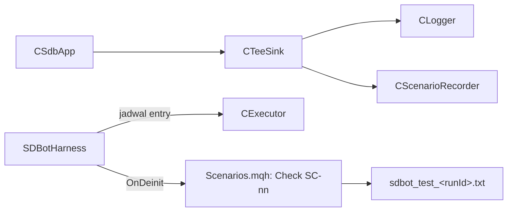

# Design — 04 Eksekusi, orkestrasi, dan harness

Status: Draft
Requirements: [requirements.md](requirements.md)

## 1. Overview

`CExecutor` membungkus `CTrade`. Semua aturan keputusan (validasi SL/TP, stops level, klasifikasi retcode, filling mode, komentar) dipisah ke `Execution/ExecutionRules.mqh` sebagai fungsi murni. Kelas hanya mengambil data simbol dan memanggil broker.

`CSdbApp` di folder baru `App/` memegang semua modul dan menjalankan urutan event. `SDBot.mq5` dan `SDBotHarness.mq5` sama-sama meneruskan event ke `CSdbApp`. Harness menambahkan jadwal entry dan perekam skenario.

## 2. File

```
Include/SDBot/Execution/ExecutionRules.mqh   [murni]
Include/SDBot/Execution/Executor.mqh         CExecutor
Include/SDBot/App/SdbApp.mqh                 CSdbApp
Experts/SDBot/SDBot.mq5                      meneruskan event ke CSdbApp (versi 1.03)
tests/Include/SDBotTests/Suites/TestExecution.mqh
tests/Include/SDBotTests/ScenarioRecorder.mqh   CTeeSink + CScenarioRecorder
tests/Include/SDBotTests/Scenarios.mqh          harapan per SC-nn
tests/Experts/SDBotTests/SDBotHarness.mq5
tests/scenarios/SC-00_smoke.ini, SC-06_stops.ini (+ .set)
```

## 3. Komponen

### 3.1 `ExecutionRules.mqh` [murni]

```cpp
ENUM_SDB_REJECT ValidateOrderSides(bool isBuy, double price, double sl, double tp);          // 1.1, 1.2
bool CheckStops(bool isBuy, double price, double sl, double tp, int stopsLevel,
                int freezeLevel, int spreadPts, double point, string &why);                   // 1.4
bool CheckVolume(double vol, double vMin, double vMax, double step, double limit,
                 double existingVol, string &why);                                           // 1.5
ENUM_ORDER_TYPE_FILLING PickFillingMode(long symbolFillingFlags);                            // 2.1
ENUM_SDB_RETCODE_CLASS ClassifyRetcode(uint retcode);   // SUCCESS | NO_CHANGES | TRANSIENT | AMBIGUOUS | PERMANENT | POSITION_GONE
string BuildOrderComment(double initialSl, int digits, string requestId);                    // 5.1
bool   ParseOrderComment(string comment, double &initialSl, string &requestId);             // 5.2
string MakeRequestId(long magic, uint counter);                                              // 12.1: base36 4 karakter
int    SlippagePoints(bool isBuy, double requested, double filled, double point);            // 3.1, negatif = merugikan
bool   IsModifySlAllowed(bool isBuy, double oldSl, double newSl, double bid, double ask,
                         int stopsLevel, int freezeLevel, double point, string &why);         // 4.2
bool   IsPartialVolumeValid(double closeVol, double posVol, double vMin, double step, string &why); // 4.5
```

Klasifikasi retcode:

| Kelas | Retcode `TRADE_RETCODE_*` |
|---|---|
| SUCCESS | `DONE`, `PLACED`, `DONE_PARTIAL` |
| NO_CHANGES | `NO_CHANGES` |
| TRANSIENT | `REQUOTE`, `PRICE_CHANGED`, `PRICE_OFF` |
| AMBIGUOUS | `TIMEOUT`, `CONNECTION`, `ERROR` (tanpa jawaban server) |
| POSITION_GONE | `POSITION_CLOSED`, `INVALID` saat target posisi sudah tidak ada |
| PERMANENT | lainnya, termasuk `MARKET_CLOSED`, `NO_MONEY`, `INVALID_VOLUME`, `INVALID_STOPS`, `TRADE_DISABLED`, `LIMIT_VOLUME`, `REJECT` |

Komentar: `SDB|1.08234|k3f9` (maks 16 karakter untuk harga 5 digit, 17 untuk JPY). ID permintaan = base36 dari `(magic % 1296) × 1296 + counter % 1296`, jadi berbeda antar-instance dan berulang baru setelah 1.296 order per instance. Penghitung disimpan di Global Variable per magic agar tidak berulang setelah restart.

### 3.2 `CExecutor`

```cpp
bool Init(long magic, string symbol, CAccount *acc, ISdbEventSink *sink, string eaVersion);
bool OpenMarket(const OrderRequest &req, OrderResult &res);            // Req 1–3
ENUM_SDB_EXEC ModifySl(ulong positionId, double newSl, string &why);   // OK | SKIPPED | GONE | FAILED
ENUM_SDB_EXEC ClosePartial(ulong positionId, double volume, string &why);
ENUM_SDB_EXEC ClosePosition(ulong positionId, string &why);
int  CountOwnPositions();
```

Alur `OpenMarket`:

```mermaid
flowchart TB
    A([OrderRequest]) --> B{CanTrade?}
    B -->|tidak| R1[tolak NOT_TRADABLE]
    B -->|ya| C[harga terbaru, normalisasi SL/TP]
    C --> D{ValidateOrderSides + CheckStops + CheckVolume}
    D -->|gagal| R2[tolak + alasan]
    D -->|lolos| E{OrderCheck}
    E -->|gagal| R3[tolak + retcode OrderCheck]
    E -->|lolos| F[OrderSend dengan komentar SDB|SL|id]
    F --> G{ClassifyRetcode}
    G -->|SUCCESS| S[baca harga isi dan volume, TradeRecord ke sink]
    G -->|TRANSIENT, ulangan < 3| C
    G -->|AMBIGUOUS| H{posisi dengan id ada?}
    H -->|ya| S
    H -->|tidak, ulangan < 3| C
    G -->|PERMANENT atau ulangan habis| R4[ERROR + alert ORDER_FAILED]
```

- Deviasi: `SetDeviationInPoints(SDB_MAX_DEVIATION_POINTS)` (10 point default, konstanta).
- `SetAsyncMode(false)`, `SetTypeFillingBySymbol` tidak dipakai, filling dari `PickFillingMode`.
- Jeda antar-ulangan `SDB_RETRY_DELAY_MS` (500 ms) lewat `Sleep`. Di tester `Sleep` tidak menunggu waktu nyata.
- Harga isi: `result.price`. Jika 0, `HistoryDealSelect(result.deal)` → `DEAL_PRICE`. Tetap tidak ada → `price_open` = harga diminta dan detail "fill price unknown" (3.3).

### 3.3 `CSdbApp`

```cpp
int  OnInit(ENUM_SDB_APP_MODE mode);   // LIVE | HARNESS
void OnTick();
void OnTimer();
void OnTradeTransaction(const MqlTradeTransaction &t, const MqlTradeRequest &rq, const MqlTradeResult &rs);
double OnTester();
void OnDeinit(int reason);
// akses modul untuk harness: Executor(), Account(), Logger(), dan mulai spec 05/06: RiskManager(), PositionManager()
```

Urutan init (6.1): `ValidateInputValues` → `CState.Init` → `CAccount.Validate` (PENDING diperbolehkan) → `CLogger.Open` + `BeginSession` → `CExecutor.Init` → modul spec 05/06 → `EventSetTimer(1)`. Setiap kegagalan melepas objek yang sudah dibuat dalam urutan terbalik (6.2).

### 3.4 Urutan event (6.3)

| Event | Urutan |
|---|---|
| `OnTick` | jika validasi akun belum PASSED → selesai; `CPositionManager.OnTick` (spec 06) |
| `OnTimer` | `CAccount.OnTimer` → `CRiskMonitor.Run` (spec 05) → `CLogger.Flush` → snapshot akun tiap 60 detik |
| `OnTradeTransaction` | `CClosureTracker.OnTransaction` (spec 06) |
| `OnTester` | `TesterMetric` (spec 07) |
| `OnDeinit` | log alasan (`REASON_*`) → `EndSession` → `CLogger.Close` (flush terakhir) → `IndicatorRelease` → `delete` semua objek → `EventKillTimer` |

### 3.5 Harness dan perekam skenario



- `CTeeSink` meneruskan setiap event ke `CLogger` dan `CScenarioRecorder`. Perekam menyimpan urutan event per posisi, SL sebelumnya per posisi, alasan tolak, dan status risiko per waktu.
- Input harness: `InpTestRunId`, `HarnessScenario` (misalnya `SC-06`), `HarnessEveryBars`, `HarnessDirection` (BUY, SELL, ALTERNATE), `HarnessSlPoints`, `HarnessTpPoints`, `HarnessMaxOpen`, `HarnessFixedLot`, `HarnessRestartAtBar`, `HarnessWithdrawAtBar`, `HarnessWithdrawPct`. Input ini hanya ada di harness.
- Restart (7.4): `delete app; app = new CSdbApp(); app.OnInit(HARNESS)`. Perekam dan `CTeeSink` tetap hidup di luar `CSdbApp`.
- `Scenarios.mqh`: satu fungsi `bool CheckScenario(string id, CScenarioRecorder &rec, string &why)` dengan `switch` per ID. ID tak dikenal → false (7.6).

## 4. Data models

Tambahan di `Core/Types.mqh`:

| Tipe | Isi |
|---|---|
| `OrderRequest` | `isBuy`, `sl`, `tp`, `volume`, `riskMoney`, `riskPct`, `signalId`, `requestId` |
| `OrderResult` | `positionId`, `dealTicket`, `priceRequested`, `priceFilled`, `volumeFilled`, `slippagePts`, `spreadPts`, `retcode`, `rejectStage` |
| `ENUM_SDB_RETCODE_CLASS` | lihat §3.1 |
| `ENUM_SDB_EXEC` | `SDB_EXEC_OK`, `SDB_EXEC_SKIPPED`, `SDB_EXEC_GONE`, `SDB_EXEC_FAILED` |
| `ENUM_SDB_APP_MODE` | `SDB_APP_LIVE`, `SDB_APP_HARNESS` |

Konstanta: `SDB_MAX_RETRY` 3 · `SDB_RETRY_DELAY_MS` 500 · `SDB_MAX_DEVIATION_POINTS` 10 · `SDB_COMMENT_PREFIX` "SDB|" · `SDB_COMMENT_MAX_LEN` 31.

Global Variable baru: `SDB_<login>_<magic>_REQ_COUNTER`.

## 5. Error handling

| Kegagalan | Tindakan | Log / alert |
|---|---|---|
| Validasi gagal | tolak, tidak kirim | WARN dengan alasan |
| `OrderCheck` gagal | tolak | WARN dengan retcode `OrderCheck` |
| Retcode sementara | ulang ≤ 3, validasi ulang | WARN per ulangan |
| Retcode ambigu | cek posisi dengan ID, lalu ulang ≤ 3 | WARN |
| Retcode permanen / ulangan habis | berhenti | ERROR + `ORDER_FAILED` Medium |
| Modify: posisi tidak ada | `GONE` | DEBUG |
| Modify: tidak lebih baik | `SKIPPED` | DEBUG |
| Harga isi tidak ada | baca history, lalu tandai | WARN |

## 6. Test case

**TestExecution**

| ID | Fungsi | Input | Harapan | Req |
|---|---|---|---|---|
| TC-EX-01 | `ValidateOrderSides` | buy 1.10000, SL 1.09800, TP 1.10500 | lolos | 1.2 |
| TC-EX-02 | sama | buy, SL 1.10100 | tolak | 1.2 |
| TC-EX-03 | sama | sell 1.10000, TP 1.10200 | tolak | 1.2 |
| TC-EX-04 | sama | SL 0 atau TP 0 | tolak | 1.1 |
| TC-EX-05 | `CheckStops` | buy 1.10000, SL 1.09995, stops 0, spread 8 | tolak (5 < 8) | 1.4 |
| TC-EX-06 | sama | buy 1.10000, SL 1.09900, stops 0, spread 8 | lolos | 1.4 |
| TC-EX-07 | sama | buy 1.10000, SL 1.09980, stops 20, spread 8 | tolak (20 < 28) | 1.4 |
| TC-EX-08 | sama | TP 3 point dari harga, freeze 5 | tolak | 1.4 |
| TC-EX-09 | sama | JPY: buy 161.500, SL 161.450, spread 35, point 0.001 | lolos (50 ≥ 35) | 1.4 |
| TC-EX-10 | `CheckVolume` | 0.015, step 0.01 | tolak (bukan kelipatan) | 1.5 |
| TC-EX-11 | sama | 0.10 dengan limit 0.20 dan posisi ada 0.15 | tolak | 1.5 |
| TC-EX-12 | `PickFillingMode` | flag FOK+IOC | FOK | 2.1 |
| TC-EX-13 | sama | flag IOC saja | IOC | EC-05 |
| TC-EX-14 | sama | flag 0 | RETURN | EC-05 |
| TC-EX-15 | `ClassifyRetcode` | tiap retcode di tabel §3.1 | kelas sesuai | 2.2–2.4 |
| TC-EX-16 | `BuildOrderComment` | 1.08234, 5, "k3f9" | `SDB\|1.08234\|k3f9` | 5.1 |
| TC-EX-17 | sama | 161.234, 3, "zz00" | `SDB\|161.234\|zz00` dan panjang ≤ 31 | 5.1 |
| TC-EX-18 | `ParseOrderComment` | komentar valid | SL dan ID benar | 5.2 |
| TC-EX-19 | sama | `""`, `SDB\|`, `SDB\|abc\|k3f9`, `[sl 1.08234]`, `SDB\|1.08234` (tanpa ID) | gagal | 5.2 |
| TC-EX-20 | `MakeRequestId` | magic 2026091900 dan 2026091901, counter sama | ID berbeda | EC-12 |
| TC-EX-21 | `SlippagePoints` | buy diminta 1.10000 isi 1.10003 | −3 | 3.1 |
| TC-EX-22 | sama | sell diminta 1.10000 isi 1.10003 | +3 | 3.1 |
| TC-EX-23 | `IsModifySlAllowed` | buy, SL lama 1.09900, baru 1.09850 | tolak (lebih buruk) | 4.2 |
| TC-EX-24 | sama | buy, SL baru di atas bid | tolak (sisi salah) | 4.2 |
| TC-EX-25 | `IsPartialVolumeValid` | tutup 0.10 dari 0.10 | tolak | 4.5 |
| TC-EX-26 | sama | tutup 0.02 dari 0.03, min 0.01 | lolos | 4.5 |
| TC-EX-27 | sama | tutup 0.025 dari 0.05, step 0.01 | tolak | 4.5 |

**Skenario**

| ID | Given | When | Then | Req |
|---|---|---|---|---|
| SC-00 smoke | EURUSDc M15 1 minggu, entry tiap 20 bar, lot tetap 0.01, SL 200, TP 200 point | posisi dibuka dan tertutup di SL/TP | ≥ 3 posisi dibuka; setiap posisi punya SL dan TP; komentar valid; `trades` dan `deals` di `sdbot_tester.sqlite` sesuai jumlah posisi; `sessions.mode = TESTER` | 2.1, 3.1, 5.1, 6.1 |
| SC-06 stops | SL 3 point | harness mencoba entry | semua ditolak `SL_TOO_CLOSE`; 0 `OrderSend` terjadi | 1.4 |
| SC-00b harness di chart live | pasang harness di terminal live | init | gagal init CRITICAL | 7.1 |

**Manual**

| ID | Langkah | Harapan | Req |
|---|---|---|---|
| MC-EX-01 | Pasang `SDBot.mq5` versi spec ini di chart EURUSDc akun cent selama 1 jam | tidak ada order; sesi LIVE tercatat; snapshot akun tiap menit | 6.5, 6.6 |

Retcode ambigu (EC-01) tidak bisa dipicu di tester. Logikanya diuji lewat `ClassifyRetcode` dan fungsi murni `ShouldResend(class, foundPosition, attempt)`: TC-EX-28 AMBIGUOUS + posisi ditemukan → tidak kirim ulang; TC-EX-29 AMBIGUOUS + tidak ditemukan + attempt 1 → kirim ulang; TC-EX-30 attempt 3 → berhenti.

## 7. Traceability

| Requirement | Komponen | Uji |
|---|---|---|
| 1 | `ExecutionRules`, `CExecutor::OpenMarket` | TC-EX-01..11, SC-06 |
| 2 | `ClassifyRetcode`, `ShouldResend`, `PickFillingMode`, `CExecutor` | TC-EX-12..15, 28..30, SC-00 |
| 3 | `SlippagePoints`, `CExecutor` | TC-EX-21..22, SC-00 |
| 4 | `CExecutor`, `IsModifySlAllowed`, `IsPartialVolumeValid` | TC-EX-23..27 |
| 5 | `BuildOrderComment`, `ParseOrderComment`, `MakeRequestId` | TC-EX-16..20 |
| 6 | `CSdbApp`, `SDBot.mq5` | SC-00, MC-EX-01 |
| 7 | harness, `CTeeSink`, `Scenarios.mqh` | SC-00, SC-00b, SC-06 |

## 8. Keputusan yang perlu disetujui

1. **Folder `App/` untuk `CSdbApp`**, lapisan paling atas yang hanya berisi orkestrasi. RULES ditambah satu baris lapisan.
2. **Komentar `SDB|<SL>|<ID>`** (menggantikan `SDB|<SL>` di draft lama), untuk mencegah posisi ganda setelah timeout.
3. **`OrderCheck` sebelum setiap `OrderSend`**, tambahan dari PRD, agar margin tidak cukup ditolak tanpa mengganggu broker.
4. **Deviasi maksimum 10 point** sebagai konstanta. PRD tidak mengaturnya; nilai ini bisa jadi input di Fase 3 bila data slippage menuntut.
