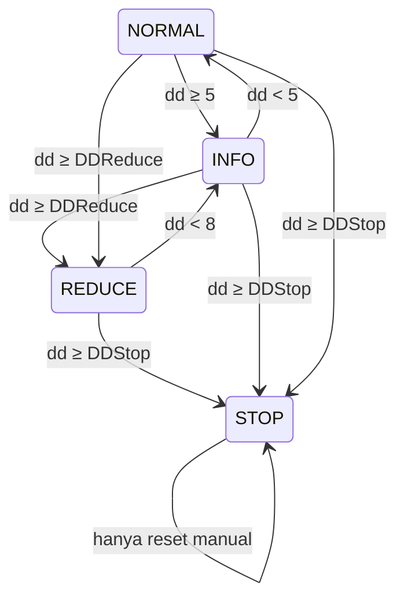

# Design — 05 Risk management

Status: Draft
Requirements: [requirements.md](requirements.md)

## 1. Overview

Semua angka risiko dihitung oleh fungsi murni di `Risk/RiskMath.mqh`. Dua kelas memakai fungsi itu: `CRiskManager` (pintu sebelum entry: lot dan pre-trade check) dan `CRiskMonitor` (setiap detik: puncak equity, drawdown, rugi harian, margin, emergency, operasi saldo). Status bersama ada di `CState` (spec 02) dengan akses bertipe yang ditambahkan di spec ini.

## 2. File

```
Include/SDBot/Risk/RiskMath.mqh      [murni]
Include/SDBot/Risk/RiskState.mqh     CRiskState: akses bertipe ke CState + compare-and-set
Include/SDBot/Risk/RiskManager.mqh   CRiskManager
Include/SDBot/Risk/RiskMonitor.mqh   CRiskMonitor
tests/Include/SDBotTests/Suites/TestRiskMath.mqh
tests/scenarios/SC-02_daily_loss, SC-03_dd, SC-05_lot_min, SC-07_withdraw (.ini + .set)
```

Harness (spec 04) diubah: entry lewat `PreTradeCheck` + `CalcVolume`; input `HarnessFixedLot` dihapus.

## 3. Komponen

### 3.1 `RiskMath.mqh` [murni]

```cpp
double RoundLotDown(double lot, double step);                           // 1.2: floor(lot/step + 1e-9) * step, lalu dinormalkan ke digit step
double CalcLotSize(double balance, double riskPct, double moneyPerLot,
                   double step, double vMin, double vMax, int &flag);    // flag: OK | BELOW_MIN | CAPPED_MAX | INVALID
double EffectiveRiskPct(double riskPct, bool lotReduced);               // 1.5
double DrawdownPct(double peak, double equity);                         // ≥ 0
double DailyLossPct(double dayStartBalance, double equity);             // bisa negatif
double PositionRiskMoney(bool isBuy, double entry, double sl, double moneyPerPointPerLot, double volume); // 0 bila SL di BE atau lebih baik
double OpenRiskPct(double sumRiskMoney, double balance);
ENUM_SDB_DD_LEVEL DrawdownLevel(double dd, ENUM_SDB_DD_LEVEL cur, double infoPct,
                                double reducePct, double recoverPct, double stopPct);
double AdjustForBalanceOp(double value, double amount);
double EffectiveMarginLevel(double marginLevel, double margin);          // margin 0 → DBL_MAX
bool   IsNewServerDay(datetime storedDay, datetime serverNow);
bool   ResetRequested(bool inputNow, bool inputLastSeen);               // 5.5: transisi false → true
```

`DrawdownLevel` sebagai mesin status:



### 3.2 `CRiskState`

```cpp
double PeakEquity();       void SetPeakEquity(double v);
bool   IsStopped();        void SetStopped(bool v);          // flush
bool   IsDailyPaused();    void SetDailyPaused(bool v);      // flush
bool   IsLotReduced();     void SetLotReduced(bool v);       // flush
double DayStartBalance();  datetime DayStartDate();
bool   TryClaimNewDay(datetime newDay, double balance);      // CAS pada DAY_START_DATE (4.3, 6.3)
bool   TryClaimBalanceDeal(ulong lastSeen, ulong newTicket); // CAS pada LAST_BAL_DEAL (7.3)
bool   ResetInputLastSeen(); void SetResetInputLastSeen(bool v);
```

Compare-and-set memakai `GlobalVariableSetOnCondition(name, newValue, expectedOld)`: yang berhasil adalah instance yang melihat nilai lama yang sama, jadi hanya satu yang menang.

### 3.3 `CRiskManager`

```cpp
bool CalcVolume(OrderRequest &req, string &stage, string &detail);     // Req 1
bool PreTradeCheck(const OrderRequest &req, string &stage, string &detail); // Req 2
```

- `moneyPerLot` = `OrderCalcProfit(type, symbol, 1.0, priceEntry, priceSl)` diambil nilai absolutnya.
- Risiko terbuka: loop posisi SDBot di akun (semua simbol, sesuai keputusan R2-1) → `PositionRiskMoney` per posisi dengan `OrderCalcProfit` antara harga buka dan SL saat ini.
- Margin: `OrderCheck` dari `CExecutor` memberi `margin_level` setelah order. Dipanggil hanya jika pemeriksaan sebelumnya lolos.

### 3.4 `CRiskMonitor::Run()` (tiap detik, sebelum flush)

1. **Operasi saldo** (Req 7): `HistorySelect(dari waktu deal terakhir yang diproses − 1 hari, sekarang)`, ambil deal `DEAL_TYPE_BALANCE`/`DEAL_TYPE_CREDIT` dengan tiket > `LAST_BAL_DEAL`, urut naik. Per deal: `TryClaimBalanceDeal` → jika menang, sesuaikan puncak dan dasar hari, kirim `BalanceOpRecord` dan alert. Dijalankan juga di init (7.2). History dibaca paling sering tiap 10 detik agar murah.
2. **Pergantian hari** (Req 4): `IsNewServerDay` → `TryClaimNewDay(hari baru, balance)` → pemenang mencabut pause harian.
3. **Puncak equity** (3.2).
4. **Drawdown** → `DrawdownLevel` → pada transisi: set/cabut flag, alert, atau emergency (3.3–3.6).
5. **Rugi harian** ≥ batas dan belum pause → pause + alert (4.1).
6. **Margin** di bawah 300% berubah → alert (3.7).
7. **Emergency** (Req 5): jika STOPPED dan ada posisi SDBot → `CloseAllSdbot()` sesuai jadwal: 5 detik saat pasar buka (`SymbolInfoSessionTrade` + `SYMBOL_TRADE_MODE`), 60 detik saat tutup. Hitung kegagalan berturut-turut untuk alert (5.3).

Reset (5.5–5.6) diproses di init oleh `CSdbApp`: `ResetRequested(InpResetEmergencyStop, ResetInputLastSeen())`. Nilai input disimpan sebagai `RESET_INPUT_LAST_SEEN` setiap init.

### 3.5 Keputusan R2-1: emergency lintas pair

Usulan: semua instance SDBot memakai magic di blok `InpMagicNumber` = `SDB_MAGIC_BASE × 100 + n` (`2026091900`–`2026091999`, n = 00–99). `ValidateInputValues` (spec 02) menolak magic di luar blok. `CExecutor::CloseAllSdbot()` menutup semua posisi dengan magic di blok itu di simbol mana pun, dan hanya dipanggil `CRiskMonitor` saat STOPPED. Risiko terbuka (2.3) juga dihitung atas seluruh blok, karena batas 3% adalah batas akun.

Jika tidak disetujui: `CloseAllOwn()` per instance, risiko terbuka tetap dihitung atas seluruh blok, dan risiko posisi yatim diterima.

## 4. Data models

Tambahan Global Variables (spec 02 §4.5 sudah punya sebagian): `SDB_<login>_RESET_INPUT_LAST_SEEN` (awal 0), `SDB_<login>_DD_LEVEL` (awal NORMAL).

Konstanta: `SDB_DD_INFO_PCT` 5 · `SDB_DD_RECOVER_PCT` 8 · `SDB_MARGIN_ALERT_PCT` 300 · `SDB_MARGIN_BLOCK_PCT` 200 · `SDB_CLOSE_ALL_RETRY_SEC` 5 · `SDB_CLOSE_ALL_CLOSED_MARKET_SEC` 60 · `SDB_CLOSE_ALL_ALERT_FAILS` 3 · `SDB_CLOSE_ALL_ALERT_REPEAT_SEC` 900 · `SDB_BALANCE_SCAN_SEC` 10 · `SDB_MAGIC_BASE` 20260919.

## 5. Error handling

| Kegagalan | Tindakan | Log / alert |
|---|---|---|
| `OrderCalcProfit` gagal | tolak entry | WARN dengan kode error |
| `HistorySelect` gagal | coba lagi siklus berikutnya | ERROR throttled |
| CAS kalah | tidak melakukan apa pun (instance lain yang memproses) | DEBUG |
| Close all gagal | jadwal ulang | Critical setelah 3 gagal, lalu tiap 15 menit |
| GV set gagal | coba lagi siklus berikutnya | ERROR (spec 02) |

## 6. Test case

**TestRiskMath**

| ID | Fungsi | Input | Harapan | Req |
|---|---|---|---|---|
| TC-RM-01 | `RoundLotDown` | 0.0379, 0.01 | 0.03 | 1.2 |
| TC-RM-02 | sama | 0.29, 0.01 | 0.29 | EC-01 |
| TC-RM-03 | sama | 1.0, 0.1 | 1.0 | 1.2 |
| TC-RM-04 | `CalcLotSize` | balance 1000, 0.5%, money/lot 20, step 0.01, min 0.01, max 100 | 0.25, OK | 1.1 |
| TC-RM-05 | sama | money/lot 30 | 0.16 | 1.2 |
| TC-RM-06 | sama | balance 100, 0.5%, money/lot 100 | 0, BELOW_MIN | 1.3, EC-02 |
| TC-RM-07 | sama | balance 100000, 1%, money/lot 10, max 50 | 50, CAPPED_MAX | 1.4 |
| TC-RM-08 | sama | money/lot 0 | INVALID | 1.6 |
| TC-RM-09 | `EffectiveRiskPct` | 0.5, aktif / tidak | 0.25 / 0.5 | 1.5 |
| TC-RM-10 | `DrawdownPct` | 1000, 900 / 1000, 1100 | 10 / 0 | 3.x |
| TC-RM-11 | `DailyLossPct` | 1000, 970 / 1000, 1010 | 3.0 / −1.0 | 4.1 |
| TC-RM-12 | `PositionRiskMoney` | buy, entry 1.10000, SL 1.09800, money/point/lot 0.1, vol 0.1 | 2.0 | 2.4 |
| TC-RM-13 | sama | buy, SL 1.10010 (di atas entry) | 0 | 2.4 |
| TC-RM-14 | `OpenRiskPct` | 25, balance 1000 | 2.5 | 2.3 |
| TC-RM-15 | `DrawdownLevel` | 4.9 dari NORMAL | NORMAL | 3.3 |
| TC-RM-16 | sama | 5.0 dari NORMAL | INFO | 3.3 |
| TC-RM-17 | sama | 10 dari INFO | REDUCE | 3.4 |
| TC-RM-18 | sama | 9 dari REDUCE | REDUCE | EC-13 |
| TC-RM-19 | sama | 7.9 dari REDUCE | INFO | 3.5 |
| TC-RM-20 | sama | 15 dari NORMAL (loncat) | STOP | 3.6 |
| TC-RM-21 | sama | 0 dari STOP | STOP | 5.7 |
| TC-RM-22 | `AdjustForBalanceOp` | 1000, −200 / 1000, +100 | 800 / 1100 | 7.1 |
| TC-RM-23 | `EffectiveMarginLevel` | 0, margin 0 | tak terbatas | 2.6 |
| TC-RM-24 | `IsNewServerDay` | tersimpan 2026-10-01, sekarang 2026-10-01 23:59 / 2026-10-02 00:00 | false / true | 4.3 |
| TC-RM-25 | sama | tersimpan Jumat, sekarang Senin | true | EC-05 |
| TC-RM-26 | `ResetRequested` | now true, last false | true | 5.5 |
| TC-RM-27 | sama | now true, last true | false | 5.6, EC-07 |
| TC-RM-28 | sama | now false, last true | false | 5.7 |

**TestRiskState** (prefix `SDBTEST`)

| ID | Kasus | Harapan | Req |
|---|---|---|---|
| TC-RS-01 | Dua objek `CRiskState` memanggil `TryClaimNewDay` untuk hari yang sama | tepat satu true | 6.3, EC-04 |
| TC-RS-02 | Dua objek memanggil `TryClaimBalanceDeal` untuk tiket sama | tepat satu true | 7.3 |
| TC-RS-03 | `SetStopped(true)` di objek A, dibaca objek B | true | 6.2 |

**Skenario** (EURUSDc M15, real ticks)

| ID | Given | When | Then | Req |
|---|---|---|---|---|
| SC-02 rugi harian | `InpDailyLossPct` 0.5, SL 100, TP 1000 point, entry tiap 4 bar | rugi hari itu ≥ 0.5% | pause aktif; entry sesudahnya di hari yang sama ditolak `DAILY_PAUSE`; entry diterima lagi di hari server berikutnya | 4.1–4.3 |
| SC-03 drawdown | `InpDDReducePct` 1, `InpDDStopPct` 2, SL 100 point | DD 1% lalu 2% | risk efektif setengah setelah DD 1% (dilihat dari `risk_pct` trade); STOPPED di 2%; tidak ada posisi SDBot > 5 detik simulasi setelah STOPPED; tidak ada entry sampai akhir | 1.5, 3.4, 3.6, 5.1, 5.4 |
| SC-03r restart saat STOPPED | sama dengan SC-03 + `HarnessRestartAtBar` setelah STOPPED | restart | STOPPED tetap; entry tetap ditolak | 5.4 |
| SC-05 lot minimum | `InpRiskPerTradePct` 0.01 | entry dicoba | semua ditolak `LOT_BELOW_MIN`; 0 order | 1.3 |
| SC-07 penarikan | `HarnessWithdrawAtBar`, 20% | `TesterWithdrawal` | puncak dan dasar hari turun sebesar nominal; `balance_ops` 1 baris; level DD tidak berubah | 7.1, 7.4 |

**Manual**

| ID | Langkah | Harapan | Req |
|---|---|---|---|
| MC-RK-01 | Dua chart (EURUSDc, GBPUSDc) di akun cent; setel GV `SDB_<login>_STOPPED` = 1 lewat F3 | kedua instance menolak entry di detik berikutnya (terlihat di log) | 6.2 |
| MC-RK-02 | Dengan STOPPED aktif, ubah `InpResetEmergencyStop` ke true, lalu init ulang tanpa mengembalikannya | reset sekali; init berikutnya WARN tanpa reset | 5.5, 5.6 |

## 7. Traceability

| Requirement | Komponen | Uji |
|---|---|---|
| 1 | `RiskMath`, `CRiskManager::CalcVolume` | TC-RM-01..09, SC-05 |
| 2 | `CRiskManager::PreTradeCheck`, `PositionRiskMoney`, `EffectiveMarginLevel` | TC-RM-12..14, 23, SC-02, SC-03 |
| 3 | `CRiskMonitor`, `DrawdownLevel` | TC-RM-10, 15..21, SC-03 |
| 4 | `CRiskMonitor`, `DailyLossPct`, `IsNewServerDay`, `TryClaimNewDay` | TC-RM-11, 24..25, TC-RS-01, SC-02 |
| 5 | `CRiskMonitor`, `ResetRequested`, `CExecutor::CloseAllSdbot` | TC-RM-26..28, SC-03, SC-03r, MC-RK-02 |
| 6 | `CRiskState` | TC-RS-01..03, MC-RK-01 |
| 7 | `CRiskMonitor` operasi saldo, `AdjustForBalanceOp` | TC-RM-22, TC-RS-02, SC-07 |

## 8. Keputusan yang perlu disetujui

1. **[Disetujui 2026-09-29] R2-1: blok magic SDBot** (`2026091900`–`2026091999`) untuk emergency lintas pair dan risiko terbuka akun. Ini pengecualian tertulis dari RULES "loop posisi memfilter magic dan simbol".
2. **Reset emergency hanya pada transisi input false → true**, menutup celah input yang lupa dikembalikan.
3. **Dasar rugi harian = balance saat pergantian hari**, dengan konsekuensi floating dari hari sebelumnya ikut terhitung (EC-03). Sudah disetujui sebagai angka dasar; konsekuensinya dicatat di sini agar disadari.
4. **Close all saat pasar tutup** dicoba tiap 60 detik, bukan 5 detik, agar log dan broker tidak dibanjiri.
5. **Asumsi `TesterWithdrawal` menghasilkan deal `DEAL_TYPE_BALANCE`** dibuktikan di SC-07. Jika tidak, SC-07 memakai jalur uji alternatif (panggil `CRiskMonitor` dengan deal buatan) dan dicatat di laporan task.
