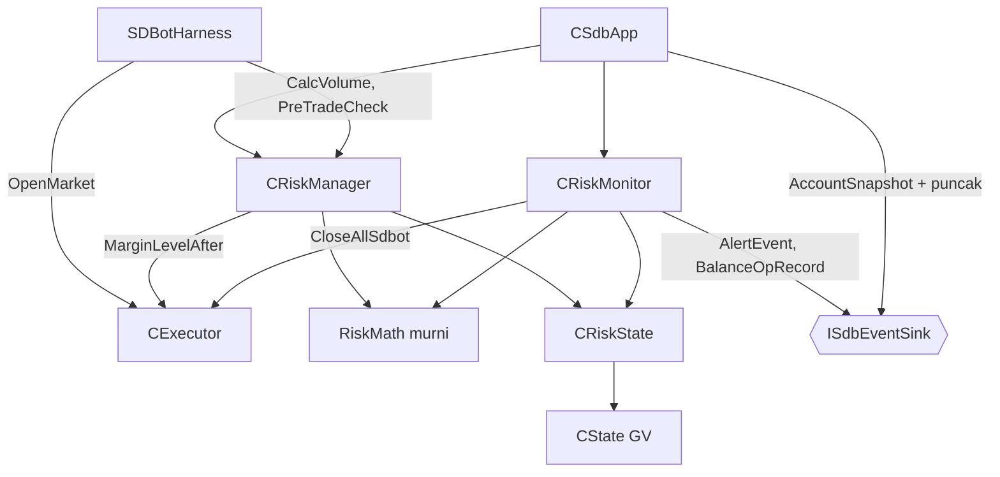
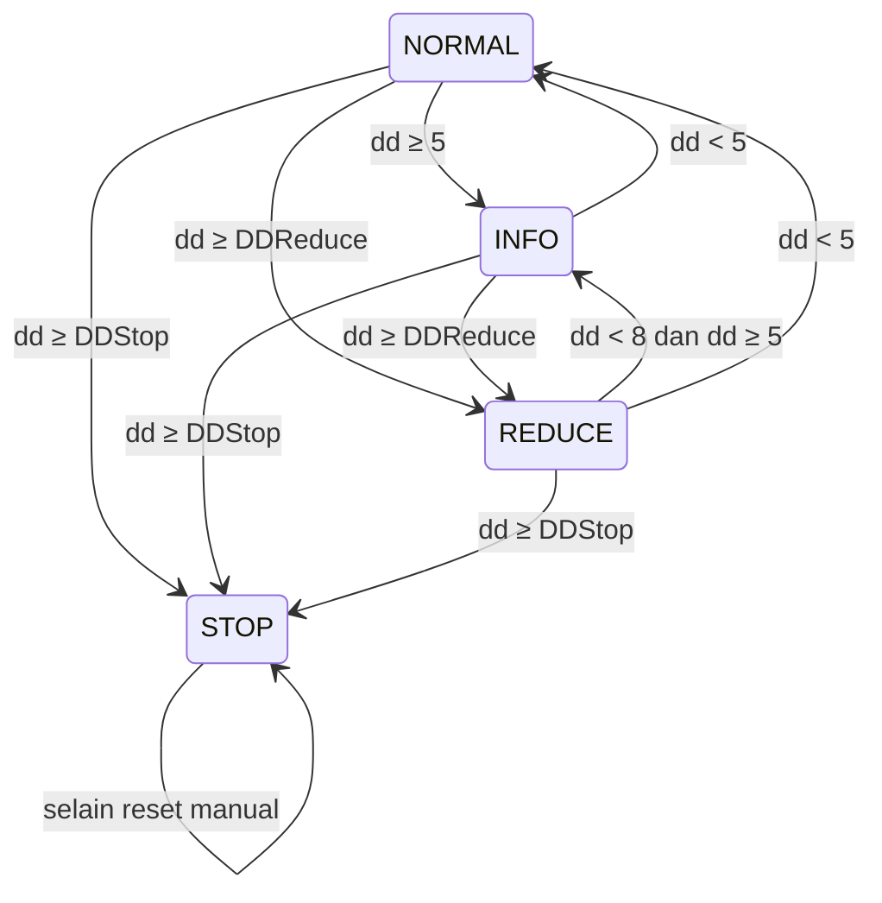

# Design — 05 Risk management

Status: Done (2026-09-30)
Requirements: [requirements.md](requirements.md)

## 1. Overview

Semua angka risiko dihitung fungsi murni di `Risk/RiskMath.mqh`. Tiga kelas memakainya:

- `CRiskState`: akses bertipe ke Global Variables akun (lewat `CState`), termasuk compare-and-set (CAS) agar keputusan akun diambil tepat satu instance.
- `CRiskManager`: pintu sebelum entry, yaitu lot (Req 1) dan pre-trade check (Req 2).
- `CRiskMonitor`: dijalankan tiap detik dari `CSdbApp::OnTimer` untuk operasi saldo, pergantian hari, puncak equity, drawdown, rugi harian, margin, dan close all (Req 3–7).

`CExecutor` mendapat dua method: `MarginLevelAfter` (`OrderCheck` untuk langkah margin) dan `CloseAllSdbot` (satu-satunya operasi lintas simbol/magic, R2-1). `CSdbApp` memasang modul risiko di urutan init dan timer yang sudah disiapkan spec 04. Harness memakai `CalcVolume` + `PreTradeCheck` sebelum `OpenMarket`.

## 2. Arsitektur



Lapisan (RULES): Risk membaca akun dan posisi, mengubah status risiko, dan meminta close all lewat Execution. Risk tidak membuka posisi.

## 3. File

```
Include/SDBot/Risk/RiskMath.mqh        [murni]
Include/SDBot/Risk/RiskState.mqh       CRiskState
Include/SDBot/Risk/RiskManager.mqh     CRiskManager
Include/SDBot/Risk/RiskMonitor.mqh     CRiskMonitor
Include/SDBot/Execution/Executor.mqh   + MarginLevelAfter, CloseAllSdbot
Include/SDBot/App/SdbApp.mqh           + modul risiko, reset input, puncak di snapshot
Include/SDBot/Core/Types.mqh           + ENUM_SDB_DD_LEVEL, ENUM_SDB_LOT_FLAG, RiskCheck, CloseAllResult
Include/SDBot/Core/InputRules.mqh      SdbAppConfig + resetEmergencyStop
Include/SDBot/Core/Inputs.mqh          CurrentAppConfig mengisi resetEmergencyStop
Include/SDBot/Core/Constants.mqh       + konstanta §5
Experts/SDBot/SDBot.mq5                v1.04
shared/schema/enums.md                 + reject_stage RISK_PER_TRADE (schema.py build)
tests/Include/SDBotTests/Suites/TestRiskMath.mqh, TestRiskState.mqh, TestRisk.mqh
tests/Include/SDBotTests/ScenarioRecorder.mqh, Scenarios.mqh   + data dan pemeriksa skenario risiko
tests/Experts/SDBotTests/SDBotHarness.mq5                      + jalur risiko, penarikan saldo
tests/scenarios/SC-02_daily_loss, SC-03_dd, SC-03r_dd_restart, SC-05_lot_min, SC-07_withdraw (.ini + .set)
```

## 4. Komponen

### 4.1 `RiskMath.mqh` [murni]

```cpp
double RoundLotDown(double lot, double step);                                  // 1.2: floor(lot/step + 1e-9) × step, dinormalkan ke digit step
double CalcLotSize(double balance, double riskPct, double moneyPerLot, double step,
                   double vMin, double vMax, ENUM_SDB_LOT_FLAG &flag);         // 1.1–1.4, 1.6: OK | BELOW_MIN | CAPPED_MAX | INVALID
double EffectiveRiskPct(double riskPct, bool lotReduced);                      // 1.5
double RiskPctOf(double riskMoney, double balance);                            // 2.3, 2.4; balance ≤ 0 → DBL_MAX
double PositionRiskMoney(bool isBuy, double openPrice, double sl, double lossMoneyAtSl,
                         double balance, double noSlRiskPct);                  // 2.5: SL ≥ open (buy) / ≤ open (sell) → 0; SL 0 → balance × noSlRiskPct%
double DrawdownPct(double peak, double equity);                                // ≥ 0; peak ≤ 0 → 0
double DailyLossPct(double dayStartBalance, double equity);                    // bisa negatif (untung)
ENUM_SDB_DD_LEVEL DrawdownLevel(double dd, ENUM_SDB_DD_LEVEL cur, double infoPct,
                                double reducePct, double recoverPct, double stopPct); // 3.3–3.6, 5.7
double EffectiveMarginLevel(double marginLevel, double margin);                // margin ≤ 0 → DBL_MAX (2.6)
bool   IsNewServerDay(datetime storedDay, datetime serverNow);                 // 4.3, 4.4: bandingkan tanggal (00:00)
datetime ServerDayStart(datetime serverNow);
bool   ResetRequested(bool inputNow, bool inputLastSeen);                      // 5.5: false → true
string BalanceOpType(long dealType);                                           // BALANCE | CREDIT | "" (jenis lain diabaikan)
bool   IsSdbotMagic(long magic);                                               // 2026091900–2026091999
ENUM_SDB_ASSET_CLASS AssetClassOf(string baseCcy, string quoteCcy);          // 2.8: XAU/XAG/XPT/XPD → COMMODITY; BTC/ETH/… → CRYPTO; ada USD → FOREX_MAJOR; dua mata uang fiat lain → FOREX_CROSS; selain itu OTHER
int    ClassPositionLimit(ENUM_SDB_ASSET_CLASS c, const int &limits[]);       // 2.8: limits[] dari input per kategori; OTHER → 1
bool   InTradeSession(int secOfDay, const int &from[], const int &to[]);       // pasar buka (glosarium)
bool   CloseAllDue(datetime now, datetime lastTry, bool marketOpen);           // 5.1: 5 dtk buka, 60 dtk tutup
bool   CloseAllAlertDue(int consecutiveFails, datetime now, datetime lastAlert); // 5.3: ≥ 3 lalu tiap 900 dtk
```

Mesin status `DrawdownLevel` (level tidak pernah keluar dari STOP; hanya reset manual, 5.7):



Alert per transisi (dikirim hanya oleh pemenang CAS, 3.9): ke INFO dari NORMAL → `DD_INFO` Info; ke REDUCE → `DD_REDUCE` High; REDUCE ke INFO/NORMAL → `DD_RECOVERED` Info; ke STOP → `DD_STOP` Critical. INFO ke NORMAL tanpa alert.

### 4.2 `CRiskState`

```cpp
bool   Init(CState *state, long magic, bool tester);   // nilai awal aman spec 02 §4.5; false bila state belum siap
bool   WasFresh() const;                               // GV PEAK_EQUITY belum ada saat Init (7.5, EC-17/18)
double PeakEquity();             bool RaisePeak(double equity);          // CAS: hanya naik (3.2)
bool   AdjustPeakAndDayStart(double amount);                             // CAS retry ≤ 5 (7.1)
bool   IsStopped();              void SetStopped(bool v);                // flush
bool   IsDailyPaused();          bool TryPauseToday();                   // CAS 0 → 1 (4.1)
bool   IsLotReduced();           void SetLotReduced(bool v);             // flush
ENUM_SDB_DD_LEVEL DdLevel();     bool TryMoveDdLevel(ENUM_SDB_DD_LEVEL from, ENUM_SDB_DD_LEVEL to); // CAS (3.9)
bool   TryMarginAlert(bool low);                                         // CAS MARGIN_LOW 0↔1 (3.7)
double DayStartBalance();        datetime DayStartDate();
bool   TryClaimNewDay(datetime storedDay, datetime newDay, double balance); // CAS DAY_START_DATE (4.3)
ulong  LastBalanceDeal();        bool TryClaimBalanceDeal(ulong lastSeen, ulong ticket); // CAS LAST_BAL_DEAL (7.3)
bool   TryClaimCloseAllAlert(datetime lastSeen, datetime now);            // CAS CLOSE_ALL_ALERT_AT (5.3, dedupe antar-instance)
bool   ResetInputLastSeen();     void SetResetInputLastSeen(bool v);     // per magic (§5)
void   ResetAfterEmergency(double equity);                               // 5.5: STOPPED 0, LOT_REDUCED 0, level NORMAL, puncak = equity
```

CAS = `GlobalVariableSetOnCondition(key, new, expectedOld)` lewat `CState::Key()`. Hanya satu instance yang melihat nilai lama yang sama, jadi hanya satu yang menang. Tiket deal disimpan sebagai `double` (tepat sampai 2^53). Setiap getter membaca GV langsung, tanpa cache (6.2).

### 4.3 `CRiskManager`

```cpp
bool Init(string symbol, CRiskState *rs, CExecutor *exe, CAccount *acc, double riskPerTradePct, double maxOpenRiskPct);
bool CalcVolume(OrderRequest &req, string &stage, string &detail);          // Req 1: mengisi req.volume
bool PreTradeCheck(const OrderRequest &req, string &stage, string &detail); // Req 2, urutan 2.1
double OpenRiskMoney();                                                     // semua posisi SDBot di akun (2.4, 2.5)
int    CountSdbotPositionsInClass(ENUM_SDB_ASSET_CLASS c);                  // 2.8: kategori posisi dari SYMBOL_CURRENCY_BASE/PROFIT simbolnya
```

- `moneyPerLot` = |`OrderCalcProfit(type, symbol, 1.0, harga entry terbaru, SL)`|; gagal atau ≤ 0 → `OTHER` + kode error (1.6).
- Risiko order baru = |`OrderCalcProfit(type, symbol, req.volume, entry, SL)`| → `RiskPctOf` dibandingkan `EffectiveRiskPct` (2.3). Toleransi 1e-9 agar lot hasil Req 1 tidak ditolak karena pembulatan.
- Risiko terbuka: loop posisi, `IsSdbotMagic` di simbol mana pun; rugi di SL = `OrderCalcProfit` dari harga buka ke SL saat ini dengan volume saat ini, lalu `PositionRiskMoney`.
- Urutan dan alasan: `CAccount::CanTrade` → `NOT_TRADABLE`; `IsStopped` → `STOPPED`; `IsDailyPaused` → `DAILY_PAUSE`; risiko per trade → `RISK_PER_TRADE`; risiko terbuka → `MAX_OPEN_RISK`; jumlah posisi SDBot sekategori ≥ batas → `CLASS_POSITION_LIMIT`; eksposur → selalu lolos (Fase 4); `EffectiveMarginLevel(MarginLevelAfter)` < 200 → `MARGIN_LOW`. Detail berisi angka dan batas, misalnya `open=2.8% + new=0.5% > 3.0%`.

### 4.4 `CRiskMonitor`

```cpp
bool Init(string symbol, long magic, CRiskState *rs, CExecutor *exe, ISdbEventSink *sink, const SdbAppConfig &cfg);
void OnStateReady(bool resetInput);   // sekali saat status bersama siap: baseline (7.5), reset (5.5, 5.6), operasi saldo tertunda (7.2)
void Run();                           // tiap detik dari CSdbApp::OnTimer
```

`OnStateReady`:
1. `WasFresh()` → `LAST_BAL_DEAL` = tiket deal saldo terbaru di seluruh history (tidak diproses, 7.5). Di live (bukan tester) dan akun punya history deal → alert High `STATE_RESET` (EC-18).
2. Reset: `ResetRequested(resetInput, ResetInputLastSeen())` dan STOPPED → `ResetAfterEmergency(equity)` + Info `EMERGENCY_RESET`. Input `true` dan terakhir `true` saat STOPPED → WARN "kembalikan `InpResetEmergencyStop` ke false" (5.6). Lalu `SetResetInputLastSeen(resetInput)`.
3. Operasi saldo sejak `LAST_BAL_DEAL` (7.2).

`Run()` berurutan (satu siklus, sebelum snapshot dan flush di `CSdbApp`):
1. **Operasi saldo**, paling sering tiap `SDB_BALANCE_SCAN_SEC`: `HistorySelect(LAST_BAL_TIME − 1 hari, sekarang)`, deal dengan `BalanceOpType ≠ ""` dan tiket > `LAST_BAL_DEAL`, urut naik. Per deal: `TryClaimBalanceDeal` → pemenang `AdjustPeakAndDayStart(amount)`, `BalanceOpRecord`, Info `BALANCE_OP`.
2. **Pergantian hari**: `IsNewServerDay(DayStartDate, TimeTradeServer())` → `TryClaimNewDay` → pemenang menyimpan balance sebagai awal hari dan mencabut pause (4.3, 4.4).
3. **Puncak**: `RaisePeak(equity)`.
4. **Drawdown**: `DrawdownLevel` → bila berubah dan `TryMoveDdLevel` menang: set/cabut `LOT_REDUCED`, alert (§4.1). Terlepas dari CAS, dd ≥ stop → `SetStopped(true)` (idempoten, agar STOPPED tidak bergantung pada siapa yang menang).
5. **Rugi harian**: `DailyLossPct ≥ InpDailyLossPct` → `TryPauseToday` → pemenang kirim High `DAILY_LOSS`.
6. **Margin**: `EffectiveMarginLevel` < 300 → `TryMarginAlert(true)` → High `MARGIN_LOW`; ≥ 300 → `TryMarginAlert(false)` → Info `MARGIN_OK`.
7. **Close all**: STOPPED dan ada posisi SDBot dan `CloseAllDue` → `CloseAllSdbot`. Gagal saat pasar buka menambah hitungan berturut-turut instance ini; berhasil atau pasar tutup mengembalikannya ke 0. `CloseAllAlertDue` → `TryClaimCloseAllAlert` → Critical `CLOSE_ALL_FAILED` (dedupe antar-instance lewat GV).

### 4.5 `CExecutor` (tambahan)

```cpp
double MarginLevelAfter(const OrderRequest &req);   // OrderCheck → margin_level; 0 bila gagal (dianggap MARGIN_LOW)
CloseAllResult CloseAllSdbot();                     // 5.8: semua posisi IsSdbotMagic di simbol mana pun
```

`CloseAllSdbot` memakai `PositionClose(ticket)` dengan aturan ulang `NextStep` spec 04. Per posisi: pasar simbol itu tutup → dilewati dan dihitung `closedMarket`; `GONE` dihitung berhasil. `CloseAllResult`: `total`, `closed`, `failed`, `closedMarket`. Ini satu-satunya method yang melintasi filter magic + simbol instance (pengecualian R2-1, PC-02).

### 4.6 `CSdbApp` (tambahan)

- Init langkah 6: `CRiskManager.Init`, `CRiskMonitor.Init`. `CRiskState.Init` di `EnsureState` saat akun `PASSED` (juga dari timer bila akun masih PENDING), lalu `CRiskMonitor.OnStateReady(cfg.resetEmergencyStop)` sekali.
- `OnTimer`: akun → `EnsureState` → `CRiskMonitor.Run()` → snapshot (60 detik) → touch GV → flush.
- Snapshot: `peakEquity` diisi dari `CRiskState` (3.8). Tepat setelah state siap, snapshot dikirim langsung (tidak menunggu 60 detik), karena snapshot dari `CAccount::Validate` dibuat sebelum puncak diketahui.
- Akses: `RiskManager()`, `RiskState()`.

### 4.7 Harness (tambahan)

- `TryEntry`: `HarnessFixedLot > 0` → lot tetap (tetap lewat pre-trade check, 8.2); `= 0` → `CalcVolume`. Lalu `PreTradeCheck`, lalu `OpenMarket`. Penolakan risiko dicatat perekam sebagai `OrderResult` dengan `rejectStage` (8.1).
- Input baru: `HarnessWithdrawAtBar` (0 = tidak), `HarnessWithdrawPct`. Penarikan dilakukan di bar pertama ≥ bar itu saat tidak ada posisi sendiri, lewat `TesterWithdrawal(balance × pct%)` (8.3). Harness mencatat puncak dan level DD tepat sebelum penarikan.
- Perekam: waktu setiap percobaan entry; `BalanceOpRecord`; sampel per timer (waktu, STOPPED, jumlah posisi SDBot) untuk SC-03.

## 5. Data models

`Core/Types.mqh`:

| Tipe | Isi |
|---|---|
| `ENUM_SDB_DD_LEVEL` | `NORMAL`, `INFO`, `REDUCE`, `STOP` |
| `ENUM_SDB_LOT_FLAG` | `OK`, `BELOW_MIN`, `CAPPED_MAX`, `INVALID` |
| `CloseAllResult` | `total`, `closed`, `failed`, `closedMarket` |
| `ENUM_SDB_ASSET_CLASS` | `FOREX_MAJOR`, `FOREX_CROSS`, `COMMODITY`, `CRYPTO`, `OTHER` |

`SdbAppConfig` + `resetEmergencyStop` (dari `InpResetEmergencyStop`).

Input EA baru (grup Risiko, PC-10; default dari `config/active_symbols.yaml` bot Python): `InpMaxPosForexMajor` 5, `InpMaxPosForexCross` 3, `InpMaxPosCommodity` 1, `InpMaxPosCrypto` 1; batas 1–20 di `ValidateInputValues`. Masuk `InputValues`, `CurrentInputs`, `CurrentInputsJson`, dan tabel input `sdbot/README.md`. Nilainya batas akun, jadi preset semua simbol memakai angka yang sama.

Global Variables (`SDB_<login>_…`, nilai awal spec 02 §4.5 kecuali disebut):

| Nama | Isi | Awal |
|---|---|---|
| `PEAK_EQUITY`, `STOPPED`, `DAILY_PAUSE`, `LOT_REDUCED`, `DAY_START_BAL`, `DAY_START_DATE`, `LAST_BAL_DEAL` | spec 02 §4.5 | spec 02 |
| `LAST_BAL_TIME` | waktu deal saldo terakhir yang diproses | waktu deal saldo terbaru |
| `DD_LEVEL` | `ENUM_SDB_DD_LEVEL` | NORMAL |
| `MARGIN_LOW` | 1 = alert margin rendah sudah dikirim | 0 |
| `CLOSE_ALL_ALERT_AT` | waktu Critical `CLOSE_ALL_FAILED` terakhir | 0 |
| `<magic>_RESET_SEEN` | nilai `InpResetEmergencyStop` pada init terakhir **instance ini** | 0 |

`RESET_SEEN` per magic, bukan per akun: input ini milik tiap chart; bila per akun, instance lain yang masih `false` akan menimpa nilainya, sehingga `true` yang lupa dikembalikan bisa mereset lagi.

Konstanta (`Constants.mqh`): `SDB_DD_INFO_PCT` 5 · `SDB_DD_RECOVER_PCT` 8 · `SDB_MARGIN_ALERT_PCT` 300 · `SDB_MARGIN_BLOCK_PCT` 200 · `SDB_NO_SL_RISK_PCT` 1.0 · `SDB_CLOSE_ALL_RETRY_SEC` 5 · `SDB_CLOSE_ALL_CLOSED_MARKET_SEC` 60 · `SDB_CLOSE_ALL_ALERT_FAILS` 3 · `SDB_CLOSE_ALL_ALERT_REPEAT_SEC` 900 · `SDB_BALANCE_SCAN_SEC` 10 · `SDB_CAS_RETRY` 5 · `SDB_DEF_MAX_POS_FOREX_MAJOR` 5 · `SDB_DEF_MAX_POS_FOREX_CROSS` 3 · `SDB_DEF_MAX_POS_COMMODITY` 1 · `SDB_DEF_MAX_POS_CRYPTO` 1 · `SDB_MAX_POS_PER_CLASS` 20 · `SDB_MAX_POS_OTHER_CLASS` 1 · `SDB_COMMODITY_CURRENCIES` "XAU,XAG,XPT,XPD" · `SDB_CRYPTO_CURRENCIES` "BTC,ETH,LTC,XRP,BCH,SOL,ADA,DOT,DOGE,BNB".

Enum: `reject_stage` + `RISK_PER_TRADE`, `CLASS_POSITION_LIMIT` (`enums.md` → `schema.py build`; kolom tanpa CHECK, tanpa migrasi).

## 6. Error handling

| Kegagalan | Tindakan | Log / alert |
|---|---|---|
| `OrderCalcProfit` gagal di lot/pre-trade | tolak entry `OTHER` | WARN dengan kode error |
| `OrderCalcProfit` gagal untuk posisi terbuka | posisi dihitung 1% balance | WARN throttled |
| `OrderCheck` gagal di `MarginLevelAfter` | margin level 0 → `MARGIN_LOW` | WARN dengan retcode |
| `HistorySelect` gagal | coba lagi siklus berikutnya | ERROR throttled |
| CAS kalah | instance lain yang memproses | DEBUG |
| CAS retry habis (puncak/awal hari) | coba lagi siklus berikutnya | ERROR throttled |
| Close all gagal | jadwal ulang 5/60 detik | Critical setelah 3 gagal saat pasar buka, lalu tiap 15 menit |
| GV set gagal | coba lagi siklus berikutnya | ERROR (spec 02) |
| Status bersama belum siap (akun PENDING) | pre-trade check menolak `NOT_TRADABLE`, monitor tidak jalan | INFO sekali |

## 7. Test case

**TestRiskMath** (murni)

| ID | Fungsi | Input | Harapan | Req |
|---|---|---|---|---|
| TC-RM-01 | `RoundLotDown` | 0.0379, step 0.01 | 0.03 | 1.2 |
| TC-RM-02 | sama | 0.29 (dari 0.1 × 2.9), step 0.01 | 0.29 | EC-01 |
| TC-RM-03 | sama | 1.0, step 0.1; 0.15, step 0.1 | 1.0; 0.1 | 1.2 |
| TC-RM-04 | `CalcLotSize` | balance 1000, 0.5%, money/lot 20, step 0.01, min 0.01, max 100 | 0.25, OK | 1.1 |
| TC-RM-05 | sama | money/lot 30 | 0.16, OK | 1.2 |
| TC-RM-06 | sama | balance 100, 0.5%, money/lot 100 | 0, BELOW_MIN | 1.3, EC-02 |
| TC-RM-07 | sama | balance 100000, 1%, money/lot 10, max 50 | 50, CAPPED_MAX | 1.4 |
| TC-RM-08 | sama | money/lot 0; −5 | 0, INVALID | 1.6 |
| TC-RM-09 | `EffectiveRiskPct` | 0.5, aktif / tidak | 0.25 / 0.5 | 1.5 |
| TC-RM-10 | `RiskPctOf` | 5, 1000; 5, 0 | 0.5; DBL_MAX | 2.3 |
| TC-RM-11 | `PositionRiskMoney` | buy, open 1.10000, SL 1.09800, rugi di SL −2.0 | 2.0 | 2.5 |
| TC-RM-12 | sama | buy, SL 1.10000 (= open); sell, SL 1.09990 (lebih baik) | 0; 0 | 2.5 |
| TC-RM-13 | sama | SL 0, balance 1000, no-SL 1% | 10 | 2.5, EC-12 |
| TC-RM-14 | `DrawdownPct` | 1000, 900 / 1000, 1100 / 0, 50 | 10 / 0 / 0 | 3.x |
| TC-RM-15 | `DailyLossPct` | 1000, 970 / 1000, 1010 | 3.0 / −1.0 | 4.1 |
| TC-RM-16 | `DrawdownLevel` | 4.9 dari NORMAL; 5.0 dari NORMAL | NORMAL; INFO | 3.3 |
| TC-RM-17 | sama | 10 dari INFO; 10 dari NORMAL | REDUCE; REDUCE | 3.4 |
| TC-RM-18 | sama | 9 dari REDUCE; 8.0 dari REDUCE | REDUCE; REDUCE | 3.5, EC-13 |
| TC-RM-19 | sama | 7.9 dari REDUCE; 4.0 dari REDUCE | INFO; NORMAL | 3.5 |
| TC-RM-20 | sama | 15 dari NORMAL (loncat); 14.99 dari REDUCE | STOP; REDUCE | 3.6 |
| TC-RM-21 | sama | 0 dari STOP | STOP | 5.7 |
| TC-RM-22 | `EffectiveMarginLevel` | 0, margin 0; 250, margin 10 | DBL_MAX; 250 | 2.6 |
| TC-RM-23 | `IsNewServerDay` | tersimpan 2026-10-01, sekarang 2026-10-01 23:59:59 / 2026-10-02 00:00:00 | false / true | 4.3 |
| TC-RM-24 | sama | tersimpan Jumat, sekarang Senin 00:00:05 | true | 4.4, EC-05 |
| TC-RM-25 | `ResetRequested` | (true, false); (true, true); (false, true); (false, false) | true; false; false; false | 5.5–5.7, EC-07 |
| TC-RM-26 | `BalanceOpType` | `DEAL_TYPE_BALANCE`; `DEAL_TYPE_CREDIT`; `DEAL_TYPE_BUY`; `DEAL_TYPE_COMMISSION` | BALANCE; CREDIT; ""; "" | 7.1, EC-10 |
| TC-RM-27 | `IsSdbotMagic` | 2026091899; 2026091900; 2026091999; 2026092000; 0 | false; true; true; false; false | 5.8, EC-15 |
| TC-RM-28 | `InTradeSession` | 08:00 dalam 00:05–23:55; 23:58; sesi kosong | true; false; false | 5.1 |
| TC-RM-29 | `CloseAllDue` | buka, 4 dtk / 5 dtk sejak coba terakhir; tutup, 59 / 60 dtk | false / true; false / true | 5.1, 5.2 |
| TC-RM-31 | `AssetClassOf` | EUR/USD, USD/JPY, EUR/JPY, GBP/JPY, XAU/USD, XAG/USD, BTC/USD, USD/USD (indeks), ""/"" | MAJOR, MAJOR, CROSS, CROSS, COMMODITY, COMMODITY, CRYPTO, OTHER, OTHER | 2.8, EC-25 |
| TC-RM-32 | `ClassPositionLimit` | limits {5,3,1,1}: tiap kategori; OTHER | 5, 3, 1, 1; 1 | 2.8 |
| TC-RM-30 | `CloseAllAlertDue` | gagal 2; gagal 3 alert terakhir 0; gagal 5, 899 / 900 dtk sejak alert | false; true; false / true | 5.3 |

**TestRiskState** (prefix `SDBTEST`, dua objek = dua instance)

| ID | Kasus | Harapan | Req |
|---|---|---|---|
| TC-RS-01 | Init pada GV kosong | nilai awal spec 02 §4.5, `WasFresh` true; Init kedua `WasFresh` false | 6.1, 7.5 |
| TC-RS-02 | A dan B `TryClaimNewDay` untuk hari yang sama | tepat satu true; balance awal hari = nilai pemenang | 4.3, 6.3, EC-04 |
| TC-RS-03 | A dan B `TryClaimBalanceDeal` untuk tiket sama | tepat satu true | 7.3 |
| TC-RS-04 | A dan B `TryMoveDdLevel(NORMAL, INFO)` | tepat satu true | 3.9 |
| TC-RS-05 | `SetStopped(true)` di A, dibaca B | true tanpa Init ulang | 6.2 |
| TC-RS-06 | `RaisePeak` 900 lalu 1100 dari puncak 1000 | 1000 lalu 1100 | 3.2 |
| TC-RS-07 | `AdjustPeakAndDayStart(−200)` | puncak dan awal hari turun 200 | 7.1 |
| TC-RS-08 | `ResetAfterEmergency(950)` | STOPPED 0, LOT_REDUCED 0, level NORMAL, puncak 950 | 5.5 |
| TC-RS-09 | `SetResetInputLastSeen` magic …01 = 1, magic …02 = 0 | masing-masing terbaca sendiri | 5.6 |

**TestRisk** (hanya di Strategy Tester, akun tester, magic harness)

| ID | Kasus | Harapan | Req |
|---|---|---|---|
| TC-RK-01 | `CalcVolume` EURUSDc SL 200 point, risiko 0.5% | volume > 0, kelipatan step, risiko order ≤ 0.5% balance | 1.1, 1.2 |
| TC-RK-02 | `PreTradeCheck` dengan STOPPED = 1 | `STOPPED` | 2.1, 5.4 |
| TC-RK-03 | pause harian = 1 | `DAILY_PAUSE` | 4.2 |
| TC-RK-04 | lot tetap 1.0, risiko 0.5% | `RISK_PER_TRADE` | 2.3, EC-19 |
| TC-RK-05 | posisi terbuka buatan dengan risiko 2.8%, order baru 0.5%, batas 3% | `MAX_OPEN_RISK` | 2.4 |
| TC-RK-06 | volume sangat besar (margin tidak cukup) | `MARGIN_LOW` | 2.6, EC-20 |
| TC-RK-07 | `OnStateReady(true)` dengan STOPPED, lalu `OnStateReady(true)` lagi | reset sekali + `EMERGENCY_RESET`; kedua kali WARN tanpa reset | 5.5, 5.6 |
| TC-RK-08 | `CloseAllSdbot` dengan dua posisi harness | `closed = 2`, posisi SDBot 0 | 5.8 |
| TC-RK-10 | satu posisi harness EURUSDc terbuka, `InpMaxPosForexMajor` 1, order EURUSDc baru | `CLASS_POSITION_LIMIT` | 2.8 |
| TC-RK-11 | `CalcVolume` XAUUSDc dan BTCUSDc (bila simbol ada di tester), SL 1000 point | volume kelipatan step simbol, risiko ≤ 0.5%; simbol tidak ada → INFO dilewati | 1.1, EC-24 |
| TC-RK-12 | GV puncak dibuat sehingga drawdown > `InpDDStopPct`, satu posisi harness, `Run()` dua kali | STOPPED, level STOP, `DD_STOP` tepat sekali, posisi SDBot 0 | 3.6, 3.9, 5.1, 5.8 |
| TC-RK-13 | GV awal hari dibuat sehingga rugi harian > batas, `Run()` dua kali | pause aktif, `DAILY_LOSS` tepat sekali | 4.1, 3.9 |
| TC-RK-09 | snapshot akun setelah state siap | `peakEquity` = `PEAK_EQUITY` GV | 3.8 |

**Skenario** (EURUSDc M15, model 1, tanggal tetap; rentang boleh diperpanjang di task bila kondisi tidak tercapai)

| ID | Given | When | Then | Req |
|---|---|---|---|---|
| SC-02 rugi harian | `InpDailyLossPct` 0.5, risiko 0.5%, SL 100 / TP 1000 point, entry tiap 4 bar | rugi hari itu ≥ 0.5% | ≥ 1 alert `DAILY_LOSS`, maksimal satu per hari server; setiap tolak `DAILY_PAUSE` jatuh di hari yang punya alert `DAILY_LOSS`; ada entry berhasil di hari server sesudah pause | 4.1–4.4 |
| SC-03 drawdown | `InpDDReducePct` 1, `InpDDStopPct` 2, risiko 1%, SL 100 point | DD 1% lalu 2% | alert `DD_REDUCE` sebelum `DD_STOP`; `risk_pct` trade sesudah `DD_REDUCE` ≈ 0.5; STOPPED = 1 di akhir; tidak ada posisi SDBot > 10 detik simulasi setelah `DD_STOP`; tidak ada entry berhasil setelah `DD_STOP` | 1.5, 3.4, 3.6, 5.1, 5.4 |
| SC-03r restart saat STOPPED | SC-03 + `HarnessRestartAtBar` sesudah `DD_STOP` | restart | STOPPED tetap; semua percobaan entry sesudah restart ditolak `STOPPED`; 2 sesi dengan `run_key` sama | 5.4, 5.7 |
| SC-05 lot minimum | `InpRiskPerTradePct` 0.01, SL 2000 point, `HarnessFixedLot` 0 | entry dicoba | semua ditolak `LOT_BELOW_MIN`; 0 kiriman | 1.3 |
| SC-07 penarikan | `HarnessWithdrawAtBar` 20, `HarnessWithdrawPct` 20 | `TesterWithdrawal` | 1 `BalanceOpRecord` dengan amount = −penarikan dan 1 baris `balance_ops` untuk `run_key` ini; puncak sesudah = puncak sebelum − penarikan; level DD tidak berubah; alert `BALANCE_OP` | 7.1, 7.4, 8.3 |
| Regresi | SC-00, SC-06, SC-08 | setelah harness lewat risiko | tetap PASS (SC-00/SC-08 memakai `CalcVolume`; SC-06 lot tetap 0.01) | 8.4 |

**Manual**

| ID | Langkah | Harapan | Req |
|---|---|---|---|
| MC-RK-01 | Dua chart (EURUSDc, GBPUSDc) di akun cent; setel GV `SDB_<login>_STOPPED` = 1 lewat F3 | Kedua instance mencatat STOPPED dan tidak ada entry (sebelum Fase 3 dicek lewat log monitor) | 6.2 |
| MC-RK-02 | STOPPED aktif, ubah `InpResetEmergencyStop` ke true, lalu init ulang tanpa mengembalikannya | Reset sekali; init berikutnya WARN tanpa reset | 5.5, 5.6 |

Pergantian hari saat akhir pekan (EC-05) dan close all saat pasar tutup (EC-06) tidak muncul di tester karena timer tester berhenti tanpa tick. Keputusannya diuji lewat `IsNewServerDay`, `InTradeSession`, dan `CloseAllDue`.

## 8. Traceability

| Requirement | Komponen | Uji |
|---|---|---|
| 1 | `RiskMath`, `CRiskManager::CalcVolume` | TC-RM-01..09, TC-RK-01, SC-05 |
| 2 | `CRiskManager::PreTradeCheck`, `CExecutor::MarginLevelAfter`, `AssetClassOf` | TC-RM-10..13, 22, 31..32, TC-RK-02..06, 10, SC-02, SC-03 |
| 3 | `CRiskMonitor`, `DrawdownLevel`, `CRiskState`, `CSdbApp` snapshot | TC-RM-14, 16..21, TC-RS-04, 06, TC-RK-09, SC-03 |
| 4 | `CRiskMonitor`, `DailyLossPct`, `IsNewServerDay`, `TryClaimNewDay` | TC-RM-15, 23..24, TC-RS-02, TC-RK-03, SC-02 |
| 5 | `CRiskMonitor`, `ResetRequested`, `CloseAllDue`, `CExecutor::CloseAllSdbot` | TC-RM-21, 25, 27..30, TC-RS-08..09, TC-RK-07..08, SC-03, SC-03r, MC-RK-02 |
| 6 | `CRiskState` | TC-RS-01..05, MC-RK-01 |
| 7 | `CRiskMonitor` operasi saldo, `BalanceOpType`, `AdjustPeakAndDayStart` | TC-RM-26, TC-RS-01, 03, 07, SC-07 |
| 8 | Harness, perekam, `Scenarios.mqh` | SC-02..07, regresi SC-00/06/08 |

## 9. Keputusan (no. 3–8 disetujui 2026-09-30)

1. **[Disetujui 2026-09-29] R2-1: blok magic SDBot** untuk close all lintas pair dan risiko terbuka akun (PC-02).
2. **[Disetujui 2026-09-30] PC-09**: `RISK_PER_TRADE`, gagal close all saat pasar tutup tidak dihitung, posisi tanpa SL = 1% balance.
3. **Transisi level dan alert akun lewat CAS di GV** (`DD_LEVEL`, `DAILY_PAUSE`, `MARGIN_LOW`, `CLOSE_ALL_ALERT_AT`), agar empat instance tidak mengirim empat alert yang sama (3.9). STOPPED tetap disetel setiap instance yang melihat dd ≥ batas, tidak bergantung pada pemenang CAS.
4. **`RESET_SEEN` per magic**, bukan per akun (§5).
5. **Alert `STATE_RESET` severity High** saat status bersama hilang di live dan akun sudah punya history (EC-18). PRD tidak menyebut severity-nya; High karena STOPPED bisa ikut hilang. Di tester tidak dikirim (GV selalu kosong di awal run).
6. **Jenis deal selain BALANCE dan CREDIT diabaikan** (komisi, charge, koreksi, bonus). Kolom `balance_ops.op_type` hanya mengenal keduanya; broker cent Exness tidak memakai jenis lain untuk deposit/penarikan.
7. **Harness `HarnessFixedLot = 0` berarti pakai `CalcVolume`**; SC-00 dan SC-08 pindah ke `CalcVolume`, SC-06 tetap lot tetap 0.01 (SL 3 point membuat `CalcVolume` memberi lot maksimum, sehingga pemeriksaan margin menolak lebih dulu dan `SL_TOO_CLOSE` tidak teruji).
9. **[Disetujui 2026-09-30, PC-10] Kategori aset dari mata uang base/quote**, bukan dari input per instance: batas per kategori harus menghitung posisi di simbol lain, dan kategori simbol lain hanya bisa diketahui dari data simbolnya. `SYMBOL_SECTOR` tidak dipakai karena isinya bergantung broker.
10. **[Ditemukan saat eksekusi task 8, dilaporkan ke user] Ambang pulih REDUCE = min(8%, `InpDDReducePct` × 0.8).** PRD: lot × 0.5 di 10%, kembali normal di bawah 8%. Bila `InpDDReducePct` disetel di bawah 8, ambang tetap 8 membuat flag dicabut seketika setelah dipasang (SC-03: ratusan alert REDUCE/RECOVERED). Rasio 0.8 = 8/10 dari angka PRD; dengan default 10% hasilnya tetap 8%. Alternatif: validasi input menolak `InpDDReducePct` ≤ 8.
8. **Asumsi `TesterWithdrawal` menghasilkan deal `DEAL_TYPE_BALANCE`** dibuktikan di SC-07. Jika tidak, SC-07 memakai jalur uji alternatif (deal buatan ke `CRiskMonitor`) dan dicatat di laporan task.
