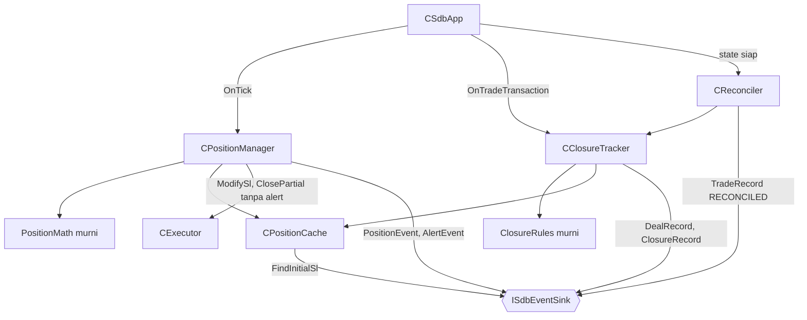
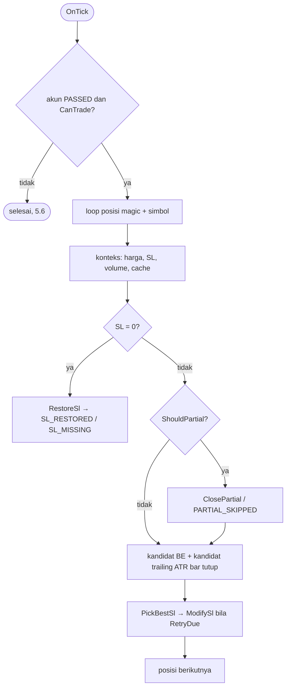

# Design — 06 Manajemen posisi dan closure

Status: Done (2026-09-30)
Requirements: [requirements.md](requirements.md)

## 1. Overview

Tiga kelas, semuanya dipasang di `CSdbApp`:

- `CPositionManager` (per tick): BE, partial, trailing, SL yang hilang, retry dengan cooldown.
- `CClosureTracker` (`OnTradeTransaction`): deal dan closure posisi instance, dengan kepemilikan dari deal pembuka.
- `CReconciler` (sekali saat status bersama siap): `TradeRecord` `RECONCILED` untuk posisi terbuka, lalu deal dan closure yang terlewat dari history.

Semua keputusan ada di fungsi murni `Position/PositionMath.mqh` dan `Position/ClosureRules.mqh`. Status posisi selalu dibaca dari MT5. Cache per posisi (`CPositionCache`) hanya menyimpan nilai mahal yang tidak berubah (SL awal, volume awal, risiko awal, kepemilikan) dan penghitung retry, lalu dibersihkan saat posisi tutup.

## 2. Arsitektur



Lapisan (RULES): Position memutuskan BE/partial/trailing lalu memanggil Execution; tidak membuka posisi.

## 3. File

```
Include/SDBot/Position/PositionMath.mqh     [murni]
Include/SDBot/Position/ClosureRules.mqh     [murni]
Include/SDBot/Position/PositionCache.mqh    CPositionCache: cache per posisi + kepemilikan
Include/SDBot/Position/PositionManager.mqh  CPositionManager
Include/SDBot/Position/ClosureTracker.mqh   CClosureTracker
Include/SDBot/Position/Reconciler.mqh       CReconciler
Include/SDBot/Execution/Executor.mqh        ModifySl / ClosePartial dengan parameter alertOnFail
Include/SDBot/App/SdbApp.mqh                pasang modul posisi, handle ATR
Experts/SDBot/SDBot.mq5                     v1.05
shared/schema/enums.md                      + alert_type BE_MOVED, PARTIAL_CLOSED, SL_MISSING
tests/Include/SDBotTests/Suites/TestPositionMath.mqh, TestClosure.mqh, TestPosition.mqh
tests/scenarios/SC-01_be_partial_trail, SC-01b_min_lot, SC-04_restart, SC-04b_close_at_restart (.ini + .set)
```

## 4. Komponen

### 4.1 `PositionMath.mqh` [murni]

```cpp
double ProfitInR(bool isBuy, double entry, double initialSl, double closePrice);         // 1.1; R ≤ 0 → 0
bool   IsBreakevenActive(bool isBuy, double entry, double sl);                          // 1.4; SL 0 → false
int    CommissionPoints(double roundTripCommissionMoney, double moneyPerPointForVolume); // 2.1; ≤ 0 → 0, dibulatkan ke atas
double BreakevenSl(bool isBuy, double entry, int spreadPts, int commissionPts, int bufferPts, double point, int digits); // 2.1
bool   ShouldBreakeven(double profitR, double beR, bool beActive, bool initialSlKnown);  // 2.1, 1.3
bool   ShouldPartial(double profitR, double partialR, double curVol, double initVol, bool initialSlKnown); // 3.1, 3.4, 1.3
double PartialVolume(double initVol, double pct, double step, double vMin, double curVol, bool &skip);    // 3.1, 3.2
double TrailingSl(bool isBuy, double closePrice, double atr, double mult, int digits);   // 4.1
bool   IsSlImprovement(bool isBuy, double oldSl, double newSl, int minStepPts, double point); // 4.2, 5.2
double PickBestSl(bool isBuy, double currentSl, double beCandidate, double trailCandidate, int minStepPts, double point); // 5.2; 0 = tidak ada
double RestoreSl(bool isBuy, double initialSl, double closePrice, int stopsLevel, int spreadPts, double point, int digits); // 5.5
bool   IsTrailingActive(bool isBuy, double beSl, double sl);                             // 6.6
bool   RetryDue(int fails, datetime lastFail, datetime now);                              // 5.3: fails < 3 dan ≥ 30 detik
```

`BreakevenSl` buy = entry + (spread + komisi + buffer) × point, sell = entry − (…) × point, dinormalkan ke digit. `RestoreSl`: SL awal bila masih di sisi rugi dari harga dan berjarak ≥ stops level + spread; kalau tidak, SL valid terdekat = harga ∓ (stops level + spread + 1) × point.

### 4.2 `ClosureRules.mqh` [murni]

```cpp
string DealEntryText(long dealEntry);     // SDB_DEAL_ENTRY_*
string DealTypeText(long dealType);       // BUY | SELL | "" (bukan deal trading)
string DealReasonText(long dealReason);   // SDB_DEAL_REASON_*
string MapCloseReason(long dealReason, bool isBuy, double entry, double levelPrice, double beSl,
                      int tolerancePts, double point, bool closedBySdbot);                 // 6.3
double ResultInR(double netProfit, double riskMoney);                                   // 6.4; risk ≤ 0 atau NULL → SDB_NULL_DOUBLE
void   MfeMaeInR(bool isBuy, double entry, double rDist, const double &highs[], const double &lows[],
                 double &mfeR, double &maeR);                                            // 6.5; kosong → NULL
```

`MapCloseReason` untuk deal alasan SL (`levelPrice` = harga pemicu SL dari `ORDER_PRICE_OPEN` order penutup, atau `DEAL_PRICE` bila tidak ada):

| `DEAL_REASON` | Kondisi | Alasan |
|---|---|---|
| `TP` | — | `TP` |
| `SL` | buy: level ≥ titik BE + toleransi / sell: ≤ titik BE − toleransi | `TRAIL_STOP` |
| `SL` | \|level − titik BE\| ≤ toleransi, atau level di sisi untung harga buka tetapi belum melewati titik BE | `BE_STOP` |
| `SL` | di sisi rugi harga buka | `SL` |
| `CLIENT`, `MOBILE`, `WEB` | — | `MANUAL` |
| `SO` | — | `STOP_OUT` |
| `EXPERT` | magic deal penutup di blok SDBot | `EA_CLOSE` |
| `EXPERT` | magic lain | `OTHER` |
| `ROLLOVER` | — | `ROLLOVER` |
| lainnya | — | `OTHER` |

Titik BE diambil dari event `BE` posisi itu bila ada; kalau tidak, dihitung ulang dengan spread rata-rata (`SYMBOL_SPREAD`). Toleransi = `InpBreakevenBufferPoints` + 2 point.

### 4.3 `CPositionCache`

Per `positionId`: `owned` (deal `IN` bermagic + bersimbol instance), `initialSl` + sumber (`COMMENT`, `ORDER`, `DB`, `NONE`), `initialVolume`, `entryTime`, `riskMoney` (dari SL awal dan volume awal), `beSl` (dari event BE), `slMissingLogged`, `partialSkippedLogged`, flag `beDone`/`partialDone`/`trailDone` untuk closure, `lastTrailEventBar`, dan per aksi (`BE`, `TRAIL`, `PARTIAL`, `RESTORE`) `fails`, `lastFail`, `failKey` (SL dan volume saat gagal; bila berubah, penghitung di-reset, 5.3).

```cpp
bool Owned(ulong positionId);                 // HistorySelectByPosition sekali, lalu di-cache
bool Get(ulong positionId, PositionCacheEntry &e);  // membangun entri bila belum ada
void Update(const PositionCacheEntry &e);
void Remove(ulong positionId);                // 7.4
```

### 4.4 `CPositionManager::OnTick()`



- Konteks untuk BE dan partial dari harga yang sama (5.1). Partial dijalankan dulu, lalu modifikasi SL, di tick yang sama.
- `ModifySl(..., alertOnFail = false)` dan `ClosePartial(..., alertOnFail = false)`. Gagal → `fails++`, `lastFail`; `fails` = 3 → event `MODIFY_FAILED` + satu alert Medium `MODIFY_FAILED` (5.3). `SKIPPED` dari `CExecutor` (SL tidak valid terhadap harga/stops) tidak dihitung gagal (2.2).
- Event: `BE` (SL lama/baru, volume, harga, spread) + alert Info `BE_MOVED`; `PARTIAL` + alert Info `PARTIAL_CLOSED`; `PARTIAL_SKIPPED` sekali; `TRAILING` pertama kali, lalu paling sering sekali per bar LTF (4.5); `SL_RESTORED` + alert High `SL_RESTORED`; restore gagal 3x → Critical `SL_MISSING`.
- ATR: handle `iATR(_Symbol, LTF, InpTrailATRPeriod)` dibuat `CSdbApp` saat init (gagal → `INIT_FAILED`), `CopyBuffer(handle, 0, 1, 1)`; < 1 nilai → trailing dilewati (4.3, 4.4). Dilepas di `OnDeinit`.

### 4.5 `CClosureTracker`

```cpp
void OnTransaction(const MqlTradeTransaction &t);   // hanya TRADE_TRANSACTION_DEAL_ADD
bool ProcessDeal(ulong dealTicket);                  // dipakai juga CReconciler; true = diproses
```

`ProcessDeal`: `HistoryDealSelect` → abaikan operasi saldo (`DealTypeText == ""`) → posisi deal → `CPositionCache::Owned` (deal pembuka bermagic + bersimbol instance; bukan magic deal ini, EC-15) → `DealRecord` (6.1) → GV `SDB_<login>_<magic>_LAST_DEAL` dinaikkan (compare-and-set tidak perlu: GV per magic hanya ditulis instance itu). Deal `OUT`/`OUT_BY` dan posisi sudah tidak ada → `HistorySelectByPosition` → jumlahkan semua deal → alasan dari deal penutup terakhir (`MapCloseReason`, `closedBySdbot` = magic deal di blok SDBot) → `ResultInR` → MFE/MAE dari `CopyHigh/CopyLow` M1 antara waktu buka dan tutup → flag BE/partial/trailing dari cache atau, setelah restart, dari history (volume `OUT` sebagian = partial; `beSl` dari DB tidak tersedia → flag BE dari level penutupan) → `ClosureRecord` (6.2–6.6) → `CPositionCache::Remove` (7.4).

Kunci unik DB (`login + run_key + deal_ticket`, `login + run_key + position_id`) menjamin "tepat sekali" walau deal datang dari transaksi dan dari scan history.

### 4.6 `CReconciler::Run()` (sekali, setelah status bersama siap)

1. Posisi terbuka milik instance → `TradeRecord` `RECONCILED`: harga diminta, slippage, spread kosong; SL awal dari cache (komentar → order → DB); tidak diketahui → SL sekarang, risiko kosong, WARN (7.1).
2. `HistorySelect(waktu LAST_DEAL − 1 hari atau 30 hari lalu, sekarang)` → `ProcessDeal` untuk setiap deal bertiket > `LAST_DEAL` (7.2, EC-09, EC-16, EC-20).

### 4.7 `CExecutor` (perubahan spec 04)

`ModifySl(positionId, newSl, why, alertOnFail = true)`, `ClosePartial(positionId, volume, why, alertOnFail = true)`. Default tetap seperti spec 04; manajer posisi memanggil dengan `false` (keputusan 3). Uji regresi spec 04 (TC-APP-08d/e) tetap lulus.

### 4.8 `CSdbApp` (tambahan)

- Init langkah 6: handle ATR, `CPositionCache`, `CPositionManager`, `CClosureTracker`, `CReconciler`. Rekonsiliasi dijalankan di `EnsureState` setelah `CRiskMonitor.OnStateReady`.
- `OnTick`: akun `PASSED` → `CPositionManager.OnTick`.
- `OnTradeTransaction`: `CClosureTracker.OnTransaction`.
- `OnDeinit`: `IndicatorRelease` handle ATR sebelum menutup Logger.

## 5. Data models

`Core/Types.mqh`: `PositionCacheEntry` (field §4.3), `ENUM_SDB_SL_SOURCE` (`NONE`, `COMMENT`, `ORDER`, `DB`), `ENUM_SDB_POS_ACTION` (`BE`, `TRAIL`, `PARTIAL`, `RESTORE`). `DealRecord`, `PositionEvent`, `ClosureRecord` sudah ada (spec 03).

Global Variable baru: `SDB_<login>_<magic>_LAST_DEAL`, `SDB_<login>_<magic>_LAST_DEAL_TIME`.

Konstanta: `SDB_MIN_SL_STEP_POINTS` 5 (PRD) · `SDB_MODIFY_COOLDOWN_SEC` 30 (PRD) · `SDB_MODIFY_MAX_ATTEMPTS` 3 (PRD) · `SDB_RECONCILE_LOOKBACK_DAYS` 30 · `SDB_CLOSE_REASON_TOLERANCE_PTS` 2.

Enum `alert_type` baru: `BE_MOVED`, `PARTIAL_CLOSED`, `SL_MISSING` (`enums.md` + `schema.py build`; tanpa migrasi).

Tidak ada input EA baru. Input harness baru: `HarnessRestartAfterPartial` (SC-04: restart N bar setelah posisi pertama melakukan partial).

## 6. Error handling

| Kegagalan | Tindakan | Log / alert |
|---|---|---|
| SL awal tidak ditemukan | BE dan partial dilewati | ERROR sekali per posisi |
| Handle ATR gagal dibuat | init gagal | CRITICAL |
| `CopyBuffer` ATR < 1 | trailing dilewati tick ini | DEBUG throttled |
| Modify / partial ditolak aturan (`SKIPPED`) | tunda, tidak dihitung gagal | DEBUG |
| Modify / partial gagal | cooldown 30 detik, maks 3 per aksi | WARN per gagal; ke-3: ERROR + event `MODIFY_FAILED` + alert Medium |
| Restore SL gagal | cooldown sama | ke-3: Critical `SL_MISSING` |
| `HistorySelectByPosition` gagal | coba lagi di transaksi/timer berikutnya | ERROR throttled |
| Bar M1 tidak cukup | MFE/MAE NULL | INFO |
| GV `LAST_DEAL` gagal ditulis | scan berikutnya mengulang (aman karena kunci unik) | ERROR throttled |

## 7. Test case

**TestPositionMath** (murni)

| ID | Fungsi | Input | Harapan | Req |
|---|---|---|---|---|
| TC-PM-01 | `ProfitInR` | buy, 1.10000, SL 1.09800, harga 1.10200 | 1.0 | 1.1 |
| TC-PM-02 | sama | sell, 1.10000, SL 1.10200, harga 1.09700 | 1.5 | 1.1 |
| TC-PM-03 | sama | buy, harga 1.09900; R 0 | −0.5; 0 | 1.1 |
| TC-PM-04 | `IsBreakevenActive` | buy SL 1.10010 / 1.09800 / tepat 1.10000 / 0 | true / false / true / false | 1.4 |
| TC-PM-05 | sama | sell SL 1.09990 | true | 1.4 |
| TC-PM-06 | `BreakevenSl` | buy 1.10000, spread 8, komisi 0, buffer 2, point 1e-5 | 1.10010 | 2.1 |
| TC-PM-07 | sama | sell, sama | 1.09990 | 2.1 |
| TC-PM-08 | sama | buy 161.500, spread 35, komisi 0, buffer 2, point 0.001 | 161.537 | 2.1, EC-17 |
| TC-PM-08b | sama | buy XAU 2000.00, spread 20, komisi 0, buffer 2, point 0.01 | 2000.22 | EC-17 |
| TC-PM-08c | `CommissionPoints` | komisi pulang-pergi 0.14, nilai per point untuk volume 0.1; komisi 0 | 2 (dibulatkan ke atas); 0 | 2.1, EC-18 |
| TC-PM-09 | `ShouldBreakeven` | 1.0R, BE 1.0, belum aktif, SL awal diketahui; 0.99R | true; false | 2.1 |
| TC-PM-10 | sama | 1.0R, SL awal tidak diketahui; BE sudah aktif | false; false | 1.3 |
| TC-PM-11 | `ShouldPartial` | 1.6R, 1.5, vol 0.10 = awal | true | 3.1 |
| TC-PM-12 | sama | 2.0R, vol 0.05 < awal 0.10 | false | 3.4 |
| TC-PM-13 | `PartialVolume` | awal 0.10, 50% | 0.05 | 3.1 |
| TC-PM-14 | sama | awal 0.03 | 0.01 | 3.1 |
| TC-PM-15 | sama | awal 0.02 | 0.01 (sisa 0.01 = min) | 3.2 |
| TC-PM-16 | sama | awal 0.01 | skip | 3.2, EC-04 |
| TC-PM-17 | `TrailingSl` | buy bid 1.10500, ATR 0.00100, ×2 | 1.10300 | 4.1 |
| TC-PM-18 | sama | sell ask 1.10500 | 1.10700 | 4.1 |
| TC-PM-19 | `IsSlImprovement` | buy 1.10280 → 1.10300, min 5 | true | 4.2 |
| TC-PM-20 | sama | buy 1.10298 → 1.10300; sell 1.10300 → 1.10310 | false; false | 4.2, 5.2 |
| TC-PM-21 | `PickBestSl` | buy, sekarang 1.10000, BE 1.10010, trail 1.10300 | 1.10300 | 5.2 |
| TC-PM-22 | sama | buy, sekarang 1.10300, BE 1.10010, trail 1.10200 | 0 | 5.2 |
| TC-PM-23 | `RestoreSl` | buy, SL awal 1.09800, harga 1.09900, stops 0, spread 8 | 1.09800 | 5.5 |
| TC-PM-24 | sama | buy, SL awal 1.09800, harga 1.09790 (sudah lewat) | 1.09781 (harga − 9 point) | 5.5 |
| TC-PM-25 | `IsTrailingActive` | buy, titik BE 1.10010, SL 1.10300 / 1.10010 | true / false | 6.6 |
| TC-PM-26 | `RetryDue` | gagal 0; gagal 1, 29 / 30 detik; gagal 3 | true; false / true; false | 5.3, EC-14 |

**TestClosure** (murni)

| ID | Fungsi | Input | Harapan | Req |
|---|---|---|---|---|
| TC-CL-01 | `MapCloseReason` | TP | `TP` | 6.3 |
| TC-CL-02 | sama | SL, buy, entry 1.10000, level 1.09800 | `SL` | 6.3, EC-03 |
| TC-CL-03 | sama | SL, buy, titik BE 1.10010, level 1.10011, toleransi 4 | `BE_STOP` | 6.3 |
| TC-CL-04 | sama | SL, buy, level 1.10300 | `TRAIL_STOP` | 6.3 |
| TC-CL-05 | sama | SL, sell, entry 1.10000, titik BE 1.09990, level 1.09700 | `TRAIL_STOP` | 6.3 |
| TC-CL-06 | sama | CLIENT / MOBILE / WEB | `MANUAL` | 6.3 |
| TC-CL-07 | sama | SO | `STOP_OUT` | EC-12 |
| TC-CL-08 | sama | EXPERT, penutup SDBot; EXPERT, magic lain | `EA_CLOSE`; `OTHER` | 6.3, EC-15 |
| TC-CL-09 | `ResultInR` | net 10, risk 5 | 2.0 | 6.4 |
| TC-CL-10 | sama | risk 0; risk NULL | NULL; NULL | 6.4 |
| TC-CL-11 | `MfeMaeInR` | buy, entry 1.10000, R 0.00200, high maks 1.10240, low min 1.09900 | MFE 1.2, MAE 0.5 | 6.5 |
| TC-CL-12 | sama | sell, entry 1.10000, R 0.00200, low min 1.09800, high maks 1.10050 | MFE 1.0, MAE 0.25 | 6.5 |
| TC-CL-13 | sama | array kosong | NULL, NULL | EC-13 |
| TC-CL-14 | `DealEntryText`, `DealTypeText`, `DealReasonText` | IN/OUT/INOUT/OUT_BY; BUY/SELL/BALANCE; tiap `DEAL_REASON` | teks `enums.md`; BALANCE → "" | 6.1, 6.7 |

**TestPosition** (hanya di tester, posisi sungguhan)

| ID | Kasus | Harapan | Req |
|---|---|---|---|
| TC-PS-01 | SL awal posisi harness; lalu cache dibangun ulang dengan pembacaan komentar dimatikan (hook uji, karena komentar tidak bisa diubah di tester) | sumber `COMMENT` dengan SL = SL order; lalu sumber `ORDER` dengan nilai yang sama | 1.2, EC-08 |
| TC-PS-02 | `ModifySl` gagal dengan `alertOnFail = false` | tidak ada alert dari `CExecutor` | 5.3 |
| TC-PS-03 | Posisi dibuka magic harness, ditutup `CloseAllSdbot` dari executor bermagic lain | `Owned` true untuk pemilik; closure `EA_CLOSE`; tracker executor lain mengabaikannya | 6.1–6.3, EC-15 |
| TC-PS-04 | `ProcessDeal` dipanggil dua kali untuk deal yang sama | satu baris `deals`, satu `closures` | 6.1, 6.2, EC-20 |

**Skenario** (EURUSDc M15, model 1)

| ID | Given | When | Then | Req |
|---|---|---|---|---|
| SC-01 BE-partial-trailing | entry bergantian tiap 20 bar, risiko 0.5%, SL 200 / TP 1000 point, 1 bulan | posisi mencapai 1R, 1.5R, lalu trailing | ≥ 1 posisi dengan event BE, PARTIAL, dan TRAILING, dan TRAILING tidak pernah mendahului BE (PARTIAL boleh di tick yang sama dengan BE atau sesudah trailing; ketiganya dievaluasi terpisah per tick); posisi yang ditutup paksa tester di akhir run dikecualikan; tiap posisi ≤ 1 BE dan ≤ 1 PARTIAL; SL di event BE/TRAILING tidak pernah memburuk; setiap posisi yang tutup punya tepat satu closure dengan alasan valid, R hasil, dan MFE ≥ R hasil; baris `deals` run ini = deal posisi harness di history; ≥ 1 closure `BE_STOP` atau `TRAIL_STOP` | 2–6 |
| SC-01b lot minimum | lot tetap 0.01 | 1.5R tercapai | `PARTIAL_SKIPPED` tepat sekali per posisi yang mencapai 1.5R, tidak ada `PARTIAL`; BE tetap terjadi | 3.2, EC-04 |
| SC-04 restart | `HarnessRestartAfterPartial` 2 | restart saat posisi sudah BE + PARTIAL | setelah restart tidak ada BE atau PARTIAL kedua untuk posisi itu; `TradeRecord` `RECONCILED` tidak menambah baris; posisi tetap dikelola (trailing) sampai tutup; closure tepat sekali | 7.1, 7.3, EC-19 |
| SC-04b tutup saat restart | restart dengan app dilepas selama N bar (posisi tertutup broker saat app tidak ada) | init ulang | deal dan closure yang terjadi saat app tidak ada tercatat tepat sekali dari scan history | 7.2, EC-09, EC-16 |
| Regresi | SC-00, SC-02, SC-03, SC-03r, SC-05..08 | modul posisi aktif | tetap PASS | — |

**Manual** (sebagian baru bisa di Fase 3, saat ada entry di akun cent)

| ID | Langkah | Harapan | Req |
|---|---|---|---|
| MC-PS-01 | (Fase 3) Tutup posisi SDBot manual dari HP | closure `MANUAL` | 6.3 |
| MC-PS-02 | (Fase 3) Hapus SL posisi SDBot manual | SL dipasang kembali dalam 1 detik + alert High | 5.5 |
| MC-PS-03 | (Fase 3) Cek `ORDER_SL` order pembuka di Exness | tidak 0 | 1.2 |
| MC-PS-04 | (Fase 3) Tutup MT5 saat ada posisi, posisi kena TP saat MT5 mati, buka lagi | closure `TP` tercatat saat init | 7.2 |

## 8. Traceability

| Requirement | Komponen | Uji |
|---|---|---|
| 1 | `CPositionCache`, `ProfitInR`, `IsBreakevenActive`, `ParseOrderComment` (spec 04), `FindInitialSl` | TC-PM-01..05, 10, TC-PS-01, SC-04, MC-PS-03 |
| 2 | `CPositionManager`, `BreakevenSl`, `CommissionPoints`, `ShouldBreakeven` | TC-PM-06..10, SC-01 |
| 3 | `ShouldPartial`, `PartialVolume`, `CExecutor::ClosePartial` | TC-PM-11..16, SC-01, SC-01b |
| 4 | `TrailingSl`, `IsSlImprovement`, handle ATR | TC-PM-17..20, SC-01 |
| 5 | `PickBestSl`, `RestoreSl`, `RetryDue`, `alertOnFail` | TC-PM-21..24, 26, TC-PS-02, MC-PS-02 |
| 6 | `CClosureTracker`, `ClosureRules`, `CPositionCache::Owned` | TC-CL-01..14, TC-PS-03..04, SC-01, MC-PS-01 |
| 7 | `CReconciler` | SC-04, SC-04b, MC-PS-04 |

## 9. Keputusan (no. 2–5 disetujui 2026-09-30)

1. **[Disetujui 2026-09-30, PC-11]** Keputusan requirements 1–4.
2. **Alert Info `BE_MOVED` dan `PARTIAL_CLOSED`, Critical `SL_MISSING`**: tipe alert baru di `enums.md` (tanpa migrasi). PRD meminta notifikasi Info untuk BE dan partial; notifier Fase 2 akan membaca tabel `alerts`.
3. **Flag BE/partial/trailing di closure setelah restart disimpulkan dari history** (deal `OUT` sebagian = partial; level penutupan terhadap titik BE = BE/trailing), karena event yang dikirim sebelum restart tidak dibaca ulang dari DB (EA tidak membaca DB untuk keputusan).
4. **SC-04b mensimulasikan "EA mati" dengan melepas `CSdbApp` selama N bar** (posisi tetap di broker), lalu init ulang, karena tester tidak bisa mematikan terminal di tengah run.
5. **Skenario 1 bulan (bukan 2)** dengan model 1 agar runner tetap di bawah batas waktu; diperpanjang di task bila kondisi BE → PARTIAL → TRAILING belum muncul.
