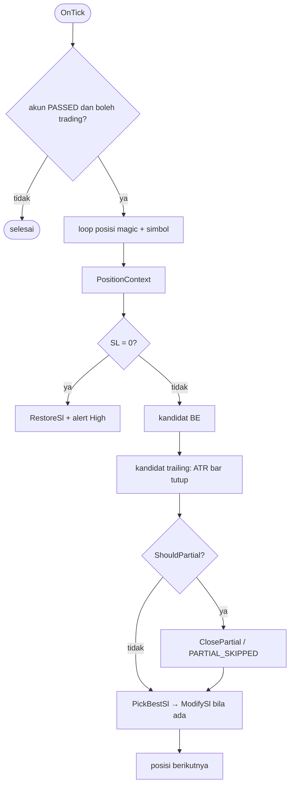

# Design — 06 Manajemen posisi dan closure

Status: Draft
Requirements: [requirements.md](requirements.md)

## 1. Overview

Tiga kelas: `CPositionManager` (per tick: BE, partial, trailing, SL hilang), `CClosureTracker` (deal dan closure dari `OnTradeTransaction`), dan `CReconciler` (saat init: posisi terbuka dan history yang terlewat). Semua keputusan ada di `Position/PositionMath.mqh` dan `Position/ClosureRules.mqh` sebagai fungsi murni. Status posisi selalu dibaca dari MT5, tidak pernah dari DB atau variabel yang bisa basi.

## 2. File

```
Include/SDBot/Position/PositionMath.mqh     [murni]
Include/SDBot/Position/ClosureRules.mqh     [murni]
Include/SDBot/Position/PositionContext.mqh  bangun PositionContext dari MT5 + cache per posisi
Include/SDBot/Position/PositionManager.mqh  CPositionManager
Include/SDBot/Position/ClosureTracker.mqh   CClosureTracker
Include/SDBot/Position/Reconciler.mqh       CReconciler
tests/Include/SDBotTests/Suites/TestPositionMath.mqh, TestClosure.mqh
tests/scenarios/SC-01_be_partial_trail, SC-04_restart (.ini + .set)
```

## 3. Komponen

### 3.1 `PositionMath.mqh` [murni]

```cpp
double ProfitInR(bool isBuy, double entry, double initialSl, double price);
bool   IsBreakevenActive(bool isBuy, double entry, double sl);
double BreakevenSl(bool isBuy, double entry, int spreadPts, int bufferPts, double point);
bool   ShouldBreakeven(double profitR, double beR, bool beActive, bool initialSlKnown);
bool   ShouldPartial(double profitR, double partialR, double curVol, double initVol, bool initialSlKnown);
double PartialVolume(double initVol, double pct, double step, double vMin, double curVol, bool &skip);
double TrailingSl(bool isBuy, double price, double atr, double mult);
bool   IsTrailStepEnough(bool isBuy, double oldSl, double newSl, int minStepPts, double point);
double PickBestSl(bool isBuy, double current, double beCandidate, double trailCandidate); // 5.2, 0 = tidak ada
double RestoreSl(bool isBuy, double initialSl, double price, int stopsLevel, int spreadPts, double point); // 5.5
bool   IsTrailingActive(bool isBuy, double entry, double sl, int spreadAtBePts, int bufferPts, double point);
```

`BreakevenSl` untuk sell = harga buka − (spread + buffer) × point. `IsTrailingActive` membandingkan SL dengan titik BE + buffer; dipakai di `ClosureRules` dan flag closure.

### 3.2 `ClosureRules.mqh` [murni]

```cpp
string MapCloseReason(ENUM_DEAL_REASON reason, bool isBuy, double entry, double levelPrice,
                      int bufferPts, double point, bool closedByEa);                   // 6.3
double ResultInR(double netProfit, double riskMoney);                                  // 6.4, NaN → NULL
void   MfeMaeInR(bool isBuy, double entry, double rDist, const double &highs[],
                 const double &lows[], double &mfeR, double &maeR);                    // 6.5
```

`MapCloseReason` untuk deal alasan SL: `level` = harga pemicu SL (`ORDER_PRICE_OPEN` order penutup). Buy: `level > entry + buffer` → `TRAIL_STOP`; `|level − entry| ≤ buffer` → `BE_STOP`; lainnya → `SL`. Sell kebalikannya. Toleransi `buffer` = `InpBreakevenBufferPoints` + spread saat BE (disimpan di event BE; jika tidak ada, spread rata-rata simbol dari `SYMBOL_SPREAD`).

| `DEAL_REASON` | Kondisi | Alasan |
|---|---|---|
| `TP` | — | `TP` |
| `SL` | level vs entry | `TRAIL_STOP` / `BE_STOP` / `SL` |
| `CLIENT`, `MOBILE`, `WEB` | — | `MANUAL` |
| `SO` | — | `STOP_OUT` |
| `EXPERT` | ditutup SDBot (magic blok) | `EA_CLOSE` |
| `ROLLOVER`, `VMARGIN`, `SPLIT` | — | `ROLLOVER` / `OTHER` |

### 3.3 `PositionContext`

Dibangun untuk setiap posisi per tick dari `PositionGet*`. Nilai yang mahal di-cache per `positionId` sampai posisi tutup: `initialSl` dan sumbernya, `initialVolume` (deal `IN` dari `HistorySelectByPosition`), `riskMoney`, jumlah kegagalan modify per aksi, `partialSkippedLogged`, `lastTrailEventBar`.

### 3.4 `CPositionManager::OnTick()`



Partial dieksekusi sebelum modifikasi SL di tick yang sama; keduanya dievaluasi dari konteks yang sama (5.1). Retry modify memakai cooldown per posisi per aksi (5.3).

### 3.5 `CClosureTracker::OnTransaction`

- Hanya `TRADE_TRANSACTION_DEAL_ADD` dengan magic dan simbol instance ini. Deal dibaca lewat `HistoryDealSelect`.
- Setiap deal → `DealRecord` (6.1) dan GV `SDB_<login>_<magic>_LAST_DEAL` diperbarui.
- Deal `OUT`/`OUT_BY` dan posisi sudah tidak ada → `HistorySelectByPosition` → jumlahkan semua deal → `MapCloseReason` → `ResultInR` → MFE/MAE dari `CopyHigh/CopyLow` M1 antara waktu buka dan tutup → `ClosureRecord` (6.2–6.6) → hapus cache posisi (7.4).
- Jumlah trade dan total R disimpan di memori untuk `OnTester` (spec 07).

### 3.6 `CReconciler::Run()` (di init, setelah storage dan executor siap)

1. Posisi terbuka instance ini → `TradeRecord` sumber `RECONCILED` (harga diminta, slippage, spread kosong) (7.1).
2. `HistorySelect(waktu deal LAST_DEAL − 1 hari, sekarang)` → setiap deal instance ini dengan tiket > `LAST_DEAL` diproses seperti di `CClosureTracker` (7.2). Jika `LAST_DEAL` belum ada, dipindai 30 hari terakhir.
3. Kunci unik di DB membuat pengulangan aman.

## 4. Data models

Tambahan `Core/Types.mqh`: `PositionContext`, `DealRecord`, `PositionEvent`, `ClosureRecord` (field mengikuti skema spec 03 §3).

Global Variable baru: `SDB_<login>_<magic>_LAST_DEAL`.

Konstanta: `SDB_MIN_SL_STEP_POINTS` 5 · `SDB_MODIFY_COOLDOWN_SEC` 30 · `SDB_MODIFY_MAX_ATTEMPTS` 3 · `SDB_RECONCILE_LOOKBACK_DAYS` 30.

## 5. Error handling

| Kegagalan | Tindakan | Log / alert |
|---|---|---|
| SL awal tidak ditemukan | BE dan partial dilewati | ERROR sekali per posisi |
| `CopyBuffer` ATR < 1 | trailing dilewati tick ini | DEBUG throttled |
| Modify gagal | cooldown 30 detik, maks 3 | ERROR + event `MODIFY_FAILED` + alert Medium |
| Partial gagal | seperti modify | sama |
| `HistorySelectByPosition` gagal | coba lagi di transaksi/timer berikutnya | ERROR |
| Bar M1 tidak cukup | MFE/MAE NULL | INFO |
| Restore SL gagal | ulang tiap tick dengan throttle | Critical setelah 3 gagal (posisi tanpa SL) |

## 6. Test case

**TestPositionMath**

| ID | Fungsi | Input | Harapan | Req |
|---|---|---|---|---|
| TC-PM-01 | `ProfitInR` | buy, 1.10000, SL 1.09800, harga 1.10200 | 1.0 | 1.1 |
| TC-PM-02 | sama | sell, 1.10000, SL 1.10200, harga 1.09700 | 1.5 | 1.1 |
| TC-PM-03 | sama | buy, harga 1.09900 | −0.5 | 1.1 |
| TC-PM-04 | `IsBreakevenActive` | buy SL 1.10010 / 1.09800 / tepat 1.10000 | true / false / true | 1.4 |
| TC-PM-05 | sama | sell SL 1.09990 | true | 1.4 |
| TC-PM-06 | `BreakevenSl` | buy 1.10000, spread 8, buffer 2, point 1e-5 | 1.10010 | 2.1 |
| TC-PM-07 | sama | sell, sama | 1.09990 | 2.1 |
| TC-PM-08 | sama | buy 161.500, spread 35, buffer 2, point 0.001 | 161.537 | 2.1 |
| TC-PM-09 | `ShouldBreakeven` | 1.0R, BE R 1.0, belum aktif, SL awal diketahui | true | 2.1 |
| TC-PM-10 | sama | 1.0R, SL awal tidak diketahui | false | 1.3 |
| TC-PM-11 | `ShouldPartial` | 1.6R, 1.5, vol 0.10 = awal | true | 3.1 |
| TC-PM-12 | sama | 2.0R, vol 0.05 < awal 0.10 | false | 3.4 |
| TC-PM-13 | `PartialVolume` | awal 0.10, 50% | 0.05 | 3.1 |
| TC-PM-14 | sama | awal 0.03 | 0.01 | 3.1 |
| TC-PM-15 | sama | awal 0.02 | 0.01 (sisa 0.01 = min) | 3.2 |
| TC-PM-16 | sama | awal 0.01 | skip | 3.2 |
| TC-PM-17 | `TrailingSl` | buy 1.10500, ATR 0.00100, ×2 | 1.10300 | 4.1 |
| TC-PM-18 | sama | sell | 1.10700 | 4.1 |
| TC-PM-19 | `IsTrailStepEnough` | buy 1.10280 → 1.10300 | true | 4.2 |
| TC-PM-20 | sama | buy 1.10298 → 1.10300 | false | 4.2 |
| TC-PM-21 | `PickBestSl` | buy, sekarang 1.10000, BE 1.10010, trail 1.10300 | 1.10300 | 5.2 |
| TC-PM-22 | sama | buy, sekarang 1.10300, BE 1.10010, trail 1.10200 | 0 (tidak ada perbaikan) | 5.2 |
| TC-PM-23 | `RestoreSl` | buy, SL awal 1.09800, harga 1.09900, stops 0, spread 8 | 1.09800 | 5.5 |
| TC-PM-24 | sama | buy, SL awal 1.09800, harga 1.09790 (sudah lewat) | SL valid terdekat di bawah harga | 5.5 |
| TC-PM-25 | `IsTrailingActive` | buy, entry 1.10000, SL 1.10300, spread BE 8, buffer 2 | true | 6.6 |

**TestClosure**

| ID | Fungsi | Input | Harapan | Req |
|---|---|---|---|---|
| TC-CL-01 | `MapCloseReason` | TP | `TP` | 6.3 |
| TC-CL-02 | sama | SL, buy, entry 1.10000, level 1.09800 | `SL` | 6.3 |
| TC-CL-03 | sama | SL, buy, level 1.10010, buffer 10 point | `BE_STOP` | 6.3 |
| TC-CL-04 | sama | SL, buy, level 1.10300 | `TRAIL_STOP` | 6.3 |
| TC-CL-05 | sama | SL, sell, level 1.09700, entry 1.10000 | `TRAIL_STOP` | 6.3 |
| TC-CL-06 | sama | CLIENT / MOBILE / WEB | `MANUAL` | 6.3 |
| TC-CL-07 | sama | SO | `STOP_OUT` | EC-12 |
| TC-CL-08 | sama | EXPERT dan ditutup SDBot | `EA_CLOSE` | 6.3 |
| TC-CL-09 | `ResultInR` | net 10, risk 5 | 2.0 | 6.4 |
| TC-CL-10 | sama | risk 0 atau tidak diketahui | kosong | 6.4 |
| TC-CL-11 | `MfeMaeInR` | buy, entry 1.10000, R 0.00200, high maks 1.10240, low min 1.09900 | MFE 1.2, MAE 0.5 | 6.5 |
| TC-CL-12 | sama | sell, entry 1.10000, R 0.00200, low min 1.09800, high maks 1.10050 | MFE 1.0, MAE 0.25 | 6.5 |
| TC-CL-13 | sama | array kosong | kosong | EC-13 |

**Skenario** (EURUSDc M15, real ticks)

| ID | Given | When | Then | Req |
|---|---|---|---|---|
| SC-01 BE-partial-trailing | entry bergantian tiap 20 bar, SL 200, TP 1000 point, 2 bulan | posisi mencapai 1R, 1.5R, lalu trailing | ada posisi dengan urutan event BE → PARTIAL → TRAILING; tiap posisi ≤ 1 BE dan ≤ 1 PARTIAL; SL tidak pernah memburuk (dicek dari setiap event); setiap posisi tutup punya closure dengan alasan valid, R hasil, dan MFE ≥ R hasil yang terealisasi; `deals` = jumlah deal di history | 2–6 |
| SC-01b posisi 0.01 | risiko diturunkan hingga lot 0.01 | 1.5R tercapai | `PARTIAL_SKIPPED` sekali per posisi, tidak ada `PARTIAL` | 3.2 |
| SC-04 restart | `HarnessRestartAtBar` setelah ada posisi BE + PARTIAL | restart | setelah restart tidak ada BE atau PARTIAL kedua untuk posisi itu; R dan SL awal sama; posisi tetap dikelola sampai tutup | 7.1–7.3 |
| SC-04b closure saat restart | posisi tertutup di bar yang sama dengan restart | restart | closure tercatat tepat sekali | 7.2 |

**Manual** (sebagian baru bisa di Fase 3, saat ada entry di akun cent)

| ID | Langkah | Harapan | Req |
|---|---|---|---|
| MC-PS-01 | (Fase 3) Tutup posisi SDBot manual dari HP | closure `MANUAL` | 6.3 |
| MC-PS-02 | (Fase 3) Hapus SL posisi SDBot manual | SL dipasang kembali dalam 1 detik + alert High | 5.5 |
| MC-PS-03 | (Fase 3) Cek `ORDER_SL` order pembuka di Exness | tidak 0 | 1.2 |
| MC-PS-04 | (Fase 3) Tutup MT5 saat ada posisi, posisi kena TP saat MT5 mati, buka lagi | closure `TP` tercatat saat init | 7.2 |

## 7. Traceability

| Requirement | Komponen | Uji |
|---|---|---|
| 1 | `PositionContext`, `ParseOrderComment` (spec 04), `FindInitialSl` | TC-PM-01..05, 10, SC-04, MC-PS-03 |
| 2 | `CPositionManager`, `BreakevenSl`, `ShouldBreakeven` | TC-PM-06..10, SC-01 |
| 3 | `ShouldPartial`, `PartialVolume`, `CExecutor::ClosePartial` | TC-PM-11..16, SC-01, SC-01b |
| 4 | `TrailingSl`, `IsTrailStepEnough` | TC-PM-17..20, SC-01 |
| 5 | `PickBestSl`, `RestoreSl`, retry modify | TC-PM-21..24, MC-PS-02 |
| 6 | `CClosureTracker`, `ClosureRules` | TC-CL-01..13, SC-01, MC-PS-01 |
| 7 | `CReconciler` | SC-04, SC-04b, MC-PS-04 |

## 8. Keputusan yang perlu disetujui

1. **Alasan tutup dibedakan `SL` / `BE_STOP` / `TRAIL_STOP`** dari level pemicu SL dibanding harga buka (pola bot Python), agar kebocoran BE terukur.
2. **MFE/MAE dari bar M1 saat tutup**, bukan dari pelacakan tick, agar tetap benar walau EA restart di tengah posisi.
3. **SL yang dihapus manual dipasang kembali** (5.5). PRD tidak mengatur ini; usulan ini mengikuti aturan "setiap posisi selalu punya SL".
4. **Satu modifikasi SL per tick per posisi** (terbaik antara BE dan trailing) dan **event trailing paling sering sekali per bar LTF**.
