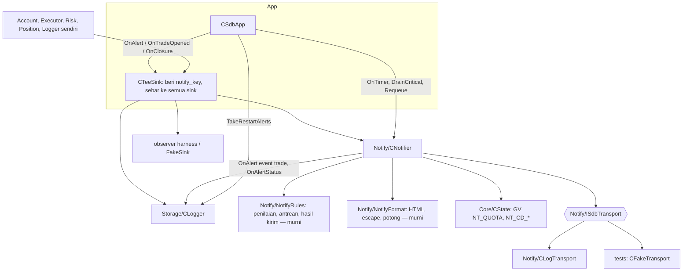

# Design — 08 Notifier core

Status: Done (2026-10-01)
Requirements: [requirements.md](requirements.md) (Approved 2026-10-01) · Keputusan: PC-13

## 1. Overview

`CNotifier` (lapisan Notify) adalah event sink tambahan di `CTeeSink`. Ia menerima `AlertEvent`, `TradeRecord`, dan `ClosureRecord` yang sudah dikirim modul Fase 1, lalu:

1. **Menilai** setiap event dengan fungsi murni di `NotifyRules.mqh`: lolos, `COOLDOWN`, atau `QUOTA`. Cooldown dan kuota lingkup akun memakai Global Variables dengan compare-and-set; lingkup instance memakai memori.
2. **Memformat** pesan HTML gaya bot Python (fungsi murni di `NotifyFormat.mqh`).
3. **Mengantrekan** pesan di memori (Critical di depan, maksimal 100).
4. **Mengirim** paling banyak 2 pesan per `OnTimer` lewat `ISdbTransport` (log di spec ini; Telegram di spec 09; palsu di uji).
5. **Melaporkan** status (`SENT`/`FAILED`/`SKIPPED` + alasan) lewat metode sink baru `OnAlertStatus` ke `CLogger`, yang memperbarui baris `alerts` berdasarkan `notify_key` (skema v3).

Event trade dibuat menjadi `AlertEvent` (`TRADE_OPENED`, `TRADE_CLOSED`) oleh notifier dan dicatat ke `alerts` lewat Logger, sehingga setiap notifikasi punya satu baris (Req 5.1). Notifier tidak pernah menulis DB dan tidak pernah memanggil modul trading (RULES).

Saat init, Logger menandai baris `PENDING` milik instance dari sesi lalu dan mengembalikan Critical yang masih muda untuk diantrekan ulang. Saat deinit, Critical yang tersisa dikirim dalam batas 3 detik.

## 2. Architecture



Dependensi: Notify → Core saja (interface sink, `CState`, tipe, konstanta). App memegang semua dan merangkai. Sesuai tabel lapisan RULES (Notify di bawah App, sejajar Storage).

Urutan `OnTimer` (Req 3.3): akun → `EnsureState` → risk monitor → snapshot → touch GV → **`CNotifier.OnTimer`** → `CLogger.Flush` (status kirim siklus ini ikut ter-flush).

## 3. Components and interfaces

### 3.1 `Core/Types.mqh` dan `Core/EventSink.mqh` (ubah)

- `AlertEvent` ditambah `string key;` (notify key, diisi `CTeeSink` bila kosong).
- Struct baru `AlertStatus` (§4.1).
- `ISdbEventSink` ditambah `void OnAlertStatus(const AlertStatus &s);`. Implementasi kosong di `CNullSink`, `CFakeSink` (direkam), `CScenarioRecorder` (direkam), `CNotifier` (diabaikan).

### 3.2 `App/TeeSink.mqh` (ubah) — Req 1.1, 5.1

Dari dua sink menjadi sampai 4 sink (`Add(ISdbEventSink*)`), sink pertama = Logger (sumber `FindInitialSl`). Membuat kunci notifikasi:

```cpp
void   SetKeyPrefix(const string prefix);   // "<magic>-<TimeLocal init>-<GetTickCount % 100000>"
string NextKey();                           // prefix + "-" + seq, seq naik per alert
void   OnAlert(const AlertEvent &a);        // salin, isi key bila kosong, sebar ke semua sink
```

### 3.3 `Notify/NotifyRules.mqh` (baru, fungsi murni) — Req 2, 3

| Fungsi | Isi | Req |
|---|---|---|
| `ENUM_SDB_NT_SCOPE NtScopeOf(const string type)` | `ACCOUNT` untuk daftar PC-13, lainnya `INSTANCE` | 2.5 |
| `bool NtIsTradeType(const string type)` | `TRADE_OPENED`, `TRADE_CLOSED`, `BE_MOVED`, `PARTIAL_CLOSED` | 2.4 |
| `int NtCooldownSec(ENUM_SDB_SEVERITY sev, const string type)` | Critical/High 0; trade 0; Medium/Info 300 | 2.1–2.4 |
| `bool NtCooldownOk(long lastAt, long now, int cooldownSec)` | `lastAt == 0` atau `now - lastAt >= cooldownSec` | 2.3 |
| `long NtQuotaHour(long now)` | `now / 3600` | 2.6 |
| `bool NtQuotaTake(double gvValue, long now, int limit, double &newValue)` | nilai GV = `jam × 1000 + jumlah`; jam beda → mulai 1; jumlah < limit → +1; selain itu false | 2.6 |
| `bool NtIsStale(ENUM_SDB_SEVERITY sev, long queuedAt, long now)` | non-Critical dan `now - queuedAt > 1800` | 2.7 |
| `int NtPickNext(const SdbNtItem &q[], long now)` | indeks Critical pertama yang siap, lalu non-Critical pertama yang siap; -1 bila tidak ada | 3.2 |
| `int NtOverflowVictim(const SdbNtItem &q[])` | indeks non-Critical tertua, -1 bila semua Critical | 3.7 |
| `ENUM_SDB_NT_NEXT NtAfterResult(const SdbSendResult &r, int attempts)` | `DONE_SENT`, `RETRY`, `WAIT` (dibatasi, attempts tidak naik), `DONE_FAILED` (permanen atau attempts ≥ 3) | 3.4–3.6 |

### 3.4 `Notify/NotifyFormat.mqh` (baru, fungsi murni) — Req 4

| Fungsi | Isi |
|---|---|
| `string NtEscape(const string s)` | `&` → `&amp;`, `<` → `&lt;`, `>` → `&gt;` (urutan `&` dulu) |
| `string NtLevelEmoji(ENUM_SDB_NT_LEVEL lv)` | 🚨 ❌ ⚠️ ℹ️ ✅ |
| `ENUM_SDB_NT_LEVEL NtLevelOf(sev, type, netProfit)` | Critical/High/Medium/Info dari severity; `BE_MOVED`, `PARTIAL_CLOSED` = SUCCESS; `TRADE_CLOSED` SUCCESS bila net > 0, Info bila ≤ 0 |
| `string NtTitle(const string type)` | judul Indonesia per tipe (tabel §4.4); tipe tak dikenal = tipe itu sendiri |
| `string NtHeader(const SdbNtContext &c, ENUM_SDB_NT_LEVEL lv)` | `<emoji> <b>SDBot</b> · <simbol> · <CENT\|REAL\|DEMO\|TESTER> · v<versi>` |
| `string NtFormatAlert(const SdbNtContext &c, const AlertEvent &a)` | header + `<b>judul</b>` + isi ter-escape |
| `string NtFormatOpened(const SdbNtContext &c, const TradeRecord &t)` | §4.4 |
| `string NtFormatClosed(const SdbNtContext &c, const ClosureRecord &cl, const string direction)` | §4.4 |
| `string NtPrice(double p, int digits)`, `NtMoney(double v, string ccy)`, `NtR(double r)`, `NtDuration(long sec)` | digit simbol; 2 desimal + mata uang; `-` untuk `SDB_NULL_DOUBLE`; `3j 25m` / `12m` / `45d` |
| `string NtTruncate(const string html, int maxLen)` | potong ≤ `maxLen` karakter: tidak memotong di dalam tag, entitas, atau pasangan surrogate, menutup tag yang masih terbuka (`b`, `i`, `code`) dalam urutan terbalik, menambah `NtTruncMark()` (`
… (dipotong)`) |
| `string NtCp(uint codePoint)` | satu code point sebagai string UTF-16; semua emoji, `·`, dan `…` dibangun dengan ini agar tidak bergantung encoding file sumber (implementasi) |

### 3.5 `Notify/Transport.mqh` (baru) — Req 3, 7

```cpp
interface ISdbTransport
  {
   SdbSendResult Send(const SdbOutMessage &m);
   string        Name();
  };

class CLogTransport : public ISdbTransport   // live spec 08 dan tester (Req 7.1, 7.3)
  {
   SdbSendResult Send(const SdbOutMessage &m);   // LogInfo("Notify", "[" + key + "] " + text); selalu OK
   string        Name() { return "LOG"; }
  };
```

`CFakeTransport` (tests, `ea/tests/Include/SDBotTests/FakeTransport.mqh`): skrip hasil per kiriman (`Script("OK,TEMP,TEMP,LIMITED:60,PERM")`, berulang di elemen terakhir), `FailType(type)` (tipe yang selalu `TEMP`), merekam `SdbOutMessage`, hasil, waktu, fase pemanggil (`SetPhase`: TIMER, DEINIT, TICK, TRADE), dan nomor siklus timer (`SetCycle`) yang diset harness.

### 3.6 `Notify/Notifier.mqh` (baru) — `CNotifier : public ISdbEventSink`

```cpp
void Init(ISdbEventSink *store, ISdbTransport *transport, const SdbNtContext &ctx);   // store = CLogger
void SetContext(const SdbNtContext &ctx);       // diperbarui setelah validasi akun
void SetState(CState *state);                   // GV akun; NULL = cooldown/kuota akun di memori
void SetKeyPrefix(const string prefix);         // kunci event trade: prefix tee + "-T" + seq notifier
void SetNowOverride(long now);                  // uji; 0 = waktu notifier
// sink
void OnAlert(const AlertEvent &a);              // nilai → antre / SKIPPED
void OnTradeOpened(const TradeRecord &t);       // abaikan RECONCILED (1.4); buat TRADE_OPENED, store.OnAlert, lalu nilai
void OnClosure(const ClosureRecord &c);         // buat TRADE_CLOSED (arah dari cache arah per posisi), store.OnAlert, lalu nilai
// lain: kosong
// siklus
void OnTimer();                                 // buang STALE, kirim ≤ 2 (Req 3.3)
void DrainCritical(const uint maxMs);           // deinit (Req 6.3)
void Requeue(const AlertEvent &a);              // Critical dari sesi lalu (Req 6.2), lewati aturan kirim
int  QueueSize() const;  int HeldInHour() const; // diagnostik dan heartbeat spec 09
```

Arah posisi untuk pesan tutup: `ClosureRecord` tidak membawa arah, jadi notifier menyimpan `positionId → direction` dari `OnTradeOpened` (termasuk `RECONCILED`, hanya tidak diberi pesan); bila tidak ada, arah diambil dari `HistorySelectByPosition` deal pertama, atau `-`.

Penilaian satu event (`Admit`):

1. Optimasi tidak sampai sini (notifier tidak dipasang).
2. Critical → antre di depan.
3. Cooldown dicek tanpa dipakai: lingkup akun dan `CState` siap → GV `NT_CD_<TYPE>` (nilai = waktu notifier terakhir lolos); lingkup instance atau GV belum siap → peta di memori. Masih berlaku → `SKIPPED COOLDOWN`.
4. Kuota (non-Critical): GV `NT_QUOTA` dengan `NtQuotaTake` + compare-and-set (maks `SDB_CAS_RETRY`); GV belum siap → penghitung memori. Habis → `SKIPPED QUOTA`, `HeldInHour` naik.
5. Cooldown dipakai (compare-and-set); kalah dari instance lain di antara langkah 3 dan 5 → `SKIPPED COOLDOWN`. Urutan ini (implementasi, temuan SC-10) mencegah pesan yang ditahan kuota ikut menahan tipenya selama 5 menit.
6. Antre dengan `queuedAt` = waktu notifier. Antrean penuh → korban `NtOverflowVictim` jadi `SKIPPED OVERFLOW`.

Umur pesan dihitung dari `queuedAt` (waktu notifier), **bukan** `AlertEvent.time`: di akhir pekan `TimeCurrent()` berhenti di tick terakhir, sehingga event baru akan tampak berjam-jam tua (EC-04).

Waktu notifier: `TimeTradeServer()` di live, `TimeCurrent()` di tester.

### 3.7 `Storage/Logger.mqh` (ubah) — Req 5, 6

- `SetRouter(ISdbEventSink *router)`: alert milik Logger (DB, migrasi) dikirim ke router (tee) saja, yang lalu memanggil `OnAlert` Logger sendiri; tanpa router, perilaku lama.
- `INSERT alerts` ikut menulis `notify_key`.
- Jenis antrean baru `SDB_Q_ALERT_STATUS` (prioritas sama dengan alert asal): `UPDATE alerts SET status = ?, attempts = ?, sent_at = NULLIF(?, ?91), status_reason = NULLIF(?, '') WHERE login = ? AND notify_key = ?`. Karena satu flush menulis antrean berurutan, update setelah insert di flush yang sama tetap kena barisnya.
- `int TakeRestartAlerts(const long nowUtc, AlertEvent &critical[])`, langsung ke DB saat init (seperti `FindInitialSl`), untuk baris `login + magic + symbol` berstatus `PENDING`:
    1. `time < nowUtc - 1800` → `SKIPPED`, `STALE`;
    2. non-Critical sisanya → `SKIPPED`, `RESTART`;
    3. Critical sisanya → dikembalikan (dengan `notify_key`) untuk `CNotifier.Requeue`.

### 3.8 `App/SdbApp.mqh` (ubah)

- Member `CNotifier m_notifier`, `CLogTransport m_logTransport`, `CTeeSink m_tee` selalu dipakai.
- `OnInit(cfg, observer = NULL, transport = NULL)`: transport NULL → `m_logTransport`.
- `OpenStorage`: bila bukan optimasi, notifier di-init **sebelum** `m_logger.Open` (alert migrasi ikut terkirim); tee = Logger + notifier (+ observer); `m_logger.SetRouter(&m_tee)`; setelah `BeginSession`, `TakeRestartAlerts` → `Requeue`.
- Konteks notifier dibangun App: simbol, versi, digit simbol, mata uang akun, tag akun (`TESTER` di tester, selain itu dari `CAccount` setelah validasi; sebelum itu dari mata uang cent `SDB_CENT_CURRENCIES` atau `DEMO`/`REAL` dari `ACCOUNT_TRADE_MODE`).
- `EnsureState` → `m_notifier.SetState(&m_state)`.
- `OnTimer` → `m_notifier.OnTimer()` sebelum `Flush` (juga saat akun belum PASSED, agar alert init terkirim).
- `OnDeinit` → `m_notifier.DrainCritical(SDB_NT_DRAIN_MS)` sebelum `EndSession`/`Close`; termasuk init gagal (Req 6.4).
- Accessor `Notifier()`, `Sink()` untuk harness.

## 4. Data models

### 4.1 Struct dan enum (`Core/Types.mqh`)

```cpp
enum ENUM_SDB_NT_LEVEL   { SDB_NT_INFO, SDB_NT_SUCCESS, SDB_NT_MEDIUM, SDB_NT_HIGH, SDB_NT_CRITICAL };
enum ENUM_SDB_NT_SCOPE   { SDB_NT_SCOPE_INSTANCE, SDB_NT_SCOPE_ACCOUNT };
enum ENUM_SDB_SEND_CODE  { SDB_SEND_OK, SDB_SEND_TEMP, SDB_SEND_LIMITED, SDB_SEND_PERMANENT };
enum ENUM_SDB_NT_NEXT    { SDB_NT_DONE_SENT, SDB_NT_RETRY, SDB_NT_WAIT, SDB_NT_DONE_FAILED };

struct SdbNtContext   { string symbol; string accountTag; string eaVersion; string currency; int digits; };
struct SdbOutMessage  { string key; string text; bool silent; ENUM_SDB_SEVERITY severity; };
struct SdbSendResult  { ENUM_SDB_SEND_CODE code; int retryAfterSec; string error; };
struct SdbNtItem      { SdbOutMessage msg; long queuedAt; int attempts; long notBefore; };
struct AlertStatus    { string key; string status; int attempts; datetime sentAt; string reason; };  // sentAt 0 = NULL
```

### 4.2 Konstanta (`Core/Constants.mqh`)

| Konstanta | Nilai | Asal |
|---|---|---|
| `SDB_NT_COOLDOWN_SEC` | 300 | PRD (Medium), PC-13 (Info) |
| `SDB_NT_QUOTA_PER_HOUR` | 20 | PRD |
| `SDB_NT_STALE_SEC` | 1800 | PRD |
| `SDB_NT_QUEUE_MAX` | 100 | PC-13 |
| `SDB_NT_MAX_PER_TIMER` | 2 | PC-13 |
| `SDB_NT_MAX_ATTEMPTS` | 3 | PRD |
| `SDB_NT_MAX_LEN` | 4096 | batas Telegram |
| `SDB_NT_QUOTA_HOUR_FACTOR` | 1000 | §4.5 (penanda potong menjadi fungsi `NtTruncMark()`, bukan konstanta) |
| `SDB_NT_DRAIN_MS` | 3000 | Req 6.3 |
| `SDB_GV_NT_QUOTA`, `SDB_GV_NT_CD_PREFIX` | `"NT_QUOTA"`, `"NT_CD_"` | §3.6 |

Tidak ada input baru di spec ini (token, chat ID, `HeartbeatMinutes` di spec 09).

### 4.3 Skema v3 (`shared/schema/migrations/data/0003_alert_notify.sql`)

```sql
ALTER TABLE alerts ADD COLUMN notify_key TEXT;
ALTER TABLE alerts ADD COLUMN status_reason TEXT;
UPDATE alerts SET notify_key = 'row-' || id WHERE notify_key IS NULL;
CREATE INDEX ix_alerts_login_key ON alerts (login, notify_key);
```

- `enums.md`: `alert_type` + `TRADE_OPENED`, `TRADE_CLOSED`; enum baru `alert_status_reason` (`COOLDOWN`, `QUOTA`, `STALE`, `OVERFLOW`, `RESTART`, `TRANSPORT_TEMP`, `TRANSPORT_PERMANENT`; CHECK tidak, karena spec 09 menambah kode Telegram).
- Severity di DB tetap `INFO..CRITICAL`; level SUCCESS hanya tampilan (disimpulkan dari tipe dan profit), tidak disimpan. Ini mempersempit keputusan 8 requirements ("level SUCCESS") agar tidak perlu membangun ulang tabel demi `CHECK`.
- Alur skema spec 03: `schema.py new data "alert notify"` → SQL → `schema.py build` (Migrations.mqh, SchemaEnums.mqh, snapshot, fixture) → blok `-- @version 3` di `seed_sample.sql` (contoh `SENT`, `SKIPPED QUOTA`, `TRADE_CLOSED`).

### 4.4 Format pesan

| Tipe | Judul |
|---|---|
| `TRADE_OPENED` / `TRADE_CLOSED` | Posisi dibuka / Posisi ditutup: `<alasan>` |
| `BE_MOVED` / `PARTIAL_CLOSED` | SL ke break-even / Partial close |
| `SL_RESTORED` / `SL_MISSING` | SL dipasang kembali / Posisi tanpa SL |
| `DD_INFO` / `DD_REDUCE` / `DD_STOP` / `DD_RECOVERED` | Drawdown 5% / Drawdown 10%: lot × 0.5 / Drawdown 15%: emergency stop / Drawdown pulih |
| `DAILY_LOSS` / `MARGIN_LOW` / `MARGIN_OK` | Rugi harian: entry di-pause / Margin rendah / Margin normal |
| `CLOSE_ALL_FAILED` / `EMERGENCY_RESET` / `STATE_RESET` | Close all gagal / Emergency stop dibuka / Status bersama di-reset |
| `CONN_DOWN` / `CONN_UP` | Koneksi terputus / Koneksi pulih |
| `ORDER_FAILED` / `MODIFY_FAILED` | Order gagal / Modifikasi posisi gagal |
| `BALANCE_OP` / `ACCOUNT_REJECTED` | Operasi saldo / Akun ditolak |
| `DB_UNAVAILABLE` / `DB_RECOVERED` / `DB_NEWER_SCHEMA` / `MIGRATION_FAILED` | Database tidak bisa ditulis / Database pulih / Database versi lebih baru / Migrasi database gagal |

Contoh (EURUSDc cent, 5 digit):

```html
ℹ️ <b>SDBot</b> · EURUSDc · CENT · v1.07
<b>Posisi dibuka</b>
📊 BUY <code>0.10</code> @ <code>1.08345</code>
🛑 SL <code>1.08145</code> · 🎯 TP <code>1.08745</code>
⚖️ Risiko <code>0.50%</code> (<code>20.00 USC</code>)
🆔 <code>123456</code>
```

```html
✅ <b>SDBot</b> · USDJPYc · CENT · v1.07
<b>Posisi ditutup: TP</b>
📊 SELL <code>0.10</code> · 🆔 <code>123457</code>
💵 Profit <b>41.20 USC</b> · R <code>2.06</code>
⏱️ Lama <code>3j 25m</code>
```

Alert: header, `<b>judul</b>`, lalu `AlertEvent.message` ter-escape. Semua pesan `silent = false` (Req 4.6).

### 4.5 Global Variables (prefix akun dari `CState`)

| Nama | Nilai | Penulis |
|---|---|---|
| `NT_QUOTA` | `jam × 1000 + jumlah`, jam = `waktu / 3600` (nilai ~4.9e8, pas di double) | semua instance, compare-and-set |
| `NT_CD_<TYPE>` | waktu notifier terakhir lolos | semua instance, compare-and-set, hanya tipe lingkup akun |

Ikut `TouchAll` lewat `CState.Get`. Dibuat bila belum ada dengan `GlobalVariableSet(…, 0)`; dua instance yang membuat bersamaan paling buruk menghasilkan satu pesan dobel (diterima, EC-14).

## 5. Error handling

| Kegagalan | Deteksi | Tindakan | Log |
|---|---|---|---|
| Transport gagal sementara | `SDB_SEND_TEMP` | ulangi di siklus berikutnya; ke-3 → `FAILED TRANSPORT_TEMP` | WARN throttled per tipe |
| Transport dibatasi | `SDB_SEND_LIMITED` + `retryAfterSec` | `notBefore = now + retryAfter` untuk seluruh antrean; percobaan tidak dihitung | INFO |
| Transport permanen | `SDB_SEND_PERMANENT` | `FAILED TRANSPORT_PERMANENT`, tanpa retry | ERROR |
| Antrean penuh | ukuran = 100 | non-Critical tertua `SKIPPED OVERFLOW` | WARN throttled |
| CAS kuota/cooldown kalah terus | `SDB_CAS_RETRY` habis | perlakukan sebagai tidak lolos (`QUOTA`/`COOLDOWN`), bukan kirim ganda | ERROR throttled |
| GV belum siap (akun PENDING) | `CState` NULL / tidak siap | cooldown dan kuota akun di memori | — |
| DB tidak tersedia | Logger nonaktif | pesan tetap terkirim; status tidak tersimpan | WARN DB yang sudah ada |
| Deinit habis waktu | `GetTickCount` > 3000 ms | berhenti; sisa tetap `PENDING` | WARN |
| Error tak terduga di notifier | — | tidak pernah memanggil Execution/Risk; trading jalan terus (Req 1.5) | ERROR |

## 6. Test case catalogue

### 6.1 Unit test — suite `TestNotifyRules.mqh` (TC-NT)

| ID | Fungsi | Input | Harapan | Req |
|---|---|---|---|---|
| TC-NT-01 | `NtScopeOf` | `DD_STOP`, `CONN_DOWN`, `BALANCE_OP` | ACCOUNT | 2.5 |
| TC-NT-02 | `NtScopeOf` | `ORDER_FAILED`, `SL_RESTORED`, `TRADE_OPENED`, `FOO` | INSTANCE | 2.5 |
| TC-NT-03 | `NtCooldownSec` | Critical `DD_STOP`; High `DD_REDUCE` | 0; 0 | 2.1, 2.2 |
| TC-NT-04 | `NtCooldownSec` | Medium `CONN_DOWN`; Info `DD_INFO` | 300; 300 | 2.3, 2.4 |
| TC-NT-05 | `NtCooldownSec` | Info `BE_MOVED`, `PARTIAL_CLOSED`, `TRADE_CLOSED` | 0 | 2.4 |
| TC-NT-06 | `NtCooldownOk` | last 0; last = now − 299; last = now − 300 | true; false; true | 2.3 |
| TC-NT-07 | `NtQuotaTake` | GV 0, now = 10 jam | true, nilai `10×1000+1` | 2.6 |
| TC-NT-08 | `NtQuotaTake` | jam sama, jumlah 19 | true, jumlah 20 | 2.6 |
| TC-NT-09 | `NtQuotaTake` | jam sama, jumlah 20 | false, nilai tetap | 2.6 |
| TC-NT-10 | `NtQuotaTake` | jam lalu, jumlah 20 | true, jam baru jumlah 1 | 2.6 |
| TC-NT-11 | `NtIsStale` | Info, umur 1800; 1801 | false; true | 2.7 |
| TC-NT-12 | `NtIsStale` | Critical, umur 7200 | false | 2.7 |
| TC-NT-13 | `NtPickNext` | [Info, Medium, Critical] | indeks 2 | 3.2 |
| TC-NT-14 | `NtPickNext` | [Info(t=1), Info(t=2)] | indeks 0 (FIFO) | 3.2 |
| TC-NT-15 | `NtPickNext` | semua `notBefore > now` | -1 | 3.5 |
| TC-NT-16 | `NtOverflowVictim` | [Critical, Info(t=5), Medium(t=3)] | indeks 2 | 3.7 |
| TC-NT-17 | `NtOverflowVictim` | semua Critical | -1 | 3.7 |
| TC-NT-18 | `NtAfterResult` | OK | DONE_SENT | 3.4 |
| TC-NT-19 | `NtAfterResult` | TEMP, attempts 1; 2; 3 | RETRY; RETRY; DONE_FAILED | 3.4 |
| TC-NT-20 | `NtAfterResult` | LIMITED 60, attempts 2 | WAIT | 3.5 |
| TC-NT-21 | `NtAfterResult` | PERMANENT, attempts 1 | DONE_FAILED | 3.6 |

### 6.2 Unit test — suite `TestNotifyFormat.mqh` (TC-NF)

| ID | Fungsi | Input | Harapan | Req |
|---|---|---|---|---|
| TC-NF-01 | `NtEscape` | `margin < 300% & R>2` | `margin &lt; 300% &amp; R&gt;2` | 4.3 |
| TC-NF-02 | `NtEscape` | teks mentah `&amp;` | `&amp;amp;` (input selalu dianggap teks mentah) | 4.3 |
| TC-NF-03 | `NtHeader` | Critical, EURUSDc, CENT, 1.07 | `🚨 <b>SDBot</b> · EURUSDc · CENT · v1.07` | 4.1 |
| TC-NF-04 | `NtHeader` | tag TESTER | memuat `· TESTER ·` | 4.1 |
| TC-NF-05 | `NtLevelOf` | `TRADE_CLOSED` net 0.01; 0; −5 | SUCCESS; INFO; INFO | 1.3 |
| TC-NF-06 | `NtLevelOf` | `BE_MOVED`, `PARTIAL_CLOSED` | SUCCESS | 4.1 |
| TC-NF-07 | `NtPrice` | 151.234, digit 3; 1.08345, 5; 2345.67, 2 | `151.234`; `1.08345`; `2345.67` | 4.4 |
| TC-NF-08 | `NtMoney` | 41.2, `USC` | `41.20 USC` | 4.4 |
| TC-NF-09 | `NtR` | 2.0567; `SDB_NULL_DOUBLE` | `2.06`; `-` | 1.3, 4.4 |
| TC-NF-10 | `NtDuration` | 45; 720; 12300; 90000 | `45d`; `12m`; `3j 25m`; `25j 0m` | 1.3 |
| TC-NF-11 | `NtFormatOpened` | trade BUY contoh §4.4 | sama persis dengan contoh | 1.2 |
| TC-NF-12 | `NtFormatClosed` | closure TP profit, R 2.06, 12300 s | sama persis dengan contoh | 1.3 |
| TC-NF-13 | `NtFormatAlert` | `DD_STOP`, pesan berisi `<` | judul benar, isi ter-escape | 4.2, 4.3 |
| TC-NF-14 | `NtTitle` | tipe `FOO_BAR` | `FOO_BAR` | 4.2 |
| TC-NF-15 | `NtTruncate` | teks 5000 karakter tanpa tag | panjang ≤ 4096, diakhiri penanda | 4.5 |
| TC-NF-16 | `NtTruncate` | batas jatuh di dalam `<code>…` | `</code>` ditutup sebelum penanda, ≤ 4096 | 4.5 |
| TC-NF-17 | `NtTruncate` | batas jatuh di tengah `&amp;` atau di dalam `<b` | entitas/tag tidak terpotong | 4.5 |
| TC-NF-18 | `NtTruncate` | teks 4096 persis | tidak berubah | 4.5 |

### 6.3 Unit test — suite `TestNotifier.mqh` (TC-NR, `CNotifier` + `CFakeTransport` + `CFakeSink`, waktu di-override, prefix GV `SDBTEST`)

| ID | Skenario | Harapan | Req |
|---|---|---|---|
| TC-NR-01 | `OnAlert` Info lalu `OnTimer` | 1 pesan di transport; status `SENT` attempts 1 dengan `key` yang sama | 1.1, 5.2 |
| TC-NR-02 | `OnTradeOpened` EA | store menerima `TRADE_OPENED` + pesan terkirim | 1.2, 5.1 |
| TC-NR-03 | `OnTradeOpened` RECONCILED | tidak ada pesan, tidak ada baris | 1.4 |
| TC-NR-04 | `OnTradeOpened` lalu `OnClosure` | pesan tutup memakai arah dari pembukaan | 1.3 |
| TC-NR-05 | 5 Info masuk, 1 Critical masuk, `OnTimer` | Critical dikirim pertama | 3.2 |
| TC-NR-06 | 5 pesan, satu `OnTimer` | 2 terkirim, 3 tersisa | 3.3 |
| TC-NR-07 | Medium `CONN_DOWN` dua kali dalam 299 s; ketiga di 300 s | ke-2 `SKIPPED COOLDOWN`; ke-3 lolos | 2.3, 2.8 |
| TC-NR-08 | Dua notifier (dua magic) GV sama, `CONN_DOWN` bersamaan | satu lolos, satu `COOLDOWN` | 2.5, EC-01 |
| TC-NR-09 | Dua notifier, `ORDER_FAILED` masing-masing | keduanya lolos (lingkup instance) | 2.5 |
| TC-NR-10 | 21 tipe Info berbeda dalam satu jam (dua notifier bergantian) | 20 lolos, 1 `SKIPPED QUOTA`; `HeldInHour` = 1 | 2.6, EC-02 |
| TC-NR-11 | Kuota habis, lalu `DD_STOP` | Critical lolos; nilai GV kuota tidak berubah | 2.1, EC-03 |
| TC-NR-12 | Info antre, transport LIMITED 3600 | setelah 1801 s: `SKIPPED STALE`; Critical tetap antre | 2.7, 3.5, EC-16 |
| TC-NR-13 | Transport TEMP terus | 3 percobaan di 3 siklus lalu `FAILED TRANSPORT_TEMP` | 3.4 |
| TC-NR-14 | Transport PERM | `FAILED` attempts 1 | 3.6 |
| TC-NR-15 | Transport LIMITED 60 lalu OK | tidak ada kiriman selama 60 s; attempts akhir 1 | 3.5 |
| TC-NR-16 | 101 Info (kuota dimatikan lewat GV jam lain) dengan 1 Critical di awal | Info tertua `SKIPPED OVERFLOW`, Critical tetap | 3.7, EC-10 |
| TC-NR-17 | `DrainCritical` dengan 2 Critical + 3 Info | 2 Critical terkirim, Info tidak | 6.3 |
| TC-NR-18 | `Requeue` Critical | terkirim dengan `key` asal, tanpa cek kuota | 6.2 |
| TC-NR-19 | `SetState(NULL)` (akun PENDING) | cooldown/kuota akun di memori, tidak error | 2.5, 2.6 |
| TC-NR-20 | GV `NT_QUOTA` dihapus di tengah | penghitung mulai dari 1 | EC-14 |
| TC-NR-21 | `queuedAt` dari waktu notifier walau `AlertEvent.time` 10 jam lalu | tidak `STALE` | 2.9, EC-04 |
| TC-NR-22 | Medium ditahan `QUOTA` 100 detik sebelum jam berganti; tipe sama 150 detik kemudian (jam baru) | lolos, cooldown tidak terpakai oleh pesan yang ditahan (temuan SC-10) | 2.3, 2.6 |

### 6.4 Unit test — Logger dan tee (suite `TestLogger.mqh`, `TestEventSink.mqh`, DB unittest)

| ID | Skenario | Harapan | Req |
|---|---|---|---|
| TC-LG-30 | Alert + `OnAlertStatus SENT` dalam satu flush | baris `SENT`, `attempts`, `sent_at`, `notify_key` terisi | 5.2 |
| TC-LG-31 | Status `SKIPPED QUOTA` di flush berikutnya | `status_reason = QUOTA` | 2.8, 5.2 |
| TC-LG-32 | `TakeRestartAlerts`: PENDING Info 40 menit, Info 5 menit, Critical 5 menit, Critical 40 menit, baris magic lain | STALE; RESTART; dikembalikan; STALE; baris lain tidak berubah | 6.1, 6.2 |
| TC-LG-33 | Logger dengan router: `RaiseAlert` | router menerima satu kali, baris DB satu | 1.1 |
| TC-ES-10 | Tee: alert tanpa key | semua sink menerima key yang sama, unik per alert | 5.1 |
| TC-ES-11 | Tee: alert dengan key | key tidak diganti (requeue) | 6.2 |
| TC-ES-12 | Tee: `OnAlertStatus` | diteruskan ke semua sink | 5.3 |
| TC-APP-09 | App + transport palsu: alert lewat `Sink()` | terkirim (tag `TESTER`), baris `SENT` dengan `notify_key` | 1.1, 7.1 |
| TC-APP-10 | App dengan `dbTarget` NONE | notifier tidak dipasang, tidak ada kiriman | 7.2 |
| TC-APP-11 | App init gagal (suffix salah) | `ACCOUNT_REJECTED` terkirim saat deinit, `SENT` | 6.3, 6.4 |
| TC-APP-12 | posisi sungguhan TC-APP-08 | `TRADE_OPENED` dan `TRADE_CLOSED` `SENT` | 1.2, 1.3 |

### 6.5 Python (`sdbot/tools/tests`)

| ID | Isi | Req |
|---|---|---|
| TS-30 | `schema.py check` lulus dengan migrasi 0003; snapshot berisi `notify_key`, `status_reason`, indeks | 5.2 |
| TS-31 | Fixture v3: baris lama mendapat `notify_key = 'row-<id>'`; seed v3 berisi status `SENT` dan `SKIPPED` | 5.2 |
| TS-32 | Query `alerts_by_severity.sql` tetap lolos di fixture v3 | 5.2 |

### 6.6 Skenario Strategy Tester — SC-10 `notifier`

Harness: input baru `HarnessTransportScript` (skrip `CFakeTransport`; kosong = transport log), `HarnessTransportFailType` (tipe yang selalu gagal sementara), `HarnessAlertBurstAtBar` (lewat `App.Sink()`: 2× `ORDER_FAILED` Medium bersamaan, satu alert tipe gagal, lalu 25 alert Info tipe `TEST_BURST_nn`).

- **Given** EURUSDc M15 2026.09.14–26, setup drawdown SC-03 (lot × 0.5 di 1%, STOP di 2%, risiko 1%), entry tiap 4 bar (SL 100, TP 100), transport `OK` dengan `TEST_FAIL` selalu `TEMP`, burst di bar 20.
- **When** run selesai.
- **Then**:
    1. setiap trade EA punya tepat satu `TRADE_OPENED` dan setiap closure satu `TRADE_CLOSED` di transport palsu, dengan simbol, arah, volume, dan R sesuai DB (Req 1.2, 1.3);
    2. `DD_STOP` terkirim sebelum pesan non-Critical yang antre di siklus yang sama (Req 3.2);
    3. `ORDER_FAILED` pertama `SENT`, kedua `SKIPPED COOLDOWN` (Req 2.3);
    4. tidak ada jam server dengan > 20 pesan non-Critical terkirim, dan ada ≥ 1 `SKIPPED QUOTA` (Req 2.6);
    5. `TEST_FAIL` dikirim 3 kali lalu `FAILED TRANSPORT_TEMP` (Req 3.4);
    6. jumlah baris `SENT` = jumlah kiriman OK di transport, jumlah `PENDING` = sisa antrean notifier setelah deinit, semua baris punya `notify_key` (Req 5.1, 5.2);
    7. tidak ada pesan yang diserahkan ke transport dari `OnTick`/`OnTradeTransaction` (transport palsu mencatat sumber panggilan) (Req 3.1);
    8. jumlah pesan per siklus timer ≤ 2 (Req 3.3), dihitung per nomor siklus dari harness karena `TimeCurrent` di tester (Model 1) tidak maju di setiap siklus timer.

Skenario lama SC-00..SC-09 tetap PASS (notifier ikut aktif dengan transport log). SC-09 tetap membuktikan optimasi tanpa DB, dan harness mengecek tidak ada notifier terpasang di optimasi (Req 7.2).

### 6.7 Manual

| ID | Isi | Req |
|---|---|---|
| MC-NT-01 | EA live (cent) 1 jam dengan transport log: pesan start-up dan snapshot di log Experts berformat §4.4, baris `alerts` berstatus `SENT` | 7.3 |

## 7. Traceability

| Req | Komponen | Tes |
|---|---|---|
| 1.1 | TeeSink, Logger router, Notifier.OnAlert | TC-NR-01, TC-LG-33, TC-ES-10 |
| 1.2–1.4 | Notifier.OnTradeOpened/OnClosure, NotifyFormat | TC-NF-05, -11, -12, TC-NR-02..04, SC-10(1) |
| 1.5 | Notifier (tanpa dependensi trading) | review dependensi, regresi SC-00..09 |
| 2.1–2.5 | NotifyRules, Notifier.Admit, GV | TC-NT-01..06, TC-NR-07..09, -11, SC-10(3) |
| 2.6 | NtQuotaTake, GV `NT_QUOTA` | TC-NT-07..10, TC-NR-10, -11, -20, SC-10(4) |
| 2.7, 2.9 | NtIsStale, waktu notifier | TC-NT-11, -12, TC-NR-12, -21 |
| 2.8 | AlertStatus, Logger update | TC-NR-07, TC-LG-31 |
| 3.1–3.3 | Notifier.OnTimer, SdbApp.OnTimer | TC-NT-13..15, TC-NR-05, -06, SC-10(2, 7, 8) |
| 3.4–3.7 | NtAfterResult, NtOverflowVictim | TC-NT-16..21, TC-NR-13..16, SC-10(5) |
| 4.1–4.6 | NotifyFormat | TC-NF-01..18 |
| 5.1–5.4 | Logger `notify_key`, `SDB_Q_ALERT_STATUS`, skema v3 | TC-LG-30..31, TS-30..32, SC-10(6) |
| 6.1–6.2 | Logger.TakeRestartAlerts, Notifier.Requeue | TC-LG-32, TC-NR-18, TC-ES-11 |
| 6.3–6.4 | Notifier.DrainCritical, SdbApp.OnDeinit | TC-NR-17 |
| 7.1–7.4 | CLogTransport, CFakeTransport, SdbApp | SC-10, SC-09, MC-NT-01 |
| 8.1–8.2 | versi, flows, CHANGELOG | review |

## 8. Keputusan yang perlu disetujui

1. **Level SUCCESS tidak disimpan di DB**; severity di `alerts` tetap `INFO`, SUCCESS hanya tampilan (dihitung dari tipe dan profit). Menghindari membangun ulang tabel `alerts` hanya untuk `CHECK`. Alternatif: tambah `SUCCESS` ke enum severity (migrasi rebuild tabel).
2. **`ISdbEventSink` ditambah `OnAlertStatus`** sebagai jalur status kirim ke Storage. Alternatif: notifier memegang pointer `CLogger` langsung (melanggar arah Notify → Core).
3. **Kunci notifikasi dibuat `CTeeSink`** (`<magic>-<waktu init>-<tick>-<seq>`), bukan ID baris DB, karena baris belum ada sampai flush dan DB bisa tidak tersedia.
4. **`BE_MOVED` dan `PARTIAL_CLOSED` level SUCCESS ✅** (seperti partial di bot Python); `TRADE_OPENED` Info.
5. **Penanda akun `TESTER`** di tester menggantikan CENT/REAL, agar pesan dari backtest tidak pernah tertukar (python-bot-lessons §3).
6. **Satu siklus timer**: notifier jalan sebelum flush, juga saat akun belum PASSED, agar alert init dan `ACCOUNT_REJECTED` tetap keluar.
7. **Harness memakai tipe alert `TEST_BURST_nn`** untuk menguji kuota; tipe ini tidak masuk `enums.md` karena hanya ada di DB tester.

## Pertanyaan terbuka

- Tidak ada.
