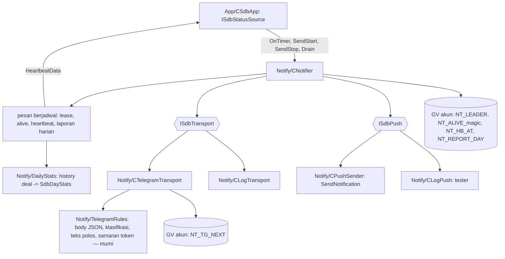

# Design — 09 Notifier Telegram

Status: Done (2026-10-02)
Requirements: [requirements.md](requirements.md) (Approved 2026-10-02) · Keputusan: PC-14 · Dasar: [spec 08 design](../ea-08-notifier-core/design.md)

## 1. Overview

Spec 08 sudah menyediakan `CNotifier` dengan antrean, aturan kirim, status di DB, dan transport yang bisa diganti. Spec ini menambah:

1. **`CTelegramTransport`**: `WebRequest` POST JSON ke `sendMessage`, klasifikasi respons lewat fungsi murni, jarak kirim 1 detik dan jeda 429 bersama di Global Variable, kirim ulang teks polos bila HTML ditolak, dan status "nonaktif" setelah error konfigurasi.
2. **`CPushSender`**: `SendNotification` dengan batas 2/detik dan 10/menit; dipakai notifier untuk Critical yang gagal di Telegram atau saat Telegram nonaktif.
3. **Pesan berjadwal di `CNotifier`**: lease pemimpin, penanda hidup, heartbeat, laporan harian (dari history deal), pesan start dan stop. Semuanya lewat antrean yang sama, ditandai "lewati aturan" (tanpa cooldown dan kuota).
4. **Input** `InpTelegramToken`, `InpTelegramChatID`, `InpHeartbeatMinutes`; token dan chat ID tidak masuk JSON input sesi.
5. **Skrip** `tools/make_local_presets.py` dan preset repo yang memuat input baru (kosong).

App memilih transport: tester dan token kosong → `CLogTransport`; live dengan token → `CTelegramTransport`. Push di tester memakai pencatat log (tanpa `SendNotification`).

## 2. Architecture



Dependensi tetap Notify → Core. `IsSdbotMagic` dipindah dari `Risk/RiskMath.mqh` ke `Core/Utils.mqh` (fungsi murni; RiskMath memakai yang di Core) karena laporan harian butuh filter blok magic yang sama. Data risiko untuk heartbeat datang dari App lewat interface `ISdbStatusSource` (Notify tidak meng-include Risk).

## 3. Components and interfaces

### 3.1 `Notify/TelegramRules.mqh` (baru, murni) — Req 1.3, 2.2–2.4, 3.1

| Fungsi | Isi | Req |
|---|---|---|
| `string TgJsonEscape(const string s)` | `"` `\` dan kontrol (`\n`, `\r`, `\t`, `< 0x20` → `\u00XX`) | 2.1 |
| `string TgBody(const string chatId, const string text, const bool silent, const bool html)` | `{"chat_id":"…","text":"…","disable_notification":true/false[,"parse_mode":"HTML"]}` | 2.1, 2.4 |
| `string TgUrl(const string token)` | `https://api.telegram.org/bot<token>/sendMessage` | 2.1 |
| `string TgMask(const string s, const string token)` | ganti token dengan `***` | 1.3 |
| `int TgRetryAfter(const string body)` | angka setelah `"retry_after":`, 0 bila tidak ada | 2.2 |
| `ENUM_SDB_TG_OUTCOME TgClassify(const int http, const int wrError, const string body)` | lihat tabel §4.3 | 2.2, 2.3 |
| `bool TgIsParseError(const string body)` | 400 dengan `can't parse entities` | 2.4 |
| `string NtPlainText(const string html)` | buang tag, kembalikan `&lt;` `&gt;` `&amp;` | 2.4, 3.1 |
| `string NtPushText(const string plain, const int maxLen)` | teks polos (penanda, judul, isi) dipotong ke `maxLen` (255) dengan `…`, baris baru jadi spasi | 3.1 |
| `bool PushAllowed(const ulong &sentMs[], const ulong nowMs)` | < 2 dalam 1000 ms terakhir dan < 10 dalam 60000 ms terakhir | 3.4 |

### 3.2 `Notify/Schedule.mqh` (baru, murni) — Req 4–6

| Fungsi | Isi | Req |
|---|---|---|
| `double LeaseEncode(const int idx, const long at)` | `idx × 1e10 + at`, idx = magic − 2026091900 (0..99) | 4.1 |
| `void LeaseDecode(const double v, int &idx, long &at)` | kebalikan | 4.1 |
| `bool LeaseCanTake(const double cur, const int myIdx, const long now, const int ttl)` | kosong, milik sendiri, atau `now − at ≥ ttl` | 4.1, 4.2 |
| `bool HeartbeatDue(const long lastAt, const long now, const int minutes)` | `minutes > 0` dan `now − lastAt ≥ minutes × 60` | 5.1 |
| `int  ReportDays(const long lastReportedDay, const long todayStart, long &days[])` | hari `lastReportedDay + 1 hari` … `todayStart − 1 hari`, maks 7 terakhir | 6.1, 6.4 |
| `long ServerDayStart(const long t)` | `t − t % 86400` | 6.1 |
| `SdbDayStats DayStats(const SdbDealRow &rows[], const long &openIds[], const long dayStart)` | agregasi §4.2 | 6.2 |

### 3.3 `Notify/NotifyFormat.mqh` (tambah) — Req 5.2, 6.2, 7.1, 7.2

`NtFormatHeartbeat(ctx, SdbHeartbeat)`, `NtFormatDailyReport(ctx, SdbDayStats, day)`, `NtFormatStart(ctx, SdbStartInfo)`, `NtFormatStop(ctx, reasonText)`. Gaya bot Python, contoh §4.4.

### 3.4 `Notify/TelegramTransport.mqh` (baru) — `CTelegramTransport : ISdbTransport`

```cpp
void Init(const string token, const string chatId, CState *state);   // state: GV NT_TG_NEXT (boleh NULL sampai akun PASSED)
void SetState(CState *state);
SdbSendResult Send(const SdbOutMessage &m);
string Name();                 // "TELEGRAM"
bool   IsDisabled() const;     // setelah error konfigurasi (Req 2.3)
string DisabledReason() const;
```

`Send`:
1. Nonaktif → `PERMANENT`, `note = TELEGRAM_OFF`.
2. Jarak kirim (Req 2.5): GV `NT_TG_NEXT` (ms `GetTickCount64`, sama untuk semua EA di satu terminal) > sekarang → `LIMITED`, `retryAfterSec` = sisa dibulatkan ke atas (tidak dihitung percobaan).
3. Pasang `NT_TG_NEXT = sekarang + 1000` dengan compare-and-set; kalah → `LIMITED 1`.
4. `WebRequest("POST", url, "Content-Type: application/json\r\n", 3000, data UTF-8, result, headers)`.
5. `TgClassify` → hasil. 429: `NT_TG_NEXT = sekarang + retry_after × 1000` (Req 2.5). Error parse HTML: kirim ulang sekali `TgBody(..., html=false)` dengan `NtPlainText`, `note = PLAIN_TEXT`. Gagal sementara: `retryAfterSec = 10` (Req 2.6). Konfigurasi: nonaktif + `disable = true`.
6. Log memakai `TgMask`.

### 3.5 `Notify/Push.mqh` (baru)

```cpp
interface ISdbPush { int Send(const string text); };   // 0 OK, 1 ditunda (batas), 2 gagal, 3 belum dikonfigurasi
class CPushSender : public ISdbPush   // live: PushAllowed, SendNotification, ERR_NOTIFICATION_WRONG_SETTINGS -> 3, TOO_FREQUENT -> 1
class CLogPush    : public ISdbPush   // tester: LogInfo("Notify", "push: " + text), selalu 0
```

### 3.6 `Notify/Notifier.mqh` (ubah)

Tambahan publik:

```cpp
void SetPush(ISdbPush *push);
void SetStatusSource(ISdbStatusSource *src);     // App: data heartbeat
void SetSchedule(const int heartbeatMinutes, const int magic);
void SendStart(const SdbStartInfo &info);         // lewat antrean, lewati aturan
void SendStop(const int reason);                  // dipanggil App sebelum Drain
void Drain(const uint maxMs);                     // ganti DrainCritical: Critical lalu EA_STOP
void ReleaseLeader();                             // OnDeinit
```

Perubahan perilaku:

- `Admit(a, text, bypass)`: `bypass = true` untuk `EA_START`, `EA_STOP`, `HEARTBEAT`, `DAILY_REPORT` → langsung antre (Req 5.3, 7.3). `SdbOutMessage.silent = true` untuk keempatnya (Req 5.1, 7.1, 7.2).
- `Deliver`: hasil `TEMP` dengan `retryAfterSec > 0` → jeda antrean instance selama itu (Req 2.6). Hasil dengan `note` (`PLAIN_TEXT`) masuk `status_reason` bila `SENT`.
- Critical `FAILED` atau transport `disable`/`TELEGRAM_OFF` → push (Req 3.1): status `FAILED` dengan alasan `PUSH_SENT`/`PUSH_FAILED`; push ditunda disimpan di antrean push kecil (maks 20) dan dicoba tiap `OnTimer`. Non-Critical saat Telegram nonaktif → `FAILED TELEGRAM_OFF`.
- `disable` pertama kali → `LogCritical` + satu push "Telegram nonaktif: <alasan, cara memperbaiki>" (Req 2.3). Push belum dikonfigurasi → satu `LogCritical` per sesi (Req 3.3).
- `OnTimer`: sebelum kirim, `RunSchedule(now)`:
    1. tiap 30 detik: GV `NT_ALIVE_<magic> = now`; coba/perbarui lease `NT_LEADER` (CAS, TTL 120).
    2. pemimpin: `HeartbeatDue(GV NT_HB_AT)` → CAS `NT_HB_AT` lalu antre heartbeat (data dari `ISdbStatusSource` + instance hidup dari `NT_ALIVE_*` ≥ now − 120 + `HeldInHour` akun dari GV `NT_HELD`).
    3. pemimpin: `ReportDays(GV NT_REPORT_DAY, ServerDayStart(now))` → per hari: CAS `NT_REPORT_DAY` ke hari itu, hitung `DayStats` dari history, antre bila ada aktivitas (Req 6.3).
    GV `NT_HB_AT` dan `NT_REPORT_DAY` yang belum ada diisi waktu sekarang / hari ini (tidak ada heartbeat atau laporan retroaktif saat pemasangan pertama).
- Kuota yang ditahan dihitung per akun: GV `NT_HELD` = `jam × 1000 + jumlah` (pola sama dengan `NT_QUOTA`); heartbeat menampilkan nilai jam sebelumnya.

### 3.7 `Notify/DailyStats.mqh` (baru)

`bool CollectDay(const long dayStart, SdbDealRow &rows[], long &openIds[])`: `HistorySelect(dayStart, dayStart + 86400)`; baris deal posisi SDBot (`IsSdbotMagic`) berjenis BUY/SELL, plus deal `BALANCE`/`CREDIT`; untuk posisi dengan deal keluar hari itu, `HistorySelectByPosition` menambahkan deal hari lain (net posisi utuh untuk win rate); `openIds` = posisi yang masih terbuka (partial hari itu, belum tutup).

### 3.8 `App/SdbApp.mqh` (ubah)

- `CSdbApp : public ISdbStatusSource` → `bool HeartbeatData(SdbHeartbeat &h)` dari `CAccount`, `CRiskState` (puncak, `IsStopped`, `IsDailyPaused`, `IsLotReduced`), jumlah posisi SDBot di akun.
- Pilih transport: argumen uji > (tester atau token kosong → log) > Telegram. Pilih push: tester → `CLogPush`, live → `CPushSender`. Token kosong di live → `LogWarn` sekali (Req 1.2).
- Akhir `OnInit` sukses → `SendStart` dengan akhir sesi lalu dari `CLogger.PreviousSessionEnd()` (Req 7.1).
- `OnDeinit`: `SendStop(reason)` → `Drain(SDB_NT_DRAIN_MS)` → `ReleaseLeader()` → `EndSession`/`Close`.
- `EnsureState` → juga `m_telegram.SetState(&m_state)`.

### 3.9 `Storage/Logger.mqh` (tambah)

`bool PreviousSessionEnd(datetime &endedAt, string &reason, bool &abnormal)`: sesi terakhir `login + magic + symbol` sebelum sesi ini; `ended_at IS NULL` = tidak normal.

### 3.10 Input (`Core/Inputs.mqh`, `Core/InputRules.mqh`)

| Input | Default | Validasi | JSON sesi |
|---|---|---|---|
| `InpTelegramToken` | `""` | — | tidak (rahasia); diganti `"InpTelegramConfigured": true/false` |
| `InpTelegramChatID` | `""` | — | tidak |
| `InpHeartbeatMinutes` | 60 | 0 atau 5–1440 | ya |

Token dan chat ID masuk `SdbAppConfig` (bukan `InputValues`), sehingga tidak pernah ikut `input_hash`.

### 3.11 `tools/make_local_presets.py` (baru)

```
python sdbot/tools/make_local_presets.py [--env PATH] [--presets DIR] [--force]
```

- `.env` default: akar repo (`<repo>/.env`). Parser: abaikan baris kosong dan `#`, terima `export KEY=VALUE`, buang spasi dan kutip pembungkus.
- Untuk setiap `SDBot_DAY_*c.set` (bukan `.local.set`): salin isi, ganti baris `InpTelegramToken=` dan `InpTelegramChatID=`, tulis `SDBot_DAY_<SIMBOL>c.local.set` (ASCII, CRLF seperti preset).
- File ada dan berbeda → lewati dengan pesan, kecuali `--force` (Req 1.6). Setelah menulis: `git check-ignore -q <file>` wajib sukses, bila tidak hapus file dan keluar 1 (Req 1.7).
- Tidak pernah mencetak token (cetak `***` + 4 karakter terakhir chat ID).

### 3.12 Preset dan generator

`gen_presets.py` menambah `InpTelegramToken=`, `InpTelegramChatID=`, `InpHeartbeatMinutes=60` ke grup Notifikasi.

## 4. Data models

### 4.1 Struct baru (`Core/Types.mqh`)

```cpp
struct SdbHeartbeat  { double balance; double equity; double peak; double ddPct; string riskStatus; int sdbotPositions; int instancesAlive; int heldLastHour; };
struct SdbStartInfo  { long magic; string presetTag; string validation; bool hasPrevious; bool previousAbnormal; datetime previousEndedAt; string previousReason; };
struct SdbDealRow    { long ticket; long positionId; string symbol; int kind; long time; double net; double amount; }; // kind: 0 IN, 1 OUT, 2 BALANCE
struct SdbDayStats   { long dayStart; double net; int closed; int wins; double balanceOps; string symbols[]; double symbolNet[]; double balanceEnd; };
enum ENUM_SDB_TG_OUTCOME { SDB_TG_OK, SDB_TG_TEMP, SDB_TG_LIMITED, SDB_TG_PARSE_ERROR, SDB_TG_PERMANENT, SDB_TG_CONFIG };
```

`SdbSendResult` ditambah `bool disable; string note;`. `interface ISdbStatusSource { bool HeartbeatData(SdbHeartbeat &h); }` di `Notify/StatusSource.mqh`.

### 4.2 Aturan `DayStats`

- `net` = jumlah `net` (profit + komisi + swap + fee) semua deal posisi SDBot yang **waktunya di hari itu**.
- Posisi tutup hari itu = punya deal keluar di hari itu dan tidak ada di `openIds`. `wins` = posisi tutup dengan net seluruh deal posisinya > 0.
- Per simbol: `net` hari itu per simbol, urut dari terbesar absolutnya.
- `balanceOps` = jumlah deal BALANCE/CREDIT hari itu.
- Aktivitas = `closed > 0` atau ada operasi saldo.

### 4.3 Klasifikasi respons (`TgClassify`)

| Masukan | Hasil |
|---|---|
| `WebRequest` −1, error 4014 | `CONFIG` (URL belum diizinkan) |
| −1, error 5200 (alamat tidak valid) | `CONFIG` |
| −1, error 5201, 5202, 5203 (koneksi, timeout, permintaan gagal) | `TEMP` |
| 200 dan `"ok":true` | `OK` |
| 200 tanpa `"ok":true` | `TEMP` |
| 429 | `LIMITED` (+ `TgRetryAfter`, minimal 1) |
| 400 `can't parse entities` | `PARSE_ERROR` |
| 400 `chat not found`, 401, 403, 404 | `CONFIG` |
| 400 lainnya | `PERMANENT` |
| ≥ 500 | `TEMP` |
| lainnya | `TEMP` |

### 4.4 Format pesan

```html
ℹ️ <b>SDBot</b> · EURUSDc · CENT · v1.08
<b>Heartbeat</b>
💰 Balance <code>10,234.50 USC</code> · Equity <code>10,180.20 USC</code>
📉 DD dari puncak <code>1.25%</code> · Status <code>normal</code>
📈 Posisi SDBot <code>3</code> · Instance hidup <code>12</code>
🔕 Ditahan kuota jam lalu <code>0</code>
```

```html
📈 <b>SDBot</b> · AKUN 12345 · CENT · v1.08
<b>Laporan harian 2026-10-01</b>
💵 P&amp;L <b>+152.40 USC</b> · 🔢 Posisi tutup <code>7</code> · 🎯 Win rate <code>57.1%</code>
EURUSDc <code>+120.00</code> · XAUUSDc <code>+80.40</code> · GBPJPYc <code>-48.00</code>
🏦 Operasi saldo <code>0.00 USC</code> · 💰 Balance akhir <code>10,386.90 USC</code>
```

Laporan dan heartbeat memakai penanda `AKUN <login>` pengganti simbol pada laporan (akun, bukan satu pair); emoji header laporan 📈/📉 mengikuti tanda P&L (gaya bot Python). Start: 🚀 judul "SDBot aktif" + magic, preset, validasi, "sesi lalu: berhenti <waktu> (<alasan>)" / "sesi lalu tidak ditutup normal". Stop: 🛑 "SDBot berhenti" + alasan. Ribuan dipisah koma (`NtMoney` tetap 2 desimal tanpa pemisah untuk alert; heartbeat dan laporan memakai `NtMoneyGrouped`).

### 4.5 Global Variables baru (prefix akun)

| Nama | Nilai |
|---|---|
| `NT_TG_NEXT` | ms `GetTickCount64` paling awal kiriman Telegram berikutnya |
| `NT_LEADER` | `LeaseEncode(idx, waktu)` |
| `NT_ALIVE_<magic>` | waktu notifier terakhir instance hidup |
| `NT_HB_AT` | waktu heartbeat akun terakhir |
| `NT_REPORT_DAY` | awal hari server terakhir yang sudah diproses |
| `NT_HELD` | `jam × 1000 + jumlah` pesan ditahan kuota |

### 4.6 Konstanta

| Konstanta | Nilai |
|---|---|
| `SDB_TG_TIMEOUT_MS` | 3000 |
| `SDB_TG_MIN_GAP_MS` | 1000 |
| `SDB_TG_TEMP_BACKOFF_SEC` | 10 |
| `SDB_PUSH_MAX_LEN` | 255 |
| `SDB_PUSH_PER_SEC` / `SDB_PUSH_PER_MIN` | 2 / 10 |
| `SDB_PUSH_QUEUE_MAX` | 20 |
| `SDB_NT_LEASE_TTL_SEC` / `SDB_NT_LEASE_RENEW_SEC` | 120 / 30 |
| `SDB_NT_REPORT_MAX_DAYS` | 7 |
| `SDB_NT_DRAIN_MS` | 2000 (dari 3000) |
| `SDB_MIN_HEARTBEAT_MIN` / `SDB_MAX_HEARTBEAT_MIN` | 5 / 1440 |

### 4.7 Enum (`enums.md`, tanpa migrasi)

`alert_type` + `EA_START`, `EA_STOP`, `HEARTBEAT`, `DAILY_REPORT`; `alert_status_reason` + `TELEGRAM_OFF`, `PUSH_SENT`, `PUSH_FAILED`, `PLAIN_TEXT`. `schema.py build` meregenerasi `SchemaEnums.mqh`; versi data tetap 3.

## 5. Error handling

| Kegagalan | Deteksi | Tindakan | Log / alert |
|---|---|---|---|
| URL belum diizinkan, token/chat salah, bot dikeluarkan | `TgClassify` = `CONFIG` | Telegram nonaktif sesi ini; Critical berikutnya lewat push | 1 CRITICAL (token tersamar) + 1 push |
| Timeout, koneksi | `TEMP` | jeda 10 detik antrean instance, maks 3 percobaan per pesan | WARN throttled |
| 429 | `LIMITED` | `NT_TG_NEXT` = sekarang + retry_after | INFO |
| HTML ditolak | `PARSE_ERROR` | kirim ulang sekali teks polos | ERROR (tipe pesan) |
| Push belum dikonfigurasi | `ERR_NOTIFICATION_WRONG_SETTINGS` | `PUSH_FAILED`, tidak dicoba lagi sesi ini | 1 CRITICAL per sesi |
| Push terlalu sering | `PushAllowed` false / `ERR_NOTIFICATION_TOO_FREQUENT` | antre push, coba siklus berikutnya | — |
| History tidak terbaca (`HistorySelect` false) | — | laporan hari itu ditunda ke siklus berikutnya, `NT_REPORT_DAY` tidak dimajukan | WARN throttled |
| Pemimpin ganda sesaat (CAS) | lease dibaca ulang | hanya pemenang CAS `NT_HB_AT` / `NT_REPORT_DAY` yang mengirim | — |
| `OnDeinit` 2 detik habis | `GetTickCount` | sisa tetap `PENDING` (restart: `RESTART`) | WARN |

## 6. Test case catalogue

### 6.1 Suite `TestTelegramRules.mqh` (TC-TG)

| ID | Fungsi | Input | Harapan | Req |
|---|---|---|---|---|
| TC-TG-01 | `TgJsonEscape` | `a"b\c` + baris baru + tab + `\x01` | `a\"b\\c\n…\t\u0001` | 2.1 |
| TC-TG-02 | `TgBody` | chat `-100123`, teks `x`, silent, html | JSON persis dengan `parse_mode` dan `disable_notification:true` | 2.1 |
| TC-TG-03 | `TgBody` | html = false | tanpa `parse_mode` | 2.4 |
| TC-TG-04 | `TgMask` | `bot123:ABC/sendMessage`, token `123:ABC` | `bot***/sendMessage` | 1.3 |
| TC-TG-05 | `TgRetryAfter` | `{"ok":false,"error_code":429,"parameters":{"retry_after":30}}`; `{}` | 30; 0 | 2.2 |
| TC-TG-06 | `TgClassify` | −1/4014; −1/5200 | CONFIG; CONFIG | 2.3 |
| TC-TG-07 | `TgClassify` | −1/5201, 5202, 5203 | TEMP | 2.2 |
| TC-TG-08 | `TgClassify` | 200 `"ok":true`; 200 `"ok":false` | OK; TEMP | 2.2 |
| TC-TG-09 | `TgClassify` | 429 | LIMITED | 2.2 |
| TC-TG-10 | `TgClassify` | 400 `can't parse entities`; 400 `chat not found`; 400 `message is empty` | PARSE_ERROR; CONFIG; PERMANENT | 2.2–2.4 |
| TC-TG-11 | `TgClassify` | 401, 403, 404; 502 | CONFIG; TEMP | 2.2, 2.3 |
| TC-TG-12 | `NtPlainText` | `<b>R&amp;D</b> &lt;5` | `R&D <5` | 2.4 |
| TC-TG-13 | `NtPushText` | teks 400 karakter | ≤ 255, diakhiri `…` | 3.1 |
| TC-TG-14 | `PushAllowed` | 1 kiriman 500 ms lalu; 2 dalam 1 detik; 10 dalam 60 detik; 10 dengan tertua 60001 ms lalu | true; false; false; true | 3.4 |

### 6.2 Suite `TestSchedule.mqh` (TC-SC)

| ID | Fungsi | Input | Harapan | Req |
|---|---|---|---|---|
| TC-SC-01 | `LeaseEncode`/`Decode` | idx 12, at 1790762405 | bolak-balik sama | 4.1 |
| TC-SC-02 | `LeaseCanTake` | kosong; milik sendiri; milik lain umur 119; 120 | true; true; false; true | 4.1, 4.2 |
| TC-SC-03 | `HeartbeatDue` | menit 60, umur 3599; 3600; menit 0 | false; true; false | 5.1 |
| TC-SC-04 | `ReportDays` | terakhir = kemarin | kosong | 6.1 |
| TC-SC-05 | `ReportDays` | terakhir = 3 hari lalu | 2 hari, urut | 6.4 |
| TC-SC-06 | `ReportDays` | terakhir = 30 hari lalu | 7 hari terakhir | 6.4 |
| TC-SC-07 | `DayStats` | 2 posisi tutup (+30, −10), 1 partial masih terbuka (+5), komisi deal IN hari itu | net = 30 − 10 + 5 − komisi, closed 2, wins 1 | 6.2 |
| TC-SC-08 | `DayStats` | posisi dibuka kemarin, tutup hari ini, net seluruh posisi negatif walau deal hari ini positif | closed 1, wins 0 | 6.2, EC-13 |
| TC-SC-09 | `DayStats` | hanya deal BALANCE −200 | closed 0, balanceOps −200, ada aktivitas | 6.2, 6.3 |
| TC-SC-10 | `DayStats` | tanpa deal | tanpa aktivitas | 6.3 |

### 6.3 Suite `TestNotifyFormat` (tambah, TC-NF-20..24)

| ID | Isi | Req |
|---|---|---|
| TC-NF-20 | `NtFormatHeartbeat` sama persis dengan contoh §4.4 | 5.2 |
| TC-NF-21 | `NtFormatDailyReport` sama persis dengan contoh §4.4; P&L negatif → 📉 | 6.2 |
| TC-NF-22 | `NtFormatStart` dengan sesi lalu normal / tidak normal / tidak ada | 7.1 |
| TC-NF-23 | `NtFormatStop` memuat alasan deinit | 7.2 |
| TC-NF-24 | `NtMoneyGrouped(10234.5, "USC")` = `10,234.50 USC`; −48 = `-48.00 USC` | 5.2 |

### 6.4 Suite `TestNotifier` (tambah, TC-NR-30..40; transport dan push palsu)

| ID | Skenario | Harapan | Req |
|---|---|---|---|
| TC-NR-30 | Kuota habis, lalu `SendStart` | start terkirim, `silent` | 5.3, 7.3 |
| TC-NR-31 | Critical, transport TEMP 3x | `FAILED`, push 1x, alasan `PUSH_SENT` | 3.1, 3.2 |
| TC-NR-32 | Transport hasil `disable` | 1 push "Telegram nonaktif", Info berikutnya `FAILED TELEGRAM_OFF`, Critical berikutnya lewat push | 2.3, 3.1 |
| TC-NR-33 | Push palsu "belum dikonfigurasi" 2 Critical | 2x `PUSH_FAILED`, log CRITICAL 1x | 3.3 |
| TC-NR-34 | Push palsu menunda | status menunggu, terkirim di siklus berikutnya | 3.4 |
| TC-NR-35 | TEMP dengan `retryAfterSec` 10 | tidak ada kiriman 10 detik | 2.6 |
| TC-NR-36 | Hasil OK `note PLAIN_TEXT` | `SENT` alasan `PLAIN_TEXT` | 2.4 |
| TC-NR-37 | Dua notifier, satu pemimpin; pemimpin `ReleaseLeader` | yang lain memimpin di siklus berikutnya | 4.1, 4.3 |
| TC-NR-38 | Pemimpin berhenti tanpa melepas, waktu +121 detik | yang lain memimpin, heartbeat tidak ganda dalam interval | 4.2, 5.1 |
| TC-NR-39 | Heartbeat: interval 60, waktu +3600 | 1 heartbeat `silent` berisi data `ISdbStatusSource` palsu dan instance hidup 2 | 5.1, 5.2 |
| TC-NR-40 | `SendStop` + `Drain` dengan 1 Critical + 3 Info | Critical lalu stop terkirim, Info tidak | 7.2, 7.4 |

### 6.5 Suite `TestApp`, `TestCoreUtils`, `TestLogger`, `TestPresets` (tambah)

| ID | Isi | Req |
|---|---|---|
| TC-SU-30 | `ValidateInputValues`: heartbeat 0, 5, 1440 lolos; 3, 1441 ditolak | 1.1 |
| TC-SU-04c | JSON sesi tanpa token/chat, dengan `InpTelegramConfigured` dan `InpHeartbeatMinutes` | 1.3 |
| TC-LG-34 | `PreviousSessionEnd`: sesi lalu normal, tidak normal, tidak ada | 7.1 |
| TC-APP-13 | Tester: transport log dipakai walau token diisi; tidak ada `WebRequest` | 2.7 |
| TC-APP-14 | Init sukses → `EA_START` di transport palsu; deinit → `EA_STOP` | 7.1, 7.2 |
| TC-PR-02 | Preset memuat 3 input baru dengan token dan chat ID kosong | 1.8 |

### 6.6 Python (TS)

| ID | Isi | Req |
|---|---|---|
| TS-40 | `.env` dengan `export`, kutip, spasi, komentar → nilai benar | 1.4, EC-17 |
| TS-41 | `.env` tidak ada / nilai kosong → exit 1, tidak ada file | 1.5 |
| TS-42 | 12 `.local.set` dibuat, isi = preset + token + chat, preset `.local.set` lama tidak ikut dibaca | 1.4 |
| TS-43 | `.local.set` berbeda → dilewati; `--force` → ditimpa | 1.6 |
| TS-44 | repo tiruan tanpa aturan ignore → exit 1, file dihapus | 1.7 |
| TS-45 | output skrip tidak memuat token | 1.3 |
| TS-46 | `gen_presets.py` memuat 3 input baru (uji preset lama diperbarui) | 1.8 |

### 6.7 Skenario SC-11 `heartbeat_report`

Harness: transport palsu (`HarnessTransportScript=OK`), `InpHeartbeatMinutes=60`, entry tiap 8 bar SL/TP 100, `HarnessRestartAtBar` di hari ketiga, 2026.09.14–26 (melewati akhir pekan 19–20).

- **Then**:
    1. heartbeat `silent`, jarak antar heartbeat ≥ 60 menit waktu notifier (Req 5.1);
    2. tidak ada dua heartbeat dalam 60 menit walau terjadi restart (pemimpin berganti) (Req 4.1–4.3);
    3. satu `DAILY_REPORT` per hari server yang punya closure di rekaman, isinya (jumlah posisi tutup, P&L bersih) cocok dengan closure rekaman hari itu (Req 6.1, 6.2);
    4. tidak ada laporan untuk 19 dan 20 September (Req 6.3);
    5. laporan Jumat 18 September tetap terkirim walau di tester tidak ada tick sampai Senin (Req 6.4);
    6. 2 `EA_START` (awal dan setelah restart; yang kedua menyebut sesi lalu) dan 2 `EA_STOP`, semuanya `silent` (Req 7.1, 7.2);
    7. heartbeat, laporan, start, stop tidak pernah `SKIPPED` (Req 5.3, 7.3).

### 6.8 Manual (`ea/tests/manual-checklist.md`, MC-TG)

| ID | Isi | Req |
|---|---|---|
| MC-TG-01 | `make_local_presets.py` dari `.env` bot Python; muat `.local.set` di chart EURUSDc akun cent | 1.4 |
| MC-TG-02 | Pesan start masuk chat bot Python, tanpa bunyi, HTML tampil benar | 2.1, 7.1 |
| MC-TG-03 | Hapus URL dari daftar WebRequest, init ulang: 1 CRITICAL + push "Telegram nonaktif" | 2.3 |
| MC-TG-04 | Token salah satu karakter: sama dengan MC-TG-03 | 2.3 |
| MC-TG-05 | Dua chart (EURUSDc, GBPUSDc) 2 jam: 1 heartbeat per jam, instance hidup 2 | 4, 5 |
| MC-TG-06 | Lepas chart pemimpin: heartbeat berikutnya dari chart lain | 4.3 |
| MC-TG-07 | Laporan harian pertama setelah pergantian hari server: angka cocok dengan history MT5 | 6 |
| MC-TG-08 | Blokir `api.telegram.org` (hapus dari daftar WebRequest) lalu picu Critical (GV STOPPED): push sampai di HP | 3.1 |

## 7. Traceability

| Req | Komponen | Tes |
|---|---|---|
| 1.1–1.3 | Inputs, InputRules, SdbAppConfig, TgMask | TC-SU-30, TC-SU-04c, TC-TG-04, TS-45 |
| 1.4–1.8 | make_local_presets.py, gen_presets.py | TS-40..46, TC-PR-02, MC-TG-01 |
| 2.1–2.6 | TelegramRules, CTelegramTransport, Notifier.Deliver | TC-TG-01..12, TC-NR-35, -36, MC-TG-02..04 |
| 2.7 | SdbApp pemilihan transport | TC-APP-13, SC-11 |
| 3.1–3.4 | Push, Notifier | TC-TG-13, -14, TC-NR-31..34, MC-TG-08 |
| 4.1–4.4 | Schedule lease, Notifier.RunSchedule | TC-SC-01, -02, TC-NR-37, -38, SC-11(2), MC-TG-05, -06 |
| 5.1–5.3 | HeartbeatDue, NtFormatHeartbeat, ISdbStatusSource | TC-SC-03, TC-NF-20, TC-NR-30, -39, SC-11(1, 7) |
| 6.1–6.4 | ReportDays, DayStats, DailyStats, NtFormatDailyReport | TC-SC-04..10, TC-NF-21, SC-11(3–5), MC-TG-07 |
| 7.1–7.4 | SendStart, SendStop, Drain, PreviousSessionEnd | TC-NF-22, -23, TC-NR-40, TC-LG-34, TC-APP-14, SC-11(6) |
| 8.1–8.4 | SC-11, suite, versi, docs sync | semua |

## 7a. Penyimpangan saat implementasi

- `CNotifySchedule` (`Notify/NotifySchedule.mqh`) memegang GV lease, penanda hidup, klaim heartbeat dan hari laporan, `NT_HELD`, agar `CNotifier` tidak membengkak; perilakunya sesuai §3.6.
- GV `NT_REPORT_DAY` yang belum ada diisi **kemarin**, bukan hari ini (temuan SC-11): hari pemasangan ikut dilaporkan besoknya; hari sebelum pemasangan tetap tidak (keputusan 6).
- Laporan menampilkan "Balance" = saldo saat laporan dibuat (bukan saldo akhir hari), karena laporan hari yang terlewat bisa terkirim beberapa hari kemudian. Contoh heartbeat §4.4 juga memakai `AKUN <login>`, sesuai teks §4.4.
- `SendStop` menerima teks alasan (App memakai `SdbDeinitReasonText` dari Storage); stop hanya dikirim bila start sudah terkirim.
- Penjaga Strategy Tester di `CTelegramTransport.Send` adalah pemeriksaan terakhir sebelum jaringan, agar jarak kirim tetap teruji (TC-TG-16).
- Preset tetap ditulis dengan akhir baris LF (seperti generator spec 07).

## 8. Keputusan yang perlu disetujui

1. **`IsSdbotMagic` pindah ke `Core/Utils.mqh`** agar Notify bisa memfilter blok magic tanpa bergantung pada Risk. Alternatif: App menyuntikkan predikat (lebih rumit tanpa manfaat).
2. **Data heartbeat dari App lewat `ISdbStatusSource`**, bukan Notify membaca GV risiko sendiri, agar arti status risiko tetap satu sumber (`CRiskState`).
3. **Transport memilih teks polos sendiri** saat HTML ditolak (satu `Send` = paling banyak dua `WebRequest`), sehingga notifier tidak perlu tahu Telegram.
4. **Jarak 1 detik dengan GV `NT_TG_NEXT` dalam ms `GetTickCount64`**: semua EA di satu terminal berbagi jam ini; kalah compare-and-set dianggap "dibatasi 1 detik", bukan gagal.
5. **Laporan dan heartbeat ditandai `AKUN <login>`** di header, bukan simbol instance pemimpin, karena isinya tentang akun.
6. **Pemasangan pertama tanpa pesan retroaktif**: GV heartbeat/laporan yang belum ada diisi waktu sekarang, jadi tidak ada laporan kemarin saat SDBot baru pertama dipasang.
7. **Antrean push kecil (maks 20) di memori**; push yang tertunda hilang bila EA berhenti (status baris tetap `FAILED` dengan alasan terakhir).
8. **SC-11 memakai restart harness** untuk membuktikan pergantian pemimpin, karena tester hanya menjalankan satu instance.

## Pertanyaan terbuka

- Tidak ada.
