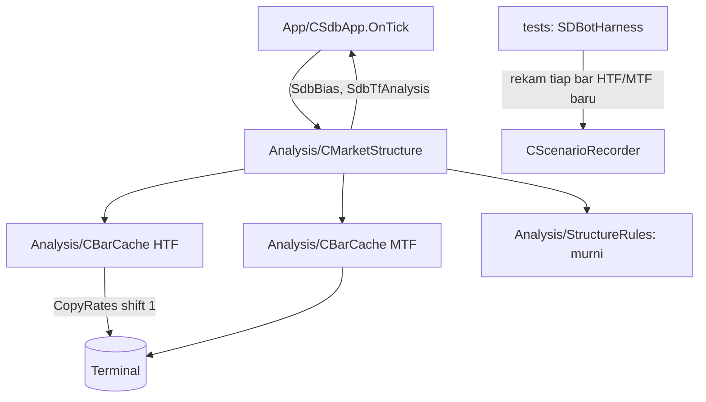

# Design — 10 Market structure dan bias HTF

Status: Done (2026-10-02)
Requirements: [requirements.md](requirements.md) (Approved 2026-10-02) · Keputusan: PC-16

## 1. Overview

Lapisan Analysis baru berisi tiga bagian:

1. **`StructureRules.mqh`**: fungsi murni di atas array `MqlRates` urut waktu naik (indeks 0 = bar tertua, indeks terakhir = bar tertutup terbaru): swing, BOS/arah struktur, EMA, arah EMA, bias, skor tren.
2. **`CBarCache`**: satu per timeframe; menyalin `N` bar tertutup (`CopyRates` mulai shift 1) hanya saat bar baru muncul.
3. **`CMarketStructure`**: memegang cache HTF dan MTF, menjalankan aturan murni saat bar baru, menyimpan hasil (`SdbTfAnalysis`) dan bias (`SdbBias`), mencatat perubahan bias.

`CSdbApp.OnTick` memanggil `CMarketStructure.OnTick()` (murah bila tidak ada bar baru). Belum ada konsumen trading; harness merekam hasil untuk SC-12. LTF baru dibutuhkan spec 12.

## 2. Architecture



Analysis hanya membaca harga (RULES); tidak menulis DB, tidak memanggil Execution/Notify. Log lewat `Core/Utils`.

## 3. Components and interfaces

### 3.1 `Analysis/StructureRules.mqh` (murni) — Req 2–6

| Fungsi | Isi | Req |
|---|---|---|
| `bool IsSwingHigh(const MqlRates &r[], const int i, const int n)` | `high[i] > high[j]` untuk `j ∈ [i−n, i−1]` dan `high[i] ≥ high[j]` untuk `j ∈ [i+1, i+n]`; false bila jendela keluar array | 2.1, 2.2 |
| `bool IsSwingLow(...)` | kebalikan dengan low | 2.1, 2.2 |
| `int FindSwings(const MqlRates &r[], const int n, SdbSwing &out[])` | semua swing dengan `i + n ≤ last`, urut indeks naik | 2.1, 2.3 |
| `void StructureOf(const MqlRates &r[], const SdbSwing &sw[], const int n, const int lookback, SdbStructure &out)` | jalan bar demi bar di jendela `[last−lookback+1, last]`; di bar `b` swing yang dipakai = swing terkonfirmasi sebelum `b` (`idx + n < b`) dan belum pernah ditembus; BOS bullish bila `close[b] > level` swing high aktif, bearish bila `close[b] < level` swing low aktif; arah = BOS terakhir; isi level/waktu BOS dan swing terakhir | 3.1–3.3 |
| `bool EmaSeries(const MqlRates &r[], const int period, double &ema[])` | benih SMA `period` bar pertama, `α = 2/(period+1)`; false bila bar < 3 × period | 4.1, 4.3 |
| `ENUM_SDB_DIR EmaDirectionOf(const double close, const double &ema[], const int slopeBars)` | `close > ema[last]` dan `ema[last] > ema[last−slopeBars]` → BULL; kebalikan → BEAR; lainnya NONE | 4.2 |
| `ENUM_SDB_DIR BiasOf(const ENUM_SDB_DIR structureDir, const ENUM_SDB_DIR emaDir)` | sama dan bukan NONE → arah itu; lainnya NONE | 5.1 |
| `int TrendScore(const ENUM_SDB_DIR signalDir, const SdbTfAnalysis &mtf)` | 15 / 7 / 0 | 6.1 |
| `int BarsNeeded(const int strength, const int lookback, const int emaPeriod, const int slopeBars)` | `max(lookback + 2·strength + 1, 3·emaPeriod + slopeBars + 1)` | 1.1 |
| `void AnalyzeTf(const MqlRates &r[], const SdbStructureParams &p, SdbTfAnalysis &out)` | gabungan: swing, struktur, EMA, arah EMA; `ready = false`, `reason = "data kurang"` bila bar < `BarsNeeded` | 1.3, 7.1 |

### 3.2 `Analysis/BarCache.mqh` — `CBarCache` — Req 1

```cpp
void Init(const string symbol, const ENUM_TIMEFRAMES tf, const int count);
bool Refresh();                    // true bila bar tertutup terbaru berubah dan salinan berhasil
bool Ready() const;                // salinan terakhir berisi >= count bar
datetime LastClosedTime() const;
int  Copy(MqlRates &out[]) const;  // salinan urut waktu naik
```

`Refresh`: bandingkan `iTime(symbol, tf, 1)` dengan `LastClosedTime`; bila sama → false tanpa salin. Bila beda → `CopyRates(symbol, tf, 1, count, rates)` (`ArraySetAsSeries(false)`). Hasil < count atau −1 → `Ready = false`, waktu terakhir tidak dimajukan (dicoba lagi tick berikutnya, Req 1.3).

### 3.3 `Analysis/MarketStructure.mqh` — `CMarketStructure` — Req 1, 5

```cpp
void Init(const string symbol, const ENUM_TIMEFRAMES htf, const ENUM_TIMEFRAMES mtf, const SdbStructureParams &p);
bool OnTick();                      // true bila HTF atau MTF dihitung ulang
void  Htf(SdbTfAnalysis &out) const;   // salinan hasil terakhir
void  Mtf(SdbTfAnalysis &out) const;
void  Bias(SdbBias &out) const;
```

- Bar baru HTF → `AnalyzeTf` → `BiasOf`; bias berubah → `LogInfo("Structure", "bias <lama> -> <baru> | struktur=… ema=… bos=…")` (Req 5.3).
- Data kurang → `LogThrottled` WARN satu kunci per TF (Req 1.3), bias NONE alasan `DATA` (Req 5.2).
- `SdbBias.reason`: `OK`, `STRUCTURE` (struktur netral/berlawanan), `EMA`, `CONFLICT` (struktur dan EMA berlawanan), `DATA`.

### 3.4 Perubahan lain

- `Core/Types.mqh`: tipe §4.1.
- `Core/Inputs.mqh`, `Core/InputRules.mqh`: 4 input + validasi; `CurrentInputsJson` 24 → 28 kunci.
- `App/SdbApp.mqh`: member `CMarketStructure`, init di `InitPositions`-sejajar (`InitAnalysis`), `OnTick` memanggilnya sebelum manajemen posisi (juga saat akun belum PASSED; analisis tidak trading); accessor `Structure()`.
- `tools/gen_presets.py` + 12 preset, `TestPresets` (kunci + nilai), README tabel input.
- Harness: input `HarnessRecordAnalysis` (bool); tiap kali `Structure().OnTick()` menghitung ulang, rekam `SdbAnalysisSample` (TF, waktu bar, arah struktur, level BOS, arah EMA, nilai EMA, bias).

## 4. Data models

### 4.1 Tipe (`Core/Types.mqh`)

```cpp
enum ENUM_SDB_DIR { SDB_DIR_BEAR = -1, SDB_DIR_NONE = 0, SDB_DIR_BULL = 1 };

struct SdbSwing     { int index; datetime time; double price; bool isHigh; };
struct SdbStructure { ENUM_SDB_DIR dir; datetime bosTime; double bosLevel;
                      double lastHigh; datetime lastHighTime; double lastLow; datetime lastLowTime; int swings; };
struct SdbStructureParams { int strength; int lookback; int emaPeriod; int slopeBars; };
struct SdbTfAnalysis { bool ready; string reason; datetime barTime; SdbStructure st; double ema; ENUM_SDB_DIR emaDir; };
struct SdbBias      { ENUM_SDB_DIR dir; string reason; datetime htfBarTime; };
struct SdbAnalysisSample { ENUM_TIMEFRAMES tf; datetime barTime; int structDir; double bosLevel; int emaDir; double ema; int bias; };  // tests
```

### 4.2 Input

| Input | Default | Batas | Konstanta |
|---|---|---|---|
| `InpSwingStrength` | 2 | 1–5 | `SDB_DEF_SWING_STRENGTH`, `SDB_MIN/MAX_SWING_STRENGTH` |
| `InpStructureLookback` | 100 | 20–500 | `SDB_DEF_STRUCTURE_LOOKBACK` … |
| `InpEmaPeriod` | 50 | 10–400 | `SDB_DEF_EMA_PERIOD` … |
| `InpEmaSlopeBars` | 3 | 1–20 | `SDB_DEF_EMA_SLOPE_BARS` … |

Konstanta: `SDB_EMA_WARMUP_MULT` 3, `SDB_EPS_PRICE` (perbandingan harga mentah, tanpa toleransi pip; Req EC-13).

Default menghasilkan `BarsNeeded` = max(105, 154) = 154 bar HTF (H4 ≈ 26 hari) dan MTF.

## 5. Error handling

| Kondisi | Deteksi | Tindakan | Log |
|---|---|---|---|
| `CopyRates` −1 / kurang | hasil < count | `ready = false`, coba tick berikutnya | WARN throttled per TF |
| Histori tidak pernah cukup (simbol baru) | `ready` terus false | bias NONE alasan DATA | WARN tiap `SDB_LOG_THROTTLE_DEFAULT_SEC` |
| EMA gagal (bar < 3 × periode) | `EmaSeries` false | `emaDir` NONE, `ready = false` | sama |

Tidak ada alert Telegram: data kurang bukan kondisi risiko.

## 6. Test case catalogue

### 6.1 Suite `TestStructure.mqh` (TC-MS)

Bar uji dibangun dengan helper `MsBar(high, low, close)` (open = close sebelumnya), urut waktu naik.

| ID | Fungsi | Input | Harapan | Req |
|---|---|---|---|---|
| TC-MS-01 | `IsSwingHigh` | high 1,2,5,2,1 (n=2) indeks 2 | true | 2.1 |
| TC-MS-02 | `IsSwingHigh` | high 1,2,5,5,1 indeks 2 dan 3 | 2 true, 3 false | 2.2 |
| TC-MS-03 | `FindSwings` | puncak di 2 bar terakhir (kanan belum lengkap) | tidak diakui | 2.1, EC-06 |
| TC-MS-04 | `FindSwings` | array ditambah 3 bar baru | swing lama tetap sama (indeks, harga) | 2.3 |
| TC-MS-05 | `IsSwingLow` | low 5,4,1,4,5 | true di indeks 2 | 2.1 |
| TC-MS-06 | `StructureOf` | swing high 1.1050 terkonfirmasi, lalu close 1.1051 | BULL, `bosLevel` 1.1050 | 3.1 |
| TC-MS-07 | `StructureOf` | close tepat 1.1050 | tidak ada BOS, NONE | 3.1, EC-07 |
| TC-MS-08 | `StructureOf` | BOS bullish lalu bearish | BEAR | 3.2, EC-08 |
| TC-MS-09 | `StructureOf` | BOS di luar jendela lookback | NONE | 3.1 |
| TC-MS-10 | `StructureOf` | close menembus swing yang terkonfirmasi di bar yang sama (`idx + n == b`) | bukan BOS | 3.1, 7.1 |
| TC-MS-11 | `StructureOf` | dua close di atas swing yang sama | satu BOS (swing hanya ditembus sekali) | 3.1 |
| TC-MS-12 | `EmaSeries` | 10 close konstan 1.0, periode 3 | semua EMA 1.0 | 4.1 |
| TC-MS-13 | `EmaSeries` | deret naik 1..20, periode 5 | nilai terakhir = hitung tangan (±1e-9) | 4.1 |
| TC-MS-14 | `EmaSeries` | bar < 3 × periode | false | 4.1 |
| TC-MS-15 | `EmaDirectionOf` | close > EMA, EMA naik / close > EMA, EMA turun / close < EMA, EMA turun | BULL / NONE / BEAR | 4.2, EC-09 |
| TC-MS-16 | `BiasOf` | BULL+BULL, BEAR+BEAR, BULL+BEAR, NONE+BULL | BULL, BEAR, NONE, NONE | 5.1 |
| TC-MS-17 | `TrendScore` | sinyal BUY: MTF BULL/BULL, BULL/NONE, BEAR/BEAR; sinyal SELL: BEAR/BEAR | 15, 7, 0, 15 | 6.1 |
| TC-MS-18 | `AnalyzeTf` | bar < `BarsNeeded` | `ready` false, `reason` "data kurang" | 1.3, 5.2 |
| TC-MS-19 | `AnalyzeTf` | harga JPY (151.234) dan XAU (2345.67) | BOS dari nilai mentah | EC-13 |
| TC-MS-20 | `BarsNeeded` | default | 154 | 1.1 |
| TC-MS-21 | `AnalyzeTf` | array sama dihitung dua kali / dipotong di bar `k` lalu dihitung | hasil identik untuk prefiks yang sama | 4.3, 7.1 |
| TC-SU-31 | `ValidateInputValues` | batas tiap input baru | lolos/ditolak sesuai §4.2 | 7.3 |
| TC-SU-04c | JSON sesi | 28 kunci | — | 7.3 |

### 6.2 Suite `TestMarketStructure.mqh` (TC-MSX, tester, data EURUSDc nyata)

| ID | Skenario | Harapan | Req |
|---|---|---|---|
| TC-MSX-01 | `CBarCache.Refresh` dua kali di tick yang sama | true lalu false | 1.2 |
| TC-MSX-02 | `CBarCache` count lebih besar dari histori tersedia | `Ready` false | 1.3 |
| TC-MSX-03 | `CMarketStructure` gaya DAY | HTF H4, MTF H1, `Htf().ready` | 1.4 |

### 6.3 Skenario SC-12 `structure`

- **Given** EURUSDc dan XAUUSDc (dua run) M15, 2026.06.01–2026.09.26, `HarnessRecordAnalysis=true`, tanpa entry, restart di bar 3000.
- **When** run selesai.
- **Then**:
    1. setiap sampel HTF dan MTF yang direkam sama dengan `AnalyzeTf` atas `CopyRates(symbol, tf, sampel.barTime, BarsNeeded)` yang dihitung di `OnDeinit` (arah struktur, level BOS, arah EMA, EMA ±1e-8, bias) (Req 7.1, 7.2);
    2. setiap bar HTF baru menghasilkan tepat satu sampel (Req 1.2);
    3. bias pernah BULL dan pernah BEAR di rentang itu (analisis tidak mati);
    4. sampel sebelum dan sesudah restart konsisten (Req 7.2).

## 7. Traceability

| Req | Komponen | Tes |
|---|---|---|
| 1.1–1.4 | CBarCache, BarsNeeded, CMarketStructure | TC-MS-18, -20, TC-MSX-01..03, SC-12(2) |
| 2.1–2.3 | IsSwingHigh/Low, FindSwings | TC-MS-01..05 |
| 3.1–3.3 | StructureOf | TC-MS-06..11 |
| 4.1–4.3 | EmaSeries, EmaDirectionOf | TC-MS-12..15, -21 |
| 5.1–5.4 | BiasOf, CMarketStructure (log, alasan) | TC-MS-16, -18, SC-12(3) |
| 6.1–6.2 | TrendScore | TC-MS-17 |
| 7.1–7.3 | AnalyzeTf, SC-12, input | TC-MS-19, -21, TC-SU-31, SC-12 |

## 7a. Penyimpangan saat implementasi

- TC-MS-10 diganti uji `lastHigh`/`lastLow`: kasus "close menembus swing yang terkonfirmasi di bar yang sama" tidak mungkin secara geometris (bar pengonfirmasi swing high pasti punya high lebih rendah).
- Skenario XAUUSDc diberi ID `SC-12x` dan rentang 2026.01.05–2026.05.20 karena histori XAUUSDc di terminal uji berakhir 2026.05.27.
- `CMarketStructure` menambah accessor `HtfTimeframe()`, `MtfTimeframe()`, `BarsRequired()`, `Params()`; `SdbAnalysisSample` didefinisikan di `ScenarioRecorder.mqh` (khusus uji), bukan `Types.mqh`.

## 8. Keputusan yang perlu disetujui

1. **Array urut waktu naik** (indeks 0 tertua) untuk semua fungsi murni, berbeda dengan konvensi series MQL5; satu konvensi di seluruh Analysis agar indeks swing tetap saat bar bertambah (TC-MS-04).
2. **Swing yang sudah ditembus tidak bisa memicu BOS lagi**; BOS berikutnya butuh swing baru (TC-MS-11).
3. **Analisis berjalan walau akun belum PASSED**, karena hanya membaca harga; gerbang trading tetap di spec 13.
4. **Tanpa toleransi pip** pada perbandingan harga (close harus melewati level); toleransi baru ditambahkan bila data menunjukkan perlu.
5. **SC-12 memakai `CopyRates` dengan waktu akhir** (bar ≤ waktu sampel) sebagai pembanding "histori", sehingga uji repaint tidak bergantung pada kode cache.

## Pertanyaan terbuka

- Tidak ada.
