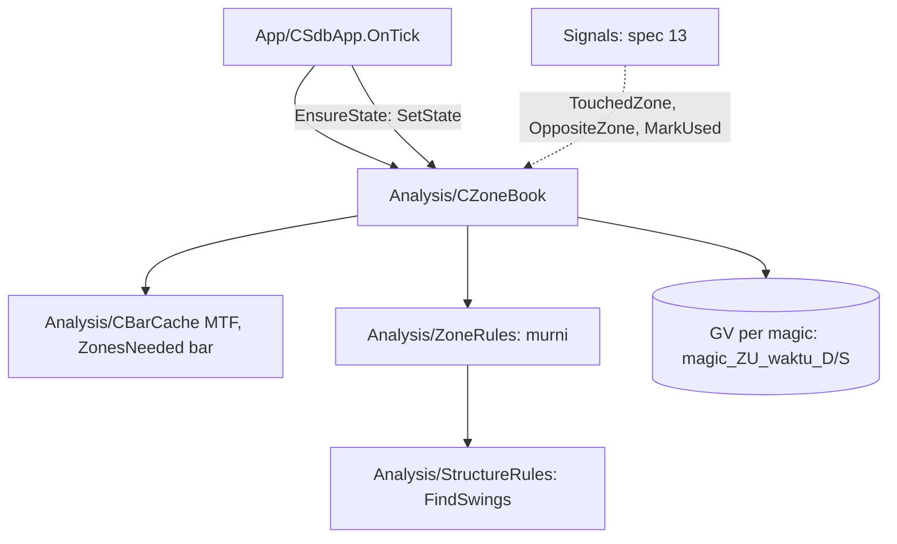

# Design — 11 Zona Supply & Demand

Status: Done (2026-10-02)
Requirements: [requirements.md](requirements.md) (Approved 2026-10-02) · Keputusan: PC-17 · Dasar: [spec 10 design](../ea-10-market-structure/design.md)

## 1. Overview

Dua bagian, mengikuti pola spec 10:

1. **`ZoneRules.mqh`**: fungsi murni di atas array `MqlRates` MTF urut waktu naik: ATR Wilder, calon zona dari swing (lebar, kekuatan keluar, bar aktif), status dari bar sesudahnya, peta lengkap (`BuildZones`), pemilihan zona disentuh, zona lawan, skor.
2. **`CZoneBook`**: memegang `CBarCache` MTF sendiri (jumlah bar `ZonesNeeded`), membangun ulang peta tiap bar MTF baru, membaca/menulis/membersihkan penanda Used di Global Variable per magic, dan menjawab pertanyaan pipeline.

Peta adalah fungsi murni dari `ZonesNeeded` bar terakhir + himpunan ID Used, sehingga jalan terus, restart, dan pembangunan dari histori pasti sama.

## 2. Architecture



`CZoneBook` memakai `CState` (Core) untuk GV; tidak menulis DB dan tidak mengirim order.

## 3. Components and interfaces

### 3.1 `Analysis/ZoneRules.mqh` (murni)

| Fungsi | Isi | Req |
|---|---|---|
| `bool AtrSeries(const MqlRates &r[], const int period, double &atr[])` | TR = max(high−low, ∣high−close₋₁∣, ∣low−close₋₁∣); benih rata-rata TR `period` bar pertama, lalu Wilder `(atr₋₁·(p−1) + tr)/p`; false bila bar < 3 × period | glosarium |
| `string ZoneId(const ENUM_TIMEFRAMES tf, const datetime swingTime, const bool demand)` | `"<tf>-<epoch>-D"` / `"-S"`, mis. `H1-1790812800-D` | 1.5 |
| `bool ZoneCandidate(const MqlRates &r[], const double &atr[], const SdbSwing &sw, const SdbZoneParams &p, SdbZone &z)` | batas, lebar/ATR, kekuatan keluar terjauh dalam `legBars`, bar aktif = max(swing + strength, bar pertama kekuatan keluar tercapai); false bila lebar atau kekuatan di luar batas | 1.1–1.4 |
| `void ZoneStatus(const MqlRates &r[], const SdbZoneParams &p, SdbZone &z)` | dari bar aktif + 1 sampai bar terakhir (maks usia): invalid lebih dulu (close lewat batas jauh, final), lalu sentuhan (masuk setelah bar sebelumnya di luar; status awal "di dalam" = bar aktif); kedaluwarsa bila `last − swingIdx > maxAge`; status dari jumlah sentuhan | 2.1–2.3 |
| `int BuildZones(const MqlRates &r[], const SdbZoneParams &p, const ENUM_TIMEFRAMES tf, const string &usedIds[], SdbZone &out[])` | swing (spec 10) → calon → status → flag Used dari daftar ID; hanya zona yang sudah aktif; urut waktu swing naik | 1–2, 3.1 |
| `int ZonesNeeded(const SdbZoneParams &p)` | `maxAge + legBars + 2·strength + 3·SDB_ZONE_ATR_PERIOD` (default 156) | 3.1 |
| `bool ZoneValid(const SdbZone &z)` | (Fresh atau Tested) dan bukan Used | 2.4, 2.5 |
| `int TouchedZone(const SdbZone &z[], const ENUM_SDB_DIR dir, const double low, const double high)` | zona valid searah (BULL = demand) yang rentang `[low, high]` memotong `[distal, proximal]`; Fresh dulu, lalu swing terbaru; −1 bila tidak ada | 4.1 |
| `int OppositeZone(const SdbZone &z[], const ENUM_SDB_DIR dir, const double price)` | BUY: supply valid dengan batas dekat > harga, yang terdekat; SELL: demand valid dengan batas dekat < harga, terdekat; −1 bila tidak ada | 4.2 |
| `int ZoneScore(const SdbZone &z)` | Fresh 30, Tested 15, lainnya atau Used 0 | 4.3 |
| `string ZoneMapText(const SdbZone &z[], const int digits)` | `id:status:sentuhan:used:distal:proximal;…` urut ID — sidik peta untuk uji | 5.1 |

### 3.2 `Analysis/ZoneBook.mqh` — `CZoneBook`

```cpp
void Init(const string symbol, const ENUM_TIMEFRAMES mtf, const SdbZoneParams &p, const SdbStructureParams &sp, const long magic);
void SetState(CState *state);        // GV siap: baca ID Used, bangun ulang di tick berikutnya
bool OnTick();                       // true bila peta dibangun ulang (bar MTF baru atau penanda berubah)
bool Ready() const;                  // false: data kurang (Req 3.5)
int  Zones(SdbZone &out[]) const;
int  CountByStatus(const ENUM_SDB_ZONE_STATUS s) const;
bool TouchedZone(const ENUM_SDB_DIR dir, const double low, const double high, SdbZone &out) const;
bool OppositeZone(const ENUM_SDB_DIR dir, const double price, SdbZone &out) const;
bool MarkUsed(const string zoneId);  // spec 13; GV + bangun ulang segera
bool IsUsed(const string zoneId) const;
```

- Nama GV: `<magic>_ZU_<epoch swing>_<D|S>` lewat `CState` (prefix akun). Hanya MTF instance itu, jadi timeframe tidak perlu di nama.
- Pembersihan: saat membangun ulang, GV Used yang waktu swing-nya lebih tua dari `maxAge` bar MTF (dihitung dari waktu bar terakhir − `maxAge × PeriodSeconds`) dihapus (Req 3.4).
- Log DEBUG tiap bangun ulang (jumlah per status); WARN throttled bila data kurang.

### 3.3 Perubahan lain

- `Core/Types.mqh`: tipe §4.1. `Core/Constants.mqh`, `Inputs.mqh`, `InputRules.mqh`: 5 input (§4.2), validasi `min < max`; JSON sesi 28 → 33 kunci; preset, README.
- `App/SdbApp.mqh`: member `CZoneBook`, `InitAnalysis` membuatnya (MTF dari gaya), `OnTick` memanggilnya setelah struktur, `EnsureState` → `SetState`, accessor `Zones()`.
- Harness: `HarnessRecordZones` (sidik peta per bar MTF baru + waktu), `HarnessMarkUsedAtBar` (tandai zona valid pertama, catat ID).

## 4. Data models

### 4.1 Tipe

```cpp
enum ENUM_SDB_ZONE_STATUS { SDB_ZONE_FRESH = 0, SDB_ZONE_TESTED = 1, SDB_ZONE_WEAK = 2, SDB_ZONE_INVALID = 3, SDB_ZONE_EXPIRED = 4 };

struct SdbZoneParams { double minWidthAtr; double maxWidthAtr; double minLegAtr; int legBars; int maxAge; int strength; };

struct SdbZone
  {
   string            id;
   bool              demand;
   datetime          swingTime;
   int               swingIdx;
   double            distal;
   double            proximal;
   double            atr;
   double            widthAtr;
   double            legAtr;
   int               activeIdx;
   datetime          activeTime;
   int               touches;
   ENUM_SDB_ZONE_STATUS status;
   bool              used;
  };
```

### 4.2 Input dan konstanta

| Input | Default | Batas |
|---|---|---|
| `InpZoneMinWidthAtr` | 0,3 | 0,05–1,0 |
| `InpZoneMaxWidthAtr` | 2,0 | 0,5–5,0, > min |
| `InpZoneMinLegAtr` | 1,5 | 0,5–5,0 |
| `InpZoneLegBars` | 10 | 3–50 |
| `InpMaxZoneAgeBars` | 100 (PRD) | 20–500 |

Konstanta: `SDB_ZONE_ATR_PERIOD` 14, `SDB_GV_ZONE_USED` `"ZU"`.

## 5. Error handling

| Kondisi | Tindakan | Log |
|---|---|---|
| `CopyRates` kurang | peta kosong, `Ready` false, dicoba tick berikutnya | WARN throttled |
| `AtrSeries` gagal | sama | sama |
| GV tidak bisa ditulis (`MarkUsed`) | false; spec 13 tidak membuka posisi untuk zona itu | ERROR throttled (lewat `CState.Set`) |
| GV belum siap (akun PENDING) | daftar Used kosong; bangun ulang lagi saat `SetState` | — |

## 6. Test case catalogue

### 6.1 Suite `TestZones.mqh` (TC-ZN)

Bar dibangun tangan (helper sama dengan spec 10), ATR diuji terpisah lalu dipakai tetap (`atr[]` buatan) agar kasus zona bisa dihitung tangan.

| ID | Fungsi | Input | Harapan | Req |
|---|---|---|---|---|
| TC-ZN-01 | `AtrSeries` | TR konstan 0.0010 | ATR 0.0010 | glosarium |
| TC-ZN-02 | `AtrSeries` | gap close sebelumnya | TR memakai ∣high−close₋₁∣ | glosarium |
| TC-ZN-03 | `ZoneId` | H1, epoch, demand / supply | `H1-<epoch>-D` / `-S` | 1.5 |
| TC-ZN-04 | `ZoneCandidate` | swing low, badan atas = low + 0.8 ATR, keluar 2 ATR | zona demand, distal = low, proximal = max(o, c), lebar 0,8 | 1.1 |
| TC-ZN-05 | `ZoneCandidate` | supply simetris | distal = high, proximal = min(o, c) | 1.1 |
| TC-ZN-06 | `ZoneCandidate` | lebar 0,29 / 0,30 / 2,0 / 2,01 ATR | tolak / terima / terima / tolak | 1.2, EC-01, EC-02 |
| TC-ZN-07 | `ZoneCandidate` | keluar 1,49 / 1,50 ATR | tolak / terima | 1.3, EC-03 |
| TC-ZN-08 | `ZoneCandidate` | keluar tercapai di bar ke-11 (`legBars` 10) | tolak | 1.3 |
| TC-ZN-09 | `ZoneCandidate` | keluar tercapai bar s+1, strength 2 | aktif di s+2 | 1.4, EC-04 |
| TC-ZN-10 | `ZoneCandidate` | keluar tercapai bar s+5 | aktif di s+5 | 1.4 |
| TC-ZN-11 | `ZoneStatus` | tanpa sentuhan | Fresh | 2.1 |
| TC-ZN-12 | `ZoneStatus` | satu masuk, tiga bar di dalam, keluar | Tested (1 sentuhan) | 2.1, EC-06 |
| TC-ZN-13 | `ZoneStatus` | dua kali masuk | Lemah | 2.1 |
| TC-ZN-14 | `ZoneStatus` | bar masuk lalu close di bawah distal | Invalid, bukan Tested | 2.2, EC-05 |
| TC-ZN-15 | `ZoneStatus` | sentuhan sesudah Invalid | tetap Invalid | 2.1 |
| TC-ZN-16 | `ZoneStatus` | usia 100 / 101 bar | belum / Kedaluwarsa | 2.3 |
| TC-ZN-17 | `BuildZones` | zona Fresh dengan ID di daftar Used | `used` true, `ZoneValid` false | 2.4, 3.3 |
| TC-ZN-18 | `BuildZones` | swing yang belum aktif (keluar belum tercapai) | tidak ada di peta | 1.4 |
| TC-ZN-19 | `TouchedZone` | demand Fresh lama + demand Tested baru + supply, bar menyentuh semua | demand Fresh lama | 4.1, EC-07, EC-08 |
| TC-ZN-20 | `TouchedZone` | hanya Lemah / Used / Invalid disentuh | −1 | 2.5, 4.1 |
| TC-ZN-21 | `OppositeZone` | BUY di 1.1000, supply di 1.1050 dan 1.1100 | 1.1050 | 4.2 |
| TC-ZN-22 | `OppositeZone` | BUY, hanya demand / supply Invalid | −1 | 4.2, EC-14 |
| TC-ZN-23 | `ZoneScore` | Fresh, Tested, Lemah, Fresh Used | 30, 15, 0, 0 | 4.3 |
| TC-ZN-24 | `ZonesNeeded` | default | 156 | 3.1 |
| TC-ZN-25 | `BuildZones` | data sama dua kali | `ZoneMapText` identik | 3.1, 5.1 |
| TC-SU-32 | `ValidateInputValues` | batas tiap input + min ≥ max ditolak | — | 5.2 |

### 6.2 Suite `TestZoneBook.mqh` (TC-ZB, tester, data nyata)

| ID | Skenario | Harapan | Req |
|---|---|---|---|
| TC-ZB-01 | `OnTick` dua kali di bar yang sama | true lalu false | 3.1 |
| TC-ZB-02 | `MarkUsed` zona valid pertama, lalu `IsUsed`, objek baru + `SetState` | Used di keduanya; GV ada | 3.3 |
| TC-ZB-03 | GV Used dengan waktu swing sangat lama, lalu bangun ulang | GV dihapus | 3.4 |
| TC-ZB-04 | sebelum `SetState` | peta dibangun, tanpa Used, tanpa error | §5 |

### 6.3 Skenario SC-13 `zones` (EURUSDc) dan SC-13x (XAUUSDc)

- **Given** M15, EURUSDc 2026.06.01–09.26 dan XAUUSDc rentang yang tersedia; `HarnessRecordZones=true`, `HarnessMarkUsedAtBar=500`, restart di bar 3000, tanpa entry.
- **Then**:
    1. setiap sidik peta yang direkam = `ZoneMapText(BuildZones(CopyRates(MTF, waktu sampel, ZonesNeeded), used))`, dengan `used` = ID yang ditandai bila sampel sesudah penandaan (Req 3.1, 5.1);
    2. satu sampel per bar H1 baru, ≥ 400 sampel;
    3. rata-rata zona aktif per sampel > 0 dan semua status muncul (Fresh, Tested, Lemah, Invalid atau Kedaluwarsa) di run itu;
    4. zona yang ditandai Used tetap Used di sampel sesudah restart (Req 3.3, 5.1).

## 7. Traceability

| Req | Komponen | Tes |
|---|---|---|
| 1.1–1.5 | ZoneCandidate, ZoneId | TC-ZN-03..10, -18 |
| 2.1–2.5 | ZoneStatus, ZoneValid | TC-ZN-11..17, -20 |
| 3.1–3.5 | BuildZones, ZonesNeeded, CZoneBook | TC-ZN-24, -25, TC-ZB-01..04, SC-13 |
| 4.1–4.4 | TouchedZone, OppositeZone, ZoneScore, CountByStatus | TC-ZN-19..23, SC-13(3) |
| 5.1–5.2 | SC-13, input, versi | SC-13, TC-SU-32 |

## 7a. Penyimpangan saat implementasi

- Fungsi murni baru `ZoneUsedCutoff(r, maxAge)` = waktu bar ke-(terakhir − maxAge): batas pembersihan penanda Used dalam bar. Rancangan §3.2 memakai `maxAge × PeriodSeconds`, yang di gap akhir pekan menghapus penanda zona yang masih aktif sehingga zona bisa dipakai entry lagi (temuan SC-13, TC-ZN-26).
- Harness menandai zona valid **terbaru** (bukan pertama) dan restart di bar 600, agar zona yang ditandai belum kedaluwarsa saat restart.
- `CZoneBook` menambah `LastBarTime()`, `Timeframe()`, `Params()`, `CountUsed()`; `SdbZoneSample` di `ScenarioRecorder.mqh` (khusus uji).

## 8. Keputusan yang perlu disetujui

1. **Pemilihan zona lawan untuk TP di batas dekat zona lawan** (bukan batas jauh), karena harga biasanya bereaksi di batas dekat.
2. **Status "di dalam" awal dihitung dari bar aktif**, sehingga bar aktif yang masih menyentuh zona (gerak keluar dari close, low masih di zona) tidak dihitung sentuhan.
3. **ATR dihitung di bar swing** dan disimpan di zona, agar lebar dan kekuatan keluar tidak berubah saat ATR berubah.
4. **`CZoneBook` punya cache MTF sendiri** (156 bar) terpisah dari struktur (154 bar), agar keduanya tidak saling mengikat jumlah bar.
5. **Sidik peta (`ZoneMapText`) sebagai pembanding uji**, sehingga SC-13 membandingkan seluruh peta sekaligus.

## Pertanyaan terbuka

- Tidak ada.
