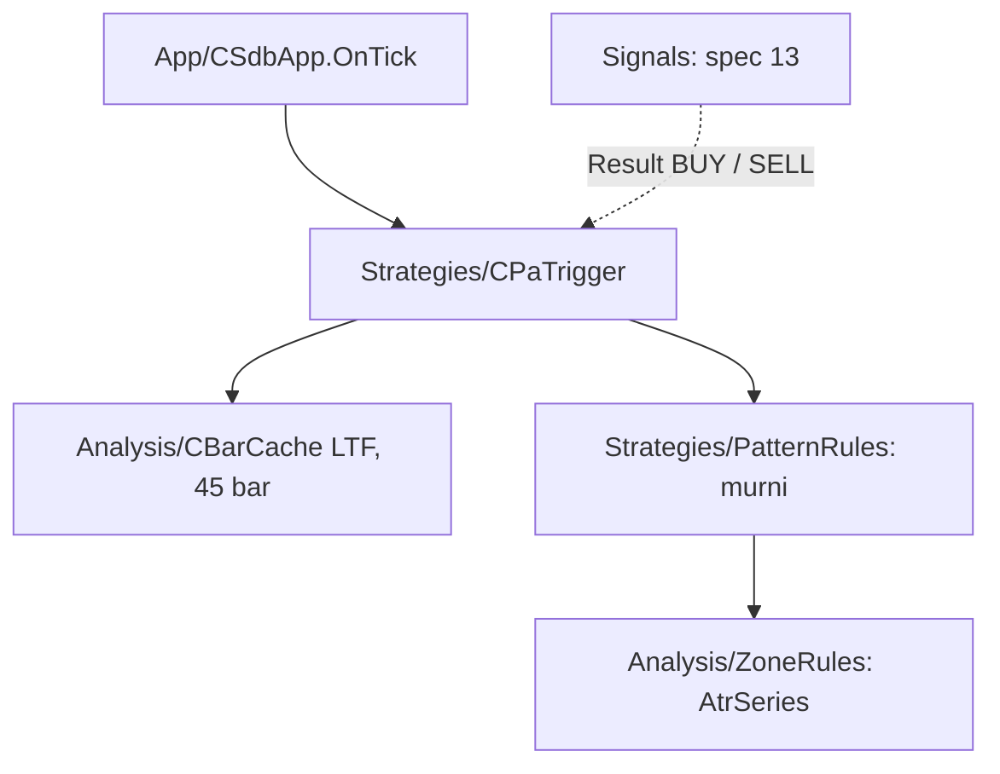

# Design — 12 Trigger price action

Status: Done (2026-10-03)
Requirements: [requirements.md](requirements.md) (Approved 2026-10-03) · Keputusan: PC-18 · Dasar: spec 10 (`CBarCache`), spec 11 (`AtrSeries`)

## 1. Overview

Dua bagian di lapisan Strategies (RULES: Strategies membaca harga dan menghitung skor, memakai Analysis):

1. **`PatternRules.mqh`**: fungsi murni per pola di atas array `MqlRates` LTF urut waktu naik + ATR di bar itu, lalu `DetectPattern` yang memeriksa enam pola terarah dalam urutan tetap dan mengembalikan pola pertama yang cocok untuk arah yang diminta. Pola netral tidak ada di daftar, sehingga tidak bisa mendahului apa pun.
2. **`CPaTrigger`**: `CBarCache` LTF (45 bar: pemanasan ATR + 3 bar pola), hitung ulang sekali per bar LTF baru, menyimpan hasil untuk BUY dan SELL.

Ambang pola adalah konstanta (`SDB_PA_*`). Kode pola masuk `enums.md` (`pa_pattern`) sehingga `SchemaEnums.mqh` menyediakan `SDB_PA_PATTERN_*`.

## 2. Architecture



## 3. Components and interfaces

### 3.1 `Strategies/PatternRules.mqh` (murni)

Semua pemeriksa: `bool IsXxx(const MqlRates &r[], const int i, const ENUM_SDB_DIR dir, const double atr)`; `dir` BULL = definisi glosarium, BEAR = cermin (tukar high/low, arah badan, sisi sumbu). Batas inklusif dengan toleransi `SDB_PA_EPS` (1e-9 relatif terhadap rentang).

| Fungsi | Isi | Req |
|---|---|---|
| `IsStar` | butuh i ≥ 2; badan i−2 berlawanan arah dan > 0,5 ATR; badan i−1 < 0,3 × badan i−2; bar i searah, close melewati titik tengah badan i−2 | 1.1 |
| `IsEngulfStrong` | `IsEngulf` + badan ≥ 60% rentang + badan ≥ 0,8 ATR + close melewati high (BULL) / low (BEAR) bar i−1 | 1.1 |
| `IsPin` | badan ≤ 35% rentang; sumbu sisi berlawanan arah ≥ 2 × badan, ≥ 60% rentang, > 2 × sumbu lain; rentang ≥ 0,8 ATR | 1.1 |
| `IsEngulf` | bar i−1 berlawanan arah, bar i searah; BULL: close i ≥ open i−1 dan open i ≤ close i−1; badan i > badan i−1 | 1.1 |
| `IsTweezer` | bar i−1 berlawanan, bar i searah, ∣low i − low i−1∣ ≤ 0,1 ATR (BEAR: high) | 1.1 |
| `IsOutside` | high i > high i−1, low i < low i−1, bar i searah, close i melewati close i−1 | 1.1 |
| `void DetectPattern(const MqlRates &r[], const double atr, const ENUM_SDB_DIR dir, SdbPattern &out)` | rentang bar terakhir 0, ATR ≤ 0, bar < 3, atau dir NONE → `NONE`; selain itu pemeriksa dalam urutan bintang, engulfing kuat, pin, engulfing, tweezer, outside | 1.1–1.5 |
| `int PaScore(const string code)` | `ENGULF_STRONG` 10, `PIN` 7, kode terarah lain 3, `NONE` 0 | 2.1 |

### 3.2 `Strategies/PaTrigger.mqh` — `CPaTrigger`

```cpp
void Init(const string symbol, const ENUM_TIMEFRAMES ltf);
bool OnTick();                                  // true bila bar LTF baru dianalisis
bool Ready() const;
datetime LastBarTime() const;
void Result(const ENUM_SDB_DIR dir, SdbPattern &out) const;   // pola bar LTF tertutup terakhir
void LastBar(MqlRates &out) const;              // untuk cek sentuhan zona (spec 13)
```

Hitung: salin 45 bar (`3 × 14 + 3`), `AtrSeries(r, SDB_ZONE_ATR_PERIOD)`, `DetectPattern` untuk BULL dan BEAR di bar terakhir. Data kurang → `Ready` false, hasil `NONE`, WARN throttled.

### 3.3 Perubahan lain

- `shared/schema/enums.md`: enum `pa_pattern` (`STAR`, `ENGULF_STRONG`, `PIN`, `ENGULF`, `TWEEZER`, `OUTSIDE`, `NONE`) tanpa CHECK. Nilainya disimpan di `signals.context_json` (teks JSON, spec 13); `enums.md` hanya mencocokkan kolom tabel, jadi kolom enum ini ditulis `signals.context_json`. `schema.py build`; versi data tetap 3.
- `Core/Types.mqh`: `struct SdbPattern { string code; ENUM_SDB_DIR dir; int score; datetime barTime; };`
- `Core/Constants.mqh`: `SDB_PA_STAR_FIRST_BODY_ATR` 0,5, `SDB_PA_STAR_MID_RATIO` 0,3, `SDB_PA_STRONG_BODY_RANGE` 0,6, `SDB_PA_STRONG_BODY_ATR` 0,8, `SDB_PA_PIN_BODY_RANGE` 0,35, `SDB_PA_PIN_WICK_BODY` 2,0, `SDB_PA_PIN_WICK_RANGE` 0,6, `SDB_PA_PIN_WICK_OTHER` 2,0, `SDB_PA_PIN_RANGE_ATR` 0,8, `SDB_PA_TWEEZER_ATR` 0,1, `SDB_PA_BARS` 45.
- `App/SdbApp.mqh`: member `CPaTrigger`, init di `InitAnalysis` (LTF dari gaya), `OnTick` setelah zona, accessor `Trigger()`.

## 4. Data models

Lihat §3.3. Tidak ada input baru (keputusan PC-18 nomor 2).

## 5. Error handling

| Kondisi | Tindakan | Log |
|---|---|---|
| Salinan LTF kurang | `Ready` false, hasil `NONE` | WARN throttled |
| Bar rentang 0 / ATR 0 | `NONE` | — |

## 6. Test case catalogue

### 6.1 Suite `TestPatterns.mqh` (TC-PA)

Bar dibangun tangan (o, h, l, c), ATR tetap 0.0010.

| ID | Kasus | Harapan | Req |
|---|---|---|---|
| TC-PA-01 | bintang pagi klasik (bearish 0,0012, doji 0,0002, bullish close di atas tengah) | `STAR` BULL, skor 3 | 1.1 |
| TC-PA-02 | bintang: badan pertama 0,0005 (tepat 0,5 ATR, harus >) | bukan `STAR` | 1.1 |
| TC-PA-03 | bintang sore (cermin) untuk BEAR | `STAR` | 1.1, 1.2 |
| TC-PA-04 | engulfing kuat: badan 0,0009 = 90% rentang 0,0010, close > high sebelumnya | `ENGULF_STRONG` 10 | 1.1, 2.1 |
| TC-PA-05 | badan tepat 0,0008 (0,8 ATR) dan tepat 60% rentang | `ENGULF_STRONG` (inklusif) | EC-08 |
| TC-PA-06 | engulfing badan 0,0007 (< 0,8 ATR) | `ENGULF` 3 | 1.1 |
| TC-PA-07 | engulfing kuat tetapi close ≤ high sebelumnya | `ENGULF` | 1.1 |
| TC-PA-08 | engulfing kuat yang juga outside bar | `ENGULF_STRONG` | EC-01 |
| TC-PA-09 | hammer: badan 0,0002, sumbu bawah 0,0008, atas 0,0001, rentang 0,0011 | `PIN` 7 | 1.1, 2.1 |
| TC-PA-10 | hammer dengan sumbu atas 0,0005 (sumbu bawah tidak > 2 × atas) | bukan `PIN` | 1.1 |
| TC-PA-11 | hammer rentang 0,0007 (< 0,8 ATR) | bukan `PIN` | 1.1 |
| TC-PA-12 | shooting star untuk BEAR; hammer diminta BEAR | `PIN` / `NONE` | 1.2, EC-07 |
| TC-PA-13 | pin bar yang juga tweezer | `PIN` | EC-02 |
| TC-PA-14 | engulfing dengan open = close sebelumnya | `ENGULF` | EC-09 |
| TC-PA-15 | tweezer bottom selisih low 0,0001 (0,1 ATR) / 0,00011 | `TWEEZER` / bukan | 1.1 |
| TC-PA-16 | outside bar bullish close > close sebelumnya | `OUTSIDE` 3 | 1.1 |
| TC-PA-17 | bar ketiga bintang yang juga engulfing | `STAR` | EC-03 |
| TC-PA-18 | inside bar bullish kecil (kasus bot Python) | `NONE` | 1.3, EC-04 |
| TC-PA-19 | doji di atas bar besar (harami) / doji dragonfly badan 10% dengan sumbu bawah 85% | `NONE` / `PIN` | 1.3, EC-05 |
| TC-PA-20 | high = low; ATR 0; 2 bar saja; dir NONE | `NONE` tanpa error | 1.5, EC-06 |
| TC-PA-21 | `PaScore` semua kode | 3/10/7/3/3/3/0 | 2.1 |
| TC-PA-22 | pola sama di bar dengan ATR 2350 dan harga 2350.00 (XAU, skala ×1e6) | hasil sama dengan skala forex | 1.4, EC-10 |

### 6.2 Suite `TestPaTrigger.mqh` (TC-PAX, tester)

| ID | Kasus | Harapan | Req |
|---|---|---|---|
| TC-PAX-01 | `OnTick` dua kali di bar M15 yang sama | true lalu false, `Ready` | 3.1 |
| TC-PAX-02 | `Result` BULL dan BEAR di bar terakhir data nyata | sama dengan `DetectPattern` atas `CopyRates` (shift 1, 45 bar) | 3.1, 3.2 |

## 7. Traceability

| Req | Komponen | Tes |
|---|---|---|
| 1.1–1.5 | Is*, DetectPattern | TC-PA-01..20, -22 |
| 2.1–2.2 | PaScore, SdbPattern | TC-PA-21 |
| 3.1–3.2 | CPaTrigger | TC-PAX-01..02 |
| 4.1–4.2 | suite, versi | semua |

## 8. Keputusan yang perlu disetujui

1. **Tidak ada skenario tester khusus**: pola murni sepenuhnya diuji di unit, dan `CPaTrigger` dibandingkan dengan `DetectPattern` atas data nyata (TC-PAX-02). Kebenaran di pipeline dibuktikan SC-14 spec 13.
2. **ATR LTF dihitung `CPaTrigger` sendiri** (45 bar), bukan dibagi dengan analisis lain, agar tidak saling mengikat jumlah bar.
3. **Satu `SdbPattern` per arah per bar** disimpan, sehingga pipeline cukup menanyakan arah bias.

## Pertanyaan terbuka

- Tidak ada.
