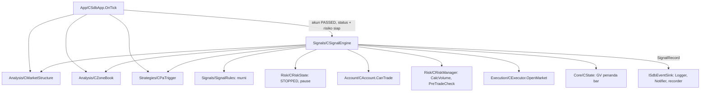

# Design — 13 Sinyal dan entry

Status: Done (2026-10-03)
Requirements: [requirements.md](requirements.md) (Approved 2026-10-03) · Keputusan: PC-19 (koreksi PC-15) · Dasar: spec 05 (`CRiskManager`), 04 (`CExecutor`), 10–12 (`CMarketStructure`, `CZoneBook`, `CPaTrigger`)

## 1. Overview

Lapisan baru **Signals** berisi dua bagian, mengikuti pola spec 10–12 (fungsi murni + kelas tipis yang membaca terminal):

1. **`SignalRules.mqh`** (murni) berisi:
   - `EvaluateSignal`: dari satu set fakta kandidat (pre-filter, posisi terbuka, pola, skor, harga, zona, zona lawan, ATR) menghasilkan keputusan: tahap tolak pertama, skor per komponen, persen skor, serta entry/SL/TP/R:R;
   - `SignalIdOf`: ID sinyal deterministik;
   - `SignalContextJson`: isi `context_json`;
   - `StaleLtfBar`: penilaian bar basi.
2. **`CSignalEngine`** dipanggil `CSdbApp.OnTick` setelah `CPaTrigger`. Kelas ini:
   - menilai setiap bar LTF tertutup sekali (penanda bar di Global Variable);
   - mengumpulkan fakta dari analisis, risiko, akun, posisi, dan harga;
   - memanggil `EvaluateSignal`;
   - bila lolos, menjalankan `CalcVolume` → `PreTradeCheck` → `OpenMarket` → `MarkUsed`;
   - mengirim satu `SignalRecord` ke event sink.

**ID sinyal dihitung EA, tidak dari autoincrement DB.** `CLogger` menulis lewat antrean yang di-flush di `OnTimer`, jadi ID baris belum ada saat order dikirim. ID = 62 bit dari SHA-256 (login, run_key, magic, waktu bar LTF), sehingga:
- `trades.signal_id` terisi sebelum order;
- baris `signals` cukup ditulis sekali setelah hasil order diketahui (tanpa UPDATE);
- restart di bar yang sama menghasilkan ID yang sama, dan `ON CONFLICT(id) DO NOTHING` menolak baris ganda.

Tidak ada migrasi skema: `signals.id INTEGER PRIMARY KEY` menerima nilai eksplisit, dan `signal_scores.component` serta `signals.reject_stage` tanpa CHECK.

## 2. Architecture



Lapisan RULES: Signals memakai Analysis, Strategies, Risk, Execution, Account, Core. Tidak ada lapisan bawah yang memanggil Signals.

## 3. Components and interfaces

### 3.1 `Signals/SignalRules.mqh` (murni)

```cpp
struct SdbSignalParams { double minScorePct; double minRR; double slBufferAtr; double minSlAtr; double maxSlAtr; };

struct SdbSignalFacts          // satu kandidat; dikumpulkan CSignalEngine, dibangun tangan di uji
  {
   ENUM_SDB_DIR dir;  SdbZone zone;
   string preStage;   string preDetail;      // "" = lolos pre-filter risiko
   bool positionOpen;
   SdbPattern pattern; int trendScore;
   double bid; double ask; double point; int digits; int stopsLevel;
   double atrMtf;
   bool haveOpposite; double oppositeProximal;
  };

struct SdbStops    { double entry; double sl; double tp; double risk; double rr; string tpSource; };   // tpSource ZONE / RR

struct SdbDecision
  {
   string stage; string detail;              // "" = lolos sampai tahap SL/TP (lot dan eksekusi di engine)
   int zoneScore; int trendScore; int paScore; int total; int maxActive; double pct;
   SdbStops stops;  bool stopsKnown;
  };
```

| Fungsi | Isi | Req |
|---|---|---|
| `bool StaleLtfBar(const datetime barTime, const int ltfSec, const datetime now)` | `now − barTime > 2 × ltfSec` (barTime = waktu buka bar tertutup) | 1.3 |
| `double ScorePct(const int total, const int maxActive)` | `total ÷ maxActive × 100`; maxActive ≤ 0 → 0 | 2.3, 3.3 |
| `bool BuildStops(const SdbSignalFacts &f, const SdbSignalParams &p, SdbStops &s, string &stage, string &detail)` | lihat §3.1.1 | 4.1–4.6 |
| `void EvaluateSignal(const SdbSignalFacts &f, const SdbSignalParams &p, SdbDecision &d)` | skor dulu (selalu terisi: `ZoneScore`, `trendScore`, `PaScore`, maks aktif `SDB_SCORE_MAX_ACTIVE` 55), lalu tahap pertama yang gagal: `preStage` → `POSITION_OPEN` → `NO_PA_TRIGGER` (pola NONE atau arah beda) → `SCORE_TOO_LOW` (pct < minScorePct − eps) → `BuildStops` | 2.2–2.4, 3.1 |
| `long SignalIdOf(const long login, const long runKey, const long magic, const datetime barTime)` | SHA-256 dari `"login|runKey|magic|barTime"`, 8 byte pertama, `& 0x3FFFFFFFFFFFFFFF`, 0 → 1 | 5.1 |
| `string SignalContextJson(const SdbSignalFacts &f, const SdbDecision &d, const string biasReason)` | JSON kanonik (`JsonObject`): `atr_mtf`, `bias_reason`, `entry`, `max_active`, `pa`, `rr`, `score_pct`, `sl`, `tp`, `tp_source`, `zone_status`; harga dengan `digits`, kunci yang belum diketahui = `null` | 6.1 |

#### 3.1.1 `BuildStops`

| | BUY | SELL |
|---|---|---|
| entry | ask | bid |
| SL | `distal − buf × ATR` | `distal + buf × ATR + (ask − bid)` |
| R | entry − SL | SL − entry |
| TP | `oppositeProximal` (ZONE) atau entry + minRR × R (RR) | `oppositeProximal` (ZONE) atau entry − minRR × R (RR) |
| R:R | (TP − entry) ÷ R | (entry − TP) ÷ R |

Urutan cek:
1. R ≤ 0 → `INVALID_STOPS`.
2. R < max(stopsLevel × point + (ask − bid), minSlAtr × ATR) → `SL_TOO_CLOSE`.
3. R > maxSlAtr × ATR → `SL_TOO_FAR`.
4. R:R < minRR → `RR_TOO_LOW`.

Batas inklusif dengan eps 1e-9 × ATR. SL dan TP dinormalkan ke `digits` sebelum R dan R:R dihitung, agar nilai yang dicatat sama dengan yang dikirim. `detail` memuat angka, misalnya `rr=1.90 min=2.00`.

### 3.2 `Signals/SignalEngine.mqh` — `CSignalEngine`

```cpp
void Init(const string symbol, const long magic, const ENUM_TIMEFRAMES ltf, const SdbSignalParams &p,
          CMarketStructure *ms, CZoneBook *zb, CPaTrigger *pt, CRiskState *rs, CRiskManager *rm,
          CExecutor *exe, CAccount *acc, ISdbEventSink *sink, const ENUM_SDB_TRADING_STYLE style);
void SetState(CState *state, const long login, const long runKey);   // dari EnsureState
bool OnTick();                     // true bila bar LTF baru dinilai (kandidat atau bukan)
void LogDaySummary();              // dipanggil saat hari server berganti dan dari OnDeinit
```

Alur `OnTick`:
1. `t = trigger.LastBarTime()`. Bila 0 atau sama dengan `m_lastBar`, selesai.
2. Bila GV `<magic>_SIGBAR` ≥ t (restart di bar yang sama), selesai. Bila belum, GV diset ke t **sebelum** langkah lain (flush), agar crash di tengah order tidak memicu penilaian ulang.
3. Bar basi (`StaleLtfBar`) → DEBUG, selesai. Analisis belum siap (`Bias` HTF data kurang, `zones.Ready()`, `trigger.Ready()`) → WARN throttled, selesai.
4. Bias NONE → hitungan `noBias`. `zones.TouchedZone(dir, bar.low, bar.high)` kosong → hitungan `noZone`. Keduanya selesai tanpa baris.
5. Kandidat:
   - kumpulkan fakta:
     - pre-filter: `rs.IsStopped()` → `STOPPED`; `rs.IsDailyPaused()` → `DAILY_PAUSE`; `!acc.CanTrade(why)` → `NOT_TRADABLE`;
     - posisi terbuka: loop posisi, filter magic dan simbol;
     - pola: `trigger.Result(dir)`; tren: `TrendScore(dir, mtf)`; ATR MTF: `zones.LastAtr()`;
     - zona lawan: `zones.OppositeZone(dir, entry)`;
   - lalu `EvaluateSignal`.
6. Lolos `EvaluateSignal`:
   - susun `OrderRequest{isBuy, sl, tp, signalId}`, lalu `rm.CalcVolume` dan `rm.PreTradeCheck`. Gagal → tahap dari risiko;
   - `exe.OpenMarket`: berhasil → `zones.MarkUsed(zone.id)` (gagal = log ERROR, posisi tetap); gagal → tahap dari `OrderResult.rejectStage`.
7. Kirim `SignalRecord` (status `ACCEPTED` hanya bila order terisi) ke sink. Log INFO untuk kandidat ACCEPTED dan DEBUG untuk yang ditolak.

Hitungan harian (`evaluated`, `noBias`, `noZone`, `candidates`, `accepted`) direset saat hari server berganti, setelah ringkasan INFO dicetak.

### 3.3 Perubahan modul lain

| Modul | Perubahan | Req |
|---|---|---|
| `Core/Types.mqh` | `SignalRecord` (kolom `signals` + `scoreZone/Trend/Pa`, `maxZone/Trend/Pa`); struct §3.1 | 6.1 |
| `Core/EventSink.mqh` | `void OnSignal(const SignalRecord &s)` di `ISdbEventSink` dan `CNullSink`; implementasi di `CTeeSink`, `CLogger`, `CNotifier` (abaikan), `CFakeSink`, `CScenarioRecorder` | 6.1 |
| `Storage/Logger.mqh` | antrean `SDB_Q_SIGNAL` (insert `signals` dengan `id` eksplisit, `ON CONFLICT(id) DO NOTHING`) dan `SDB_Q_SIGNAL_SCORE` (satu per komponen, `ON CONFLICT DO NOTHING`); `OnSignal` mengantrekan 1 + 3 event; accessor `RunKey()` | 3.2, 6.1 |
| `Analysis/ZoneBook.mqh` | `double LastAtr() const` (ATR MTF bar tertutup terakhir, disimpan saat `Rebuild`) | 4.2 |
| `Core/Inputs.mqh`, `InputRules.mqh` | `InpMinConfluenceScore` 65 (0–100), `InpMinRR` 2.0 (1–10), `InpSlBufferAtr` 0.1 (0–1), `InpMinSlAtr` 0.3 (0.05–2), `InpMaxSlAtr` 3.0 (0.5–10, > min); `InputValues`, validasi, `inputs_json`; `SdbAppConfig.signalsOn` | 7.2 |
| `App/SdbApp.mqh` | member `CSignalEngine`; init setelah `InitAnalysis`; `SetState` di `EnsureState`; `OnTick`: `m_signals.OnTick()` setelah `m_trigger.OnTick()` bila `signalsOn`, akun PASSED, status dan risiko siap, sebelum `m_posManager.OnTick()`; `OnDeinit`: `LogDaySummary` | 1.1, 7.1 |
| `SDBot.mq5` | `signalsOn = true`; komentar "tidak membuka posisi" dihapus | 7.1 |
| `SDBotHarness.mq5` | input `HarnessPipeline` (false) → `signalsOn`; `HarnessEveryBars = 0` mematikan entry terjadwal | 7.3 |
| `shared/schema/enums.md` | `reject_stage` + `POSITION_OPEN`, `SL_TOO_FAR`; enum baru `score_component` (`ZONE`, `TREND`, `PA`, `FIB`, `TRENDLINE`, `BREAKOUT`, `RSI`; kolom `signal_scores.component`); `tp_source` (`ZONE`, `RR`; `signals.context_json`); `schema.py build`, data tetap v3 | 6.2 |
| `Core/Constants.mqh` | default input, `SDB_SCORE_MAX_ACTIVE` 55, `SDB_GV_SIGNAL_BAR` "SIGBAR", eps | — |
| Preset `tools/gen_presets.py` | 5 input baru di 12 preset | 7.2 |
| `tools/queries/` | `signal_rejects.sql`, `score_vs_r.sql`, `pattern_vs_r.sql`, `zone_status_vs_r.sql`, `tp_source_vs_r.sql`, `candidates_per_day.sql` | 8.3 |
| `ea/tests/baseline/` + runner | `BL-<SIMBOL>.ini` × 12 (EA utama, preset simbol, M15, 2025.10.01–2026.10.01, model OHLC M1); `run-ea-tests.ps1 -Baseline [simbol,...]`; `tools/baseline_report.py` | 8.1, 8.2 |

### 3.4 Backtest dasar

1. `run-ea-tests.ps1 -Baseline` menjalankan 12 run `BL-*.ini` berurutan dengan EA utama `SDBot.ex5` dan preset masing-masing (runner menyalin `.set` preset ke profil tester, sama seperti skenario). Run memakai ID run baru, jadi DB tester bisa dipilah per `sessions.run_key`.
2. Setelah semua run, runner memanggil `uv run python sdbot/tools/baseline_report.py --db <sdbot_tester.sqlite> --runs <run_key,...> --log <log agen tester>`. Laporan mencetak per simbol:
   - jumlah kandidat dan sebaran tahap tolak;
   - trade dan win rate;
   - R hasil total dan expectancy;
   - trade tanpa `signal_id` atau dengan skor tidak lengkap.
   Laporan juga mencetak jumlah baris log `[SDB][ERROR]` / `[SDB][CRITICAL]`. Exit 0 hanya bila kriteria 8.2 terpenuhi.
3. Model OHLC M1 (bukan tick nyata) agar 12 run selesai sekitar 30 menit. Tick nyata diuji di Fase 5–6 (keputusan §8.5).

## 4. Data models

- Tidak ada tabel atau kolom baru. `signals.id` = `SignalIdOf`, `signals.time` = waktu buka bar LTF (UTC), `zone_ref` = ID zona, `score_total` = skor mentah, `spread_points` dari `SYMBOL_SPREAD` saat penilaian.
- `signal_scores`: 3 baris per kandidat (`ZONE` maks 30, `TREND` maks 15, `PA` maks 10). Pola selalu sudah dihitung `CPaTrigger`, jadi PA juga tercatat untuk kandidat yang ditolak sebelum tahap PA.
- Global Variable baru: `SDB_<login>_<magic>_SIGBAR` (waktu buka bar LTF terakhir yang dinilai; lewat `CState`, flush).
- Input baru: §3.3.

## 5. Error handling

| Kondisi | Tindakan | Log |
|---|---|---|
| Analisis HTF/MTF/LTF belum siap | Bar dilewati, tanpa baris | WARN throttled `Signals` |
| Bar basi (setelah akhir pekan, reconnect) | Bar dilewati | DEBUG |
| GV `SIGBAR` gagal ditulis | Bar tetap dinilai (risiko dobel kecil; zona Used dan `POSITION_OPEN` tetap mencegah order kedua) | ERROR |
| `CalcVolume` / `PreTradeCheck` menolak | Tahap dari risiko (`LOT_BELOW_MIN`, `RISK_PER_TRADE`, …) | DEBUG + baris `signals` |
| `OpenMarket` gagal | Tahap dari `OrderResult`; zona tidak Used; alert `ORDER_FAILED` sudah dikirim `CExecutor` | baris `signals` |
| `MarkUsed` gagal (GV) | Posisi tetap; zona bisa tersentuh lagi tetapi `POSITION_OPEN` mencegah entry selama posisi terbuka | ERROR |
| DB tidak tersedia / optimasi | `OnSignal` ke `CNullSink`; order tetap dengan `signal_id` | — |

## 6. Test case catalogue

### 6.1 Suite `TestSignalRules.mqh` (TC-SG, murni)

Fakta dasar F0 (EURUSDc): digits 5, point 0.00001, stops level 0, ATR MTF 0.0010, bid 1.10080, ask 1.10090; zona demand Fresh distal 1.10000, proximal 1.10060; pola PIN BULL; trendScore 7; tanpa zona lawan; parameter default (65 / 2.0 / 0.1 / 0.3 / 3.0).

| ID | Kasus | Harapan | Req |
|---|---|---|---|
| TC-SG-01 | F0 dengan zona lawan supply proximal 1.10350 | lolos; entry 1.10090, SL 1.09990, R 0.00100, TP 1.10350, R:R 2.60, `ZONE` | 4.1–4.4 |
| TC-SG-02 | F0 tanpa zona lawan | TP 1.10290, R:R 2.00, `RR` | 4.3 |
| TC-SG-03 | F0 zona lawan 1.10280 | `RR_TOO_LOW` (1.90) | 4.4 |
| TC-SG-04 | F0 zona lawan tepat 1.10290 | lolos (R:R 2.00 inklusif) | 4.4 |
| TC-SG-05 | SELL cermin: supply distal 1.10200, proximal 1.10140, bid 1.10120, ask 1.10130 | SL 1.10200 + 0.00010 + 0.00010 = 1.10220, R 0.00100, TP 2R 1.09920 | 4.2 |
| TC-SG-06 | distal 1.10070 (SL 1.10060, R 0.00030 = 0.3 ATR tepat) / distal 1.10071 (R 0.00029) | lolos / `SL_TOO_CLOSE` | 4.5 |
| TC-SG-07 | stops level 50 point, distal 1.10045 (R 0.00055 < 50 pt + spread 10 pt) | `SL_TOO_CLOSE` | 4.5 |
| TC-SG-08 | distal 1.09780 (SL 1.09770, R 0.00320 > 3 ATR) | `SL_TOO_FAR` | 4.5 |
| TC-SG-09 | ask 1.09980 (sudah di bawah SL 1.09990) | `INVALID_STOPS` | 4.6 |
| TC-SG-10 | USDJPYc: digits 3, ATR 0.150, demand distal 150.000, ask 150.180 | SL 149.985, R 0.195, TP 2R 150.570; nilai dinormalkan 3 digit | 9.1, EC-15 |
| TC-SG-11 | XAUUSDc: digits 2, ATR 12.00, demand distal 2350.00, ask 2362.50 | SL 2348.80, R 13.70, TP 2R 2389.90 | 9.1, EC-15 |
| TC-SG-12 | skor: Fresh 30 + tren 7 + PIN 7 | total 44, pct 80.0, lolos | 3.1, 2.3 |
| TC-SG-13 | Tested 15 + tren 7 + ENGULF_STRONG 10 | total 32, pct 58.2, `SCORE_TOO_LOW` | 2.3 |
| TC-SG-14 | `ScorePct(36,55)` ≥ 65 / `ScorePct(35,55)` < 65; minScorePct 0 → selalu lolos | 65.45 / 63.64 | 2.3 |
| TC-SG-15 | pola NONE, zona Fresh dan tren 15 | `NO_PA_TRIGGER`, skor tetap 30/15/0 | 2.4, 3.2 |
| TC-SG-16 | pola arah berlawanan dengan kandidat | `NO_PA_TRIGGER` | 2.4 |
| TC-SG-17 | urutan: preStage `STOPPED` + posisi terbuka + pola NONE | `STOPPED`; tanpa preStage → `POSITION_OPEN`; tanpa posisi → `NO_PA_TRIGGER` | 2.2 |
| TC-SG-18 | `SCORE_TOO_LOW` bersama SL terlalu dekat | `SCORE_TOO_LOW` (skor lebih dulu), `stopsKnown` false | 2.2 |
| TC-SG-19 | `StaleLtfBar`: bar 00:00, now 00:15:05 / 00:30:00 / 00:30:01 (M15) | false / false / true | 1.3 |
| TC-SG-20 | `SignalIdOf` sama dua kali; beda login, run_key, magic, atau waktu bar | sama; semua berbeda; > 0 dan < 2^62 | 5.1, EC-01 |
| TC-SG-21 | `SignalContextJson` TC-SG-01 | `{"atr_mtf":0.0010,"bias_reason":"OK","entry":1.10090,...,"tp_source":"ZONE","zone_status":"FRESH"}` (string tepat) | 6.1 |
| TC-SG-22 | konteks kandidat `NO_PA_TRIGGER` | `entry`/`sl`/`tp`/`rr`/`tp_source` = `null` | 6.1 |
| TC-SG-23 | `ValidateInputValues`: default lolos; `InpMinRR` 0.9, `InpMinConfluenceScore` 101, `InpSlBufferAtr` −0.1, `InpMinSlAtr` ≥ `InpMaxSlAtr` | masing-masing ditolak dengan nama input | 7.2 |
| TC-SG-24 | `CLogger.OnSignal` + flush (DB uji): 1 baris `signals` dengan `id` eksplisit dan 3 baris `signal_scores`; record yang sama dikirim lagi | tetap 1 + 3 baris, tanpa error | 3.2, 6.1, EC-01 |

### 6.2 Suite `TestSignalEngine.mqh` (TC-SGX, tester, data nyata EURUSDc)

| ID | Kasus | Harapan | Req |
|---|---|---|---|
| TC-SGX-01 | `OnTick` dua kali di bar M15 yang sama | true lalu false | 1.1 |
| TC-SGX-02 | engine baru dengan magic dan GV yang sama (restart) | `OnTick` false di bar yang sama | 1.4, EC-01 |
| TC-SGX-03 | sink palsu menerima `SignalRecord` dengan skor 3 komponen bila bar kandidat; atau hitungan noBias/noZone bertambah | salah satu terjadi, tidak keduanya | 6.1, 6.4 |

### 6.3 Pytest (TS)

| ID | Kasus | Req |
|---|---|---|
| TS-50 | `enums.md`: `reject_stage` memuat `POSITION_OPEN`, `SL_TOO_FAR`; `score_component`, `tp_source` ada | 6.2 |
| TS-51 | preset 12 simbol memuat 5 input baru dengan default | 7.2 |
| TS-52 | `baseline_report.py` di atas DB fixture: kriteria lolos / gagal (simbol < 15 trade, trade tanpa `signal_id`, skor tidak lengkap, log CRITICAL) | 8.2 |
| TS-53 | query kalibrasi berjalan di DB fixture dan mengembalikan kolom yang diharapkan | 8.3 |

### 6.4 Skenario

| ID | Given / When / Then | Req |
|---|---|---|
| SC-14 | **Given** harness `HarnessPipeline=true`, entry terjadwal mati, EURUSDc M15 2026.04.01–2026.10.01. **When** run selesai. **Then**: ≥ 1 trade `source=EA`; setiap trade punya `signal_id` → baris `signals` ACCEPTED → 3 baris `signal_scores`; setiap trade punya closure; tidak ada dua trade dengan `zone_ref` sama; tidak ada dua baris `signals` dengan waktu bar sama; setiap `signals` ACCEPTED punya trade | 5.1–5.4, 6.1, 9.2 |
| SC-14x | sama untuk XAUUSDc (rentang data penuh terminal uji) | 9.1, EC-15 |

### 6.4b Temuan saat eksekusi

| ID | Kasus | Harapan | Asal |
|---|---|---|---|
| TC-RK-14 | `CalcVolume` lalu `PreTradeCheck` untuk 25 balance (9900–10075) × 41 jarak SL × 2 arah | tidak ada `RISK_PER_TRADE` (rugi dari `OrderCalcProfit` dibulatkan ke sen; lot diturunkan per step bila melebihi) | SC-14: 4 kandidat EURUSD ditolak |
| TC-EX-33 | `NextStep(MARKET_CLOSED, 1 / 4)` | `DEFER` (retcode 10018 kelas sendiri, bukan PERMANENT) | backtest dasar: 16 log ERROR "market closed" sekitar 21:00 server (penutupan Jumat, jeda harian emas) |
| TC-PS-05 | `ModifySl` / `ClosePartial` dengan retcode 10018 (hook uji) | `SKIPPED`, 1 kiriman per aksi, tanpa alert, tanpa log ERROR; manajer posisi mencoba lagi di tick berikutnya tanpa menghitung gagal; `OpenMarket` menolak `NOT_TRADABLE` tanpa alert | idem |

### 6.5 Manual

| ID | Isi |
|---|---|
| MC-SG-01 | EA v1.12 di akun cent (EURUSDc, risiko minimum): sinyal pertama tercatat di `signals` dengan skor, posisi punya SL/TP dari zona, pesan Telegram masuk |
| MC-SG-02 | Restart EA di tengah bar M15 setelah kandidat: tidak ada baris atau order ganda |

## 7. Traceability

| Req | Komponen | Tes |
|---|---|---|
| 1.1–1.5 | `CSignalEngine.OnTick`, `StaleLtfBar`, GV `SIGBAR` | TC-SG-19, TC-SGX-01..02, SC-14 |
| 2.1–2.4 | `EvaluateSignal`, `TouchedZone` | TC-SG-12..18 |
| 3.1–3.3 | `EvaluateSignal`, `SignalRecord`, Logger | TC-SG-12..15, TC-SG-24, SC-14 |
| 4.1–4.7 | `BuildStops`, `CRiskManager` | TC-SG-01..11, SC-14 |
| 5.1–5.5 | engine, `SignalIdOf`, `MarkUsed` | TC-SG-20, SC-14 |
| 6.1–6.4 | `SignalContextJson`, Logger, hitungan harian | TC-SG-21..22, TC-SGX-03, TS-50, SC-14 |
| 7.1–7.3 | App, EA, harness, input | TC-SG-23, TS-51, SC-14, regresi |
| 8.1–8.3 | baseline, report, query | TS-52..53, backtest dasar |
| 9.1–9.3 | suite, versi | semua |

## 8. Keputusan yang perlu disetujui

1. **ID sinyal deterministik dari hash** (login, run_key, magic, bar), bukan autoincrement. Alasannya: Logger berbasis antrean tidak bisa memberi ID sebelum order, dan hash membuat restart idempoten. Alternatif: insert sinkron di `OnTick` untuk dapat rowid, lalu UPDATE status setelah order. Itu menambah jalur tulis kedua dan menulis DB di tengah alur order.
2. **Skor PA tetap dicatat untuk kandidat yang ditolak sebelum tahap PA** (tiga baris selalu ada), karena pola sudah dihitung `CPaTrigger` dan kolomnya membantu kalibrasi.
3. **Pre-filter risiko memakai status yang sudah ada** (`CRiskState`, `CAccount.CanTrade`) tanpa lot. Batas posisi per kategori dan margin tetap di `PreTradeCheck` setelah SL/TP diketahui.
4. **`MarkUsed` gagal tidak membatalkan posisi**: posisi tetap, ERROR dicatat. `POSITION_OPEN` mencegah entry kedua selama posisi terbuka.
5. **Backtest dasar memakai model OHLC M1** untuk kecepatan (sekitar 30 menit untuk 12 simbol). Tick nyata di Fase 5–6.
6. **SC-14 memakai harness dengan pipeline**, bukan EA utama, agar recorder dan assert DB yang sudah ada bisa dipakai. EA utama dibuktikan lewat backtest dasar.

## Pertanyaan terbuka

- Tidak ada.
