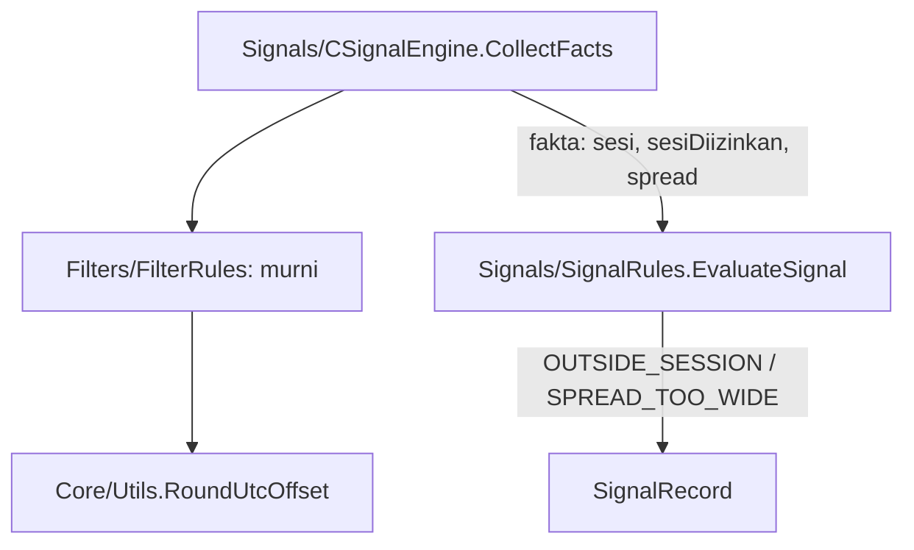

# Design — 14 Filter sesi dan spread

Status: Done (2026-10-04)
Requirements: [requirements.md](requirements.md) (Approved 2026-10-04) · Keputusan: PC-21, PC-22 · Dasar: spec 13 (`SignalRules`, `CSignalEngine`), Fase 1 (`RoundUtcOffset`)

## 1. Overview

Lapisan baru **Filters** berisi `FilterRules.mqh`, kumpulan fungsi murni: nama sesi UTC per detik-hari, apakah sesi diizinkan input, waktu UTC bar dari selisih server–UTC, selisih yang dipakai (live vs tester), dan pemeriksaan spread.

Pipeline tidak mendapat kelas baru:
- `CSignalEngine` menghitung sesi dan spread kandidat saat mengumpulkan fakta;
- `EvaluateSignal` memeriksa dua tahap baru tepat setelah pre-filter risiko;
- hasilnya ikut tercatat di `context_json`.

Sesi dan spread hanya menyentuh entry baru, jadi manajemen posisi tidak berubah.

## 2. Architecture



Lapisan RULES: Signals memakai Filters; Filters hanya memakai Core.

## 3. Components and interfaces

### 3.1 `Filters/FilterRules.mqh` (murni)

```cpp
enum ENUM_SDB_SESSION { SDB_SESSION_TOKYO, SDB_SESSION_LONDON, SDB_SESSION_OVERLAP, SDB_SESSION_NEWYORK, SDB_SESSION_OFF };
struct SdbSessionParams { bool tokyo; bool london; bool newYork; };
```

| Fungsi | Isi | Req |
|---|---|---|
| `ENUM_SDB_SESSION SessionOfUtc(const int utcSecOfDay)` | 0–8 jam TOKYO, 8–13 LONDON, 13–17 OVERLAP, 17–22 NEWYORK, 22–24 OFF (awal inklusif, akhir eksklusif) | 1.2 |
| `string SessionText(const ENUM_SDB_SESSION s)` | `TOKYO`, `LONDON`, `OVERLAP`, `NEWYORK`, `OFF` | 1.2, 3.2 |
| `bool SessionFilterOn(const SdbSessionParams &p)` | salah satu input true | 1.3 |
| `bool SessionAllowed(const ENUM_SDB_SESSION s, const SdbSessionParams &p)` | filter mati → true; TOKYO ← tokyo; LONDON ← london; OVERLAP ← london atau newYork; NEWYORK ← newYork; OFF → false | 1.1–1.3 |
| `int UtcSecOfDay(const datetime serverTime, const int offsetSec)` | `((serverTime − offset) mod 86400 + 86400) mod 86400` | 1.4 |
| `int ServerUtcOffsetSec(const bool tester, const int testerHours, const datetime serverNow, const datetime gmtNow)` | tester → `testerHours × 3600`; live → `RoundUtcOffset(serverNow − gmtNow)` | 1.4, 4.2 |
| `bool SpreadAllowed(const long spreadPoints, const int maxSpreadPoints)` | max ≤ 0 → true; selain itu spread ≤ max | 2.1–2.3 |

### 3.2 Perubahan modul lain

| Modul | Perubahan | Req |
|---|---|---|
| `Core/Types.mqh` | `SdbSignalFacts` + `session` (string), `sessionAllowed` (bool), `spreadPoints` (long); `SdbSignalParams` + `maxSpreadPoints` (int) | 3.1 |
| `Signals/SignalRules.mqh` | `EvaluateSignal`: setelah `preStage`, `!sessionAllowed` → `OUTSIDE_SESSION` (detail `sesi=<nama>`), lalu `!SpreadAllowed` → `SPREAD_TOO_WIDE` (detail `spread=<n> max=<m>`), sebelum `POSITION_OPEN`. `SignalContextJson` + `max_spread` dan `session` (kunci kanonik terurut) | 2.2, 3.1, 3.2 |
| `Signals/SignalEngine.mqh` | `Init` menerima `SdbSessionParams` dan offset tester; `CollectFacts`: offset → `UtcSecOfDay(t)` → sesi + allowed; spread = `round((ask − bid) / point)`; INFO sekali bila filter sesi mati (Req 1.3) | 1.2–1.4, 2.2 |
| `Core/Inputs.mqh`, `InputRules.mqh` | `InpSessionTokyo` false, `InpSessionLondon` true, `InpSessionNewYork` true, `InpMaxSpreadPoints` 0 (0–100000), `InpTesterUtcOffsetHours` 0 (−12..14); `InputValues`, validasi, `inputs_json` (43 input) | 1.1, 2.1, 4.1, 4.2 |
| `App/SdbApp.mqh` | parameter baru dari `cfg.inputs` ke `m_signals.Init`; WARN sekali bila `InpMaxSpreadPoints` 0 di live (EC-06) | 2.1 |
| `tools/gen_presets.py` | spread per simbol di `SYMBOLS` (tabel PC-22), input sesi dan offset di `COMMON_INPUTS` | 4.1 |
| `tools/baseline_report.py` | default `--min-total 200 --min-symbol 10` (PC-22); opsi `--compare-from A --compare-to B`: cetak trade dan expectancy per simbol dari backtest dasar lain (sesi A..B) di samping hasil sekarang | 5.3 |
| `tools/run-ea-tests.ps1` | `-Baseline` meneruskan `-CompareFrom/-CompareTo` bila diberikan | 5.3 |
| README, `docs/flows/signals.md`, CHANGELOG, versi `1.15` | | 4.1, 5.4 |

## 4. Data models

Tidak ada perubahan skema. Tahap `OUTSIDE_SESSION` dan `SPREAD_TOO_WIDE` sudah ada di `enums.md` sejak Fase 1. `context_json` mendapat kunci `max_spread` (angka) dan `session` (teks), dengan urutan kanonik: `atr_mtf`, `bias_reason`, `entry`, `max_active`, `max_spread`, `pa`, `rr`, `score_pct`, `session`, `sl`, `tp`, `tp_source`, `zone_status`.

## 5. Error handling

| Kondisi | Tindakan | Log |
|---|---|---|
| Ketiga input sesi false | Filter sesi mati | INFO sekali saat init |
| `InpMaxSpreadPoints` 0 di live | Filter spread mati | WARN sekali saat init |
| `TimeGMT()` 0 / tidak tersedia di live | Offset 0 | WARN throttled |

## 6. Test case catalogue

### 6.1 Suite `TestFilterRules.mqh` (TC-FL, murni)

| ID | Kasus | Harapan | Req |
|---|---|---|---|
| TC-FL-01 | `SessionOfUtc` di 00:00, 07:59:59, 08:00, 12:59:59, 13:00, 16:59:59, 17:00, 21:59:59, 22:00, 23:59:59 | TOKYO, TOKYO, LONDON, LONDON, OVERLAP, OVERLAP, NEWYORK, NEWYORK, OFF, OFF | 1.2, EC-01 |
| TC-FL-02 | `SessionAllowed`, default London + NY | TOKYO tidak, LONDON ya, OVERLAP ya, NEWYORK ya, OFF tidak | 1.1, 1.2 |
| TC-FL-03 | hanya NY: OVERLAP ya, LONDON tidak; hanya Tokyo: TOKYO ya, lainnya tidak | sesuai | EC-02 |
| TC-FL-04 | ketiga false | `SessionFilterOn` false; semua sesi termasuk OFF diizinkan | 1.3, EC-08 |
| TC-FL-05 | `UtcSecOfDay`: server 2026-06-01 03:30 offset +3 jam → 00:30 (TOKYO); server 20:00 offset −5 jam → 01:00 (TOKYO); server 00:15 offset +3 jam → 21:15 (NEWYORK) | 1800, 3600, 76500 | 1.4, EC-03 |
| TC-FL-06 | `ServerUtcOffsetSec`: tester jam 2 → 7200; live selisih 10795 detik → 10800; live selisih −18010 → −18000 | sesuai | 1.4, 4.2, EC-04 |
| TC-FL-07 | `SpreadAllowed`: 23/24, 24/24, 25/24, 500/0 | ya, ya, tidak, ya | 2.1–2.3 |
| TC-FL-08 | validasi input: default lolos; `InpMaxSpreadPoints` −1 dan 100001, `InpTesterUtcOffsetHours` −13 dan 15 ditolak dengan nama input | sesuai | 4.1 |

### 6.2 Tambahan suite `TestSignalRules.mqh`

| ID | Kasus | Harapan | Req |
|---|---|---|---|
| TC-SG-25 | F0 dengan `sessionAllowed` false; F0 dengan `STOPPED` dan sesi tidak diizinkan; sesi tidak diizinkan dan posisi terbuka | `OUTSIDE_SESSION`; `STOPPED`; `OUTSIDE_SESSION` | 3.1, EC-09 |
| TC-SG-26 | F0 spread 25 / maks 24; spread 24 / 24; sesi tidak diizinkan dan spread lebar | `SPREAD_TOO_WIDE`; lolos; `OUTSIDE_SESSION` | 2.2, 2.3, 3.1 |
| TC-SG-21 / 22 | string JSON diperbarui dengan `max_spread` dan `session` | sesuai urutan kanonik | 3.2 |

### 6.3 Pytest (TS)

| ID | Kasus | Req |
|---|---|---|
| TS-54 | 12 preset memuat input sesi (London + NY), `InpTesterUtcOffsetHours=0`, dan `InpMaxSpreadPoints` per simbol sesuai PC-22 | 4.1 |
| TS-55 | `baseline_report.py` default 200/10; `--compare-from/--compare-to` mencetak kolom pembanding per simbol | 5.3 |

### 6.4 Skenario

| ID | Given / When / Then | Req |
|---|---|---|
| SC-15 | **Given** harness pipeline EURUSDc M15 2026.04.01–2026.09.26, hanya `InpSessionTokyo` true. **When** run selesai. **Then:** ≥ 1 trade; semua sinyal ACCEPTED punya `session` TOKYO di konteks dan jam UTC bar 0–7; ada baris `OUTSIDE_SESSION`; tidak ada baris `OUTSIDE_SESSION` yang sesinya TOKYO | 1.2, 5.2 |
| SC-15b | **Given** sama, sesi default, `InpMaxSpreadPoints` 1. **Then:** 0 trade; ada baris `SPREAD_TOO_WIDE`; tidak ada sinyal ACCEPTED | 2.2, 5.2 |

## 7. Traceability

| Req | Komponen | Tes |
|---|---|---|
| 1.1–1.4 | `SessionOfUtc`, `SessionAllowed`, `UtcSecOfDay`, `ServerUtcOffsetSec`, engine | TC-FL-01..06, TC-SG-25, SC-15 |
| 2.1–2.3 | `SpreadAllowed`, engine | TC-FL-07, TC-SG-26, SC-15b |
| 3.1–3.3 | `EvaluateSignal`, `SignalContextJson` | TC-SG-21/22/25/26, regresi SC-04..08 (manajemen posisi) |
| 4.1–4.2 | input, preset | TC-FL-08, TS-54 |
| 5.1–5.4 | suite, skenario, laporan, versi | semua, TS-55, backtest dasar |

## 8. Keputusan yang perlu disetujui

1. **Filter di `EvaluateSignal`** (fungsi murni yang sudah ada), bukan kelas filter terpisah, karena sesi dan spread hanya fakta kandidat. Kelas `Filters/` baru dibutuhkan untuk berita (spec 16), yang punya sumber data sendiri.
2. **Spread dari ask − bid saat penilaian**, bukan `SYMBOL_SPREAD`, agar sama dengan spread yang dipakai SL SELL. Kolom `spread_points` di `signals` tetap dari `SYMBOL_SPREAD` seperti spec 13.
3. **Laporan pembanding di `baseline_report.py`** (`--compare-from/--compare-to`), agar efek setiap filter Fase 4 terukur dengan alat yang sama.

## Pertanyaan terbuka

- Tidak ada.
