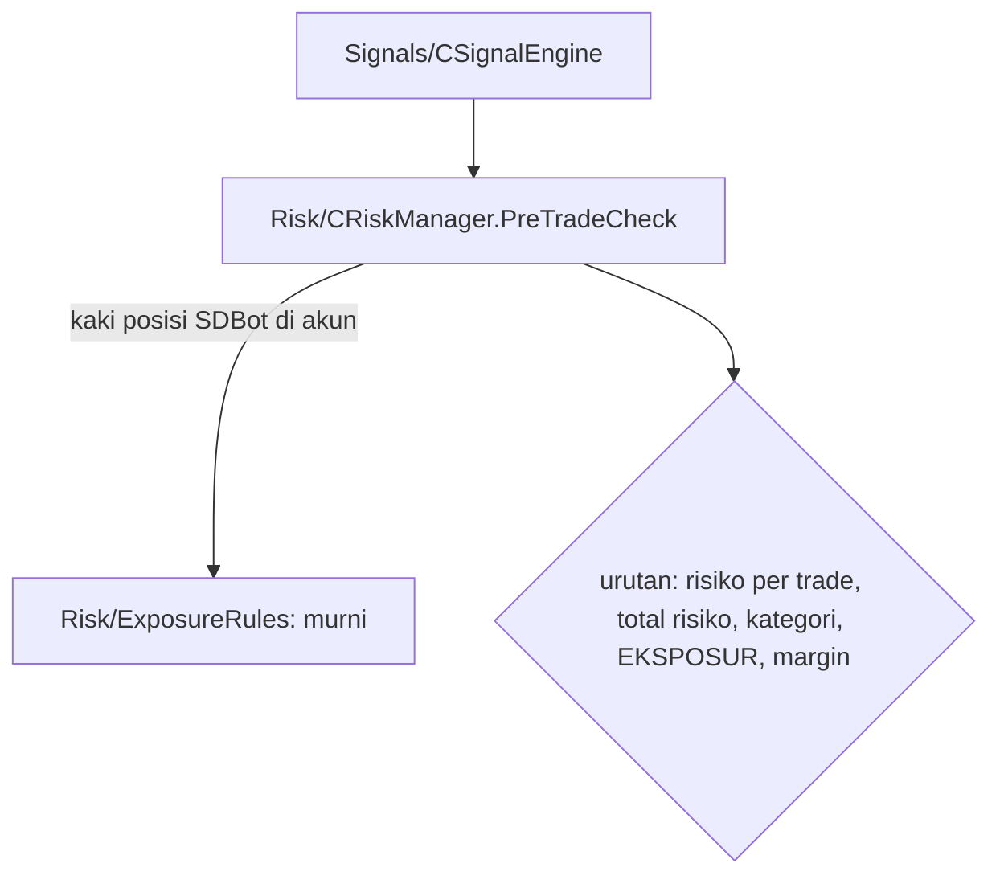

# Design — 15 Eksposur mata uang

Status: Done (2026-10-05)
Requirements: [requirements.md](requirements.md) (Approved 2026-10-05) · Keputusan: PC-21, PC-23 · Dasar: spec 05 (`CRiskManager.PreTradeCheck`), spec 13 (pipeline sinyal)

## 1. Overview

`Risk/ExposureRules.mqh` berisi fungsi murni yang mengubah posisi menjadi kaki mata uang berarah, lalu menghitung dan menilai apakah order baru melewati batas. `CRiskManager` mengumpulkan kaki semua posisi SDBot di akun dan memanggil fungsi itu di langkah eksposur pre-trade check yang sejak Fase 1 masih kosong. Pipeline sinyal tidak berubah: penolakan dari pre-trade check sudah tercatat sebagai tahap tolak kandidat (spec 13).

## 2. Architecture

## 3. Components and interfaces

### 3.1 `Risk/ExposureRules.mqh` (murni)

Arah kaki: +1 long, −1 short.

| Fungsi | Isi | Req |
|---|---|---|
| `int LegsOf(const string base, const string quote, const bool isBuy, string &ccy[], int &dir[])` | 2 kaki (dasar arah order, kuotasi kebalikannya). Mata uang kosong atau dasar = kuotasi → 0 kaki | 1.1, 1.4 |
| `void AddLegs(const string base, const string quote, const bool isBuy, string &ccy[], int &dir[])` | menambahkan kaki satu posisi ke daftar | 1.1 |
| `int SameDirectionCount(const string &ccy[], const int &dir[], const string c, const int d)` | jumlah kaki dengan mata uang dan arah sama | 1.3 |
| `bool ExposureAllowed(const string &ccy[], const int &dir[], const string base, const string quote, const bool isBuy, const int limit, string &detail)` | limit ≤ 0 → true; untuk tiap kaki order: hitungan saat ini ≥ limit → false, detail `<CCY> <long/short> <n>/<limit>` | 2.1, 2.3 |
| `string DirText(const int d)` | `long` / `short` | 2.1 |

### 3.2 Perubahan modul lain

| Modul | Perubahan | Req |
|---|---|---|
| `Risk/RiskManager.mqh` | `CollectSdbotLegs(string &ccy[], int &dir[])`: loop posisi, filter `IsSdbotMagic`, mata uang dari `SymbolInfoString` simbol posisi; WARN throttled per simbol bila mata uang kosong. `PreTradeCheck`: setelah batas kategori, `!ExposureAllowed(...)` → `CURRENCY_EXPOSURE` | 1.1–1.4, 2.1, 2.2 |
| `Core/Inputs.mqh`, `InputRules.mqh`, `Constants.mqh` | `InpMaxSameDirectionPerCurrency` (2; 0–10); `InputValues`, validasi, `inputs_json` (44 input) | 2.3, 3.1 |
| `tools/gen_presets.py` + 12 preset, README | input baru = 2 | 3.1 |
| `SDBotHarness.mq5` | input `HarnessExposureSetup` (false): di tick pertama membuka BUY GBPUSDc (magic 2026091902) dan BUY AUDUSDc (magic 2026091907), lot minimum, SL/TP 5000 point (tetap terbuka sepanjang run) | 4.3 |
| `docs/flows/order-execution.md`, CHANGELOG, versi `1.16` | | 4.4 |

## 4. Data models

Tidak ada perubahan skema. `CURRENCY_EXPOSURE` sudah ada di enum `reject_stage`.

## 5. Error handling

| Kondisi | Tindakan | Log |
|---|---|---|
| Mata uang dasar/kuotasi posisi kosong | Posisi tidak menambah eksposur | WARN throttled per simbol |
| Mata uang order sendiri kosong | Langkah eksposur lolos | WARN throttled |

## 6. Test case catalogue

### 6.1 Suite `TestExposureRules.mqh` (TC-EXP, murni)

Notasi: `+` long, `−` short.

| ID | Kasus | Harapan | Req |
|---|---|---|---|
| TC-EXP-01 | `LegsOf`: BUY EURUSD; SELL EURUSD; BUY USDJPY; SELL EURJPY; BUY XAUUSD; SELL BTCUSD | EUR+ USD−; EUR− USD+; USD+ JPY−; EUR− JPY+; XAU+ USD−; BTC− USD+ | 1.1 |
| TC-EXP-02 | posisi BUY EURUSD, BUY GBPUSD, SELL USDJPY | USD− = 3, USD+ = 0, JPY+ = 1 | 1.3 |
| TC-EXP-03 | ada BUY EURUSD + BUY GBPUSD; order BUY AUDUSD / SELL EURUSD / BUY AUDUSD dengan limit 0 | ditolak `USD short 2/2` / lolos / lolos | 2.1, 2.3, EC-01, EC-02 |
| TC-EXP-04 | ada BUY EURJPY + BUY USDJPY; order BUY GBPJPY | ditolak `JPY short 2/2` | 2.1, EC-03 |
| TC-EXP-05 | ada BUY XAUUSD + BUY EURUSD; order BUY BTCUSD | ditolak `USD short 2/2`; XAU+ = 1 | 1.1, EC-04 |
| TC-EXP-06 | `LegsOf("", "USD")`, `LegsOf("USD","USD")`; order dengan mata uang kosong | 0 kaki; lolos | 1.4, EC-08 |
| TC-EXP-07 | validasi input: 2 lolos; 0 dan 10 lolos; −1 dan 11 ditolak dengan nama input | sesuai | 2.3, 3.1 |

### 6.2 Uji integrasi `TestRisk.mqh` (TC-RK, tester, posisi nyata)

| ID | Kasus | Harapan | Req |
|---|---|---|---|
| TC-RK-16 | buka BUY GBPUSDc dan BUY AUDUSDc dengan magic SDBot lain (lot minimum); `PreTradeCheck` BUY EURUSDc | `CURRENCY_EXPOSURE`, detail `USD short 2/2`; SELL EURUSDc tidak ditolak di langkah ini | 2.1, 2.2, 4.2 |
| TC-RK-17 | sama, batas forex major diset 2 | `CLASS_POSITION_LIMIT` (lebih dulu dari eksposur) | 2.2, EC-09 |
| TC-RK-18 | posisi manual (magic 0) BUY GBPUSDc + BUY AUDUSDc; `PreTradeCheck` BUY EURUSDc | tidak ditolak eksposur | 1.2, EC-05 |

### 6.3 Pytest

| ID | Kasus | Req |
|---|---|---|
| TS-56 | 12 preset memuat `InpMaxSameDirectionPerCurrency=2` | 3.1 |

### 6.4 Skenario

| ID | Given / When / Then | Req |
|---|---|---|
| SC-16 | **Given** harness pipeline EURUSDc 2026.04.01–2026.09.26 dengan `HarnessExposureSetup` (2 posisi BUY GBPUSDc/AUDUSDc terbuka sepanjang run). **Then:** ada baris `CURRENCY_EXPOSURE` dengan detail `USD short 2/2`; semua baris itu BUY; tidak ada sinyal BUY ACCEPTED; posisi setup masih terbuka di akhir run | 2.1, 2.4, 4.3 |

## 7. Traceability

| Req | Komponen | Tes |
|---|---|---|
| 1.1–1.4 | `LegsOf`, `AddLegs`, `SameDirectionCount`, `CollectSdbotLegs` | TC-EXP-01, 02, 06, TC-RK-18 |
| 2.1–2.4 | `ExposureAllowed`, `PreTradeCheck` | TC-EXP-03..05, TC-RK-16, 17, SC-16 |
| 3.1 | input, preset | TC-EXP-07, TS-56 |
| 4.1–4.4 | suite, skenario, versi | semua |

## 8. Keputusan yang perlu disetujui

1. **Fungsi murni di lapisan Risk**, karena eksposur adalah aturan risiko akun di pre-trade check (PRD), bukan filter kandidat.
2. **Mata uang dibaca dari properti simbol** (`SYMBOL_CURRENCY_BASE/PROFIT`), bukan dipotong dari nama simbol, sehingga akhiran broker (`c`) dan simbol non-standar tetap benar.
3. **SC-16 memakai posisi setup yang dibuka harness di simbol lain** (tester MT5 mendukung order multi-simbol dari satu EA), karena tester satu simbol tidak bisa menjalankan dua instance SDBot.

## Pertanyaan terbuka

- Tidak ada.
