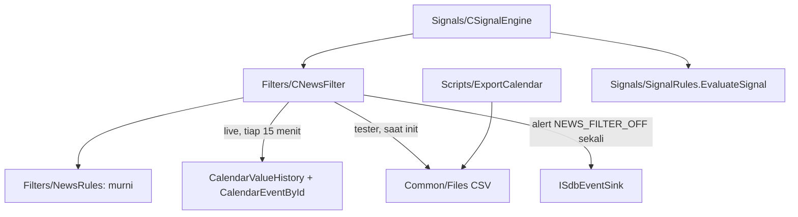

# Design — 16 Filter berita

Status: Done (2026-10-05)
Requirements: [requirements.md](requirements.md) (Approved 2026-10-05) · Keputusan: PC-21, PC-24 · Dasar: spec 13–14 (`SignalRules`, `CSignalEngine`), spec 08 (alert lewat event sink)

## 1. Overview

Tiga bagian:

1. **`Filters/NewsRules.mqh`** (murni): model event, parse baris CSV, relevansi mata uang, jendela blackout, pilihan event saat tumpang tindih, event terdekat. Semua aturan diuji tanpa terminal.
2. **`Filters/NewsFilter.mqh` — `CNewsFilter`:** memuat event dari sumbernya ke cache memori (live: kalender MT5 tiap 15 menit; tester: CSV sekali saat init), memegang status `ON`/`OFF`/`DISABLED`, dan mengirim alert `NEWS_FILTER_OFF` sekali per sesi lewat event sink. Filters tidak memanggil Notify langsung (RULES).
3. **`Scripts/SDBot/ExportCalendar.mq5`:** menulis CSV kalender, dijalankan manual di chart atau lewat runner `-ExportCalendar` di terminal uji.

`CSignalEngine` menanyakan `CNewsFilter` saat mengumpulkan fakta kandidat. `EvaluateSignal` menolak `NEWS_BLACKOUT` tepat setelah pre-filter risiko, sebelum sesi dan spread.

## 2. Architecture



## 3. Components and interfaces

### 3.1 `Filters/NewsRules.mqh` (murni)

```cpp
#define SDB_NEWS_LOW 0
#define SDB_NEWS_MEDIUM 1
#define SDB_NEWS_HIGH 2
struct SdbNewsEvent { datetime time; string ccy; int impact; long id; string name; };
struct SdbNewsParams { bool enabled; int highMinutes; int mediumMinutes; };
```

| Fungsi | Isi | Req |
|---|---|---|
| `int ImpactFromText(const string s)` / `string ImpactText(const int i)` | `HIGH` 2, `MEDIUM` 1, `LOW`/lainnya 0 | 2.2 |
| `bool ParseCalendarLine(const string line, SdbNewsEvent &e)` | `epoch,ccy,impact,id,nama` (nama boleh berisi koma; hanya 4 koma pertama yang memisah); epoch ≤ 0, ccy bukan 3 huruf, atau kolom kurang → false | 2.2, EC-07 |
| `string CalendarLine(const SdbNewsEvent &e)` | kebalikan parse; dipakai `ExportCalendar` (nama: koma dan baris baru diganti spasi) | 5.1 |
| `bool EventForSymbol(const SdbNewsEvent &e, const string base, const string quote)` | ccy = base atau quote | 1.1, EC-03 |
| `int WindowMinutes(const int impact, const SdbNewsParams &p)` | high → highMinutes, medium → mediumMinutes, low → 0 | 1.3 |
| `int MinutesToEvent(const datetime bar, const datetime ev)` | `(bar − ev) / 60`, dibulatkan menuju nol | 1.1 |
| `int FindBlackout(const SdbNewsEvent &ev[], const datetime bar, const string base, const string quote, const SdbNewsParams &p)` | indeks event relevan dengan jendela > 0 dan `|bar − ev| ≤ jendela × 60`; dampak tertinggi lalu terdekat; −1 bila tidak ada atau filter mati | 1.1–1.3, EC-01, EC-02, EC-04 |
| `int NearestUpcoming(const SdbNewsEvent &ev[], const datetime bar, const string base, const string quote, const int horizonSec)` | event relevan dampak ≥ medium dengan waktu ≥ bar dan ≤ bar + horizon, terdekat; −1 | 4.1 |
| `string BlackoutDetail(const SdbNewsEvent &e, const datetime bar)` | `<nama> <ccy> <HIGH/MEDIUM> <menit>m` | 1.1 |

### 3.2 `Filters/NewsFilter.mqh` — `CNewsFilter`

```cpp
void Init(const string symbol, const string base, const string quote, const SdbNewsParams &p, const bool tester,
          const string csvFile, ISdbEventSink *sink, const long magic);
void Refresh(const datetime serverNow);        // live: muat ulang bila > 15 menit sejak muat terakhir
string Status() const;                         // ON, OFF, DISABLED
bool Blocked(const datetime bar, string &detail) const;
string NearestText(const datetime bar) const;  // "" bila tidak ada; "<nama> <ccy> <dampak> <menit>m"
int EventCount() const;
```

- **Live:** untuk tiap mata uang simbol, `CalendarValueHistory(values, now − 1 hari, now + 2 hari, NULL, ccy)`. Untuk tiap value, `CalendarEventById` memberi importance dan nama (cache per event ID). Gagal → `OFF` + alert sekali; berhasil setelah gagal → `ON` + INFO.
- **Tester:** baca CSV `csvFile` (input `InpNewsCsvFile`, default `sdbot_calendar.csv`, FILE_COMMON) sekali saat `Init`, hanya event untuk mata uang simbol. File tidak ada / 0 event valid → `OFF` + alert sekali. Baris rusak dihitung dan dilaporkan WARN.
- **`DISABLED`** bila `InpNewsFilter` false (tanpa alert).

### 3.3 `Scripts/SDBot/ExportCalendar.mq5`

- Input `InpFrom` (2025.01.01), `InpTo` (0 = sekarang), `InpFile` (`sdbot_calendar.csv`).
- Untuk USD, EUR, GBP, JPY, CHF, AUD, CAD, NZD: `CalendarValueHistory` di rentang, ambil event importance ≥ LOW, urutkan waktu, tulis `CalendarLine` ke FILE_COMMON (ANSI, overwrite).
- Cetak jumlah per mata uang × dampak. Total 0 atau fungsi gagal → pesan "kalender belum tersinkron" dan file tidak ditulis.

### 3.4 Perubahan modul lain

| Modul | Perubahan | Req |
|---|---|---|
| `Core/Types.mqh` | `SdbSignalFacts` + `newsBlocked` (bool), `newsDetail`, `newsStatus`, `newsNext` | 1.1, 3.3, 4.1 |
| `Signals/SignalRules.mqh` | `EvaluateSignal`: setelah `preStage`, `newsBlocked` → `NEWS_BLACKOUT` (detail `newsDetail`), sebelum sesi. `SignalContextJson` + kunci `news` (status) dan `news_next` (teks atau `null`) | 1.1, 1.4, 3.3, 4.1 |
| `Signals/SignalEngine.mqh` | `Init` menerima `CNewsFilter*`; `CollectFacts`: `Refresh(TimeTradeServer())`, `Blocked(t, detail)`, `Status()`, `NearestText(t)` | 1.1, 2.1 |
| `App/SdbApp.mqh` | member `CNewsFilter`, init setelah analisis (mata uang dari properti simbol, mode tester), diteruskan ke engine | 2.1, 2.2 |
| `Core/Inputs.mqh`, `InputRules.mqh` | `InpNewsFilter` true, `InpNewsHighMinutes` 15 (0–240), `InpNewsMediumMinutes` 0 (0–240), `InpNewsCsvFile` `sdbot_calendar.csv` (hanya tester); `inputs_json` (48) | 1.3, 2.2 |
| `shared/schema/enums.md` | `alert_type` + `NEWS_FILTER_OFF`; `schema.py build` (data tetap v3) | 4.2 |
| `tools/run-ea-tests.ps1` | `-ExportCalendar`: terminal uji dengan `[StartUp] Script=SDBot\ExportCalendar`, `ShutdownTerminal=1`, lalu cek CSV ada, > 0 baris, dan lebih baru dari saat mulai; skenario menyalin `ea\tests\fixtures\common\*` ke Common\Files sebelum run | 5.3, 6.2 |
| `ea/tests/fixtures/common/sdbot_calendar_sc17.csv` | event buatan USD HIGH tiap hari kerja 12:30 server dan EUR MEDIUM 09:00, rentang SC-17 | 6.2 |
| Preset, README, `docs/flows/signals.md`, CHANGELOG, versi `1.17` | | 6.5 |

## 4. Data models

- Tidak ada perubahan tabel. `NEWS_BLACKOUT` sudah ada di `reject_stage`.
- `context_json` + `news` (`ON`/`OFF`/`DISABLED`) dan `news_next` (teks/`null`).
- Kunci kanonik: `atr_mtf`, `bias_reason`, `entry`, `max_active`, `max_spread`, `news`, `news_next`, `pa`, `rr`, `score_pct`, `session`, `sl`, `tp`, `tp_source`, `zone_status`.
- CSV: `epoch_server,ccy,impact,event_id,name`, tanpa header, urut waktu.

## 5. Error handling

| Kondisi | Tindakan | Log/alert |
|---|---|---|
| Kalender live gagal / 0 event untuk semua mata uang simbol | `OFF`, entry tidak diblokir | alert `NEWS_FILTER_OFF` High sekali per sesi + WARN |
| Kalender live kembali terbaca | `ON` | INFO sekali |
| CSV tidak ada / 0 event valid (tester) | `OFF` | alert sekali |
| Baris CSV rusak | dilewati | WARN dengan jumlah |
| `ExportCalendar` tanpa data | file tidak ditulis | pesan error, exit gagal di runner |

## 6. Test case catalogue

### 6.1 Suite `TestNewsRules.mqh` (TC-NW, murni)

Event dasar: USD HIGH NFP pukul 12:30 server.

| ID | Kasus | Harapan | Req |
|---|---|---|---|
| TC-NW-01 | bar 12:00, 12:30, 13:00 (tepat ±30 menit) | diblokir, menit −30 / 0 / +30 | 1.1, EC-01 |
| TC-NW-02 | bar 11:59 dan 13:01 | tidak diblokir | 1.1 |
| TC-NW-03 | event EUR MEDIUM 09:00: bar 08:50 / 09:10 diblokir, 09:11 tidak; event LOW tidak pernah | sesuai | 1.3, EC-02 |
| TC-NW-04 | `EventForSymbol`: USD untuk EURUSD, USDJPY, XAUUSD, BTCUSD ya; JPY untuk EURJPY ya; GBP untuk EURUSD tidak | sesuai | 1.1, EC-03 |
| TC-NW-05 | EUR HIGH 12:40 + USD MEDIUM 12:35 untuk EURUSD bar 12:35 | detail event EUR HIGH | 1.2, EC-04 |
| TC-NW-06 | high 0 + medium 0; `enabled` false | tidak ada blackout | 1.3, EC-09 |
| TC-NW-07 | `ParseCalendarLine`: baris valid; nama berkoma; kolom kurang; epoch bukan angka; ccy 4 huruf | true (nama utuh); false ×3 | 2.2, EC-07 |
| TC-NW-08 | `CalendarLine` lalu `ParseCalendarLine` (round trip, nama dengan koma dan baris baru) | event sama, nama dibersihkan | 5.1 |
| TC-NW-09 | `NearestUpcoming` 24 jam: event medium besok 08:00 dan high lusa → besok; event lewat tidak dihitung | sesuai | 4.1 |
| TC-NW-10 | `BlackoutDetail` | `Non-Farm Payrolls USD HIGH -12m` | 1.1 |
| TC-NW-11 | validasi input: default lolos; 241 dan −1 ditolak dengan nama input | sesuai | 1.3 |

### 6.2 Tambahan suite `TestSignalRules.mqh`

| ID | Kasus | Harapan | Req |
|---|---|---|---|
| TC-SG-27 | F0 `newsBlocked`; `newsBlocked` + `STOPPED`; `newsBlocked` + di luar sesi | `NEWS_BLACKOUT`; `STOPPED`; `NEWS_BLACKOUT` | 1.4, EC-10 |
| TC-SG-21 / 22 | JSON + `news` dan `news_next` | sesuai urutan kanonik | 3.3, 4.1 |

### 6.3 Pytest

| ID | Kasus | Req |
|---|---|---|
| TS-57 | `enums.md`: `alert_type` memuat `NEWS_FILTER_OFF` | 4.2 |
| TS-58 | 12 preset: `InpNewsFilter=true`, `InpNewsHighMinutes=15`, `InpNewsMediumMinutes=0` (SC-17 tetap 30/10 eksplisit) | 1.3 |
| TS-59 | fixture `sdbot_calendar_sc17.csv`: setiap baris 5 kolom, epoch naik, ccy 3 huruf, impact valid | 6.2 |

### 6.4 Skenario

| ID | Given / When / Then | Req |
|---|---|---|
| SC-17 | **Given** harness pipeline EURUSDc 2026.06.01–2026.09.26, `InpNewsCsvFile=sdbot_calendar_sc17.csv` (USD HIGH tiap hari kerja 12:30 server, EUR MEDIUM 09:00). **Then:** ada baris `NEWS_BLACKOUT` dan semuanya berjarak ≤ 30 menit dari 12:30 atau ≤ 10 menit dari 09:00; tidak ada sinyal ACCEPTED di jendela itu; konteks `news` = `ON`; ≥ 1 trade di luar jendela | 1.1–1.4, 2.2, 6.2 |
| SC-17b | **Given** sama dengan `InpNewsCsvFile=tidak_ada.csv`. **Then:** ≥ 1 trade; tepat 1 alert `NEWS_FILTER_OFF` di `alerts` run ini; semua konteks `news` = `OFF`; tidak ada `NEWS_BLACKOUT` | 3.1, 3.3, 6.3 |

### 6.5 Manual

| ID | Isi |
|---|---|
| MC-NW-01 | EA v1.17 di akun cent: menjelang berita USD high, log menunjukkan kandidat `NEWS_BLACKOUT` dengan nama event; `news_next` terisi di sinyal lain |
| MC-NW-02 | Terminal baru start sebelum kalender sinkron: satu alert `NEWS_FILTER_OFF`, lalu INFO saat aktif kembali |

## 7. Traceability

| Req | Komponen | Tes |
|---|---|---|
| 1.1–1.5 | `FindBlackout`, `EventForSymbol`, `BlackoutDetail`, `EvaluateSignal` | TC-NW-01..06, 10, TC-SG-27, SC-17 |
| 2.1–2.4 | `CNewsFilter`, `ParseCalendarLine` | TC-NW-07, SC-17, MC-NW-01 |
| 3.1–3.3 | `CNewsFilter` status + alert | SC-17b, MC-NW-02 |
| 4.1–4.2 | `NearestUpcoming`, konteks, enum | TC-NW-09, TS-57 |
| 5.1–5.3 | `ExportCalendar`, `CalendarLine`, runner | TC-NW-08, `-ExportCalendar` |
| 6.1–6.5 | suite, skenario, backtest, versi | semua, TS-58, TS-59 |

## 8. Keputusan yang perlu disetujui

1. **`CNewsFilter` di lapisan Filters dengan alert lewat event sink** (seperti `CExecutor`), sehingga Filters tidak memanggil Notify langsung.
2. **Cache live: jendela −1 hari s.d. +2 hari**, dimuat ulang tiap 15 menit. Cukup untuk blackout terpanjang (240 menit) dan event terdekat 24 jam.
3. **Input `InpNewsCsvFile`** (default `sdbot_calendar.csv`) agar skenario memakai fixture sendiri tanpa menimpa CSV backtest. Runner menyalin `ea/tests/fixtures/common/*` ke Common\Files sebelum skenario.
4. **`-ExportCalendar` di terminal uji.** Bila terminal uji tidak tersambung ke server (kalender kosong), script menolak menulis file dan runner gagal dengan pesan. Alternatifnya, jalankan script manual di chart terminal live.

## Pertanyaan terbuka

- Tidak ada.
