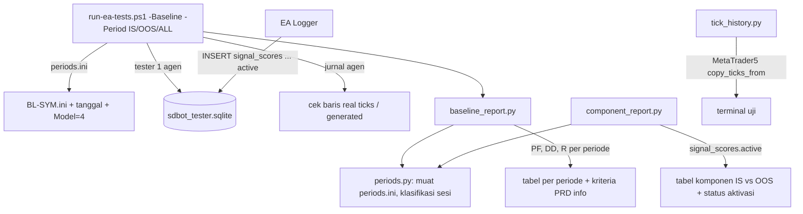

# Design — Alat ukur in-sample / out-of-sample

Status: Done (2026-10-06)
Requirements: [requirements.md](requirements.md) (Approved 2026-10-05)

## 1. Overview

Sebagian besar spec ini berupa alat Python dan PowerShell di `tools/`. EA hanya berubah di skema (v4) dan versi.

- **Periode bernama** disimpan di `ea/tests/baseline/periods.ini`. Runner menerapkannya ke `BL-*.ini` saat `-Period` dipakai.
- **Label periode tidak disimpan di DB.** Laporan mencocokkan `sessions.tester_from`, `tester_to`, dan `tester_model` dengan `periods.ini`, jadi skema tidak perlu kolom label (Req 1.4).
- **Metrik PF dan DD** dihitung `baseline_report.py` dari `closures` dan `balance_ops` per run.
- **Laporan per nilai komponen** ada di alat baru `component_report.py`, yang memakai helper sesi dan periode yang sama.
- **Skema v4** menambah `signal_scores.active` (DEFAULT 1) lewat alur `schema.py new/build`. Logger EA mengisi kolom itu secara eksplisit.
- **Kedalaman histori real ticks** diukur `tick_history.py` lewat paket Python MetaTrader5 di terminal uji.

## 2. Architecture



Aturan lapisan EA tidak berubah: hanya Storage menulis DB. Alat Python hanya membaca DB.

## 3. Components and interfaces

### 3.1 `ea/tests/baseline/periods.ini` (Req 1.1, 5.2–5.3)

```ini
; Periode backtest Fase 5 (PC-25). OOS hanya untuk menilai, tidak untuk menyetel.
[IS]
FromDate=2025.10.01
ToDate=2026.07.01
Model=4
[OOS]
FromDate=2026.07.01
ToDate=2026.10.01
Model=4
[ShortHistory]
; simbol dengan histori real ticks < 12 bulan (diisi dari tick_history.py), dipisah koma
Symbols=
```

Tanggal awal IS ditetapkan ulang di task 1 dari hasil `tick_history.py` (pertanyaan terbuka requirements: IS diperpanjang ke belakang sejauh histori tersedia, OOS tetap). Hasil pengukuran: bar M1 sejak 2024-03-26, real ticks sejak 2026-01-05 (XAU 2026-08-14); keputusan 2026-10-05 opsi A: IS 2024-04..2026-06 dan OOS 2026-07..2026-10 dengan OHLC M1, periode REAL dengan real ticks.

### 3.2 `tools/run-ea-tests.ps1` (Req 1.1–1.6)

- Parameter baru `-Period IS|OOS|ALL`, hanya bersama `-Baseline`. `ALL` = semua simbol untuk IS, lalu semua simbol untuk OOS, dengan satu penanda sesi dan satu laporan.
- Urutan prioritas tanggal dan model: opsi `-FromDate`/`-ToDate`/`-Model` > `-Period` > `BL-*.ini` (Req 1.3).
- Real ticks: baris jurnal agen sejak run mulai yang menyebut tick buatan atau histori tick kosong ditulis ke `baseline-ticks.txt`, lalu laporan menandai simbol itu (Req 1.5). Pola persis teks MT5 diambil dari jurnal nyata di task 2 (Red dengan contoh baris asli).
- Batas waktu default per run untuk `-Period` = 3600 detik (real ticks); `-TimeoutSec` tetap bisa mengganti (EC-08). Durasi per simbol sudah dicetak dan tetap ada (Req 1.6).
- Laporan dipanggil dengan `--periods ea\tests\baseline\periods.ini` dan `--ticks baseline-ticks.txt`.

### 3.3 `tools/periods.py` (baru, murni)

```python
@dataclass(frozen=True)
class Period:
    name: str          # "IS", "OOS"
    start: int         # epoch UTC 00:00 FromDate
    end: int           # epoch UTC 00:00 ToDate
    model: int

def load_periods(path: Path) -> tuple[list[Period], set[str]]   # periode + simbol ShortHistory
def classify(tester_from: int, tester_to: int, tester_model: int, periods: list[Period]) -> str
    # "IS"/"OOS" bila from == start, to dalam [end - 86400, end + 86400) dan model sama; selain itu "CUSTOM"
```

Toleransi 1 hari di `tester_to` karena tester mencatat akhir hari terakhir (`…23:59:59`), bukan 00:00 hari berikutnya.

### 3.4 `tools/baseline_report.py` (Req 2.1–2.7)

Tambahan:
- `RunRow` mendapat `period`, `gross_win`, `gross_loss` (uang, `net_profit`), `max_dd_pct`, `deposit`, dan daftar `(closed_at, r_result)` untuk kurva R total.
- `deposit` = jumlah `balance_ops` run itu dengan waktu ≤ closure pertama. Bila tidak ada, `--deposit` (default 10000) dipakai dan laporan mencetak catatan.
- Fungsi murni baru:

```python
def profit_factor(gross_win: float, gross_loss: float, trades: int) -> float | None  # None = "-", inf = "∞"
def max_drawdown_pct(deposit: float, pnl_seq: list[float]) -> float | None          # puncak balance -> lembah
def max_drawdown_r(r_seq: list[float]) -> float | None                              # kurva R gabungan
def prd_status(is_row: Summary, oos_row: Summary | None) -> list[str]
    # "PF IS 1.03 < 1.3", "DD OOS 4.2% <= 15%", "PF OOS vs IS -12% (batas -30%)" ... informasi saja
```

- Render: satu tabel per periode yang ada (IS, OOS, CUSTOM), dengan kolom tambahan `PF` dan `DD%`. Baris TOTAL memuat PF gabungan (uang) dan DD dalam R. Pembanding `--compare-from/--compare-to` dicocokkan per (periode, simbol).
- Simbol di `--ticks` atau di `ShortHistory` ditandai `*` beserta keterangannya.
- Kode keluar tetap hanya dari kriteria PC-22 dan kelengkapan data (Req 2.6). Pemeriksaan "3 komponen skor" kini hanya menghitung komponen `active = 1`.

### 3.5 `tools/component_report.py` (baru, Req 3.1–3.5)

```
python component_report.py --db <tester.sqlite> --sessions A-B [--periods periods.ini] [--candidates]
```

```python
@dataclass
class Group:
    component: str; active: bool; score: float
    n: int; wins: int; total_r: float

def group_trades(rows) -> dict[tuple[str, str], list[Group]]   # (komponen, periode) -> kelompok per nilai
def verdict(is_groups: list[Group], oos_groups: list[Group], min_n: int = 20) -> str
    # TERBUKTI: nilai tertinggi vs nilai 0, R/trade lebih baik di IS dan OOS, keduanya n >= min_n
    # TIDAK: syarat n terpenuhi tetapi salah satu periode tidak lebih baik
    # SAMPEL KURANG: kelompok 0 atau tertinggi < min_n di salah satu periode (termasuk EC-07)
```

- Trade = closure dengan `r_result` yang ber-`signal_id`, digabung ke `signal_scores`.
- `--candidates`: distribusi nilai komponen per `reject_stage` (termasuk ACCEPTED) atas semua `signals`, tanpa R (Req 3.5).
- Kelompok n < 20 diberi tanda `(sampel kecil)` (Req 3.3).

### 3.6 Skema v4 (Req 4.1–4.4)

- `shared/schema/migrations/data/0004_signal_score_active.sql`:
  ```sql
  ALTER TABLE signal_scores ADD COLUMN active INTEGER NOT NULL DEFAULT 1 CHECK (active IN (0, 1));
  ```
- `seed_sample.sql` blok `-- @version 4` (satu skor bayangan contoh, `active = 0`).
- `schema.py build` meregenerasi `data_db.sql`, fixture, `Migrations.mqh`, dan lock. `schema.py check` menguji migrasi atas data contoh v3.
- `Storage/Logger.mqh`: `SDB_Q_SIGNAL_SCORE` mengikat `?5 = active`; antrean entri mendapat field `active` (default 1); `CSdbApp`/sink mengirim 1 untuk ZONE, TREND, PA.
- Backoffice API belum ada di repo; yang diperbarui hanya fixture dan `schema.py`. Bila API sudah dibuat, ia membaca skema v4 dari folder ini.

### 3.7 `tools/tick_history.py` + runner `-ProbeHistory` (Req 5.1; diubah saat task 1)

Rencana awal memakai `copy_ticks_from`/`copy_ticks_range` paket MetaTrader5. Saat dicoba, terminal menggantung ketika diminta semua tick sejak 2015, dan untuk bulan yang di tester justru punya data (Nov 2025, 392 ribu tick dalam 2 minggu), API ini mengembalikan 0 tick. API Python tidak mencerminkan histori tester.

Pengganti:
- `run-ea-tests.ps1 -ProbeHistory` menjalankan EA utama per preset pada 2015.01.01–2015.01.08 (model 4). Tester menulis "found history data from A to B, specified period is out of this range".
- `Get-TesterDataLines` mengambil pesan tester tentang histori dan tick (bukan log EA) sejak run mulai, ke `.tmpaseline-ticks.txt` sebagai "<simbol>	<pesan>". Fungsi yang sama dipakai backtest dasar untuk Req 1.5.
- `tick_history.py --journal` mengurai baris itu (`parse_probe`, `journal_problems`, `months_between`, `short_history`; murni, TS-70).

## 4. Data models

| Item | Perubahan |
|---|---|
| `signal_scores` | `+ active INTEGER NOT NULL DEFAULT 1 CHECK (active IN (0,1))`, skema v4 |
| `ea/tests/baseline/periods.ini` | baru: IS, OOS, ShortHistory |
| Input EA | tidak ada |
| Versi | EA 1.19 (skema v4), harness 1.19 |

## 5. Error handling

| Kegagalan | Deteksi | Perilaku |
|---|---|---|
| `periods.ini` tidak ada / periode tidak dikenal | runner sebelum run | exit 2 dengan pesan, tidak ada run |
| Tester memakai tick buatan | baris jurnal agen | simbol ditandai di laporan, run tidak gagal (Req 1.5) |
| Run real ticks melewati batas waktu | runner | `TIME` seperti sekarang; batas bisa dinaikkan |
| Deposit tidak ditemukan di `balance_ops` | laporan | pakai `--deposit`, cetak catatan |
| DB v3 lama | EA init | migrasi v4 otomatis; alat Python membaca `active` dengan fallback 1 bila kolom belum ada |
| MetaTrader5 gagal `initialize` | `tick_history.py` | pesan + exit 2 |

## 6. Test case catalogue

### 6.1 pytest (`tools/tests/`)

| ID | Kasus | Harapan | Kriteria |
|---|---|---|---|
| TS-60 | `load_periods` dari contoh ini | IS/OOS epoch benar, ShortHistory set | 1.1, 5.3 |
| TS-61 | `classify`: from/to IS persis, to `…23:59:59` hari sebelumnya, model beda, tanggal lain | IS; IS; CUSTOM; CUSTOM | 1.4, EC-09 |
| TS-62 | `profit_factor`: 300/200; 300/0; 0 trade | 1.5; inf (∞); None (-) | 2.2, 2.5, EC-04 |
| TS-63 | `max_drawdown_pct` deposit 10000, pnl [+100, −300, +50, −100] | 3,47% (10100 → 9750) | 2.3 |
| TS-64 | `max_drawdown_r` [1, −1, −1, 2, −1] | 2,0 | 2.4 |
| TS-65 | laporan atas DB uji dua periode + pembanding | tabel IS dan OOS terpisah, kolom PF/DD, baris acuan per (periode, simbol) | 2.1, 2.7 |
| TS-66 | `prd_status` PF IS 1,4 / OOS 0,9 | "PF OOS vs IS −36% (batas −30%)" | 2.6 |
| TS-67 | `verdict`: naik di IS dan OOS n ≥ 20; naik IS saja; n 0 = 12 | TERBUKTI; TIDAK; SAMPEL KURANG | 3.4, EC-07 |
| TS-68 | `component_report` atas DB uji dengan skor bayangan `active = 0` | komponen bayangan tampil dengan penanda; skor total laporan dasar tidak menghitungnya | 3.2, 4.3 |
| TS-69 | `--candidates` | distribusi nilai per `reject_stage` termasuk ACCEPTED | 3.5 |
| TS-70 | `short_history`, `months_between` | simbol < 12 bulan ditandai | 5.1, 5.3 |
| TS-71 | migrasi 0004 atas fixture v3 berisi data | baris lama `active = 1`, `CHECK` menolak 2 | 4.1, EC-05 |

### 6.2 MQL5 unit

| ID | Kasus | Harapan | Kriteria |
|---|---|---|---|
| TC-LG-xx (TestLogger) | DB unit baru dan DB v3 lama | `MAX(version) = 4`; skor ZONE/TREND/PA ditulis `active = 1` | 4.1, 4.2 |
| TC-MG-xx (TestMigrations) | migrasi berurutan 1→4 | `schema_migrations` lengkap, kolom ada | 4.1 |

Nomor persis mengikuti nomor terakhir di suite saat task dikerjakan.

### 6.3 Run nyata

| ID | Run | Harapan | Kriteria |
|---|---|---|---|
| RUN-01 | `tick_history.py` 12 simbol | tanggal tick tertua per simbol tercatat; periods.ini disesuaikan | 5.1–5.3 |
| RUN-02 | `-Baseline -Period ALL` v1.19 | laporan IS + OOS dengan PF/DD; sesi acuan dicatat | 1.1–1.6, 6.1–6.2 |
| RUN-03 | `component_report.py` atas sesi RUN-02 | ZONE/TREND/PA per nilai, status aktivasi tercetak | 3.1–3.4 |

## 7. Traceability

| Req | Komponen | Uji |
|---|---|---|
| 1.1–1.4 | `periods.ini`, runner `-Period`, `periods.py` | TS-60, TS-61, RUN-02 |
| 1.5–1.6 | runner cek jurnal tick, durasi | RUN-02 |
| 2.1–2.7 | `baseline_report.py` | TS-62..66, RUN-02 |
| 3.1–3.5 | `component_report.py` | TS-67..69, RUN-03 |
| 4.1–4.4 | migrasi 0004, Logger, fixture | TS-71, TC-LG, TC-MG, `schema.py check` |
| 5.1–5.3 | `tick_history.py`, `periods.ini` | TS-70, RUN-01 |
| 6.1–6.2 | run acuan, CHANGELOG, README spec | RUN-02 |

## 8. Keputusan yang perlu disetujui

1. **Label periode dari `sessions.tester_from/to/model`**, tanpa kolom baru. Alternatif: kolom `sessions.period`; ditolak karena EA tidak tahu nama periode dan skema jadi bergantung pada alat.
2. **DD per simbol dihitung dari closure (balance tertutup), bukan equity mengambang**, karena itulah yang tersedia di DB per trade. DD tester MT5 (equity) bisa sedikit lebih besar. Alternatif: membaca laporan HTML tester; ditolak karena runner tidak membuat laporan untuk backtest dasar.
3. **DD total dalam R**, karena tiap simbol berjalan di run terpisah dengan deposit sendiri, sehingga persen gabungan tidak bermakna.
4. **Kriteria PRD tahap 2–3 hanya informasi**, tidak memengaruhi kode keluar. Kode keluar tetap dari PC-22, karena v1.18 jelas belum memenuhi PF 1,3 dan alat harus tetap bisa dipakai untuk mengukur.
5. **`component_report.py` sebagai alat terpisah** dari `baseline_report.py`. Laporan dasar tetap ringkas, dan laporan komponen bisa dijalankan atas sesi mana pun tanpa menjalankan backtest ulang.
6. **Batas waktu default 3600 detik per run untuk `-Period`.** Ukuran 3 bulan real ticks: 28–508 detik per simbol (BTC paling lama), sehingga 9–12 bulan diperkirakan sampai sekitar 30 menit untuk BTC.
