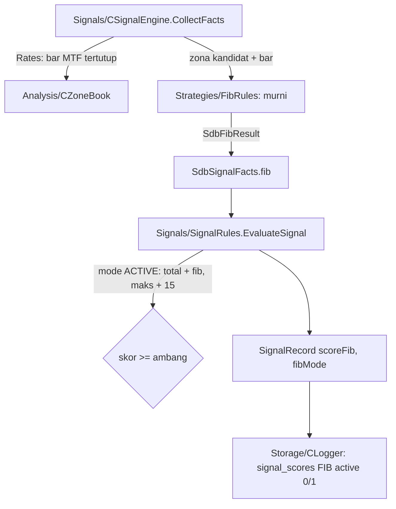

# Design — Skor Fibonacci (mode bayangan)

Status: Done (2026-10-06)
Requirements: [requirements.md](requirements.md) (Approved 2026-10-06; titik ukur = batas dekat zona, pengurangan linear sampai 0,05 rasio)

## 1. Overview

Fibonacci dihitung sebagai fungsi murni di lapisan baru `Strategies/FibRules.mqh`.
- **Masukan:** bar MTF tertutup dari cache `CZoneBook` (cache yang sama dengan yang membangun zona) dan zona kandidat.
- **Leg:** dari batas jauh zona ke ekstrem bar sesudah candle swing zona. Cache hanya berisi bar tertutup, jadi tidak ada lookahead (Req 1).
- **Skor:** rasio retracement batas dekat zona → level terdekat → nilai dasar PRD dikurangi linear sesuai jarak (Req 2).

`CSignalEngine.CollectFacts` mengisi hasilnya ke `SdbSignalFacts`. `EvaluateSignal` menambahkannya ke skor gerbang hanya pada mode ACTIVE. Logger mencatat baris `signal_scores` FIB dengan `active = 0` pada mode SHADOW (Req 3).

`CConfirmations` di overview Fase 5 belum dibuat di sini. Dengan satu komponen, kelas pembungkus belum perlu; ia dibuat di spec 19 saat komponen kedua masuk.

## 2. Architecture



Lapisan: Strategies dipakai oleh Signals (atas), memakai Core dan tipe Analysis; tidak memanggil Execution atau Storage (RULES).

## 3. Components and interfaces

### 3.1 `Strategies/FibRules.mqh` (baru, murni)

```cpp
#define SDB_FIB_LEVELS 4   // 0.382, 0.5, 0.618, 0.786

struct SdbFibResult
  {
   int    score;        // 0..15
   double ratio;        // rasio retracement batas dekat; -1 = tidak dihitung
   double level;        // level terdekat; 0 = tidak ada
   double dist;         // |ratio - level|
   double legStart;     // batas jauh zona
   double legEnd;       // ekstrem impuls
   string reason;       // "" = dihitung; "leg pendek", "data kurang", "di luar leg"
  };

// Awal impuls: demand = low terendah r[swingIdx - lookback .. swingIdx], supply = high tertinggi (keputusan A).
bool FibLegStart(const MqlRates &r[], const SdbZone &z, const int lookback, double &legStart);
// Ujung impuls: demand = high tertinggi r[z.swingIdx..n-1], supply = low terendah. false bila indeks di luar array.
bool FibLegEnd(const MqlRates &r[], const SdbZone &z, double &legEnd);
// Demand: (end - price) / (end - start); supply: (price - end) / (start - end). end == start -> -1.
double RetraceRatio(const double start, const double end, const double price);
// Level terdekat (tie: level lebih dalam, mis. 0.559 -> 0.618); nilai dasar 15 (0.5, 0.618) / 8 (0.382, 0.786);
// skor = round(dasar x max(0, 1 - jarak / SDB_FIB_TOLERANCE)); rasio < 0.236 atau > 1.0 -> 0.
int FibScore(const double ratio, double &level, double &dist);
void FibEvaluate(const MqlRates &r[], const SdbZone &z, const double minLegAtr, const int lookback, SdbFibResult &out);
```

- Titik ukur: `z.proximal`. Leg `start = FibLegStart` (lookback = `StructureLookback`), `end = FibLegEnd`.
- Leg pendek: `|end - start| < minLegAtr × z.atr`, dengan `minLegAtr` = input zona `ZoneMinLegAtr` (1,5).
- Rasio tidak bergantung skala harga (EC-05).
- Tie dipecah ke level yang lebih dalam (EC-03): zona lebih dekat ke batas jauh berarti retracement lebih besar.

### 3.2 `Analysis/ZoneBook.mqh`

`int Rates(MqlRates &out[]) const` menyalin cache bar MTF tertutup yang dipakai `Rebuild()`. Indeks `zone.swingIdx` menunjuk ke array yang sama.

### 3.3 `Signals/SignalEngine.mqh`

- `Init(..., const ENUM_SDB_COMPONENT_MODE fibMode)`.
- `CollectFacts`:
  - bila mode != OFF: `m_zb.Rates(r)`, `FibEvaluate(r, zone, zoneParams.minLegAtr, f.fib)`;
  - `f.fibMode = mode`;
  - histori kurang: `reason = "data kurang"`, `score = 0` (EC-07).

### 3.4 `Signals/SignalRules.mqh`

- `EvaluateSignal`:
  - `d.fibScore = f.fib.score` (0 bila OFF);
  - bila `f.fibMode == SDB_COMPONENT_ACTIVE`: `d.total += d.fibScore; d.maxActive += SDB_SCORE_MAX_FIB`;
  - urutan tahap tolak tidak berubah.
- `SignalContextJson`: kunci baru `fib_level` dan `fib_ratio`. Isinya `null` bila mode OFF atau rasio tidak dihitung; `fib_ratio` 3 desimal. Kunci kanonik tetap terurut.

### 3.5 `Storage/Logger.mqh` dan `SignalRecord`

- `SignalRecord` mendapat `scoreFib` dan `fibMode`.
- `OnSignal` mencatat FIB (`max_score` 15) bila `fibMode != OFF`, dengan `active = (fibMode == ACTIVE)`.

### 3.6 Input

| Input | Default | Nilai | Tempat |
|---|---|---|---|
| `InpScoreFibMode` | `SDB_COMPONENT_SHADOW` | OFF / SHADOW / ACTIVE | `Core/Inputs.mqh`, `InputRules.mqh`, `inputs_json` (49 kunci), preset 12 simbol, README |

Enum baru `ENUM_SDB_COMPONENT_MODE { SDB_COMPONENT_OFF = 0, SDB_COMPONENT_SHADOW = 1, SDB_COMPONENT_ACTIVE = 2 }` di `Core/Types.mqh`, dipakai ulang oleh spec 19–21.

## 4. Data models

| Item | Perubahan |
|---|---|
| `Core/Constants.mqh` | `SDB_SCORE_MAX_FIB 15`, `SDB_FIB_TOLERANCE 0.05`, `SDB_FIB_MIN_RATIO 0.236`, `SDB_FIB_MAX_RATIO 1.0`, `SDB_FIB_SCORE_HIGH 15`, `SDB_FIB_SCORE_LOW 8` |
| `Core/Types.mqh` | `ENUM_SDB_COMPONENT_MODE`; `SdbSignalFacts.fib`, `fibMode`; `SdbDecision.fibScore`; `SignalRecord.scoreFib`, `fibMode` |
| `signals.context_json` | `fib_level`, `fib_ratio` |
| `signal_scores` | baris `FIB` (enum sudah ada sejak spec 13), `active` dari skema v4 |
| Skema DB | tidak berubah |
| Versi | EA 1.20, harness 1.20 |

## 5. Error handling

| Kondisi | Deteksi | Perilaku |
|---|---|---|
| Cache MTF belum siap / `swingIdx` di luar array | `FibLegEnd` false | `score = 0`, `reason = "data kurang"`, kandidat tetap dinilai komponen lain |
| Leg nol (`end == start`) | `RetraceRatio` -1 | `score = 0`, `reason = "leg pendek"` |
| Mode tidak valid di input | `ValidateInputValues` | INIT gagal dengan nama input (pola input lain) |

Tidak ada log per kandidat (sudah ada telemetri `signals`), sehingga tidak ada spam.

## 6. Test case catalogue

### 6.1 `TestFibRules` (suite baru)

| ID | Kasus | Harapan | Kriteria |
|---|---|---|---|
| TC-FIB-01 | Demand: start 1.1000, bar sesudah swing high tertinggi 1.1100, proximal 1.1050 | legEnd 1.1100, rasio 0.500, level 0.5, skor 15 | 1.1, 2.1–2.3 |
| TC-FIB-02 | Supply cerminan TC-FIB-01 | rasio 0.500, skor 15 | 1.1, 2.1 |
| TC-FIB-03 | Bug bot Python: rasio 0.55 | level terdekat 0.5 (bukan 0.618), jarak 0.05, skor 0 | 2.2, 2.4 |
| TC-FIB-04 | Rasio 0.40 / 0.63 / 0.80 | 0.382 skor 5; 0.618 skor 11; 0.786 skor 6 (linear, dibulatkan) | 2.3, 2.4 |
| TC-FIB-05 | Rasio 0.559 (tie 0.5 / 0.618) | level 0.618 | 2.2, EC-03 |
| TC-FIB-06 | Rasio 0.20 dan 1.05 | skor 0 | 2.5, EC-09 |
| TC-FIB-07 | Leg 1,2 ATR (< 1,5) | skor 0, reason "leg pendek" | 1.3 |
| TC-FIB-08 | High baru sesudah zona lalu kembali (EC-02) | legEnd = high baru | 1.1, EC-02 |
| TC-FIB-09 | USDJPY (157.200 → 158.400) dan BTC (60000 → 63000) proporsi sama | rasio dan skor sama dengan TC-FIB-01 | EC-05 |
| TC-FIB-10 | `swingIdx` di luar array | false, reason "data kurang" | EC-07 |
| TC-FIB-11 | Input `InpScoreFibMode` default SHADOW; 3 ditolak dengan nama | — | 3.1 |

### 6.2 `TestSignalRules`

| ID | Kasus | Harapan | Kriteria |
|---|---|---|---|
| TC-SG-28 | Fakta sama, fib 15, mode OFF / SHADOW / ACTIVE | total dan maxActive: 52/55, 52/55, 67/70; tahap sama untuk OFF dan SHADOW | 3.2–3.4 |
| TC-SG-29 | Mode ACTIVE: skor 36/55 lolos (65,5%) tanpa fib, dengan fib 0 → 36/70 = 51% ditolak SCORE_TOO_LOW | perilaku ambang mengikuti maksimum aktif | 3.3 |
| TC-SG-21/22 | JSON konteks dengan `fib_level`, `fib_ratio` (dan null untuk OFF) | string kanonik baru | 2.6 |

### 6.3 `TestLogger`

| ID | Kasus | Harapan | Kriteria |
|---|---|---|---|
| TC-SG-24 (diperluas) | SignalRecord dengan fibMode SHADOW / ACTIVE / OFF | 4 baris skor (FIB `active` 0) / 4 baris (FIB `active` 1) / 3 baris | 3.2, 3.4, 3.5 |

### 6.4 Skenario

| ID | Given / When / Then | Kriteria |
|---|---|---|
| SC-18 | **Given** harness pipeline EURUSDc 2026.06.01–2026.09.26 dengan `InpScoreFibMode` default. **When** run selesai. **Then** setiap sinyal punya baris FIB `active = 0`; `score_total` = ZONE + TREND + PA (tanpa FIB); ada FIB > 0 dan FIB = 0; nilai FIB terkait `fib_ratio` di konteks (rasio null hanya bila skor 0). | 1.1, 2.6, 3.2, 3.5 |

### 6.5 Run nyata

| ID | Run | Harapan | Kriteria |
|---|---|---|---|
| RUN-01 | `-Baseline -Period ALL` v1.20 | trade dan R total per simbol sama dengan acuan 901–924 | 4.1 |
| RUN-02 | `component_report.py` + `--candidates` atas RUN-01 | FIB per nilai IS/OOS; distribusi ACCEPTED (skor penuh ≤ 60%) | 4.2, 4.3 |

## 7. Traceability

| Req | Komponen | Uji |
|---|---|---|
| 1.1–1.4 | `FibLegEnd`, `CZoneBook.Rates`, `CollectFacts` | TC-FIB-01, 02, 07, 08, 10, SC-18 |
| 2.1–2.6 | `RetraceRatio`, `FibScore`, `SignalContextJson` | TC-FIB-01..06, 09, TC-SG-21/22 |
| 3.1–3.5 | input, `EvaluateSignal`, Logger | TC-FIB-11, TC-SG-28, 29, 24, SC-18 |
| 4.1–4.3 | backtest, laporan | RUN-01, RUN-02 |

## 8. Keputusan yang perlu disetujui

1. **Leg = impuls penuh yang memuat zona** (diubah 2026-10-06, opsi A): dari ekstrem `StructureLookback` (100) bar MTF sebelum candle swing zona sampai ekstrem sesudahnya. Rencana awal, leg dari batas jauh zona sendiri, di SC-18 hanya menghasilkan rasio 0,60–0,93 (median 0,83, hampir selalu level 0.786), karena zona selalu di dasar leg-nya sendiri sehingga rasio hanya mengukur lebar zona. Dengan impuls penuh, zona basis di tengah impuls mendapat 0.5–0.618, dan zona di asal impuls mendapat rasio ~0,9 dan skor 0.
2. **Tie ke level yang lebih dalam.** Alternatif: ke level dengan skor lebih tinggi; ditolak karena itulah pola bug bot Python.
3. **Skor dibulatkan ke bilangan bulat** (0–15), agar laporan per nilai tidak tercecer ke banyak desimal. Alternatif: REAL apa adanya.
4. **Tanpa kelas `CConfirmations` dulu**; dibuat di spec 19.
5. **Tidak ada skenario terpisah untuk mode ACTIVE.** ACTIVE dibuktikan di unit (TC-SG-28/29) dan baru dipakai di spec 22.
