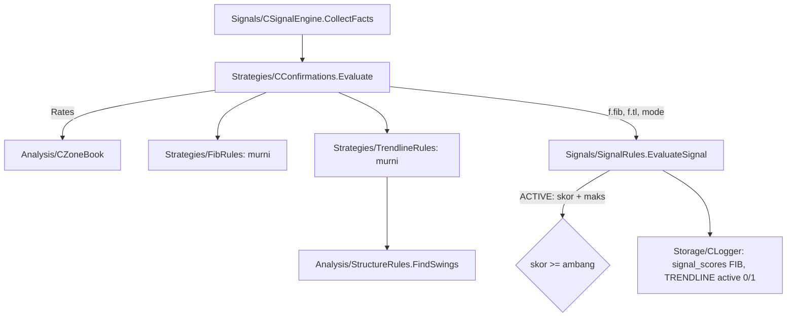

# Design — Skor trendline (mode bayangan)

Status: Done (2026-10-06)
Requirements: [requirements.md](requirements.md) (Approved 2026-10-06; toleransi 0,2 ATR, kemiringan minimum 0,02 ATR per bar, semua pasangan swing di jendela 100 bar)

## 1. Overview

Trendline dihitung sebagai fungsi murni di `Strategies/TrendlineRules.mqh`.

- **Masukan:**
  - bar MTF tertutup dari cache `CZoneBook` (sama dengan Fibonacci);
  - swing terkonfirmasi dari `FindSwings`, aturan fractal yang sama dengan struktur Fase 3;
  - zona kandidat dan ATR MTF terakhir.
- **Proses:** setiap pasangan swing di jendela `StructureLookback` dengan sisi dan arah yang benar menjadi kandidat garis. Garis dibuang bila terlalu datar, patah, atau proyeksinya jauh dari zona. Sentuhan dihitung, lalu garis terbaik dipilih.

Kelas baru `Strategies/CConfirmations` memegang mode Fibonacci dan trendline, lalu mengisi `SdbSignalFacts`. `CSignalEngine` hanya memanggil `m_conf.Evaluate(...)`. `EvaluateSignal` menjumlahkan komponen ACTIVE ke skor dan maksimum lewat satu fungsi, `ActiveConfirmations`.

## 2. Architecture



Lapisan: Strategies memakai Analysis (`StructureRules`, tipe zona) dan Core; dipakai oleh Signals (RULES: lapisan atas memakai bawah).

## 3. Components and interfaces

### 3.1 `Strategies/TrendlineRules.mqh` (baru, murni)

```cpp
// Nilai garis di indeks bar x untuk garis lewat (i1, p1) dan (i2, p2).
double TlValueAt(const int i1, const double p1, const int i2, const double p2, const double x);
// Swing sesisi di jendela (termasuk sebelum i1: garisnya sama) berjarak <= tol dari garis; first = sentuhan paling awal.
// Diubah saat task 1: hitung "sejak i1" membuat garis yang sama bernilai beda menurut pasangan titiknya (TC-TL-08).
int TlTouches(const SdbSwing &sw[], const bool lows, const int i1, const double p1, const int i2, const double p2, const double tol,
              int &first);
// Patah: ada close bar k di [first, n-1] yang melewati garis > tol ke arah berlawanan (di bawah support / di atas resistance).
bool TlBroken(const MqlRates &r[], const bool support, const int from, const int i1, const double p1, const int i2, const double p2,
              const double tol);
// Garis terbaik untuk kandidat; skor 15 (>= 3 sentuhan), 7 (2), 0 (tidak ada).
void TlEvaluate(const MqlRates &r[], const SdbZone &z, const bool buy, const int strength, const int lookback, const double atr,
                SdbTrendlineResult &out);
```

Langkah `TlEvaluate`:
1. `FindSwings(r, strength, sw)`. Hanya swing sesisi dengan indeks ≥ `n - lookback` yang dipakai. Swing yang belum terkonfirmasi tidak pernah dikembalikan `FindSwings` (EC-03).
2. Untuk setiap pasangan `i1 < i2`:
   - kemiringan per bar `(p2 - p1) / (i2 - i1)` dalam ATR wajib ≥ +0,02 (BUY) atau ≤ −0,02 (SELL) (Req 1.2, 1.3);
   - garis tidak patah (Req 1.4);
   - proyeksi di `x = n` (bar MTF yang memuat kandidat) berada di `[min(distal, proximal) − tol, max(distal, proximal) + tol]` (Req 2.1).
3. Sentuhan = `TlTouches`. Garis terbaik dipilih dengan sentuhan terbanyak, lalu `i2` terbesar, lalu `i1` terbesar (Req 2.3, EC-07).
4. Skor: ≥ 3 sentuhan → 15, 2 → 7.

Toleransi `tol = 0,2 × atr`, dengan `atr` = ATR(14) MTF bar tertutup terakhir (`f.atrMtf`). Semua ukuran dalam ATR, jadi tidak bergantung skala harga (EC-08).

### 3.2 `Strategies/Confirmations.mqh` (baru, `CConfirmations`)

```cpp
class CConfirmations
  {
public:
   void Init(const ENUM_SDB_COMPONENT_MODE fibMode, const ENUM_SDB_COMPONENT_MODE tlMode, CZoneBook *zb, CMarketStructure *ms);
   bool AnyOn() const;
   // Mengisi f.fibMode, f.fib, f.tlMode, f.tl untuk zona kandidat; rates disalin sekali untuk semua komponen.
   void Evaluate(const SdbZone &zone, const ENUM_SDB_DIR dir, const double atrMtf, SdbSignalFacts &f);
  };
```

`CSignalEngine.CollectFib` (spec 18) dihapus. Logika Fibonacci pindah tanpa perubahan perilaku ke `CConfirmations.Evaluate`, dan dibuktikan oleh SC-18 dan backtest yang identik.

### 3.3 `Signals/SignalRules.mqh`

- Fungsi baru `void ActiveConfirmations(const SdbSignalFacts &f, int &bonus, int &extraMax)`. Fungsi ini menjumlahkan skor dan maksimum komponen ACTIVE (FIB 15, TRENDLINE 15) (Req 3.3, EC-10).
- `EvaluateSignal`:
  - `d.fibScore` dan `d.tlScore` diisi saat mode != OFF;
  - `d.total += bonus; d.maxActive += extraMax`.
- `SignalContextJson`: kunci baru `tl_dist` (ATR, 2 desimal), `tl_slope` (ATR per bar, 3 desimal), `tl_touches` (bilangan bulat). Semuanya `null` bila mode OFF atau tidak ada garis.

### 3.4 Data

```cpp
struct SdbTrendlineResult
  {
   int      score;       // 0, 7, 15
   int      touches;     // 0 = tidak ada garis
   double   slopeAtr;    // ATR per bar MTF
   double   distAtr;     // jarak proyeksi ke zona dalam ATR (0 = di dalam zona)
   datetime t1, t2;      // waktu dua titik pembentuk
   string   reason;      // "" = ada garis; "data kurang", "tidak ada garis"
  };
```

| Item | Perubahan |
|---|---|
| `Core/Types.mqh` | `SdbTrendlineResult`; `SdbSignalFacts.tlMode`, `tl`; `SdbDecision.tlScore`; `SignalRecord.scoreTrendline`, `trendlineMode` |
| `Core/Constants.mqh` | `SDB_SCORE_MAX_TRENDLINE 15`, `SDB_TL_SCORE_3 15`, `SDB_TL_SCORE_2 7`, `SDB_TL_TOL_ATR 0.2`, `SDB_TL_MIN_SLOPE_ATR 0.02` |
| Input | `InpScoreTrendlineMode` (SHADOW), `inputs_json` 50 kunci, preset, README |
| `signals.context_json` | `tl_dist`, `tl_slope`, `tl_touches` |
| `signal_scores` | baris `TRENDLINE` (enum sudah ada) |
| Skema DB | tidak berubah |
| Versi | EA 1.21, harness 1.21 |

### 3.5 Logger

`OnSignal` mencatat TRENDLINE (`max_score` 15) bila `trendlineMode != OFF`, dengan `active = (mode == ACTIVE)`. Pola sama dengan FIB.

## 4. Error handling

| Kondisi | Perilaku |
|---|---|
| Cache MTF kosong / swing < 2 sesisi | `score 0`, `reason "data kurang"` atau `"tidak ada garis"`; komponen lain tetap dinilai |
| ATR MTF 0 | `score 0`, `reason "data kurang"` (tanpa pembagian nol) |
| Mode tidak valid | `ValidateInputValues` menolak dengan nama input |

Tanpa log per kandidat; telemetri ada di `signals`.

## 5. Test case catalogue

### 5.1 `TestTrendlineRules` (suite baru)

Data uji: bar MTF sintetis (`TtlRates`) dengan swing low/high yang diletakkan di indeks tertentu, `strength` 2, ATR 0,0010.

| ID | Kasus | Harapan | Kriteria |
|---|---|---|---|
| TC-TL-01 | BUY: 3 swing low naik segaris, proyeksi di dalam zona demand | skor 15, sentuhan 3 | 1.2, 2.1, 2.2 |
| TC-TL-02 | BUY: 2 swing low naik, proyeksi di zona | skor 7 | 2.2 |
| TC-TL-03 | Bug bot Python: BUY dengan support **turun** 3 sentuhan lewat zona | skor 0 | 1.2, EC-01 |
| TC-TL-04 | SELL: 3 swing high turun segaris, proyeksi di zona supply | skor 15 | 1.2 |
| TC-TL-05 | Garis datar (kemiringan 0,01 ATR per bar) | skor 0 | 1.3, EC-05 |
| TC-TL-06 | Close menembus garis > 0,2 ATR di antara titik | skor 0 | 1.4, EC-04 |
| TC-TL-07 | Proyeksi 0,5 ATR di bawah zona demand | skor 0; 0,15 ATR → skor dihitung | 2.1, EC-06 |
| TC-TL-08 | Dua garis 3 sentuhan | dipilih titik kedua terbaru (`t2` lebih besar) | 2.3, EC-07 |
| TC-TL-09 | Swing terakhir belum terkonfirmasi (bar kanan < strength) | tidak dipakai, sentuhan tidak bertambah | 1.1, EC-03 |
| TC-TL-10 | Skala USDJPY dan BTC (proporsi sama dengan TC-TL-01) | skor 15 | EC-08 |
| TC-TL-11 | Input `InpScoreTrendlineMode` default SHADOW; 3 ditolak | — | 3.1 |

### 5.2 `TestSignalRules`

| ID | Kasus | Harapan | Kriteria |
|---|---|---|---|
| TC-SG-30 | FIB 15 dan TL 15; mode FIB/TL: SHADOW/SHADOW, ACTIVE/SHADOW, ACTIVE/ACTIVE | total/maks 52/55, 67/70, 82/85 | 3.2, 3.3, EC-10 |
| TC-SG-21/22 | JSON dengan `tl_dist`, `tl_slope`, `tl_touches` | string kanonik baru | 2.4 |
| TC-SG-22c | Konteks trendline bayangan | `"tl_dist":0.00,"tl_slope":0.050,"tl_touches":3` | 2.4 |

### 5.3 `TestLogger`

| ID | Kasus | Harapan | Kriteria |
|---|---|---|---|
| TC-SG-24c | Rekaman dengan TL SHADOW / ACTIVE / OFF | baris TRENDLINE `active` 0 / 1 / tidak ada | 3.2, 3.4 |

### 5.4 Skenario

| ID | Given / When / Then | Kriteria |
|---|---|---|
| SC-19 | **Given** harness pipeline EURUSDc 2026.06.01–2026.09.26, mode default. **Then** setiap sinyal punya FIB dan TRENDLINE `active = 0`; `score_total` = ZONE + TREND + PA; TRENDLINE 0 dan > 0 sama-sama ada; `tl_touches` ≥ 2 untuk setiap TRENDLINE > 0. | 1.1, 2.4, 3.2, 3.5 |
| SC-18 | Tetap PASS (Fibonacci tidak berubah sesudah pindah ke `CConfirmations`) | 3.5 |

### 5.5 Run nyata

| ID | Run | Harapan | Kriteria |
|---|---|---|---|
| RUN-01 | `-Baseline -Period ALL` v1.21 | trade identik dengan 964–987 (swap boleh beda) | 4.1 |
| RUN-02 | `component_report.py` + `--candidates` | TRENDLINE per nilai IS/OOS; ACCEPTED bernilai 15 ≤ 60% dan > 0 ≥ 2% | 4.2, 4.3 |

## 6. Traceability

| Req | Komponen | Uji |
|---|---|---|
| 1.1–1.5 | `TlEvaluate`, `TlBroken`, `FindSwings` | TC-TL-01, 03, 05, 06, 09, SC-19 |
| 2.1–2.4 | `TlEvaluate`, `TlTouches`, `SignalContextJson` | TC-TL-01, 02, 07, 08, 10, TC-SG-21/22/22c |
| 3.1–3.5 | input, `CConfirmations`, `ActiveConfirmations`, Logger | TC-TL-11, TC-SG-30, 24c, SC-18, SC-19 |
| 4.1–4.3 | backtest, laporan | RUN-01, RUN-02 |

## 7. Keputusan yang perlu disetujui

1. **Garis patah dicek dari titik pertama sampai bar terakhir**, bukan hanya sesudah sentuhan terakhir (lebih ketat dari Req 1.4). Garis yang dipotong close di antara titik-titiknya bukan trendline yang dihormati harga. Alternatif: hanya sesudah sentuhan terakhir (lebih longgar, lebih banyak garis).
2. **Proyeksi di indeks `n`** (bar H1 yang sedang berjalan dan memuat kandidat M15), bukan interpolasi menit. Selisihnya paling banyak 1 bar × kemiringan (≤ 0,02–0,1 ATR untuk garis wajar). Alternatif: interpolasi waktu (lebih rumit, perbedaan kecil).
3. **ATR terkini (`f.atrMtf`) untuk toleransi dan kemiringan**, bukan ATR zona. Garis berlaku sekarang, jadi skala volatilitas sekarang yang relevan.
4. **`CConfirmations` memindahkan Fibonacci** tanpa mengubah perilaku, dibuktikan SC-18 dan backtest identik. Alternatif: biarkan Fibonacci di engine (duplikasi pola untuk 4 komponen).
