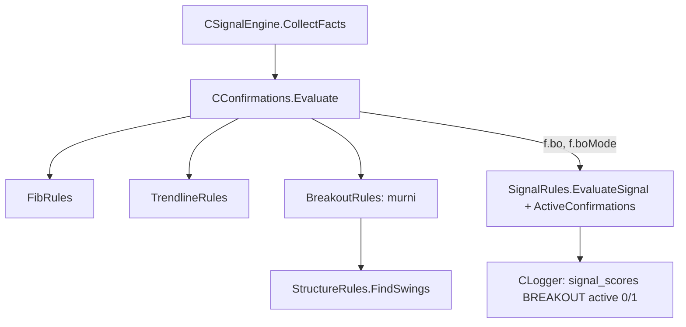

# Design — Skor breakout & retest (mode bayangan)

Status: Done (2026-10-07)
Requirements: [requirements.md](requirements.md) (Approved 2026-10-06; jarak tembus 0,1 ATR, toleransi 0,2 ATR, umur dibatasi jendela 100 bar)

## 1. Overview

Fungsi murni baru di `Strategies/BreakoutRules.mqh`.

- **Masukan:** bar MTF tertutup dan swing dari `FindSwings`, sama dengan trendline.
- **Proses, per swing sesisi di jendela:**
  1. cari close pertama sesudah swing terkonfirmasi yang menembus level searah sinyal ≥ 0,1 ATR;
  2. buang bila sesudahnya ada close yang kembali melewati level > 0,2 ATR (breakout gagal);
  3. level dihitung bila berjarak ≤ 0,2 ATR dari zona kandidat.
- **Pilihan level:** breakout terbaru.

Komponen ditambahkan ke `CConfirmations` dan `ActiveConfirmations` (+10). Pola telemetri dan Logger sama dengan FIB/TRENDLINE.

## 2. Architecture



## 3. Components and interfaces

### 3.1 `Strategies/BreakoutRules.mqh` (baru, murni)

```cpp
// Indeks close pertama sesudah konfirmasi swing (s.index + strength) yang menembus level searah >= minBreak; -1 bila tidak ada.
int BoBreakIndex(const MqlRates &r[], const SdbSwing &s, const bool buy, const int strength, const double minBreak);
// Gagal: close di (k, n-1] kembali melewati level > tol ke arah berlawanan.
bool BoFailed(const MqlRates &r[], const int k, const double level, const bool buy, const double tol);
// Level breakout valid terbaru yang menguji zona; skor 10 atau 0.
void BoEvaluate(const MqlRates &r[], const SdbZone &z, const bool buy, const int strength, const int lookback, const double atr,
                SdbBreakoutResult &out);
```

- **Sisi:** BUY memakai swing high (resistance ditembus naik), SELL memakai swing low (EC-03).
- **Tembus BUY:** `close ≥ level + 0,1 ATR`. **Gagal BUY:** `close < level − 0,2 ATR`. SELL cerminannya.
- **Retest:** `TlDistToZone(z, level) ≤ 0,2 ATR`. Fungsi ini dipakai ulang dari `TrendlineRules` dan dipindah ke `StrategyMath` umum (lihat §3.4).
- **Pilihan:** indeks breakout terbesar; bila sama, indeks swing terbesar (EC-06).
- **Swing:** hanya yang indeksnya ≥ `n − lookback` (EC-09). `FindSwings` tidak mengembalikan swing yang belum terkonfirmasi (EC-04). Cache hanya berisi bar tertutup (EC-05).

### 3.2 `CConfirmations`

`Init(fibMode, tlMode, boMode, zb, ms)`. `Evaluate` mengisi `f.boMode`, `f.bo`, memakai salinan bar yang sama.

### 3.3 `SignalRules`

- `ActiveConfirmations`: + `SDB_SCORE_MAX_BREAKOUT` (10) bila `boMode == ACTIVE`.
- `EvaluateSignal`: `d.boScore` (0 bila OFF).
- `SignalContextJson`: `bo_age` (bar MTF sejak breakout), `bo_dist` (ATR, 2 desimal), `bo_level` (digit simbol). Nilainya `null` bila OFF atau tidak ada level.

### 3.4 `Strategies/StrategyMath.mqh` (baru, kecil)

`DistToZone(const SdbZone &z, const double v)` dipindah dari `TlDistToZone` agar dipakai trendline dan breakout. `TrendlineRules` memanggilnya tanpa perubahan perilaku (TC-TL-07 tetap PASS).

### 3.5 Data

```cpp
struct SdbBreakoutResult
  {
   int      score;      // 0 atau 10
   double   level;      // 0 = tidak ada
   int      ageBars;    // bar MTF sejak breakout sampai bar kandidat
   double   distAtr;    // jarak level ke zona dalam ATR
   datetime tBreak;     // waktu bar breakout
   string   reason;     // "" = ada; "data kurang", "tidak ada breakout"
  };
```

| Item | Perubahan |
|---|---|
| `Core/Types.mqh` | `SdbBreakoutResult`; `SdbSignalFacts.boMode`, `bo`; `SdbDecision.boScore`; `SignalRecord.scoreBreakout`, `breakoutMode` |
| `Core/Constants.mqh` | `SDB_SCORE_MAX_BREAKOUT 10`, `SDB_BO_SCORE 10`, `SDB_BO_MIN_BREAK_ATR 0.1`, `SDB_BO_TOL_ATR 0.2` |
| Input | `InpScoreBreakoutMode` (SHADOW), `inputs_json` 51, preset, README |
| Konteks | `bo_age`, `bo_dist`, `bo_level` |
| Skema DB | tidak berubah (enum `BREAKOUT` sudah ada) |
| Versi | 1.22 |

## 4. Error handling

Sama dengan trendline: data kurang atau ATR 0 → skor 0 dengan alasan; mode tidak valid ditolak input. Tidak ada log per kandidat.

## 5. Test case catalogue

### 5.1 `TestBreakoutRules` (suite baru)

Bar sintetis 40 bar, `strength` 2, ATR 0,0010. Swing high di bar 10 pada 1.1050; bar lain di bawahnya sampai breakout.

| ID | Kasus | Harapan | Kriteria |
|---|---|---|---|
| TC-BO-01 | BUY: close bar 20 = 1.1060 (tembus 1 ATR), harga tetap di atas, zona demand 1.1045..1.1055 | skor 10, level 1.1050, umur 20 | 1.1, 1.2, 2.1, 2.3 |
| TC-BO-02 | Hanya wick di atas level (close ≤ level) | skor 0 | 1.2, EC-01 |
| TC-BO-03 | Tembus lalu close bar 25 = 1.1025 (< level − 0,2 ATR) | skor 0 | 1.3, EC-02 |
| TC-BO-04 | Kandidat BUY, tetapi yang ditembus support turun | skor 0 | EC-03 |
| TC-BO-05 | Swing di bar 38 (belum terkonfirmasi) ditembus di bar 39 | tidak dipakai | EC-04 |
| TC-BO-06 | Dua level ditembus, keduanya di zona | breakout terbaru dipilih (`tBreak`) | 2.2, EC-06 |
| TC-BO-07 | Level 0,5 ATR di bawah zona | skor 0; 0,15 ATR → 10 | 2.1, EC-07 |
| TC-BO-08 | SELL cerminan TC-BO-01 | skor 10 | 1.1, 2.1 |
| TC-BO-09 | Skala USDJPY dan BTC | skor 10 | EC-08 |
| TC-BO-10 | Tembus 0,05 ATR (< 0,1) | skor 0 | 1.2 |
| TC-BO-11 | Input `InpScoreBreakoutMode` default SHADOW; 3 ditolak | — | 3.1 |

### 5.2 `TestSignalRules`

| ID | Kasus | Harapan | Kriteria |
|---|---|---|---|
| TC-SG-31 | FIB 15, TL 15, BO 10; semua ACTIVE | total 92, maks 95 | 3.3 |
| TC-SG-32 | Skor dasar 37; FIB dan TL OFF; BO ACTIVE 10 → 47/65 = 72% lolos; BO ACTIVE 0 → 37/65 = 57% `SCORE_TOO_LOW` | breakout mengubah tahap tolak | 4.2 |
| TC-SG-21/22 | JSON dengan `bo_age`, `bo_dist`, `bo_level` | string kanonik baru | 2.3 |
| TC-SG-22d | Konteks breakout bayangan | `"bo_age":20,"bo_dist":0.00,"bo_level":1.10500` | 2.3 |

### 5.3 `TestLogger`

| ID | Kasus | Harapan | Kriteria |
|---|---|---|---|
| TC-SG-24d | BO SHADOW / ACTIVE / OFF | baris BREAKOUT `max_score` 10, `active` 0 / 1 / tidak ada | 3.2, 3.4 |

### 5.4 Skenario

| ID | Given / When / Then | Kriteria |
|---|---|---|
| SC-20 | **Given** harness pipeline EURUSDc 2026.06.01–2026.09.26, mode default. **Then** setiap sinyal punya FIB, TRENDLINE, BREAKOUT `active = 0`; `score_total` = ZONE + TREND + PA; BREAKOUT 10 dan 0 sama-sama ada; `bo_level` tidak null untuk setiap BREAKOUT 10. SC-18 dan SC-19 tetap PASS. | 1.1, 2.3, 3.2, 4.1 |

### 5.5 Run nyata

| ID | Run | Harapan | Kriteria |
|---|---|---|---|
| RUN-01 | `-Baseline -Period ALL` v1.22 | trade identik dengan 1027–1051 | 5.1 |
| RUN-02 | `component_report.py` + `--candidates` | BREAKOUT per nilai IS/OOS; ACCEPTED bernilai 10 di antara 2% dan 60% | 5.2, 5.3 |

## 6. Traceability

| Req | Komponen | Uji |
|---|---|---|
| 1.1–1.4 | `BoBreakIndex`, `BoFailed`, `FindSwings` | TC-BO-01..05, 10, SC-20 |
| 2.1–2.3 | `BoEvaluate`, `DistToZone`, konteks | TC-BO-01, 06, 07, 08, 09, TC-SG-21/22/22d |
| 3.1–3.4 | input, `CConfirmations`, `ActiveConfirmations`, Logger | TC-BO-11, TC-SG-31, 24d |
| 4.1–4.2 | skenario, `EvaluateSignal` | SC-20, TC-SG-32 |
| 5.1–5.3 | backtest, laporan | RUN-01, RUN-02 |

## 7. Keputusan yang perlu disetujui

1. **Breakout dicari mulai sesudah konfirmasi swing** (`index + strength`). Close yang menembus sebelum swing diakui tidak dihitung, agar urutan kejadian sama dengan yang terlihat di live.
2. **Hanya breakout pertama per level** yang dicek; bila level itu gagal, level tidak dipakai lagi meskipun ditembus ulang. Alternatif: breakout terakhir (lebih longgar, tetapi level yang sudah gagal biasanya tidak dihormati pasar).
3. **`DistToZone` dipindah ke `StrategyMath.mqh`** dan dipakai bersama, bukan disalin.
