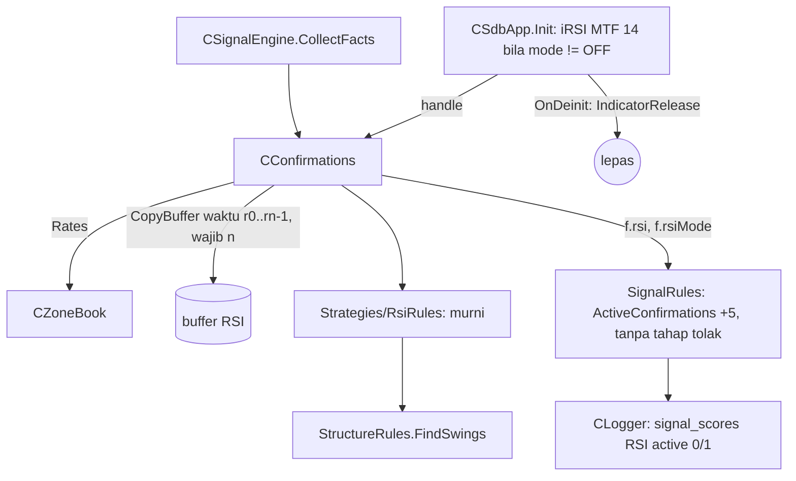

# Design — Skor RSI divergence (mode bayangan)

Status: Done (2026-10-07)
Requirements: [requirements.md](requirements.md) (Approved 2026-10-07; selisih RSI minimum 2,0; swing kedua ≤ 20 bar H1 dari kandidat; handle gagal = degrade aman di semua mode)

## 1. Overview

- **Handle.** `iRSI(_Symbol, MTF, 14, PRICE_CLOSE)` dibuat `CSdbApp` saat init, sama dengan handle ATR trailing (spec 06). Syaratnya sinyal aktif dan `InpScoreRsiMode` bukan OFF. Handle dilepas di `OnDeinit`, lalu diteruskan ke `CConfirmations`.
- **Penyejajaran.** `CConfirmations` menyalin RSI dengan `CopyBuffer` berdasarkan rentang **waktu** bar cache zona (`r[0].time` .. `r[n-1].time`). Hasilnya wajib berjumlah tepat `n`, sehingga indeks RSI sejajar dengan bar.
- **Fungsi murni.** `Strategies/RsiRules.mqh` mengambil dua swing sinyal terakhir dari `FindSwings`, lalu memeriksa lower low harga dengan higher low RSI (BUY), atau cerminannya (SELL).
- **Bukan gerbang.** Tidak ada tahap tolak baru. RSI hanya ikut `ActiveConfirmations` (+5).

## 2. Architecture



## 3. Components and interfaces

### 3.1 `Strategies/RsiRules.mqh` (baru, murni)

```cpp
// Dua swing sinyal terakhir (low untuk BUY, high untuk SELL) dengan indeks >= n - lookback; false bila < 2.
bool RsiLastTwoSwings(const MqlRates &r[], const bool buy, const int strength, const int lookback, SdbSwing &s1, SdbSwing &s2);
// Divergence reguler searah sinyal; skor 5 atau 0.
void RsiEvaluate(const MqlRates &r[], const double &rsi[], const bool buy, const int strength, const int lookback, const double atr,
                 SdbRsiResult &out);
```

Aturan:
- `ArraySize(rsi) != ArraySize(r)` → `reason "data kurang"` (Req 1.2).
- **BUY:** `s2.price < s1.price` (ketat, EC-02) dan `rsi[s2] − rsi[s1] ≥ 2,0`.
- **SELL:** `s2.price > s1.price` dan `rsi[s1] − rsi[s2] ≥ 2,0`.
- **Basi:** `n − s2.index > 20` (Req 2.3). `n` = indeks bar MTF yang memuat kandidat, sama dengan trendline.
- **Telemetri:**
  - `rsiDiff`: positif berarti RSI searah divergence;
  - `priceDiffAtr` = |s2 − s1| / atr;
  - `ageBars` = n − s2.index.

  Ketiganya diisi bila ada dua swing, juga ketika skornya 0.

### 3.2 `CConfirmations`

- `Init(fibMode, tlMode, boMode, rsiMode, rsiHandle, zb, ms)`.
- `Evaluate`: bila `rsiMode != OFF`, salin `CopyBuffer(rsiHandle, 0, r[0].time, r[n-1].time, buf)`.
  - Bila handle tidak valid atau jumlah salinan != n: skor 0, `reason "data kurang"`, dan `LogThrottled(WARN, "rsi-data", 1 hari)`, yaitu satu WARN per hari, bukan per kandidat (Req 1.3).
  - Selain itu `RsiEvaluate`.

### 3.3 `CSdbApp`

- Member `m_rsiHandle`. Saat init, bila `cfg.signalsOn` dan mode != OFF, `iRSI(_Symbol, mtf, SDB_RSI_PERIOD, PRICE_CLOSE)` dibuat. Kalau `INVALID_HANDLE`: satu WARN dan lanjut (degrade, keputusan requirements).
- `OnDeinit` memanggil `IndicatorRelease` (pola ATR).

### 3.4 `SignalRules`

- `ActiveConfirmations`: + `SDB_SCORE_MAX_RSI` (5) bila ACTIVE.
- `EvaluateSignal`: `d.rsiScore`. Tidak ada cabang tahap tolak baru (Req 3.1).
- `SignalContextJson`: `rsi_age`, `rsi_diff` (1 desimal), `rsi_pdiff` (ATR, 2 desimal). Nilainya `null` bila OFF atau tidak ada dua swing.

### 3.5 Data

```cpp
struct SdbRsiResult
  {
   int      score;         // 0 atau 5
   bool     have;          // ada dua swing
   double   rsiDiff;       // poin RSI, + = searah divergence
   double   priceDiffAtr;  // |harga swing 2 - swing 1| / ATR
   int      ageBars;       // n - indeks swing kedua
   string   reason;        // "" = ada dua swing; "data kurang", "swing kurang"
  };
```

| Item | Perubahan |
|---|---|
| `Core/Types.mqh` | `SdbRsiResult`; `SdbSignalFacts.rsiMode`, `rsi`; `SdbDecision.rsiScore`; `SignalRecord.scoreRsi`, `rsiMode` |
| `Core/Constants.mqh` | `SDB_SCORE_MAX_RSI 5`, `SDB_RSI_SCORE 5`, `SDB_RSI_PERIOD 14`, `SDB_RSI_MIN_DIFF 2.0`, `SDB_RSI_MAX_AGE 20` |
| Input | `InpScoreRsiMode` (SHADOW), `inputs_json` 52, preset, README |
| Konteks | `rsi_age`, `rsi_diff`, `rsi_pdiff` |
| Skema DB | tidak berubah (enum `RSI` sudah ada) |
| Versi | 1.23 |

## 4. Error handling

| Kondisi | Deteksi | Perilaku |
|---|---|---|
| `iRSI` gagal saat init | `INVALID_HANDLE` | WARN sekali, `m_rsiHandle` tetap invalid, skor RSI 0 "data kurang"; EA tetap jalan |
| Buffer belum siap / jumlah beda | `CopyBuffer != n` | skor 0 "data kurang", WARN tertahan 1 hari |
| Mode OFF | — | handle tidak dibuat (Req 4.4) |

## 5. Test case catalogue

### 5.1 `TestRsiRules` (suite baru)

Bar sintetis 40 bar dengan swing low di bar 15 dan 30 (BUY), dan array RSI sintetis sejajar.

| ID | Kasus | Harapan | Kriteria |
|---|---|---|---|
| TC-RSI-01 | BUY: low 1.1000 → 1.0990 (lower low), RSI 30 → 35 | skor 5, diff +5,0, umur 10 | 2.1, 2.2, 2.4 |
| TC-RSI-02 | Low lebih rendah, RSI juga lebih rendah (30 → 25) | skor 0, diff −5,0 | EC-03 |
| TC-RSI-03 | Low sama persis | skor 0 | EC-02 |
| TC-RSI-04 | RSI 30 → 31,5 (< 2) | skor 0 | EC-04 |
| TC-RSI-05 | SELL: high 1.1100 → 1.1110, RSI 70 → 64 | skor 5 | 2.2 |
| TC-RSI-06 | Kandidat BUY pada data bearish divergence (swing high) | skor 0 | EC-05 |
| TC-RSI-07 | Swing kedua 25 bar dari kandidat | skor 0 (basi) | 2.3, EC-06 |
| TC-RSI-08 | Hanya satu swing low | skor 0, `have` false | EC-01 |
| TC-RSI-09 | `ArraySize(rsi)` 39 vs bar 40 | skor 0, "data kurang" | 1.2 |
| TC-RSI-10 | Input `InpScoreRsiMode` default SHADOW; 3 ditolak | — | 4.1 |
| TC-RSI-11 | Handle `iRSI` H1 untuk `_Symbol` di tester dibuat dan dilepas lewat `CConfirmations` | handle valid, `CopyBuffer` berdasarkan waktu bar mengisi n nilai | 1.1, 1.2 |

### 5.2 `TestSignalRules`

| ID | Kasus | Harapan | Kriteria |
|---|---|---|---|
| TC-SG-33 | FIB 15, TL 15, BO 10, RSI 5, semua ACTIVE | total 97, maks 100 | 4.3 |
| TC-SG-34 | Kandidat lolos dengan RSI 0 / 5 di SHADOW; kandidat `SCORE_TOO_LOW` dengan RSI 5 di SHADOW | tahap tidak berubah oleh RSI | 3.1, 3.2 |
| TC-SG-21/22, 22e | JSON dengan `rsi_age`, `rsi_diff`, `rsi_pdiff` | string kanonik baru | 2.5 |

### 5.3 `TestLogger`

| ID | Kasus | Harapan | Kriteria |
|---|---|---|---|
| TC-SG-24e | RSI SHADOW / ACTIVE / OFF | baris RSI `max_score` 5, `active` 0 / 1 / tidak ada | 4.2, 4.4 |

### 5.4 Skenario

| ID | Given / When / Then | Kriteria |
|---|---|---|
| SC-21 | **Given** harness pipeline EURUSDc 2026.06.01–2026.09.26, mode default. **Then** setiap sinyal punya FIB, TRENDLINE, BREAKOUT, RSI `active = 0`; `score_total` = ZONE + TREND + PA; RSI 5 dan 0 sama-sama ada; tidak ada `reject_stage` di luar daftar Fase 3–4 (RSI bukan gerbang). SC-18..20 tetap PASS. | 1.1, 3.2, 4.2 |

### 5.5 Run nyata

| ID | Run | Harapan | Kriteria |
|---|---|---|---|
| RUN-01 | `-Baseline -Period ALL` v1.23 | trade identik dengan 1091–1114 | 5.1 |
| RUN-02 | `component_report.py` + `--candidates` | RSI per nilai IS/OOS; ACCEPTED bernilai 5 di antara 2% dan 60% | 5.2, 5.3 |

## 6. Traceability

| Req | Komponen | Uji |
|---|---|---|
| 1.1–1.4 | `CSdbApp` handle, `CConfirmations` CopyBuffer waktu | TC-RSI-09, 11, SC-21 |
| 2.1–2.5 | `RsiLastTwoSwings`, `RsiEvaluate`, konteks | TC-RSI-01..08, TC-SG-21/22/22e |
| 3.1–3.2 | `EvaluateSignal` tanpa tahap RSI | TC-SG-34, SC-21 |
| 4.1–4.4 | input, `ActiveConfirmations`, Logger | TC-RSI-10, TC-SG-33, 24e |
| 5.1–5.3 | backtest, laporan | RUN-01, RUN-02 |

## 7. Keputusan yang perlu disetujui

1. **Handle dimiliki `CSdbApp`**, sama dengan ATR trailing, lalu diteruskan ke `CConfirmations`. Alternatif: `CConfirmations` membuat sendiri (kepemilikan handle tersebar).
2. **`CopyBuffer` berdasarkan waktu bar cache**, bukan shift. Penyejajaran dijamin walau bar baru datang di antara salinan bar dan salinan RSI.
3. **Hanya dua swing terakhir** yang dibandingkan, bukan semua pasangan. Itu divergence paling relevan untuk entry sekarang, dan bisa dijelaskan di konteks.
4. **WARN data RSI tertahan 1 hari** (`LogThrottled`), bukan sekali per sesi, agar masalah yang menetap tetap terlihat tanpa spam.
